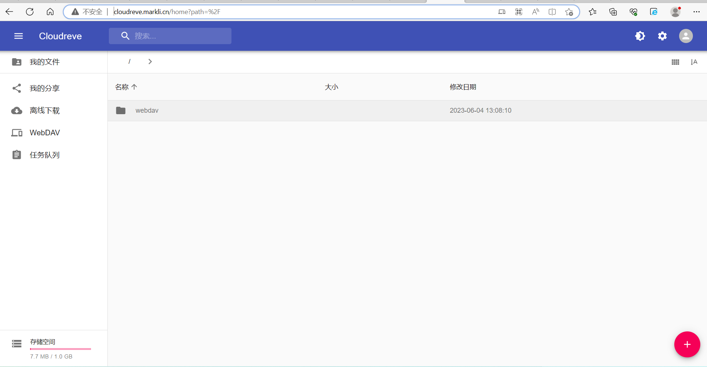

# cloudreve网盘


## 安装cloudreve

```bash
mkdir -vp cloudreve/{uploads,avatar} \
&& touch cloudreve/conf.ini \
&& touch cloudreve/cloudreve.db && \
docker run -d \
--name cloudreve \
-p 5212:5212 \
--mount type=bind,source=/root/cloudreve/conf.ini,target=/cloudreve/conf.ini \
--mount type=bind,source=/root/cloudreve/cloudreve.db,target=/cloudreve/cloudreve.db \
-v /root/cloudreve/uploads:/cloudreve/uploads \
-v /root/cloudreve/avatar:/cloudreve/avatar \
cloudreve/cloudreve:3.5.2
```


Cloudreve 在首次启动时，会创建初始管理员账号，请注意保管管理员密码，此密码只会在首次启动时出现。如果您忘记初始管理员密码，需要删除同级目录下的cloudreve.db，重新启动主程序以初始化新的管理员账户。

```bash
[root@node2 ~]# docker logs -f cloudreve 

   ___ _                 _                    
  / __\ | ___  _   _  __| |_ __ _____   _____ 
 / /  | |/ _ \| | | |/ _  | '__/ _ \ \ / / _ \	
/ /___| | (_) | |_| | (_| | | |  __/\ V /  __/
\____/|_|\___/ \__,_|\__,_|_|  \___| \_/ \___|

   V3.5.2  Commit #a11f819  Pro=false
================================================

[Info]    2023-06-04 13:07:05 初始化数据库连接
[Info]    2023-06-04 13:07:05 开始进行数据库初始化...
[Info]    2023-06-04 13:07:05 初始管理员账号：admin@cloudreve.org
[Info]    2023-06-04 13:07:05 初始管理员密码：isFhsnT9
[Info]    2023-06-04 13:07:05 开始执行数据库脚本 [UpgradeTo3.4.0]
[Info]    2023-06-04 13:07:05 数据库初始化结束
[Info]    2023-06-04 13:07:05 初始化任务队列，WorkerNum = 10
[Info]    2023-06-04 13:07:05 初始化定时任务...
[Info]    2023-06-04 13:07:05 当前运行模式：Master
[Info]    2023-06-04 13:07:05 开始监听 :5212
[Info]    2023-06-04 13:07:05 有新的版本 [3.8.0-beta1] 可用，下载：https://github.com/cloudreve/Cloudreve/releases/tag/3.8.0-beta1


admin@cloudreve.org
Hs77wrA8
```


## nginx反射代理cloudreve

```
docker run -d --privileged --name nginx -p 80:80 -v /root/nginx/default.conf:/etc/nginx/conf.d/default.conf nginx
或
docker run -d --privileged --link cloudreve:cloudreve --name nginx -p 80:80 -v /root/nginx/default.conf:/etc/nginx/conf.d/default.conf nginx

[root@node2 ~/nginx]# cat default.conf 
server {
    listen       80;
    server_name  cloudreve.markli.cn;
    location / {
        proxy_redirect off;
        proxy_set_header Host $http_host;
        proxy_set_header X-Real-IP $remote_addr;
        proxy_set_header X-Real-Port $remote_port;
        proxy_set_header X-Forwarded-For $proxy_add_x_forwarded_for;
        proxy_pass http://192.168.15.202:5212;
        #proxy_pass http://cloudreve:5212;
    }
    error_page   500 502 503 504  /50x.html;
    location = /50x.html {
        root   /usr/share/nginx/html;
    }
}

[root@node2 ~/nginx]# docker exec nginx nginx -s reload
```




