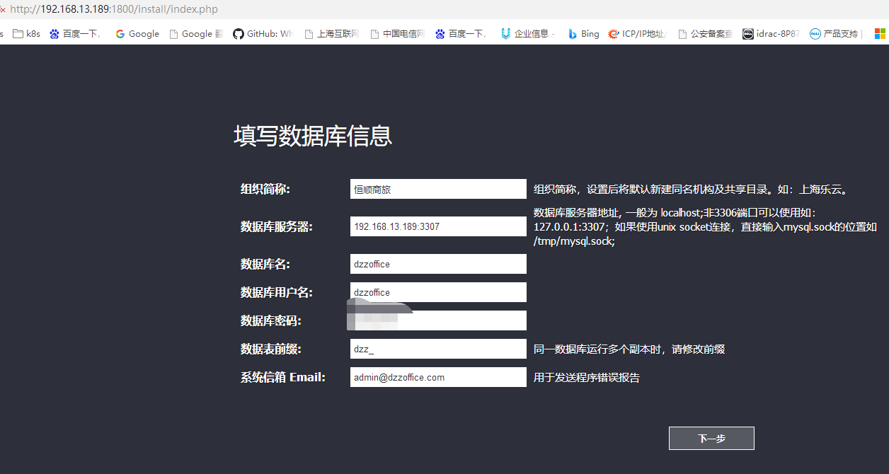
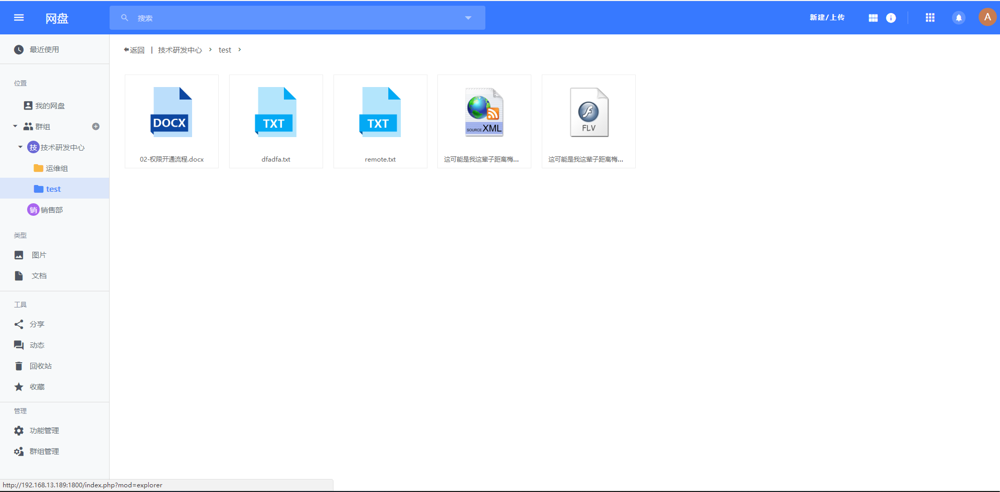
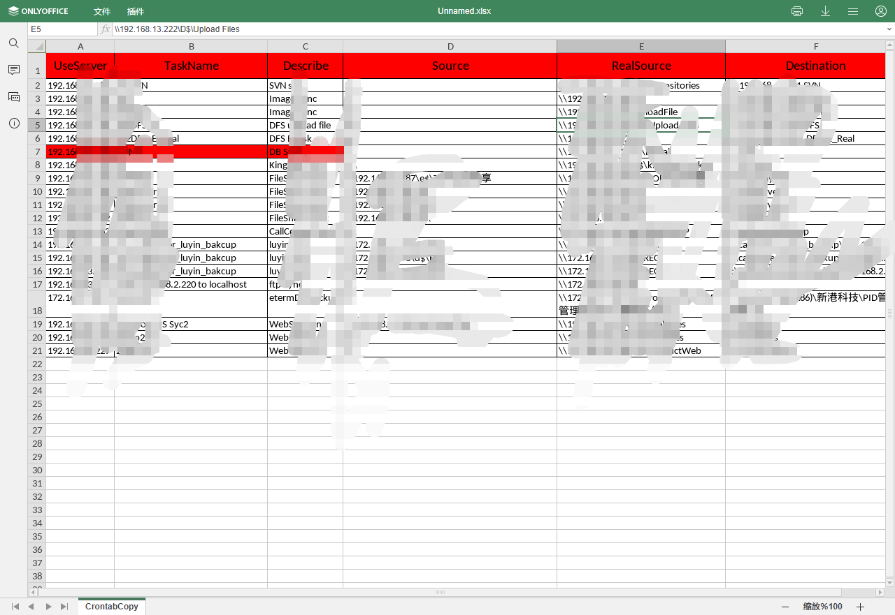

# dzzoffice


## 部署安装

dzzoffice是小型团队共享系统、协同办公系统


### docker、docker-compose部署

```
# step 1: 安装必要的一些系统工具
sudo apt-get update
sudo apt-get -y install apt-transport-https ca-certificates curl gnupg  
curl -fsSL https://mirrors.aliyun.com/docker-ce/linux/ubuntu/gpg | sudo apt-key add -
sudo add-apt-repository "deb [arch=amd64] https://repo.huaweicloud.com/docker-ce/linux/ubuntu $(lsb_release -cs) stable"
sudo apt-get -y update
apt-cache madison docker-ce
sudo apt-get -y install docker-ce=[VERSION]

# 安装docker-compose
root@office:~# curl -fsSLO https://github.com/docker/compose/releases/download/v2.12.2/docker-compose-linux-x86_64
root@office:~# chmod +x docker-compose-linux-x86_64
root@office:~# mv docker-compose-linux-x86_64 /usr/local/bin/docker-compose
root@office:~# docker-compose -version
docker-compose version 1.25.3, build d4d1b42b

```


### 构建dzzoffice镜像

```
root@office:~/dzzoffice# cat Dockerfile
FROM php:7.3.8-apache-stretch

ENV VERSION 2.02

RUN apt-get update && apt-get install -y libzip-dev libfreetype6-dev \
  && docker-php-ext-install mysqli \
  && docker-php-ext-install gd \
  && docker-php-ext-install zip

RUN curl -o /tmp/dzzoffice-2.02.tar.gz https://codeload.github.com/zyx0814/dzzoffice/tar.gz/2.02 \
  && tar -xzvf /tmp/dzzoffice-2.02.tar.gz -C /tmp \
  && rm -rf /tmp/dzzoffice-2.02.tar.gz /tmp/dzzoffice-2.02/*.md \
  && mv /tmp/dzzoffice-2.02/* /var/www/html/

RUN chown -R www-data:www-data /var/www/html/
---
root@office:~/dzzoffice# docker build -t dzzoffice:2.02 .
```


### 将dzzoffice容器中的源码复制到数据目录，后面docker-compose需要挂载

```
root@office:~/dzzoffice# docker run -d --name test dzzoffice:2.02
root@office:~/dzzoffice# docker cp test:/var/www/html /data/dzzoffice/
root@office:~/dzzoffice# mkdir -p /data/dzzoffice
root@office:~/dzzoffice# chmod -R 777 /data/dzzoffice
root@office:~/dzzoffice# ll /data/dzzoffice
total 0
drwxrwxrwx  3 root root  18 Nov 24 19:48 ./
drwxr-xr-x  3 root root  23 Nov 24 19:36 ../
drwxrwxrwx 11 root root 326 Nov 24 19:46 html/

```


### docker-compose运行项目

```
root@office:~/dzzoffice# cat docker-compose.yml
version: "2.2"
networks:
  internal_network:
services:
  mysql:
    restart: always
    networks:
      - internal_network
    image: mysql:5.7.27
    environment:
      - MYSQL_ROOT_PASSWORD=homsom
    volumes:
      - /data/dzzoffice/mysql:/var/lib/mysql
    expose:
      - "3306"
    ports:
      - "3307:3306"
  dzzoffice:
    restart: always
    networks:
      - internal_network
    image: dzzoffice:2.02
    volumes:
      - /data/dzzoffice/html:/var/www/html
    links:
      - "mysql"
    expose:
      - "80"
    ports:
      - "1800:80"
  onlyoffice:
    image: onlyoffice/documentserver:latest	#latest有问题，会导致dzzoffice无法打开onlyoffice
    restart: always
    networks:
      - internal_network
    expose:
      - "80"
    ports:
      - "8000:80"
```
root@office:~/dzzoffice# docker-compose up -d 


### 配置dzzoffice mysql用户

root@office:~/dzzoffice# docker exec -it dzzoffice_mysql_1 /bin/bash
root@bfbd8207d529:/# mysql -uroot -phomsom
mysql> grant all on dzzoffice.* to dzzoffice@'%' identified by 'tOk';
mysql> flush privileges;


### 访问dzzoffice并安装初始化

http://IP:1800	#dzzoffice访问地址，
http://IP:8000	#正常打开表示onlyoffice安装成功

配置数据库信息，初始化安装



去应用市场下载所有应用，并配置启用相关应用。例：配置onlyoffice地址，实现在线协同办公





在线协同办公截图，word、excel、ppt





## 数据备份及迁移

1. 每天备份mysql数据库（全备）

2. 复制dzzoffice的数据目录html到新机器上，路径一样（实时增量备份dzzoffice数据）

3. 运行docker-compose项目

4. 恢复mysql数据到新机器

5. 重启docker-compose项目

6. 检查项目是否如预期

  问题：经过测试，其它正常，但是onlyoffice报错，"报文档安全信息未正确形成，请与您的文件服务器管理员联系"，以后需要解决的

  原因： docker镜像onlyoffice有问题，上面是： image: onlyoffice/documentserver:latest	#latest有问题，会导致dzzoffice无法打开onlyoffice，用镜像image: onlyoffice/documentserver:7.1无问题，此后正常迁移


