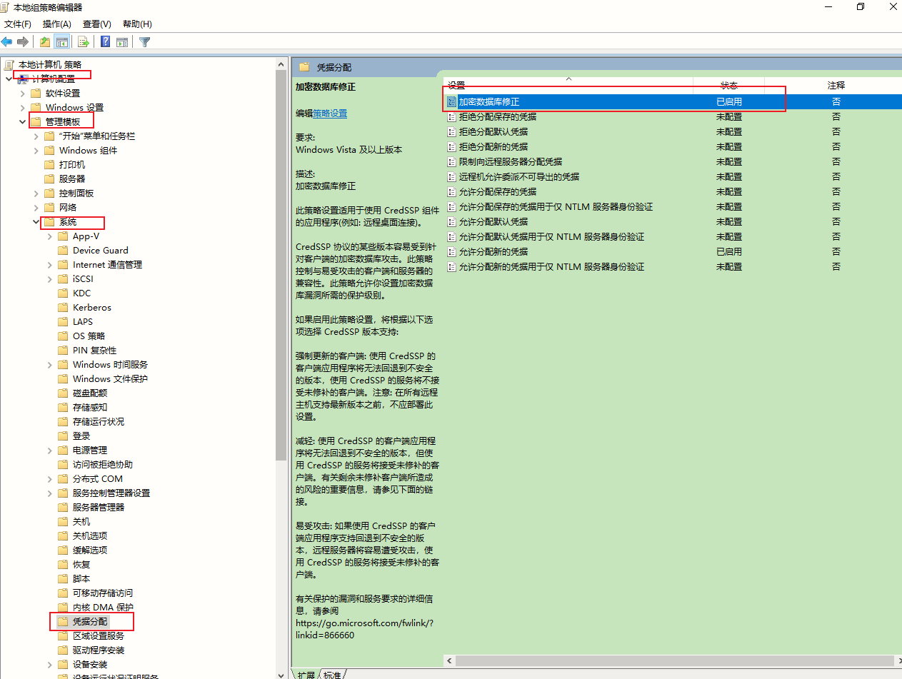

# frp

frp就是一个反向代理软件，它体积轻量但功能很强大，可以使处于内网或防火墙后的设备对外界提供服务，它支持HTTP、TCP、UDP等众多协议。我们今天仅讨论TCP和UDP相关的内容。


**为什么需要内网穿透功能**

*从公网中访问自己的私有设备向来是一件难事儿* 自己的主力台式机、NAS等等设备，它们可能处于路由器后，或者运营商因为IP地址短缺不给你分配公网IP地址。如果我们想直接访问到这些设备（远程桌面，远程文件，SSH等等），一般来说要通过一些转发或者P2P组网软件的帮助。 我有一台计算机位于一个很复杂的局域网中，我想要实现远程桌面和文件访问，目前来看其所处的网络环境很难通过简单的端口映射将其暴露在公网之中，我试过这么几种方法：

1. 远程桌面使用TeamViewer。可用，但需要访问端也拥有TeamViewer软件，不是很方便，希望能使用Windows自带的远程桌面。且TeamViewer不易实现远程文件访问。
2. 使用蒲公英VPN软件进行组网，可用，但免费版本网络速度极慢，体验不佳，几乎无法正常使用。
3. 使用花生壳软件进行DDNS解析，可用，但同第二点所述，免费版本有带宽限制，无法实际使用。
4. 搭建frp服务器进行内网穿透，可用且推荐，可以达到不错的速度，且理论上可以开放任何想要的端口，可以实现的功能远不止远程桌面或者文件共享。


## 1. frp安装 

```
curl -OL https://github.com/fatedier/frp/releases/download/v0.44.0/frp_0.44.0_linux_amd64.tar.gz
tar xf frp_0.44.0_linux_amd64.tar.gz -C /usr/local/
cd /usr/local/
ln -sv frp_0.44.0_linux_amd64/ frp
cd frp
vim frps.ini 
```


## 2. frp配置


### 2.1 frp服务端配置

```
[root@prometheus frp]# cat frps.ini 
[common]
bind_port = 7123			#frp server port
vhost_http_port = 8088		#http port
vhost_https_port = 8099		#https port
token = idBANrqAS3hDK		#frp token

[root@prometheus frp]# systemctl cat frp.service 	#frp服务端启动脚本
# /usr/lib/systemd/system/frp.service
[Unit]
Description=The nginx HTTP and reverse proxy server
After=network.target remote-fs.target nss-lookup.target

[Service]
Type=simple
ExecStart=/usr/local/frp/frps -c /usr/local/frp/frps.ini
KillSignal=SIGQUIT
TimeoutStopSec=5
KillMode=process
PrivateTmp=true
StandardOutput=syslog
StandardError=inherit

[Install]
WantedBy=multi-user.target
---
[root@prometheus frp]# systemctl daemon-reload 
[root@prometheus frp]# systemctl enable frp.service 
[root@prometheus frp]# systemctl start frp.service 
[root@prometheus frp]# ss -tnl | grep -E ':(7123|8088|8099)'
LISTEN     0      1024      [::]:8088                  [::]:*                  
LISTEN     0      1024      [::]:8099                  [::]:*                  
LISTEN     0      1024      [::]:7123                  [::]:*             
```


### 2.2 frp客户端配置

```
root@gitlab:/usr/local/frp# cat frpc.ini	#客户端配置
[common]
server_addr = 114.114.114.114	#frp服务端Ip
server_port = 7123				#frp服务端Port
token = idBANrqAS3hDK			#frp服务端token，客户端跟服务端需要一致

[ssh]							#配置段描述
type = tcp						#类型为tcp
local_ip = 192.168.13.236		#本地ip和port，为frp穿透的对象
local_port = 22
remote_port = 8033				#指定服务端ssh端口，对应的是192.168.13.236:22

[web]							#配置段描述
type = http						#类型为http
local_ip = 192.168.13.236		#本地的http服务Ip及Port，此处为prometheus服务
local_port = 9090			
custom_domains = prometheus.mark.cn #对应的公网域名，需要映射到frp服务器，访问方式为http://prometheus.mark.cn:8088

[web2]
type = http
local_ip = 192.168.13.236
local_port = 3000
custom_domains = grafana.mark.cn

[rdp]							#配置段描述
type = tcp						#类型为tcp
local_ip = 172.168.2.122		#本地ip和port，为frp穿透的对象
local_port = 3389
remote_port = 7001				#指定服务端rdp端口，对应的是172.168.2.122:3389
---

root@gitlab:/usr/local/frp# systemctl cat frpc.service
# /usr/lib/systemd/system/frpc.service
[Unit]
Description=The nginx HTTP and reverse proxy server
After=network.target remote-fs.target nss-lookup.target

[Service]
Type=simple
ExecStart=/usr/local/frp/frpc -c /usr/local/frp/frpc.ini
KillSignal=SIGQUIT
TimeoutStopSec=5
KillMode=process
PrivateTmp=true
StandardOutput=syslog
StandardError=inherit

[Install]
WantedBy=multi-user.target
---

root@gitlab:/usr/local/frp# systemctl daemon-reload
root@gitlab:/usr/local/frp# systemctl enable frpc.service
root@gitlab:/usr/local/frp# systemctl start frpc.service

```


**frp客户端启动后服务端自动监听端口**

例如上方8033、7001，另外frpc中配置的域名也会自动在frps中体现，只要token认证通过就可实现
```
[root@prometheus frp]# ss -tnl | grep -E ':(8033|7001)'
LISTEN     0      1024      [::]:7001                  [::]:*                  
LISTEN     0      1024      [::]:8033                  [::]:*    
[root@prometheus frp]# iptables -vnL	#如果公有云上ECS在本地开启了防火墙则需放行相应端口、另外安全组也需要放行
Chain INPUT (policy DROP 61 packets, 3164 bytes)
   98  5468 ACCEPT     tcp  --  *      *       0.0.0.0/0            0.0.0.0/0            multiport ports 7123,8088,8099,8033
  182  9432 ACCEPT     tcp  --  *      *       0.0.0.0/0            0.0.0.0/0            multiport dports 7001:7010

```


**使用远程桌面客户端连接**

RDP: 114.114.114.114:7001

> 如果远程连接不上，请检查远程服务是否打开、防火墙是否关闭
>
> 另外的一个原因就是目标主机被本机组策略阻止，不允许不安全的凭据登录，会报错：`无法连接到远程PC。请确保该PC已打开并连接到网络，且已启用远程访问。错误代码：0X204`

**解决0X204方法**

运行：`gpedit.msc`打开本地组策略

将`加密数据库修正`配置为：`已启用`，并将等级设置为`减轻`

最后强制刷新组策略`gpupdate /force`




### 2.3 通过frp上nginx进行反射代理frp http/https服务

```
    server {
        listen       80;
        server_name  prometheus.mark.cn;

        location / {
		proxy_pass http://127.0.0.1:8088;
		proxy_set_header    Host            $host;
                proxy_set_header    X-Real-IP       $remote_addr;
                proxy_set_header    X-Forwarded-For $proxy_add_x_forwarded_for;
                proxy_hide_header   X-Powered-By;
		auth_basic_user_file /usr/local/nginx/conf/passwdfile;
		auth_basic	"Prometheus for homsom";
        }
    }

    server {
        listen       80;
        server_name  prometheus.mark.cn;
        server_name  grafana.mark.cn;

        location / {
		proxy_pass http://127.0.0.1:8088;
		proxy_set_header    Host            $host;
                proxy_set_header    X-Real-IP       $remote_addr;
                proxy_set_header    X-Forwarded-For $proxy_add_x_forwarded_for;
                proxy_hide_header   X-Powered-By;
        }
    }
	#注：此时可以删除frp服务端 http/https端口相关安全组和防火墙配置，因为通过nginx反向代理进行配置了。
```


## 3. frp-0.60.0配置

```bash
[root@frp frp]# cat frps.toml
bindAddr = "47.103.13.208"
bindPort = 7000
allowPorts = [
{ start = 7100,end = 7200 }
]
auth.method = "token"
auth.token = "AdTj8NzOSq3yrrBT1EPvpkss3mPlyauN"
webServer.addr = "0.0.0.0"
webServer.port = 8000
webServer.user = "admin"
webServer.password = "ObiuDLwQ0LWQfqy4"
log.to = "./frp.log"
log.level = "info"
log.maxDays = 3
log.disablePrintColor = false

```

