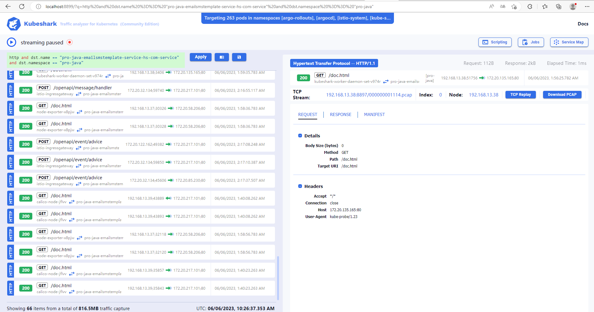

# 1. cloudreve项目


[cloudreve文档](https://docs.cloudreve.org/)

## Cloudreve 是什么？

Cloudreve 可以让您快速搭建起公私兼备的网盘系统。Cloudreve 在底层支持不同的云存储平台，用户在实际使用时无须关心物理存储方式。你可以使用 Cloudreve 搭建个人用网盘、文件分享系统，亦或是针对大小团体的公有云系统。


## 安装cloudreve

```bash
mkdir -vp cloudreve/{uploads,avatar} \
&& touch cloudreve/conf.ini \
&& touch cloudreve/cloudreve.db && \
docker run -d \
--name cloudreve \
-p 5212:5212 \
--mount type=bind,source=/root/cloudreve/conf.ini,target=/cloudreve/conf.ini \
--mount type=bind,source=/root/cloudreve/cloudreve.db,target=/cloudreve/cloudreve.db \
-v /root/cloudreve/uploads:/cloudreve/uploads \
-v /root/cloudreve/avatar:/cloudreve/avatar \
cloudreve/cloudreve:3.5.2
```


Cloudreve 在首次启动时，会创建初始管理员账号，请注意保管管理员密码，此密码只会在首次启动时出现。如果您忘记初始管理员密码，需要删除同级目录下的cloudreve.db，重新启动主程序以初始化新的管理员账户。

```bash
[root@node2 ~]# docker logs -f cloudreve 

   ___ _                 _                    
  / __\ | ___  _   _  __| |_ __ _____   _____ 
 / /  | |/ _ \| | | |/ _  | '__/ _ \ \ / / _ \	
/ /___| | (_) | |_| | (_| | | |  __/\ V /  __/
\____/|_|\___/ \__,_|\__,_|_|  \___| \_/ \___|

   V3.5.2  Commit #a11f819  Pro=false
================================================

[Info]    2023-06-04 13:07:05 初始化数据库连接
[Info]    2023-06-04 13:07:05 开始进行数据库初始化...
[Info]    2023-06-04 13:07:05 初始管理员账号：admin@cloudreve.org
[Info]    2023-06-04 13:07:05 初始管理员密码：isFhsnT9
[Info]    2023-06-04 13:07:05 开始执行数据库脚本 [UpgradeTo3.4.0]
[Info]    2023-06-04 13:07:05 数据库初始化结束
[Info]    2023-06-04 13:07:05 初始化任务队列，WorkerNum = 10
[Info]    2023-06-04 13:07:05 初始化定时任务...
[Info]    2023-06-04 13:07:05 当前运行模式：Master
[Info]    2023-06-04 13:07:05 开始监听 :5212
[Info]    2023-06-04 13:07:05 有新的版本 [3.8.0-beta1] 可用，下载：https://github.com/cloudreve/Cloudreve/releases/tag/3.8.0-beta1


admin@cloudreve.org
Hs77wrA8
```


## nginx反射代理cloudreve

```
docker run -d --privileged --name nginx -p 80:80 -v /root/nginx/default.conf:/etc/nginx/conf.d/default.conf nginx
或
docker run -d --privileged --link cloudreve:cloudreve --name nginx -p 80:80 -v /root/nginx/default.conf:/etc/nginx/conf.d/default.conf nginx

[root@node2 ~/nginx]# cat default.conf 
server {
    listen       80;
    server_name  cloudreve.markli.cn;
    location / {
        proxy_redirect off;
        proxy_set_header Host $http_host;
        proxy_set_header X-Real-IP $remote_addr;
        proxy_set_header X-Real-Port $remote_port;
        proxy_set_header X-Forwarded-For $proxy_add_x_forwarded_for;
        proxy_pass http://192.168.15.202:5212;
        #proxy_pass http://cloudreve:5212;
    }
    error_page   500 502 503 504  /50x.html;
    location = /50x.html {
        root   /usr/share/nginx/html;
    }
}

[root@node2 ~/nginx]# docker exec nginx nginx -s reload
```


# 2. dozzle项目


[dozzle文档](https://github.com/amir20/dozzle)

## Dozzle是什么

Dozzle是一个小型的轻量级应用程序，具有基于Web的界面来监视Docker日志。它不存储任何日志文件。它仅用于实时监视容器日志。


## 查看主机docker输出日志

docker run --name dozzle -d --volume=/var/run/docker.sock:/var/run/docker.sock -p 8888:8080 amir20/dozzle:latest


# 3. alist项目


[alist文档](https://alist.nn.ci/zh/guide/)

## alist是什么

一个支持多种存储，支持网页浏览和 WebDAV 的文件列表程序，由 gin 和 Solidjs 驱动。

## docker running

```bash
docker run -d --restart=always -v /etc/alist:/opt/alist/data -p 5244:5244 -e PUID=0 -e PGID=0 -e UMASK=022 --name="alist" xhofe/alist:latest
[root@prometheus ~]# docker logs alist
INFO[2023-06-05 07:10:22] reading config file: data/config.json        
INFO[2023-06-05 07:10:22] config file not exists, creating default config file 
INFO[2023-06-05 07:10:22] load config from env with prefix:            
INFO[2023-06-05 07:10:22] init logrus...                               
INFO[2023-06-05 07:10:22] Successfully created the admin user and the initial password is: oblPN87u 
INFO[2023-06-05 07:10:22] start server @ 0.0.0.0:5244                  
INFO[2023-06-05 07:10:22] qbittorrent not ready.                       
INFO[2023-06-05 07:10:22] Aria2 not ready.           
```


## binnary running

```bash
[root@prometheus download]# curl -OL https://github.com/axel-download-accelerator/axel/releases/download/v2.17.11/axel-2.17.11.tar.gz
[root@prometheus download]# axel -n 30 https://github.com/alist-org/alist/releases/download/v3.18.0/alist-linux-musl-amd64.tar.gz
[root@prometheus download]# tar xf alist-linux-musl-amd64.tar.gz
[root@prometheus download]# mv alist /usr/local/alist/bin/
[root@prometheus data]# cat /etc/profile.d/alist.sh 
export PATH=$PATH:/usr/local/alist/bin
[root@prometheus data]# source /etc/profile
[root@prometheus data]# systemctl cat alist.service 
# /usr/lib/systemd/system/alist.service
[Unit]
Description=alist
After=network.target
 
[Service]
Type=simple
WorkingDirectory=/usr/local/alist
ExecStart=/usr/local/alist/bin/alist server
Restart=on-failure
 
[Install]
WantedBy=multi-user.target
[root@prometheus data]# systemctl enable alist.service 
[root@prometheus data]# systemctl start alist.service 
[root@prometheus data]# journalctl -u alist
-- Logs begin at Sat 2023-06-03 11:00:17 CST, end at Mon 2023-06-05 16:41:15 CST. --
Jun 05 16:34:49 prometheus systemd[1]: Started alist.
Jun 05 16:34:49 prometheus alist[29881]: A file list program that supports multiple storage,
Jun 05 16:34:49 prometheus alist[29881]: built with love by Xhofe and friends in Go/Solid.js.
Jun 05 16:34:49 prometheus alist[29881]: Complete documentation is available at https://alist.nn.ci/
Jun 05 16:34:49 prometheus alist[29881]: Usage:
Jun 05 16:34:49 prometheus alist[29881]: alist [command]
Jun 05 16:34:49 prometheus alist[29881]: Available Commands:
Jun 05 16:34:49 prometheus alist[29881]: admin       Show admin user's info
Jun 05 16:34:49 prometheus alist[29881]: cancel2fa   Delete 2FA of admin user
Jun 05 16:34:49 prometheus alist[29881]: completion  Generate the autocompletion script for the specified shell
Jun 05 16:34:49 prometheus alist[29881]: help        Help about any command
Jun 05 16:34:49 prometheus alist[29881]: lang        Generate language json file
Jun 05 16:34:49 prometheus alist[29881]: restart     Restart alist server by daemon/pid file
Jun 05 16:34:49 prometheus alist[29881]: server      Start the server at the specified address
Jun 05 16:34:49 prometheus alist[29881]: start       Silent start alist server with `--force-bin-dir`
Jun 05 16:34:49 prometheus alist[29881]: stop        Stop alist server by daemon/pid file
Jun 05 16:34:49 prometheus alist[29881]: storage     Manage storage
Jun 05 16:34:49 prometheus alist[29881]: version     Show current version of AList
Jun 05 16:34:49 prometheus alist[29881]: Flags:
Jun 05 16:34:49 prometheus alist[29881]: --data string     config file (default "data")
Jun 05 16:34:49 prometheus alist[29881]: --debug           start with debug mode
Jun 05 16:34:49 prometheus alist[29881]: --dev             start with dev mode
Jun 05 16:34:49 prometheus alist[29881]: --force-bin-dir   Force to use the directory where the binary file is located as data directory
Jun 05 16:34:49 prometheus alist[29881]: -h, --help            help for alist
Jun 05 16:34:49 prometheus alist[29881]: --log-std         Force to log to std
Jun 05 16:34:49 prometheus alist[29881]: --no-prefix       disable env prefix
Jun 05 16:34:49 prometheus alist[29881]: Use "alist [command] --help" for more information about a command.
Jun 05 16:38:18 prometheus systemd[1]: Started alist.
Jun 05 16:38:18 prometheus alist[30144]: INFO[2023-06-05 16:38:18] reading config file: data/config.json
Jun 05 16:38:18 prometheus alist[30144]: INFO[2023-06-05 16:38:18] config file not exists, creating default config file
Jun 05 16:38:18 prometheus alist[30144]: INFO[2023-06-05 16:38:18] load config from env with prefix: ALIST_
Jun 05 16:38:18 prometheus alist[30144]: INFO[2023-06-05 16:38:18] init logrus...
Jun 05 16:38:18 prometheus alist[30144]: INFO[2023-06-05 16:38:18] Successfully created the admin user and the initial password is: teyOpaG2
Jun 05 16:38:18 prometheus alist[30144]: INFO[2023-06-05 16:38:18] start server @ 0.0.0.0:5244
Jun 05 16:38:18 prometheus alist[30144]: INFO[2023-06-05 16:38:18] Aria2 not ready.
Jun 05 16:38:18 prometheus alist[30144]: INFO[2023-06-05 16:38:18] qbittorrent not ready.
# user: admin  		password: teyOpaG2
```


## 配置nginx

```bash
[root@prometheus data]# cat /usr/local/nginx/conf/nginx.conf
	server {
        listen       80;
        server_name  alist.markli.cn;

        location / {
		proxy_pass http://127.0.0.1:5244;
		proxy_set_header    Host            $proxy_host;
                proxy_set_header    X-Real-IP       $remote_addr;
                proxy_set_header    X-Forwarded-For $proxy_add_x_forwarded_for;
                proxy_hide_header   X-Powered-By;
			#auth_basic_user_file /usr/local/nginx/conf/passwdfile;
			#auth_basic	"alist authentication";
        }
    }

```


# 4. kubeshark项目


[kubeshark文档](https://docs.kubeshark.co/en/introduction)

## kubeshark是什么

**Kubeshark** 是 Kubernetes 的 API 流量分析器，提供对 [Kubernetes](https://kubernetes.io/) 内部网络的实时协议级可见性，捕获、剖析和监控进出容器、Pod 和集群的所有流量和有效负载。


https://github.com/kubeshark/kubeshark/releases/download/40.5/kubeshark_40.5_windows_amd64.tar.gz


 





# 5. hack-browser-data项目


[hack-browser-data文档](https://github.com/moonD4rk/HackBrowserData)

## hack-browser-data

一款可全平台运行的浏览器数据导出解密工具。


# 6. hugo项目


## hugo简介

世界上最快的网站构建框架

Hugo是最受欢迎的开源静态站点生成器之一。凭借其惊人的速度和灵活性，Hugo 让构建网站再次变得有趣。


## 1. 安装hugo

```
[root@prometheus download]# axel -n 30 https://github.com/gohugoio/hugo/releases/download/v0.113.0/hugo_0.113.0_linux-amd64.tar.gz
[root@prometheus download]# tar xf hugo_0.113.0_linux-amd64.tar.gz -C /usr/local/bin/
```


## 2. 安装git

```
[root@prometheus download]# yum install -y git 
```


## 3. 配置hugo

```
[root@prometheus download]# mkdir /opt/hugo
[root@prometheus download]# cd /opt/hugo
[root@prometheus hugo]# hugo new site blog
[root@prometheus hugo]# cd blog/
[root@prometheus blog]# git init 
Initialized empty Git repository in /opt/hugo/blog/.git/
# 此步可能需要科学上网
[root@prometheus blog]# git clone https://github.com/adityatelange/hugo-PaperMod themes/PaperMod

############
# 配置代理，方可进行下面clone
[root@docker /usr/local/hugo/quickstart]# export HTTP_PROXY="http://172.168.2.219:10809"
[root@docker /usr/local/hugo/quickstart]# export HTTPS_PROXY="http://172.168.2.219:10809"
[root@docker /usr/local/hugo/quickstart]# curl -I https://www.google.com
HTTP/1.1 200 Connection established
############


[root@prometheus blog]# cat hugo.yml 
baseURL: "http://blog.markli.cn/"
languageCode: "zh-CN"
title: "JackBlog"
theme: "PaperMod"
paginate: 5

enableRobotsTXT: true
buildDrafts: false
buildFuture: false
buildExpired: false

googleAnalytics: UA-123-45

minify:
  disableXML: true
  minifyOutput: true

params:
  #env: opengraph # to enable google analytics, opengraph, twitter-cards and schema.
  env: production # to enable google analytics, opengraph, twitter-cards and schema.
  title: ExampleSite
  description: "ExampleSite description"
  keywords: [Blog, Portfolio, PaperMod]
  author: Me
  # author: ["Me", "You"] # multiple authors
  images: ["<link or path of image for opengraph, twitter-cards>"]
  DateFormat: "January 2, 2006"
  defaultTheme: auto # dark, light
  disableThemeToggle: false

  ShowReadingTime: true
  ShowShareButtons: true
  ShowPostNavLinks: true
  ShowBreadCrumbs: true
  ShowCodeCopyButtons: false
  ShowWordCount: true
  ShowRssButtonInSectionTermList: true
  UseHugoToc: true
  disableSpecial1stPost: false
  disableScrollToTop: false
  comments: false
  hidemeta: false
  hideSummary: false
  showtoc: false
  tocopen: false

  assets:
    # disableHLJS: true # to disable highlight.js
    # disableFingerprinting: true
    favicon: "<link / abs url>"
    favicon16x16: "<link / abs url>"
    favicon32x32: "<link / abs url>"
    apple_touch_icon: "<link / abs url>"
    safari_pinned_tab: "<link / abs url>"

  label:
    text: "Home"
    icon: /apple-touch-icon.png
    iconHeight: 35

  # profile-mode
  profileMode:
    enabled: false # needs to be explicitly set
    title: ExampleSite
    subtitle: "This is subtitle"
    imageUrl: ""
    imageWidth: 120
    imageHeight: 120
    imageTitle: my image
    buttons:
      - name: Posts
        url: posts
      - name: Tags
        url: tags

  # home-info mode
  homeInfoParams:
    Title: "Hi there \U0001F44B"
    Content: Welcome to my blog

  socialIcons:
    - name: grafana
      url: "https://monitor.markli.cn/grafana"
    - name: github
      url: "https://github.com/jacknotes"

  analytics:
    google:
      SiteVerificationTag: "XYZabc"
    bing:
      SiteVerificationTag: "XYZabc"
    yandex:
      SiteVerificationTag: "XYZabc"

  cover:
    hidden: true # hide everywhere but not in structured data
    hiddenInList: true # hide on list pages and home
    hiddenInSingle: true # hide on single page

#  editPost:
#    #URL: "https://github.com/<path_to_repo>/content"
#    URL: "http://192.168.75.100:1313/content"
#    Text: "Suggest Changes" # edit text
#    appendFilePath: true # to append file path to Edit link

  # for search
  # https://fusejs.io/api/options.html
  fuseOpts:
    isCaseSensitive: false
    shouldSort: true
    location: 0
    distance: 1000
    threshold: 0.4
    minMatchCharLength: 0
    keys: ["title", "permalink", "summary", "content"]
menu:
  main:
    - identifier: categories
      name: categories
      url: /categories/
      weight: 10
    - identifier: tags
      name: tags
      url: /tags/
      weight: 20
# Read: https://github.com/adityatelange/hugo-PaperMod/wiki/FAQs#using-hugos-syntax-highlighter-chroma
pygmentsUseClasses: true
markup:
  highlight:
    noClasses: false
    # anchorLineNos: true
    # codeFences: true
    # guessSyntax: true
    # lineNos: true
    # style: monokai
	

[root@prometheus content]# mkdir -p /opt/hugo/blog/content/posts
[root@prometheus blog]# ls content/posts/
cloudnative  frp.md
```


## 以systemd服务启动

```
[root@prometheus blog]# systemctl cat hugo.service 
# /usr/lib/systemd/system/hugo.service
[Unit]
Description=https://gohugo.io/documentation/
After=network-online.target

[Service]
User=root
Group=root
Type=simple
WorkingDirectory=/opt/hugo/blog
ExecStart=/usr/local/bin/hugo server --config=/opt/hugo/blog/hugo.yml --buildDrafts --baseURL=http://blog.markli.cn/ --appendPort=false --theme=/opt/hugo/blog/themes/PaperMod/
Restart=on-failure

[Install]
WantedBy=multi-user.target
```


## 通过nginx反向代理

```
    server {
        listen       80;
        server_name  blog.markli.cn;
	rewrite ^(.*)$ https://${server_name}$1 permanent;
    }
    server {
        listen       443;
        server_name  blog.markli.cn;
	ssl_certificate /etc/letsencrypt/live/blog.markli.cn/fullchain.pem;
        ssl_certificate_key /etc/letsencrypt/live/blog.markli.cn/privkey.pem;
        ssl_session_timeout 5m;
        ssl_ciphers ECDHE-RSA-AES128-GCM-SHA256:ECDHE:ECDH:AES:HIGH:!NULL:!aNULL:!MD5:!ADH:!RC4:!DH:!DHE;
        ssl_protocols TLSv1.2 TLSv1.3;
        ssl_prefer_server_ciphers on;

        location / {
		proxy_pass http://127.0.0.1:1313;
		proxy_set_header    Host            $proxy_host;
                proxy_set_header    X-Real-IP       $remote_addr;
                proxy_set_header    X-Forwarded-For $proxy_add_x_forwarded_for;
                proxy_hide_header   X-Powered-By;
        }
    }
```


## hugo主题更换

```
# 官方主题市场
https://themes.gohugo.io/
# 本地主题目录
[root@docker /usr/local/hugo/quickstart]# ls themes/
ananke
# 下载第三方主题到主题目录，必须带特定目录，否则主题不可用
[root@docker /usr/local/hugo/quickstart]# git clone https://github.com/adityatelange/hugo-PaperMod themes/PaperMod
[root@docker /usr/local/hugo/quickstart]# ls themes/PaperMod/
assets  go.mod  i18n  images  layouts  LICENSE  README.md  theme.toml
# 切换指定主题
[root@docker /usr/local/hugo/quickstart]# vim hugo.toml
theme = 'PaperMod'
```


# 7. posh项目


[Oh My Posh](https://ohmyposh.dev/docs)

适用于多种 shell 的终端提示个性化工具。该项目内置多款主题开箱即用，支持 Windows、Linux、macOS 三个系统上的 PowerShell、Bash、Zsh 等多种 shell，自动补全你输入的每个命令


```powershell
# 下载程序
curl https://github.com/JanDeDobbeleer/oh-my-posh/releases/download/v17.5.3/posh-windows-amd64.exe
# 将posh-windows-amd64.exe放入到环境变量中


# 下载字体
https://www.nerdfonts.com/font-downloads
https://github.com/ryanoasis/nerd-fonts/releases/download/v3.0.2/Agave.zip
# 将字体解压放到C:\Windows\Fonts目录下


# 下载主题
https://github.com/JanDeDobbeleer/oh-my-posh/releases/download/v17.5.3/themes.zip
# 将主题解压放到C:\Users\$USER\AppData\Local\Programs\oh-my-posh\themes目录下，没有此目录则新建


# 安装完成后打开Windows Terminal然后按"Ctrl+Shift+,（逗号）"来打开settings.json配置文件将"defaults": {}改成
"defaults": 
        {
            "font": 
            {
                "face": "Agave Nerd Font Propo"
            }
        }
并保存退出 


# 然后在Windows Terminal中的powershell中输入并回车notepad $profile，第一次会显示找不到该文件，选择创建新文件，然后输入如下内容并保存
oh-my-posh init pwsh | Invoke-Expression
# 然后回到Windows terminal新建一个powershell，此处使用的是默认主题
# 若想修改主题，可以使用命令Get-PoshThemes查看上面下载安装的主题

# 更改默认主题为froczh.omp.json
posh init pwsh --config C:\Users\0799\AppData\Local\Programs\oh-my-posh\themes\gmay.omp.json  | Invoke-Expression
# 然后保存并在Windows Terminal中新建一个powershell即可看到新主题已成功配置
```


# 8. yearning项目

[yearning](https://next.yearning.io/guide/get/order.html)开箱即用的MYSQL SQL审核工具

go+vue为Yearning带来了流畅且美观的用户界面与强大的性能。

Yearning 根据Mysql语法树解析自动审查Mysql语句语法规范并根据Yearning自身实现的审核规则进行功能性审核。


## 1. 运行

```bash
root@ansible:/download/Yearning/docker# cat docker-compose.yml
version: '3'

services:
    yearning:
        image: chaiyd/yearning:latest
        environment:
           MYSQL_USER: yearning
           MYSQL_PASSWORD: ukC2ZkcG_ZTeb
           MYSQL_ADDR: mysql
           MYSQL_DB: yearning
           SECRET_KEY: dbcjqheupqjsuwsm
           IS_DOCKER: is_docker
        ports:
           - 8000:8000
        # 首次使用请先初始化
        command: /bin/bash -c "./Yearning install && ./Yearning run"
        depends_on:
           - mysql
        restart: always

    mysql:
        image: mysql:5.7
        environment:
           MYSQL_ROOT_PASSWORD: ukC2ZkcG_ZTeb
           MYSQL_DATABASE: yearning
           MYSQL_USER: yearning
           MYSQL_PASSWORD: ukC2ZkcG_ZTeb
        command:
           - --character-set-server=utf8mb4
           - --collation-server=utf8mb4_general_ci
        volumes:
           - ./data/mysql:/var/lib/mysql

# 默认账号：admin，默认密码：Yearning_admin

root@ansible:/download/Yearning/docker# docker ps -a
CONTAINER ID        IMAGE                    COMMAND                  CREATED             STATUS              PORTS                    NAMES
5d314f318d40        chaiyd/yearning:latest   "/usr/bin/dumb-init …"   45 hours ago        Up 45 hours         0.0.0.0:8000->8000/tcp   docker_yearning_1
cf1c93e201c2        mysql:5.7                "docker-entrypoint.s…"   45 hours ago        Up 45 hours         3306/tcp, 33060/tcp      docker_mysql_1

```


## 2. 使用


# 9. syncthing

[syncthing](https://github.com/syncthing/syncthing)开源的持续文件同步软件


## 1. 安装

```bash
[ops0799@hs-backup /download]$ sudo curl -OL https://github.com/syncthing/syncthing/releases/download/v1.27.7/syncthing-linux-amd64-v1.27.7.tar.gz
[ops0799@hs-backup /download]$ ls
syncthing-linux-amd64-v1.27.7.tar.gz
[ops0799@hs-backup /download]$ sudo tar -xf syncthing-linux-amd64-v1.27.7.tar.gz -C /usr/local/
[ops0799@hs-backup /download]$ sudo ln -sv /usr/local/syncthing-linux-amd64-v1.27.7/ /usr/local/syncthing
‘/usr/local/syncthing’ -> ‘/usr/local/syncthing-linux-amd64-v1.27.7/’
[ops0799@hs-backup /usr/local/syncthing]$ ls
AUTHORS.txt  etc  LICENSE.txt  README.txt  syncthing
```


## 2. 配置

```bash
# 配置用户
[ops0799@syncthing /usr/local/syncthing]$ sudo groupadd -r syncthing
[ops0799@syncthing /usr/local/syncthing]$ sudo useradd -r -g syncthing -d /data/syncthing syncthing
[ops0799@syncthing /usr/local/syncthing]$ id syncthing
uid=996(syncthing) gid=994(syncthing) groups=994(syncthing)

# 配置目录
[ops0799@syncthing /usr/local]$ sudo chown -R root.syncthing syncthing-linux-amd64-v1.27.7/
[ops0799@syncthing /usr/local]$ sudo chmod -R 775 syncthing-linux-amd64-v1.27.7/
[ops0799@syncthing /usr/local]$ sudo ls -ld syncthing-linux-amd64-v1.27.7/
drwxrwxr-- 4 root syncthing 4096 May 11 14:22 syncthing-linux-amd64-v1.27.7/

[ops0799@syncthing /usr/local]$ sudo chown -R root.syncthing /data/syncthing/
[ops0799@syncthing /usr/local]$ sudo chmod -R 775 /data/syncthing/
[ops0799@syncthing /usr/local]$ sudo ls -ld /data/syncthing/
drwxrwxr-- 3 root syncthing 30 May 11 13:53 /data/syncthing/

# 配置服务
[ops0799@hs-backup /usr/local/syncthing]$ sudo vim /usr/lib/systemd/system/syncthing.service
# 配置用户syncthing启动，此时源目录和目标目录中syncthing需要写入权限，如不好更改，建议使用root启动
[ops0799@hs-backup /usr/local/syncthing]$ cat /usr/lib/systemd/system/syncthing.service
[Unit]
Description=Syncthing - Open Source Continuous File Synchronization
After=network.target

[Service]
User=syncthing
ExecStart=/usr/local/syncthing/syncthing serve --no-browser --no-restart --logflags=0 --data=/data/syncthing --config=/usr/local/syncthing --gui-address=http://0.0.0.0:8384
Restart=on-failure

[Install]
WantedBy=multi-user.target
[ops0799@hs-backup /usr/local/syncthing]$ sudo mkdir -p /data/syncthing
[ops0799@hs-backup /usr/local/syncthing]$ sudo systemctl daemon-reload
[ops0799@hs-backup /usr/local/syncthing]$ sudo systemctl enable syncthing.service
[ops0799@hs-backup /usr/local/syncthing]$ sudo systemctl start syncthing.service
[ops0799@hs-backup /usr/local/syncthing]$ sudo ss -tnlp | grep 8384
LISTEN     0      128       [::]:8384                  [::]:*                   users:(("syncthing",pid=2563,fd=30))

# 更改GUI主机名
[ops0799@hs-backup /usr/local/syncthing]$ vim /usr/local/syncthing/config.xml
<device id="HA253YQ-ULFJC5A-JBO5XLZ-24PCWGC-GHE52BY-O2XMNT3-C7YNSBG-PPSNMA4" name="syncthing.ops.hs.com"
[ops0799@hs-backup /usr/local/syncthing]$ sudo systemctl restart syncthing.service
```


## 3. 添加认证

```bash
# 添加htpasswd用户
[ops0799@nginx /usr/local/nginx/conf/conf.d]$ sudo htpasswd -c /usr/local/nginx/conf/password.sycnthing 0799
New password:
Re-type new password:
Adding password for user 0799

[ops0799@nginx /usr/local/nginx/conf/conf.d]$ cat syncthing.homsom.com.conf
server {
        listen       443 ssl;
        server_name     syncthing.homsom.com;
        ssl_certificate      cert/homsom.com.pem;
        ssl_certificate_key  cert/homsom.com.key;
        ssl_session_cache    shared:SSL:1m;
        ssl_session_timeout  5m;
        ssl_ciphers  HIGH:!aNULL:!MD5;
        ssl_prefer_server_ciphers  on;

        location / {
                proxy_next_upstream  error timeout http_502 http_503 http_504;
                proxy_redirect off;
                proxy_set_header Host $host;
                proxy_set_header X-Real-IP $remote_addr;
                proxy_set_header X-Real-Port $remote_port;
                proxy_set_header X-Forwarded-For $proxy_add_x_forwarded_for;
                proxy_pass https://10.10.10.202:8384;
                auth_basic_user_file /usr/local/nginx/conf/password.sycnthing;
                auth_basic      "syncthing" ;
                allow 222.66.21.210;
                allow 58.246.78.150;
                allow 47.103.112.73;
                allow 47.100.73.115;
                deny all;
        }

        error_page   500 502 503 504  /50x.html;
        location = /50x.html {
                root   html;
        }
}
```

> 添加htpasswd认证后，打开syncthing.homsom.com时需要使用htpasswd添加的用户访问


## 4. 用户访问

**使用htpasswd认证**


**添加syncthing的GUI用户认证信息，实现双重认证**


# 10. WinMerge

[Download](https://github.com/WinMerge/winmerge/releases/download/v2.16.44/winmerge-2.16.44-exe.zip)


# 11. RustDesk

[download](https://github.com/rustdesk/rustdesk)

## 运行
在国内需要使用docker代理，方可运行起来
```bash
[root@hw-blog rustdesk]# cat /etc/systemd/system/docker.service.d/http-proxy.conf 
[Service]
Environment="HTTP_PROXY=http://127.0.0.1:10809"
Environment="HTTPS_PROXY=http://127.0.0.1:10809"
Environment="NO_PROXY=localhost,127.0.0.1"
[root@hw-blog rustdesk]# systemctl restart docker

root@ansible:~/rustdesk# cat docker-compose.yml
version: '3'
services:
  hbbs:
    container_name: hbbs
    image: rustdesk/rustdesk-server:1.1.12
    environment:
      - ALWAYS_USE_RELAY=Y
    command: hbbs
    volumes:
      - ./data:/root
    network_mode: "host"

    depends_on:
      - hbbr
    restart: unless-stopped

  hbbr:
    container_name: hbbr
    image: rustdesk/rustdesk-server:1.1.12
    command: hbbr
    volumes:
      - ./data:/root
    network_mode: "host"
    restart: unless-stopped
```


# 端口参数
* hbbs:
21114（TCP）：用于 Web 控制台，仅在版本中可用。Pro
21115（TCP）：用于 NAT 类型测试。
21116（TCP/UDP）：请注意，TCP 和 UDP 都应该启用 21116。 用于 ID 注册和心跳服务。 用于 TCP 打孔和连接服务。21116/UDP21116/TCP
21118（TCP）：用于支持 Web 客户端。
* hbbr:
21117（TCP）：用于 Relay 服务。
21119（TCP）：用于支持 Web 客户端。

防火墙开放端口：TCP-21115、21116、21117，UDP-21116


## 查看参数
key：eNL0rQN0hSxr5TY91IzwBY0TH361QKvRxvf1FqMRwXQ=
ID服务器：172.168.2.12:21116
中继服务器：172.168.2.12:21117
```bash
root@ansible:~# docker logs -f hbbs
[2024-12-17 03:36:34.527584 +00:00] INFO [src/common.rs:148] Private/public key written to id_ed25519/id_ed25519.pub
[2024-12-17 03:36:34.527636 +00:00] INFO [src/rendezvous_server.rs:1205] Key: eNL0rQN0hSxr5TY91IzwBY0TH361QKvRxvf1FqMRwXQ=
[2024-12-17 03:36:34.527640 +00:00] INFO [src/peer.rs:84] DB_URL=./db_v2.sqlite3
[2024-12-17 03:36:34.537387 +00:00] INFO [src/rendezvous_server.rs:99] serial=0
[2024-12-17 03:36:34.537407 +00:00] INFO [src/common.rs:46] rendezvous-servers=[]
[2024-12-17 03:36:34.537410 +00:00] INFO [src/rendezvous_server.rs:101] Listening on tcp/udp :21116
[2024-12-17 03:36:34.537412 +00:00] INFO [src/rendezvous_server.rs:102] Listening on tcp :21115, extra port for NAT test
[2024-12-17 03:36:34.537414 +00:00] INFO [src/rendezvous_server.rs:103] Listening on websocket :21118
[2024-12-17 03:36:34.538059 +00:00] INFO [libs/hbb_common/src/udp.rs:36] Receive buf size of udp [::]:21116: Ok(8388608)
[2024-12-17 03:36:34.538110 +00:00] INFO [src/rendezvous_server.rs:138] mask: None
[2024-12-17 03:36:34.538113 +00:00] INFO [src/rendezvous_server.rs:139] local-ip: ""
[2024-12-17 03:36:34.538118 +00:00] INFO [src/common.rs:46] relay-servers=[]
[2024-12-17 03:36:34.538249 +00:00] INFO [src/rendezvous_server.rs:153] ALWAYS_USE_RELAY=Y
[2024-12-17 03:36:34.538282 +00:00] INFO [src/rendezvous_server.rs:185] Start
[2024-12-17 03:36:34.538536 +00:00] INFO [libs/hbb_common/src/udp.rs:36] Receive buf size of udp [::]:0: Ok(8388608)
[2024-12-17 03:36:34.540939 +00:00] INFO [libs/hbb_common/src/udp.rs:36] Receive buf size of udp 0.0.0.0:0: Ok(8388608)

```