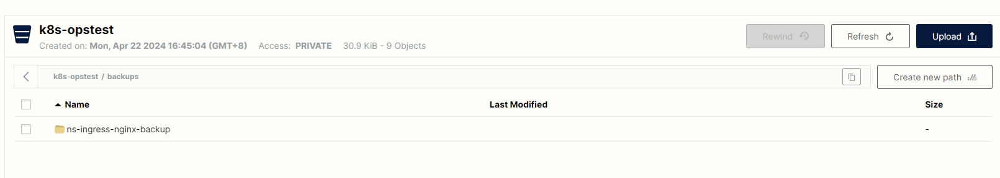
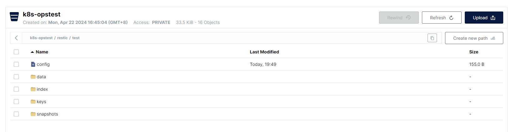

# k8s backup


## 1. minio权限配置

配置k8s的minio Policy，此策略仅允许访问k8s-opstest Bucket下的所有对象

```bash
# policy文件
{
   "Version" : "2012-10-17",
   "Statement" : [
      {
         "Effect" : "Allow",
         "Action" : [ "s3:*"],
         "Resource" : "arn:aws:s3:::k8s-opstest/*"
      }
   ]
}

mc admin policy create local k8s-opstest_policy "./k8s-opstest_policy.json"
```


## 2. 创建minio用户

```bash
# 创建用户
mc admin user add local k8s-opstest password
# 用户绑定策略
mc admin policy attach local k8s-opstest_policy --user k8s-opstest
# 用户下创建AK、SK
mc admin user svcacct add local k8s-opstest --access-key "dwJf7ZjAMxp5Nl8kY5Nr" --secret-key "IKj8JpH8wEQBh1EA2Ok42oKlM7p9mOxXV4XipZcj"
```


## 3. velero配置密钥

```bash
# 配置alias
root@ansible:~/velero/k8s-opstest# mc alias set local http://minio-api.hs.com dwJf7ZjAMxp5Nl8kY5Nr IKj8JpH8wEQBh1EA2Ok42oKlM7p9mOxXV4XipZcj

# 列出所有bucket
root@ansible:~/velero/k8s-opstest# mc ls local
[2024-04-22 16:45:04 CST]     0B k8s-opstest/


# 创建secret文件
root@ansible:~/velero/k8s-opstest# cat secret.txt
[default]
aws_access_key_id=dwJf7ZjAMxp5Nl8kY5Nr
aws_secret_access_key=IKj8JpH8wEQBh1EA2Ok42oKlM7p9mOxXV4XipZcj
```


## 4. 安装velero

```bash
# 干跑生成yaml文件，可以得知secret和s3Url在哪里，`直接运行下面脚本会生成BackupStorageLocation`
# 可执行多次./velero-install.sh
root@ansible:~/velero/k8s-opstest# cat velero-install.sh
#!/bin/bash
velero install \
--provider aws \
--bucket velero \
--image velero/velero:v1.9.7 \
--plugins velero/velero-plugin-for-aws:v1.5.5 \
--namespace velero \
--secret-file ./secret.txt \
--use-volume-snapshots=false \
--use-restic \
--default-volumes-to-restic=true \
--kubeconfig=/root/.kube/config \
--backup-location-config region=minio,s3ForcePathStyle="true",s3Url=http://minio-api.hs.com \
--dry-run -o yaml > velero-install.yaml

# 安装，此命令不会创建BackupStorageLocation
root@ansible:~/velero/k8s-opstest# kubectl apply -f velero-install.yaml

# 查看velero版本
root@ansible:~/velero/k8s-opstest# velero version
Client:
        Version: v1.9.7
        Git commit: 9ace4ecbdc08d57415786ab9c896f86dbb6dc0b7
Server:
        Version: v1.9.7
```


## 5. 更改已存在的velero后端存储Minio信息

```bash
# 对secret文件进行编码
root@ansible:~/velero/k8s-opstest# cat secret.txt | base64 -w 0 ;echo
W2RlZmF1bHRdCmF3c19hY2Nlc3Nfa2V5X2lkPWR3SmY3WmpBTXhwNU5sOGtZNU5yCmF3c19zZWNyZXRfYWNjZXNzX2tleT1JS2o4SnBIOHdFUUJoMUVBMk9rNDJvS2xNN3A5bU94WFY0WGlwWmNqCg==

# 更改velero后端存储Minio的AK、SK
root@ansible:~/velero/k8s-opstest# kubectl edit secret -n velero cloud-credentials
secret/cloud-credentials edited
root@ansible:~/velero/k8s-opstest# kubectl get secret -n velero cloud-credentials -o yaml
apiVersion: v1
data:
  cloud: W2RlZmF1bHRdCmF3c19hY2Nlc3Nfa2V5X2lkPWR3SmY3WmpBTXhwNU5sOGtZNU5yCmF3c19zZWNyZXRfYWNjZXNzX2tleT1JS2o4SnBIOHdFUUJoMUVBMk9rNDJvS2xNN3A5bU94WFY0WGlwWmNqCg==
kind: Secret
metadata:
  creationTimestamp: "2024-03-28T11:41:03Z"
  labels:
    component: velero
  name: cloud-credentials
  namespace: velero
  resourceVersion: "67349878"
  uid: 5f46ef07-fa9d-4148-b3ee-27342810a2e2
type: Opaque
root@ansible:~/velero/k8s-opstest# echo 'W2RlZmF1bHRdCmF3c19hY2Nlc3Nfa2V5X2lkPWR3SmY3WmpBTXhwNU5sOGtZNU5yCmF3c19zZWNyZXRfYWNjZXNzX2tleT1JS2o4SnBIOHdFUUJoMUVBMk9rNDJvS2xNN3A5bU94WFY0WGlwWmNqCg==' | base64 -d -w 0 ;echo
[default]
aws_access_key_id=dwJf7ZjAMxp5Nl8kY5Nr
aws_secret_access_key=IKj8JpH8wEQBh1EA2Ok42oKlM7p9mOxXV4XipZcj


# 更改velero后端存储Minio的s3Url、bucket
root@ansible:~/velero/k8s-opstest# kubectl edit BackupStorageLocation -n velero
backupstoragelocation.velero.io/default edited
root@ansible:~/velero/k8s-opstest# kubectl get BackupStorageLocation -n velero default -o yaml
apiVersion: velero.io/v1
kind: BackupStorageLocation
metadata:
  creationTimestamp: "2024-03-28T11:41:04Z"
  generation: 8654
  labels:
    component: velero
  name: default
  namespace: velero
  resourceVersion: "67595448"
  uid: b05db923-cbe5-4eb4-8168-8d8c260f6111
spec:
  config:
    region: minio
    s3ForcePathStyle: "true"
    s3Url: http://minio-api.hs.com
  default: true
  objectStorage:
    bucket: k8s-opstest
  provider: aws
status:
  lastValidationTime: "2024-04-23T03:46:44Z"
  phase: Available
```


## 6. 删除之前失败的备份和恢复文件

```bash
# 有一直pending的任务，无法删除
root@ansible:~/velero/k8s-opstest# velero backup get
NAME                             STATUS     ERRORS   WARNINGS   CREATED                         EXPIRES   STORAGE LOCATION   SELECTOR
everyday-backup-20240422014001   Deleting   7        8          2024-04-22 09:40:08 +0800 CST   28d       default            <none>
everyday-backup-20240409010048   Deleting   0        4          2024-04-09 09:00:48 +0800 CST   15d       default            <none>
everyday-backup-20240408091047   Deleting   0        8          2024-04-08 17:10:53 +0800 CST   15d       default            <none>
everyday-backup-20240401080757   Deleting   0        4          2024-04-01 16:07:58 +0800 CST   8d        default            <none>
mybackup-001                     Deleting   0        0          2024-03-28 19:51:13 +0800 CST   4d        default            <none>
mybackup-002                     Deleting   0        0          2024-03-28 20:04:17 +0800 CST   4d        default            <none>
ops-backup-001                   Deleting   0        0          2024-03-29 17:10:33 +0800 CST   5d        default            <none>


# 只能etcd删除
root@k8s-master01:~# for i in `ETCDCTL_API=3 etcdctl get / --prefix --keys-only | grep velero | grep backup | grep 'velero.io'`;do ETCDCTL_API=3 etcdctl del $i;done

```


## 7. velero备份


### 7.1 查看当前ingress-nginx名称空间对象

```bash
root@ansible:~/velero/k8s-opstest# kubectl get all -n ingress-nginx
NAME                                            READY   STATUS      RESTARTS   AGE
pod/ingress-nginx-admission-create-56fpr        0/1     Completed   0          34d
pod/ingress-nginx-admission-patch-v8b8m         0/1     Completed   0          34d
pod/ingress-nginx-controller-64674dc5d6-6tspj   1/1     Running     0          34d
pod/ingress-nginx-controller-64674dc5d6-bh82z   1/1     Running     0          7h49m
pod/ingress-nginx-controller-64674dc5d6-kpljx   1/1     Running     0          7h49m
pod/ingress-nginx-controller-64674dc5d6-lmvrf   1/1     Running     0          34d

NAME                                         TYPE        CLUSTER-IP      EXTERNAL-IP   PORT(S)                      AGE
service/ingress-nginx-controller             NodePort    10.68.208.129   <none>        80:47255/TCP,443:30042/TCP   34d
service/ingress-nginx-controller-admission   ClusterIP   10.68.164.87    <none>        443/TCP                      34d

NAME                                       READY   UP-TO-DATE   AVAILABLE   AGE
deployment.apps/ingress-nginx-controller   4/4     4            4           34d

NAME                                                  DESIRED   CURRENT   READY   AGE
replicaset.apps/ingress-nginx-controller-64674dc5d6   4         4         4       34d

NAME                                       COMPLETIONS   DURATION   AGE
job.batch/ingress-nginx-admission-create   1/1           7s         34d
job.batch/ingress-nginx-admission-patch    1/1           9s         34d

```


### 7.2 备份ingress-nginx名称空间所有对象

1. 如果`备份名称`在对象存储中已经存在，但是velero中现在没有此`备份名称`，则velero在创建时会`覆盖`已经存储的路径数据
2. velero备份和恢复名称全局唯一

```bash
# 执行备份
root@ansible:~/velero/k8s-opstest# velero backup create ns-ingress-nginx-backup --include-namespaces ingress-nginx --default-volumes-to-restic -n velero
Backup request "ns-ingress-nginx-backup" submitted successfully.
Run `velero backup describe ns-ingress-nginx-backup` or `velero backup logs ns-ingress-nginx-backup` for more details.

# 此时正在备份
root@ansible:~/velero/k8s-opstest# velero backup get
NAME                      STATUS       ERRORS   WARNINGS   CREATED                         EXPIRES   STORAGE LOCATION   SELECTOR
ns-ingress-nginx-backup   InProgress   0        0          2024-04-23 18:05:12 +0800 CST   29d       default            <none>

# 此时已完成备份
root@ansible:~/velero/k8s-opstest# velero backup get
NAME                      STATUS      ERRORS   WARNINGS   CREATED                         EXPIRES   STORAGE LOCATION   SELECTOR
ns-ingress-nginx-backup   Completed   0        4          2024-04-23 18:05:12 +0800 CST   29d       default            <none>

```




### 7.3 删除测试备份

删除备份后，将会同步删除对象存储的备份数据

```bash
root@ansible:~/velero/k8s-test# velero backup delete ns-ingress-nginx-backup
Are you sure you want to continue (Y/N)? y
Request to delete backup "ns-ingress-nginx-backup" submitted successfully.
The backup will be fully deleted after all associated data (disk snapshots, backup files, restores) are removed.

```


## 8. 新的存储位置备份


### 8.1 配置新的位置使用的AK、SK

```bash
root@ansible:~/velero/k8s-test# kubectl edit secret -n velero cloud-credentials
secret/cloud-credentials edited
root@ansible:~/velero/k8s-test# kubectl get secret -n velero cloud-credentials -o yaml
apiVersion: v1
data:
  cloud: W2RlZmF1bHRdCmF3c19hY2Nlc3Nfa2V5X2lkPVg1ZXF1OXRpOUlObXpJZnBtWEtWCmF3c19zZWNyZXRfYWNjZXNzX2tleT05UE1mYzJwVDNxT1VBNjZHQkl1YTBpRGJQb0RqeUo0VExRUzNsNTFyCg==
kind: Secret
metadata:
  annotations:
    kubectl.kubernetes.io/last-applied-configuration: |
      {"apiVersion":"v1","data":{"cloud":"W2RlZmF1bHRdCmF3c19hY2Nlc3Nfa2V5X2lkPWR3SmY3WmpBTXhwNU5sOGtZNU5yCmF3c19zZWNyZXRfYWNjZXNzX2tleT1JS2o4SnBIOHdFUUJoMUVBMk9rNDJvS2xNN3A5bU94WFY0WGlwWmNqCg=="},"kind":"Secret","metadata":{"annotations":{},"creationTimestamp":null,"labels":{"component":"velero"},"name":"cloud-credentials","namespace":"velero"},"type":"Opaque"}
  creationTimestamp: "2024-04-23T09:50:07Z"
  labels:
    component: velero
  name: cloud-credentials
  namespace: velero
  resourceVersion: "67887613"
  uid: 3e2a324b-7753-4738-b347-163a5c0a90e7
type: Opaque
root@ansible:~/velero/k8s-test# echo 'W2RlZmF1bHRdCmF3c19hY2Nlc3Nfa2V5X2lkPVg1ZXF1OXRpOUlObXpJZnBtWEtWCmF3c19zZWNyZXRfYWNjZXNzX2tleT05UE1mYzJwVDNxT1VBNjZHQkl1YTBpRGJQb0RqeUo0VExRUzNsNTFyCg==' | base64 -d -w 0 ;echo
[default]
aws_access_key_id=X5equ9ti9INmzIfpmXKV
aws_secret_access_key=9PMfc2pT3qOUA66GBIua0iDbPoDjyJ4TLQS3l51r

```


### 8.2 创建新的存储位置

```bash
root@ansible:~/velero/k8s-test# cat BackupStorageLocation.yaml
apiVersion: velero.io/v1
kind: BackupStorageLocation
metadata:
  labels:
    component: velero
  name: k8s-test
  namespace: velero
spec:
  config:
    region: minio
    s3ForcePathStyle: "true"
    s3Url: http://minio-api.hs.com
  default: true
  objectStorage:
    bucket: k8s-test
  provider: aws
root@ansible:~/velero/k8s-test# kubectl apply -f BackupStorageLocation.yaml
backupstoragelocation.velero.io/k8s-test created
root@ansible:~/velero/k8s-test# kubectl get BackupStorageLocation -n velero
NAME       PHASE         LAST VALIDATED   AGE   DEFAULT
default    Unavailable   18s              15h   true #因为更改了AK、SK所以不可用，会自动保持心跳
k8s-test   Available     9s               9s    true

```


### 8.3 使用新的存储位置进行备份

```bash

root@ansible:~/velero/k8s-test# velero backup create k8s-test-ns-ingress-nginx-backup --include-namespaces ingress-nginx --default-volumes-to-restic --storage-location k8s-test -n velero
Backup request "k8s-test-ns-ingress-nginx-backup" submitted successfully.
Run `velero backup describe k8s-test-ns-ingress-nginx-backup` or `velero backup logs k8s-test-ns-ingress-nginx-backup` for more details.

root@ansible:~/velero/k8s-test# velero backup get
NAME                               STATUS       ERRORS   WARNINGS   CREATED                         EXPIRES   STORAGE LOCATION   SELECTOR
k8s-test-ns-ingress-nginx-backup   InProgress   0        0          2024-04-24 09:11:51 +0800 CST   29d       k8s-test           <none>
ns-ingress-nginx-backup            Completed    0        4          2024-04-23 18:05:12 +0800 CST   29d       default            <none>

root@ansible:~/velero/k8s-test# velero backup get
NAME                               STATUS      ERRORS   WARNINGS   CREATED                         EXPIRES   STORAGE LOCATION   SELECTOR
k8s-test-ns-ingress-nginx-backup   Completed   0        0          2024-04-24 09:11:51 +0800 CST   29d       k8s-test           <none>
ns-ingress-nginx-backup            Completed   0        4          2024-04-23 18:05:12 +0800 CST   29d       default            <none>
```


## 9. 最佳实践

* AK、SK不可变，使用一套
* BackupStorageLocation可变，根据不同环境创造不同BackupStorageLocation
* 备份恢复时使用--storage-location指定BackupStorageLocation，实现不同环境的备份位置切换
* 如果是一套BackupStorageLocation则可以命名为default，则可省略参数--storage-location


### 9.1 BackupStorageLocation多环境创建

```bash
# k8s-pro 存储位置
root@ansible:~/velero/k8s-pro# cat BackupStorageLocation.yaml
apiVersion: velero.io/v1
kind: BackupStorageLocation
metadata:
  labels:
    component: velero
  name: k8s-pro
  namespace: velero
spec:
  config:
    region: minio
    s3ForcePathStyle: "true"
    s3Url: http://minio-api.hs.com
  default: false
  objectStorage:
    bucket: k8s-pro
  provider: aws
root@ansible:~/velero/k8s-pro# kubectl apply -f BackupStorageLocation.yaml
backupstoragelocation.velero.io/k8s-pro created

# k8s-prepro 存储位置
root@ansible:~/velero/k8s-prepro# cat BackupStorageLocation.yaml
apiVersion: velero.io/v1
kind: BackupStorageLocation
metadata:
  labels:
    component: velero
  name: k8s-prepro
  namespace: velero
spec:
  config:
    region: minio
    s3ForcePathStyle: "true"
    s3Url: http://minio-api.hs.com
  default: false
  objectStorage:
    bucket: k8s-prepro
  provider: aws
root@ansible:~/velero/k8s-prepro# kubectl apply -f BackupStorageLocation.yaml
backupstoragelocation.velero.io/k8s-prepro created

# k8s-test 存储位置
root@ansible:~/velero/k8s-test# cat BackupStorageLocation.yaml
apiVersion: velero.io/v1
kind: BackupStorageLocation
metadata:
  labels:
    component: velero
  name: k8s-test
  namespace: velero
spec:
  config:
    region: minio
    s3ForcePathStyle: "true"
    s3Url: http://minio-api.hs.com
  default: false
  objectStorage:
    bucket: k8s-test
  provider: aws
root@ansible:~/velero/k8s-test# kubectl apply -f BackupStorageLocation.yaml
backupstoragelocation.velero.io/k8s-test created

# k8s-opstest 存储位置
root@ansible:~/velero/k8s-opstest# cat BackupStorageLocation.yaml
apiVersion: velero.io/v1
kind: BackupStorageLocation
metadata:
  labels:
    component: velero
  name: default
  namespace: velero
spec:
  config:
    region: minio
    s3ForcePathStyle: "true"
    s3Url: http://minio-api.hs.com
  default: true
  objectStorage:
    bucket: k8s-opstest
  provider: aws
root@ansible:~/velero/k8s-opstest# kubectl apply -f BackupStorageLocation.yaml
backupstoragelocation.velero.io/default created
```


### 9.2 BackupStorageLocation查看

1. BackupStorageLocation每隔一分钟自动跟存储位置保持心跳，进行测试是否可用
2. 如果BackupStorageLocation中配置了`default: true`，则不加--storage-location表示使用`default``备份存储位置`进行备份，会先使用`default`，如果`default`不可用或无，则随机找寻其它配置了`default: true`的BackupStorageLocation进行备份

```bash
root@ansible:~/velero/k8s-test# kubectl get BackupStorageLocation -n velero
NAME         PHASE         LAST VALIDATED   AGE   DEFAULT
default      Unavailable   27s              15h   true
k8s-prepro   Available     22s              11m   false
k8s-pro      Available     11s              12m   false
k8s-test     Available     46s              41m   false
```


## 10. 持久化数据备份


### 10.1 NFS持久化


#### 10.1.1 创建服务

```yaml
# root@ansible:~/velero/k8s-opstest# cat app-nfs.yaml
apiVersion: v1
data:
  nginx.conf: |-
    events {
    }
    http {
      server {
        listen 80 default_server;
        listen [::]:80 default_server;
        root /var/www/html;
        index index.php;
        server_name _;
        location / {
          try_files $uri $uri/ =404;
        }
        location ~ \.php$ {
          include fastcgi_params;
          fastcgi_param REQUEST_METHOD $request_method;
          fastcgi_param SCRIPT_FILENAME $document_root$fastcgi_script_name;
          fastcgi_pass 127.0.0.1:9000;
        }
      }
    }
kind: ConfigMap
metadata:
  name: nginx-config
---
apiVersion: v1
kind: Service
metadata:
  name: php-fpm-nginx-svc
spec:
  ports:
  - port: 80
    targetPort: 80
  selector:
    app: php-fpm-nginx
---
apiVersion: apps/v1
kind: Deployment
metadata:
  name: php-fpm-nginx
spec:
  replicas: 1
  selector:
    matchLabels:
      app: php-fpm-nginx
  template:
    metadata:
      labels:
        app: php-fpm-nginx
    spec:
      containers:
      - image: jxlwqq/php-info
        imagePullPolicy: IfNotPresent
        lifecycle:
          postStart:
            exec:
              command:
              - /bin/sh
              - -c
              - cp -r /app/. /var/www/html
          preStop:
            exec:
              command:
              - sh
              - -c
              - sleep 5 && kill -SIGQUIT 1
        name: php-fpm
        ports:
        - containerPort: 9000
        volumeMounts:
        - mountPath: /var/www/html
          name: nginx-www
      - image: nginx
        lifecycle:
          preStop:
            exec:
              command:
              - sh
              - -c
              - sleep 5 && /usr/sbin/nginx -s quit
        name: nginx
        ports:
        - containerPort: 80
        volumeMounts:
        - mountPath: /var/www/html
          name: nginx-www
        - mountPath: /etc/nginx/nginx.conf
          name: nginx-config
          subPath: nginx.conf
      volumes:
      - nfs:
          server: 192.168.13.67
          path: /data/k8sdata/magedu/wordpress
        name: nginx-www
      - configMap:
          name: nginx-config
        name: nginx-config
---
apiVersion: autoscaling/v2beta2
kind: HorizontalPodAutoscaler
metadata:
  name: php-fpm-nginx
spec:
  maxReplicas: 2
  metrics:
  - resource:
      name: memory
      target:
        averageUtilization: 100
        type: Utilization
    type: Resource
  minReplicas: 1
  scaleTargetRef:
    apiVersion: apps/v1
    kind: Deployment
    name: php-fpm-nginx
---
apiVersion: networking.k8s.io/v1
kind: Ingress
metadata:
  name: php-fpm-nginx-ingress
spec:
  ingressClassName: nginx
  rules:
  - http:
      paths:
      - backend:
          service:
            name: php-fpm-nginx-svc
            port:
              number: 80
        path: /
        pathType: Prefix
    host: nginx-php.hs.com
```

**应用清单**

```bash
# 运行服务
root@ansible:~/velero/k8s-opstest# kubectl create ns test
namespace/test created
root@ansible:~/velero/k8s-opstest# kubectl apply -f app-nfs.yaml -n test
configmap/nginx-config created
service/php-fpm-nginx-svc created
deployment.apps/php-fpm-nginx created
Warning: autoscaling/v2beta2 HorizontalPodAutoscaler is deprecated in v1.23+, unavailable in v1.26+; use autoscaling/v2 HorizontalPodAutoscaler
horizontalpodautoscaler.autoscaling/php-fpm-nginx created
ingress.networking.k8s.io/php-fpm-nginx-ingress created

# 访问应用服务
root@k8s-master01:~# curl -I -H 'Host: nginx-php.hs.com' http://172.168.2.21:47255/index.php
HTTP/1.1 200 OK
Date: Thu, 25 Apr 2024 11:46:17 GMT
Content-Type: text/html; charset=UTF-8
Connection: keep-alive
X-Powered-By: PHP/8.1.0
```


#### 10.1.2 备份服务

```bash
# 查看服务
root@k8s-master01:~# kubectl  get all -n test
ku      c        NAME                                 READY   STATUS    RESTARTS   AGE
pod/php-fpm-nginx-7869cfc776-464dz   2/2     Running   0          31h

NAME                        TYPE        CLUSTER-IP      EXTERNAL-IP   PORT(S)   AGE
service/php-fpm-nginx-svc   ClusterIP   10.68.239.106   <none>        80/TCP    31h

NAME                            READY   UP-TO-DATE   AVAILABLE   AGE
deployment.apps/php-fpm-nginx   1/1     1            1           31h

NAME                                       DESIRED   CURRENT   READY   AGE
replicaset.apps/php-fpm-nginx-7869cfc776   1         1         1       31h

NAME                                                REFERENCE                  TARGETS          MINPODS   MAXPODS   REPLICAS   AGE
horizontalpodautoscaler.autoscaling/php-fpm-nginx   Deployment/php-fpm-nginx   <unknown>/100%   1         2         1          31h

# 备份test名称空间
root@ansible:~# velero backup create ns-test-backup --include-namespaces test --default-volumes-to-restic -n velero
Backup request "ns-test-backup" submitted successfully.
Run `velero backup describe ns-test-backup` or `velero backup logs ns-test-backup` for more details.
root@ansible:~# velero backup get
NAME                               STATUS       ERRORS   WARNINGS   CREATED                         EXPIRES   STORAGE LOCATION   SELECTOR
k8s-test-ns-ingress-nginx-backup   Completed    0        0          2024-04-24 09:11:51 +0800 CST   28d       k8s-test           <none>
ns-ingress-nginx-backup            Completed    0        0          2024-04-24 09:57:10 +0800 CST   28d       default            <none>
ns-test-backup                     InProgress   0        0          2024-04-25 19:49:03 +0800 CST   29d       default            <none>

root@ansible:~# velero backup get
NAME                               STATUS      ERRORS   WARNINGS   CREATED                         EXPIRES   STORAGE LOCATION   SELECTOR
k8s-test-ns-ingress-nginx-backup   Completed   0        0          2024-04-24 09:11:51 +0800 CST   28d       k8s-test           <none>
ns-ingress-nginx-backup            Completed   0        0          2024-04-24 09:57:10 +0800 CST   28d       default            <none>
ns-test-backup                     Completed   0        0          2024-04-25 19:49:03 +0800 CST   29d       default            <none>

```

当有持久化数据备份的时候，默认在`${BUCKET}/restic/${NAMESPACE}/`目录下创建持久化的数据




#### 10.1.3 删除服务

```bash
# 删除test名称空间及所属所有服务
root@ansible:~# kubectl delete ns test
namespace "test" deleted

# 此时访问服务是故障的，无法正常访问了
root@k8s-master01:~# curl -I -H 'Host: nginx-php.hs.com' http://172.168.2.21:47255/index.php
HTTP/1.1 404 Not Found
Date: Thu, 25 Apr 2024 11:54:45 GMT
Content-Type: text/html
Content-Length: 146
Connection: keep-alive
```


#### 10.1.4 恢复服务

```bash
root@ansible:~# velero backup-location get
NAME         PROVIDER   BUCKET/PREFIX   PHASE       LAST VALIDATED                  ACCESS MODE   DEFAULT
default      aws        k8s-opstest     Available   2024-04-25 20:02:41 +0800 CST   ReadWrite     true
k8s-prepro   aws        k8s-prepro      Available   2024-04-25 20:02:11 +0800 CST   ReadWrite
k8s-pro      aws        k8s-pro         Available   2024-04-25 20:02:11 +0800 CST   ReadWrite
k8s-test     aws        k8s-test        Available   2024-04-25 20:02:21 +0800 CST   ReadWrite

root@ansible:~# velero backup get
NAME                               STATUS      ERRORS   WARNINGS   CREATED                         EXPIRES   STORAGE LOCATION   SELECTOR
k8s-test-ns-ingress-nginx-backup   Completed   0        0          2024-04-24 09:11:51 +0800 CST   28d       k8s-test           <none>
ns-ingress-nginx-backup            Completed   0        0          2024-04-24 09:57:10 +0800 CST   28d       default            <none>
ns-test-backup                     Completed   0        0          2024-04-25 19:49:03 +0800 CST   29d       default            <none>

# 恢复服务
root@ansible:~# velero restore create ns-test-restore --from-backup ns-test-backup --include-namespaces test --existing-resource-policy update --namespace-mappings test:jack
Restore request "ns-test-restore" submitted successfully.
Run `velero restore describe ns-test-restore` or `velero restore logs ns-test-restore` for more details.

root@ansible:~# velero restore get
NAME              BACKUP           STATUS      STARTED                         COMPLETED                       ERRORS   WARNINGS   CREATED                         SELECTOR
ns-test-restore   ns-test-backup   Completed   2024-04-25 20:09:24 +0800 CST   2024-04-25 20:09:33 +0800 CST   0        0          2024-04-25 20:09:24 +0800 CST   <none>


# 查看恢复的详细信息
root@ansible:~# velero restore describe ns-test-restore
Name:         ns-test-restore
Namespace:    velero
Labels:       <none>
Annotations:  <none>

Phase:                       Completed
Total items to be restored:  14
Items restored:              14

Started:    2024-04-25 20:09:24 +0800 CST
Completed:  2024-04-25 20:09:33 +0800 CST

Backup:  ns-test-backup

Namespaces:
  Included:  test
  Excluded:  <none>

Resources:
  Included:        *
  Excluded:        nodes, events, events.events.k8s.io, backups.velero.io, restores.velero.io, resticrepositories.velero.io, csinodes.storage.k8s.io, volumeattachments.storage.k8s.io
  Cluster-scoped:  auto

Namespace mappings:  test=jack

Label selector:  <none>

Restore PVs:  auto

Restic Restores (specify --details for more information):
  Completed:  1

Existing Resource Policy:   update

Preserve Service NodePorts:  auto
---

# 上面把从test名称空间的服务恢复到名称空间jack了
root@ansible:~# kubectl get all -n jack
NAME                                 READY   STATUS    RESTARTS   AGE
pod/php-fpm-nginx-7869cfc776-464dz   2/2     Running   0          2m24s

NAME                        TYPE        CLUSTER-IP      EXTERNAL-IP   PORT(S)   AGE
service/php-fpm-nginx-svc   ClusterIP   10.68.179.197   <none>        80/TCP    2m22s

NAME                            READY   UP-TO-DATE   AVAILABLE   AGE
deployment.apps/php-fpm-nginx   1/1     1            1           2m23s

NAME                                       DESIRED   CURRENT   READY   AGE
replicaset.apps/php-fpm-nginx-7869cfc776   1         1         1       2m24s

NAME                                                REFERENCE                  TARGETS          MINPODS   MAXPODS   REPLICAS   AGE
horizontalpodautoscaler.autoscaling/php-fpm-nginx   Deployment/php-fpm-nginx   <unknown>/100%   1         2         1          2m23s

# 测试恢复的服务，结果是OK的
root@ansible:~# curl -I -H 'Host: nginx-php.hs.com' http://172.168.2.21:47255/index.php
HTTP/1.1 200 OK
Date: Thu, 25 Apr 2024 12:12:25 GMT
Content-Type: text/html; charset=UTF-8
Connection: keep-alive
X-Powered-By: PHP/8.1.0

# 查看NFSServer的数据，已经恢复了，之前手动删除了index.php和test.txt
[root@NFSServer /data/k8sdata/magedu/wordpress]# ll
total 8
-rw-r--r-- 1 root root 21 Apr 25 20:09 index.php
-rw-r--r-- 1 root root  5 Apr 25 19:40 test.txt
```


### 10.2 PV持久化


#### 10.2.1 PV配置

**nfs配置**

```bash
[root@NFSServer /data/k8sdata/magedu/wordpress]# cat /etc/exports
/data	192.168.13.50/24(rw,async,no_root_squash)
/data	192.168.13.65/24(rw,async,no_root_squash)
/k8s	192.168.13.0/24(rw,async,no_root_squash)
/elkdata	192.168.13.0/24(rw,async,no_root_squash)
/data/k8sdata/magedu *(rw,no_root_squash)
/data/k8sdata/pv01 *(rw,no_root_squash)
[root@NFSServer /data/k8sdata/magedu/wordpress]# mkdir -p /data/k8sdata/pv01
[root@NFSServer /data/k8sdata/magedu/wordpress]# exportfs -arv
exporting 192.168.13.0/24:/elkdata
exporting 192.168.13.0/24:/k8s
exporting 192.168.13.50/24:/data
exporting 192.168.13.65/24:/data
exporting *:/data/k8sdata/pv01
exporting *:/data/k8sdata/magedu

```

**创建pv**

```bash
root@ansible:~/velero/k8s-opstest/pv# cat wordpress-pv.yaml
apiVersion: v1
kind: PersistentVolume
metadata:
  name: data-pv01
  labels:
    name: data-pv01
spec:
  nfs:
    path: /data/k8sdata/pv01
    server: 192.168.13.67
  accessModes: ['ReadWriteOnce']
  capacity:
    storage: 1Gi
root@ansible:~/velero/k8s-opstest/pv# kubectl apply -f wordpress-pv.yaml
persistentvolume/data-pv01 created
root@ansible:~/velero/k8s-opstest/pv# kubectl get pv
NAME                                 CAPACITY   ACCESS MODES   RECLAIM POLICY   STATUS      CLAIM                                       STORAGECLASS   REASON   AGE
clusterpedia-internalstorage-mysql   20Gi       RWO            Retain           Bound       clusterpedia-system/internalstorage-mysql                           27d
data-pv01                            1Gi        RWO            Retain           Available                                                                       2
```


#### 10.2.2 创建服务

```yaml
# root@ansible:~/velero/k8s-opstest/pv# cat app-pvc.yaml
apiVersion: v1
kind: PersistentVolumeClaim
metadata:
  name: wordpress-pvc
spec:
  accessModes: ['ReadWriteOnce']
  resources:
    requests:
      storage: 1Gi
---
apiVersion: v1
data:
  nginx.conf: |-
    events {
    }
    http {
      server {
        listen 80 default_server;
        listen [::]:80 default_server;
        root /var/www/html;
        index index.php;
        server_name _;
        location / {
          try_files $uri $uri/ =404;
        }
        location ~ \.php$ {
          include fastcgi_params;
          fastcgi_param REQUEST_METHOD $request_method;
          fastcgi_param SCRIPT_FILENAME $document_root$fastcgi_script_name;
          fastcgi_pass 127.0.0.1:9000;
        }
      }
    }
kind: ConfigMap
metadata:
  name: nginx-config
---
apiVersion: v1
kind: Service
metadata:
  name: php-fpm-nginx-svc
spec:
  ports:
  - port: 80
    targetPort: 80
  selector:
    app: php-fpm-nginx
---
apiVersion: apps/v1
kind: Deployment
metadata:
  name: php-fpm-nginx
spec:
  replicas: 1
  selector:
    matchLabels:
      app: php-fpm-nginx
  template:
    metadata:
      labels:
        app: php-fpm-nginx
    spec:
      containers:
      - image: jxlwqq/php-info
        imagePullPolicy: IfNotPresent
        lifecycle:
          postStart:
            exec:
              command:
              - /bin/sh
              - -c
              - cp -r /app/. /var/www/html
          preStop:
            exec:
              command:
              - sh
              - -c
              - sleep 5 && kill -SIGQUIT 1
        name: php-fpm
        ports:
        - containerPort: 9000
        volumeMounts:
        - mountPath: /var/www/html
          name: nginx-www
      - image: nginx
        lifecycle:
          preStop:
            exec:
              command:
              - sh
              - -c
              - sleep 5 && /usr/sbin/nginx -s quit
        name: nginx
        ports:
        - containerPort: 80
        volumeMounts:
        - mountPath: /var/www/html
          name: nginx-www
        - mountPath: /etc/nginx/nginx.conf
          name: nginx-config
          subPath: nginx.conf
      volumes:
      - persistentVolumeClaim:
          claimName: wordpress-pvc
        name: nginx-www
      - configMap:
          name: nginx-config
        name: nginx-config
---
apiVersion: autoscaling/v2beta2
kind: HorizontalPodAutoscaler
metadata:
  name: php-fpm-nginx
spec:
  maxReplicas: 2
  metrics:
  - resource:
      name: memory
      target:
        averageUtilization: 100
        type: Utilization
    type: Resource
  minReplicas: 1
  scaleTargetRef:
    apiVersion: apps/v1
    kind: Deployment
    name: php-fpm-nginx
---
apiVersion: networking.k8s.io/v1
kind: Ingress
metadata:
  name: php-fpm-nginx-ingress
spec:
  ingressClassName: nginx
  rules:
  - http:
      paths:
      - backend:
          service:
            name: php-fpm-nginx-svc
            port:
              number: 80
        path: /
        pathType: Prefix
    host: nginx-php.hs.com
```

**运行**

```bash
root@ansible:~/velero/k8s-opstest/pv# kubectl apply -f app-pvc.yaml -n wordpress
persistentvolumeclaim/wordpress-pvc created
configmap/nginx-config created
service/php-fpm-nginx-svc created
deployment.apps/php-fpm-nginx created
Warning: autoscaling/v2beta2 HorizontalPodAutoscaler is deprecated in v1.23+, unavailable in v1.26+; use autoscaling/v2 HorizontalPodAutoscaler
horizontalpodautoscaler.autoscaling/php-fpm-nginx created
ingress.networking.k8s.io/php-fpm-nginx-ingress created
```

**测试**

```bash
root@ansible:~/velero/k8s-opstest/pv# curl -I -H 'Host: nginx-php02.hs.com' http://172.168.2.21:47255/index.php
HTTP/1.1 200 OK
Date: Thu, 25 Apr 2024 12:45:32 GMT
Content-Type: text/html; charset=UTF-8
Connection: keep-alive
X-Powered-By: PHP/8.1.0
```

**查看PV数据**

```bash
root@ansible:~# kubectl get pv
NAME                                 CAPACITY   ACCESS MODES   RECLAIM POLICY   STATUS   CLAIM                                       STORAGECLASS   REASON   AGE
clusterpedia-internalstorage-mysql   20Gi       RWO            Retain           Bound    clusterpedia-system/internalstorage-mysql                           27d
data-pv01                            1Gi        RWO            Retain           Bound    wordpress/wordpress-pvc                                             14h

root@ansible:~# kubectl get pvc -n wordpress
NAME            STATUS   VOLUME      CAPACITY   ACCESS MODES   STORAGECLASS   AGE
wordpress-pvc   Bound    data-pv01   1Gi        RWO                           14h

[root@NFSServer /data/k8sdata/magedu/wordpress]# ll /data/k8sdata/pv01
total 4
-rw-r--r-- 1 root root 21 Apr 25 20:43 index.php
[root@NFSServer /data/k8sdata/magedu/wordpress]# echo 'hello world!' > /data/k8sdata/pv01/hello.txt
[root@NFSServer /data/k8sdata/magedu/wordpress]# ll /data/k8sdata/pv01/
total 8
-rw-r--r-- 1 root root 13 Apr 25 20:46 hello.txt
-rw-r--r-- 1 root root 21 Apr 25 20:43 index.php

root@ansible:~/velero/k8s-opstest/pv# curl -H 'Host: nginx-php02.hs.com' http://172.168.2.21:47255/hello.txt
hello world!
```


#### 10.2.3 备份服务

```bash
# 备份名称空间wordpress
root@ansible:~# velero backup create ns-wordpress-backup --include-namespaces wordpress --default-volumes-to-restic
root@ansible:~# velero backup get
NAME                               STATUS      ERRORS   WARNINGS   CREATED                         EXPIRES   STORAGE LOCATION   SELECTOR
k8s-test-ns-ingress-nginx-backup   Completed   0        0          2024-04-24 09:11:51 +0800 CST   27d       k8s-test           <none>
ns-ingress-nginx-backup            Completed   0        0          2024-04-24 09:57:10 +0800 CST   27d       default            <none>
ns-test-backup                     Completed   0        0          2024-04-25 19:49:03 +0800 CST   29d       default            <none>
ns-wordpress-backup                Completed   0        0          2024-04-26 11:05:42 +0800 CST   29d       default            <none>

# 备份名称空间wordpress，显示指定参数--include-cluster-resources=true，默认已带此参数
root@ansible:~# velero backup create ns-wordpress-backup002 --include-namespaces wordpress --default-volumes-to-restic --include-cluster-resources=true
root@ansible:~# velero backup get
NAME                               STATUS      ERRORS   WARNINGS   CREATED                         EXPIRES   STORAGE LOCATION   SELECTOR
k8s-test-ns-ingress-nginx-backup   Completed   0        0          2024-04-24 09:11:51 +0800 CST   27d       k8s-test           <none>
ns-ingress-nginx-backup            Completed   0        0          2024-04-24 09:57:10 +0800 CST   27d       default            <none>
ns-test-backup                     Completed   0        0          2024-04-25 19:49:03 +0800 CST   29d       default            <none>
ns-wordpress-backup                Completed   0        0          2024-04-26 11:05:42 +0800 CST   29d       default            <none>
ns-wordpress-backup002             Completed   0        0          2024-04-26 11:08:05 +0800 CST   29d       default            <none>
```


#### 10.2.4 删除服务

```bash
# 删除名称及其资源
root@ansible:~# kubectl delete ns wordpress
namespace "wordpress" deleted


# 测试
root@ansible:~# curl -I -H 'Host: nginx-php02.hs.com' http://172.168.2.21:47255/index.php
HTTP/1.1 404 Not Found
Date: Fri, 26 Apr 2024 03:11:27 GMT
Content-Type: text/html
Content-Length: 146
Connection: keep-alive

root@ansible:~# curl -H 'Host: nginx-php02.hs.com' http://172.168.2.21:47255/hello.txt
<html>
<head><title>404 Not Found</title></head>
<body>
<center><h1>404 Not Found</h1></center>
<hr><center>nginx</center>
</body>
</html>

```


#### 10.2.5 恢复服务

```bash
# 删除PV数据
[root@NFSServer /data/k8sdata/pv01]# rm -rf hello.txt index.php 
[root@NFSServer /data/k8sdata/pv01]# ll
total 0


# 恢复名称空间
root@ansible:~# velero restore create ns-wordpress-restore --from-backup ns-wordpress-backup --include-namespaces wordpress --existing-resource-policy update
Restore request "ns-wordpress-restore" submitted successfully.
Run `velero restore describe ns-wordpress-restore` or `velero restore logs ns-wordpress-restore` for more details.

# 一直卡住恢复中
root@ansible:~# velero restore get
NAME                   BACKUP                STATUS       STARTED                         COMPLETED                       ERRORS   WARNINGS   CREATED                         SELECTOR
ns-test-restore        ns-test-backup        Completed    2024-04-25 20:09:24 +0800 CST   2024-04-25 20:09:33 +0800 CST   0        0          2024-04-25 20:09:24 +0800 CST   <none>
ns-wordpress-restore   ns-wordpress-backup   InProgress   2024-04-26 11:15:10 +0800 CST   <nil>                           0        0          2024-04-26 11:15:10 +0800 CST   <none>


# 恢复时一直pending，是因为PV不可用
# PV状态为Released，而不是Available，需要删除Cliam的引用
root@ansible:~# kubectl get pv
NAME                                 CAPACITY   ACCESS MODES   RECLAIM POLICY   STATUS     CLAIM                                       STORAGECLASS   REASON   AGE
clusterpedia-internalstorage-mysql   20Gi       RWO            Retain           Bound      clusterpedia-system/internalstorage-mysql                           27d
data-pv01                            1Gi        RWO            Retain           Released   wordpress/wordpress-pvc                                             14h

# 此时PVC因为申请不能PV，所以也一直Pending
root@ansible:~# kubectl get pvc -A
NAMESPACE             NAME                    STATUS    VOLUME                               CAPACITY   ACCESS MODES   STORAGECLASS   AGE
clusterpedia-system   internalstorage-mysql   Bound     clusterpedia-internalstorage-mysql   20Gi       RWO                           27d
wordpress             wordpress-pvc           Pending                                                                                 12m
# 删除spec.claimRef
root@ansible:~# kubectl edit pv data-pv01
# 此时状态变为Available
root@ansible:~# kubectl get pv
NAME                                 CAPACITY   ACCESS MODES   RECLAIM POLICY   STATUS      CLAIM                                       STORAGECLASS   REASON   AGE
clusterpedia-internalstorage-mysql   20Gi       RWO            Retain           Bound       clusterpedia-system/internalstorage-mysql                           27d
data-pv01                            1Gi        RWO            Retain           Available                                                                       14h
# 随后PV从Available变为Bound
root@ansible:~# kubectl get pv
NAME                                 CAPACITY   ACCESS MODES   RECLAIM POLICY   STATUS   CLAIM                                       STORAGECLASS   REASON   AGE
clusterpedia-internalstorage-mysql   20Gi       RWO            Retain           Bound    clusterpedia-system/internalstorage-mysql                           27d
data-pv01                            1Gi        RWO            Retain           Bound    wordpress/wordpress-pvc                                             14h

# 最后restore恢复成功
root@ansible:~# velero restore get
NAME                   BACKUP                STATUS      STARTED                         COMPLETED                       ERRORS   WARNINGS   CREATED                         SELECTOR
ns-test-restore        ns-test-backup        Completed   2024-04-25 20:09:24 +0800 CST   2024-04-25 20:09:33 +0800 CST   0        0          2024-04-25 20:09:24 +0800 CST   <none>
ns-wordpress-restore   ns-wordpress-backup   Completed   2024-04-26 11:15:10 +0800 CST   2024-04-26 11:29:43 +0800 CST   0        0          2024-04-26 11:15:10 +0800 CST   <none>


# 查看恢复的名称空间wordpress
root@ansible:~# kubectl get all -n wordpress
NAME                                 READY   STATUS    RESTARTS   AGE
pod/php-fpm-nginx-85dbd8477d-jz98b   2/2     Running   0          27m

NAME                        TYPE        CLUSTER-IP     EXTERNAL-IP   PORT(S)   AGE
service/php-fpm-nginx-svc   ClusterIP   10.68.101.61   <none>        80/TCP    27m

NAME                            READY   UP-TO-DATE   AVAILABLE   AGE
deployment.apps/php-fpm-nginx   1/1     1            1           27m

NAME                                       DESIRED   CURRENT   READY   AGE
replicaset.apps/php-fpm-nginx-85dbd8477d   1         1         1       27m

NAME                                                REFERENCE                  TARGETS          MINPODS   MAXPODS   REPLICAS   AGE
horizontalpodautoscaler.autoscaling/php-fpm-nginx   Deployment/php-fpm-nginx   <unknown>/100%   1         2         1          27m

```


**测试恢复的服务**

```bash
# 测试服务可用性
root@ansible:~# curl -I -H 'Host: nginx-php02.hs.com' http://172.168.2.21:47255/index.php
HTTP/1.1 200 OK
Date: Fri, 26 Apr 2024 03:47:42 GMT
Content-Type: text/html; charset=UTF-8
Connection: keep-alive
X-Powered-By: PHP/8.1.0
root@ansible:~# curl -H 'Host: nginx-php02.hs.com' http://172.168.2.21:47255/hello.txt
hello world!

# 查看恢复的PV数据 
[root@NFSServer /data/k8sdata/pv01]# ll
total 8
-rw-r--r-- 1 root root 13 Apr 25 20:46 hello.txt
-rw-r--r-- 1 root root 21 Apr 26 11:29 index.php

```

> 经过备份及恢复有PV数据的服务，完美的恢复了服务及PV中的数据，经过测试，PV中的数据无丢失。
