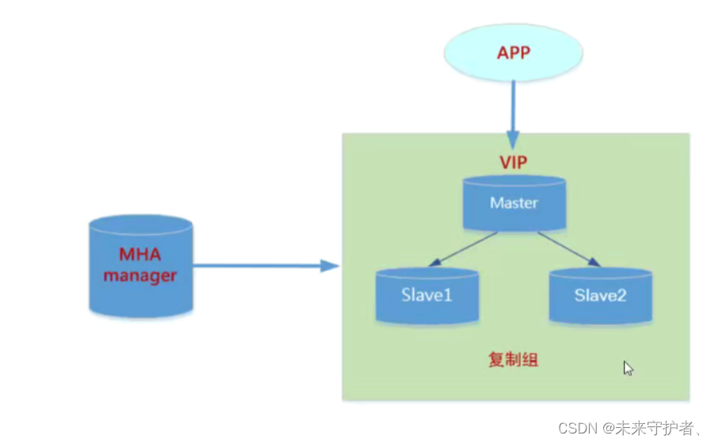
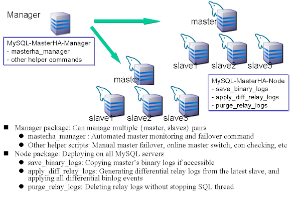
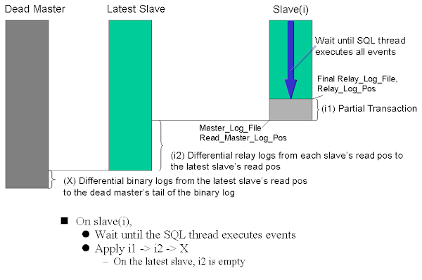
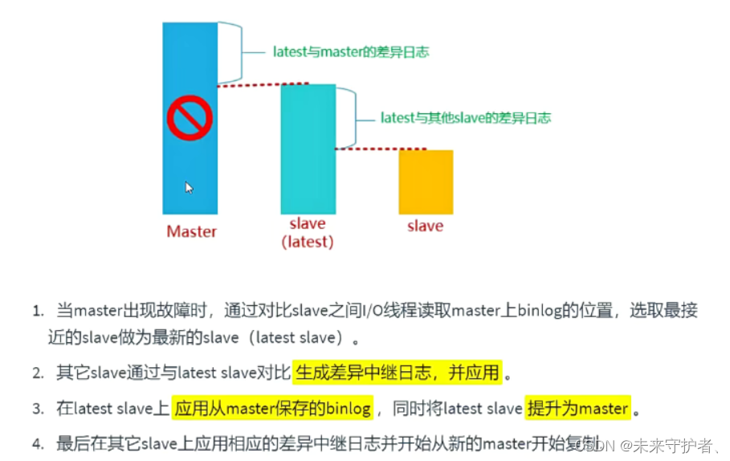
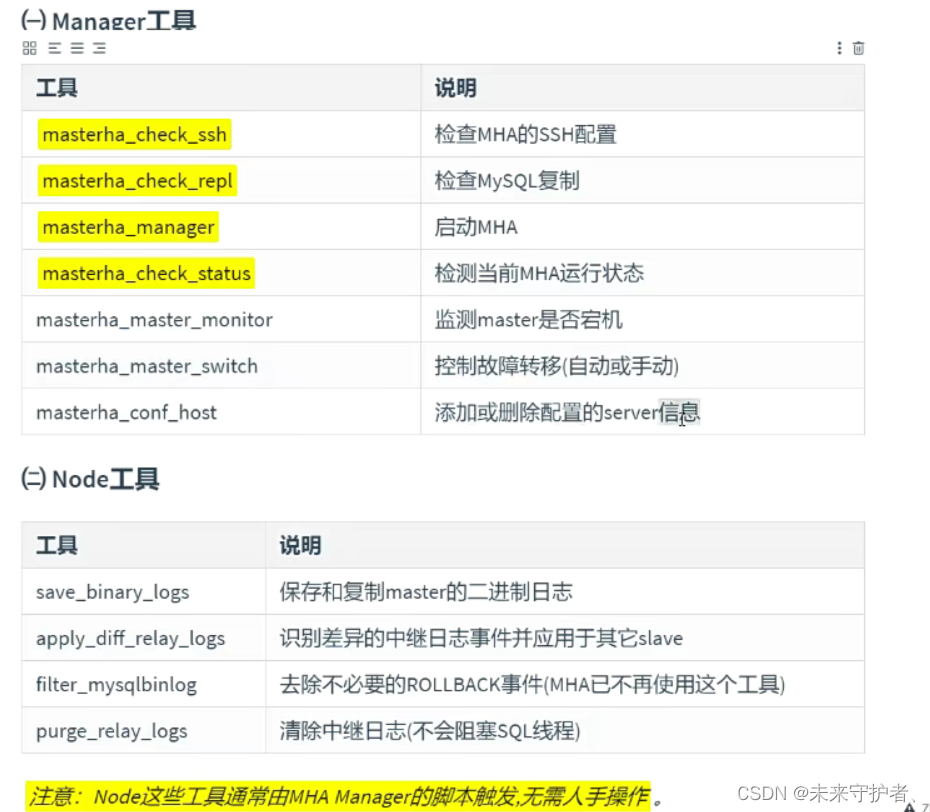

# Mysql MHA


## MHA





**MHA简介**

MHA（Master High Availability）是由日本人yoshinorim开发的一款成熟且开源的MySQL高可用程序，它实现了MySQL主从环境下MASTER宕机后能够自动进行单次故障转移的功能，其本身由perl语言编写，安装方便，使用简单。

* MHA（MasterHigh Availability）是一套优秀的MySQL高可用环境下故障切换和主从复制的软件。
* MHA 的出现就是解决MySQL 单点故障的问题。
* MySQL故障切换过程中，MHA能做到0-30秒内自动完成故障切换操作。
* MHA能在故障切换的过程中最大程度上保证数据的一致性，以达到真正意义上的高可用。

MHA服务有两种角色，MHA Manager(管理节点)和MHA Node(数据节点)：

* MHA Manager: 通常单独部署在一台独立机器上管理多个master/slave集群，每个master/slave集群称作一个application;
* MHA Node: 运行在每台MySQL服务器上(master/slave/manager)，它通过监控具备解析和清理logs功能的脚本来加快故障转移。




**MHA工作原理**

* 从宕机崩溃的Master保存二进制日志事件（binlog event）；
* 识别含有最新更新的Slave；
* 应用差异的中继日志（relay log）到其他Slave；
* 应用从Master保存的二进制日志事件；
* 提升一个Slave为新的Master；
* 使其他的Slave连接新的Master进行复制；



 


**MHA数据补偿**

- 当SSH能连接,从库对比主库GTID 或者position号,立即将二进制日志保存至各个从节点并且应用(save_binary_logs )
- 当SSH不能连接, 对比从库之间的relaylog的差异(apply_diff_relay_logs)


**MHA组件**

MHA会提供诸多工具程序，其常见的如下所示：




## MySQL MHA搭建准备


1. MHA架构：①数据库安装 ②一主两从 ③MHA搭建

2. 故障模拟：①主库失效 ②备选主库成为主库 ③原故障主库恢复重新加入到MHA成为从库


**实验环境**

一主两从环境：

manager：172.168.2.17

master: 172.168.2.18

slave1: 172.168.2.19

slave2: 172.168.2.20

```bash
# 确保所有节点主机名可解析
[root@manager ~]# cat /etc/hosts
127.0.0.1   localhost localhost.localdomain localhost4 localhost4.localdomain4
::1         localhost localhost.localdomain localhost6 localhost6.localdomain6

172.168.2.17 manager
172.168.2.18 master
172.168.2.19 slave1
172.168.2.20 slave2
```


### 配置主从集群-有gtid

* 安装mysql，略

- 所有mysql节点开启中继日志、二进制日志、server-id唯一、从节点开启只读、从节点关闭中继日志自动清理

```bash
# master
[root@master mysql]# cat /etc/my.cnf
[mysqld]
server-id=1				#服务器ID
skip-name-resolve=1
datadir=/data/mysql		#数据目录，mysql用户有读写权限
basedir = /usr/local/mysql
socket=/data/mysql/mysql.sock
pid-file=/data/mysql/mysql.pid
gtid-mode=on
enforce-gtid-consistency=true
master-info-repository=TABLE
relay-log-info-repository=TABLE
sync-master-info=1
slave-parallel-workers=2
binlog-checksum=CRC32
master-verify-checksum=1
slave-sql-verify-checksum=1
binlog_format = ROW
log-bin=master-bin					#开启二进制日志
log-bin-index=master-bin.index
character-set-server=utf8mb4
relay-log=relay-master				#开启中继日志
relay-log-index=relay-master.index
slow_query_log_file = /data/mysql/mysql-slow.log
slow_query_log = 1
log_error = /data/mysql/mysql.err
innodb_file_per_table=1
sql_mode=NO_ENGINE_SUBSTITUTION,STRICT_TRANS_TABLES
default-storage-engine = InnoDB
default-tmp-storage-engine = InnoDB
internal-tmp-disk-storage-engine = InnoDB
sync-binlog = 1
log-slave-updates = 1  #multi level copy enable
lower-case-table-names = 1
innodb-flush-method=O_DIRECT
max-connections=1000
wait-timeout=3600
innodb-thread-concurrency=16
innodb-log-buffer-size=100M
innodb-log-file-size=300M
innodb-log-files-in-group=3
bind-address=0.0.0.0
port=3306
transaction-isolation=READ-COMMITTED
log_timestamps=SYSTEM
max_allowed_packet=16777216
log_warnings=1

[client]
default-character-set = utf8mb4
socket=/data/mysql/mysql.sock


# slave1
[root@slave1 mysql]# cat /etc/my.cnf
[mysqld]
server-id=2				#服务器ID
skip-name-resolve=1
datadir=/data/mysql		#数据目录，mysql用户有读写权限
basedir = /usr/local/mysql
socket=/data/mysql/mysql.sock
pid-file=/data/mysql/mysql.pid
gtid-mode=on
enforce-gtid-consistency=true
master-info-repository=TABLE
relay-log-info-repository=TABLE
sync-master-info=1
slave-parallel-workers=2
binlog-checksum=CRC32
master-verify-checksum=1
slave-sql-verify-checksum=1
binlog_format = ROW
log-bin=master-bin						#开启二进制日志
log-bin-index=master-bin.index
character-set-server=utf8mb4
relay-log=relay-master					#开启中继日志
relay-log-index=relay-master.index
slow_query_log_file = /data/mysql/mysql-slow.log
slow_query_log = 1
log_error = /data/mysql/mysql.err
innodb_file_per_table=1
sql_mode=NO_ENGINE_SUBSTITUTION,STRICT_TRANS_TABLES
default-storage-engine = InnoDB
default-tmp-storage-engine = InnoDB
internal-tmp-disk-storage-engine = InnoDB
sync-binlog = 1
log-slave-updates = 0  #multi level copy disable
lower-case-table-names = 1
innodb-flush-method=O_DIRECT
max-connections=1000
wait-timeout=3600
innodb-thread-concurrency=16
innodb-log-buffer-size=100M
innodb-log-file-size=300M
innodb-log-files-in-group=3
bind-address=0.0.0.0
port=3306
transaction-isolation=READ-COMMITTED
log_timestamps=SYSTEM
max_allowed_packet=16777216
log_warnings=1
relay_log_purge=0					#从节点关闭中继日志自动清理
read_only=1							#从节点开启只读

[client]
default-character-set = utf8mb4
socket=/data/mysql/mysql.sock


# slave2
[root@slave2 mysql]# cat /etc/my.cnf
[mysqld]
server-id=3				#服务器ID
skip-name-resolve=1
datadir=/data/mysql		#数据目录，mysql用户有读写权限
basedir = /usr/local/mysql
socket=/data/mysql/mysql.sock
pid-file=/data/mysql/mysql.pid
gtid-mode=on
enforce-gtid-consistency=true
master-info-repository=TABLE
relay-log-info-repository=TABLE
sync-master-info=1
slave-parallel-workers=2
binlog-checksum=CRC32
master-verify-checksum=1
slave-sql-verify-checksum=1
binlog_format = ROW
log-bin=master-bin						#开启二进制日志
log-bin-index=master-bin.index
character-set-server=utf8mb4
relay-log=relay-master					#开启中继日志
relay-log-index=relay-master.index
slow_query_log_file = /data/mysql/mysql-slow.log
slow_query_log = 1
log_error = /data/mysql/mysql.err
innodb_file_per_table=1
sql_mode=NO_ENGINE_SUBSTITUTION,STRICT_TRANS_TABLES
default-storage-engine = InnoDB
default-tmp-storage-engine = InnoDB
internal-tmp-disk-storage-engine = InnoDB
sync-binlog = 1
log-slave-updates = 0  #multi level copy disable
lower-case-table-names = 1
innodb-flush-method=O_DIRECT
max-connections=1000
wait-timeout=3600
innodb-thread-concurrency=16
innodb-log-buffer-size=100M
innodb-log-file-size=300M
innodb-log-files-in-group=3
bind-address=0.0.0.0
port=3306
transaction-isolation=READ-COMMITTED
log_timestamps=SYSTEM
max_allowed_packet=16777216
log_warnings=1
relay_log_purge=0					#从节点关闭中继日志自动清理
read_only=1							#从节点开启只读


[client]
default-character-set = utf8mb4
socket=/data/mysql/mysql.sock

```


* 配置主从集群配置

```bash
# 所有mysql节点配置主从复制时使用的用户及权限
grant replication slave on *.* to 'repluser'@'172.168.2.%' identified by 'pass';

# master上查看binlog文件执行位置
mysql> show master status;
+-------------------+----------+--------------+------------------+------------------------------------------+
| File              | Position | Binlog_Do_DB | Binlog_Ignore_DB | Executed_Gtid_Set                        |
+-------------------+----------+--------------+------------------+------------------------------------------+
| master-bin.000003 |      695 |              |                  | 6a46703e-0798-11ee-af59-000c29c7acb7:1-2 |
+-------------------+----------+--------------+------------------+------------------------------------------+


# slave1和slave2上执行
change master to master_host='172.168.2.18',master_user='repluser',master_password='pass',master_log_file='master-bin.000003',MASTER_LOG_POS=695 for channel 'slave';


# slave1集群状态
mysql> start slave;
Query OK, 0 rows affected (0.01 sec)

mysql> show slave status\G
*************************** 1. row ***************************
               Slave_IO_State: Waiting for master to send event
                  Master_Host: 172.168.2.18
                  Master_User: repluser
                  Master_Port: 3306
                Connect_Retry: 60
              Master_Log_File: master-bin.000003
          Read_Master_Log_Pos: 695
               Relay_Log_File: relay-master-slave.000002
                Relay_Log_Pos: 321
        Relay_Master_Log_File: master-bin.000003
             Slave_IO_Running: Yes
            Slave_SQL_Running: Yes
              Replicate_Do_DB: 
          Replicate_Ignore_DB: 
           Replicate_Do_Table: 
       Replicate_Ignore_Table: 
      Replicate_Wild_Do_Table: 
  Replicate_Wild_Ignore_Table: 
                   Last_Errno: 0
                   Last_Error: 
                 Skip_Counter: 0
          Exec_Master_Log_Pos: 695
              Relay_Log_Space: 531
              Until_Condition: None
               Until_Log_File: 
                Until_Log_Pos: 0
           Master_SSL_Allowed: No
           Master_SSL_CA_File: 
           Master_SSL_CA_Path: 
              Master_SSL_Cert: 
            Master_SSL_Cipher: 
               Master_SSL_Key: 
        Seconds_Behind_Master: 0
Master_SSL_Verify_Server_Cert: No
                Last_IO_Errno: 0
                Last_IO_Error: 
               Last_SQL_Errno: 0
               Last_SQL_Error: 
  Replicate_Ignore_Server_Ids: 
             Master_Server_Id: 1
                  Master_UUID: 6a46703e-0798-11ee-af59-000c29c7acb7
             Master_Info_File: mysql.slave_master_info
                    SQL_Delay: 0
          SQL_Remaining_Delay: NULL
      Slave_SQL_Running_State: Slave has read all relay log; waiting for more updates
           Master_Retry_Count: 86400
                  Master_Bind: 
      Last_IO_Error_Timestamp: 
     Last_SQL_Error_Timestamp: 
               Master_SSL_Crl: 
           Master_SSL_Crlpath: 
           Retrieved_Gtid_Set: 
            Executed_Gtid_Set: 6a3dda9b-0798-11ee-89f5-000c29089177:1-2
                Auto_Position: 0
         Replicate_Rewrite_DB: 
                 Channel_Name: slave
           Master_TLS_Version: 
1 row in set (0.00 sec)


# slave2集群状态
mysql> start slave;
Query OK, 0 rows affected (0.01 sec)

mysql> show slave status\G
*************************** 1. row ***************************
               Slave_IO_State: Waiting for master to send event
                  Master_Host: 172.168.2.18
                  Master_User: repluser
                  Master_Port: 3306
                Connect_Retry: 60
              Master_Log_File: master-bin.000003
          Read_Master_Log_Pos: 695
               Relay_Log_File: relay-master-slave.000002
                Relay_Log_Pos: 321
        Relay_Master_Log_File: master-bin.000003
             Slave_IO_Running: Yes
            Slave_SQL_Running: Yes
              Replicate_Do_DB: 
          Replicate_Ignore_DB: 
           Replicate_Do_Table: 
       Replicate_Ignore_Table: 
      Replicate_Wild_Do_Table: 
  Replicate_Wild_Ignore_Table: 
                   Last_Errno: 0
                   Last_Error: 
                 Skip_Counter: 0
          Exec_Master_Log_Pos: 695
              Relay_Log_Space: 531
              Until_Condition: None
               Until_Log_File: 
                Until_Log_Pos: 0
           Master_SSL_Allowed: No
           Master_SSL_CA_File: 
           Master_SSL_CA_Path: 
              Master_SSL_Cert: 
            Master_SSL_Cipher: 
               Master_SSL_Key: 
        Seconds_Behind_Master: 0
Master_SSL_Verify_Server_Cert: No
                Last_IO_Errno: 0
                Last_IO_Error: 
               Last_SQL_Errno: 0
               Last_SQL_Error: 
  Replicate_Ignore_Server_Ids: 
             Master_Server_Id: 1
                  Master_UUID: 6a46703e-0798-11ee-af59-000c29c7acb7
             Master_Info_File: mysql.slave_master_info
                    SQL_Delay: 0
          SQL_Remaining_Delay: NULL
      Slave_SQL_Running_State: Slave has read all relay log; waiting for more updates
           Master_Retry_Count: 86400
                  Master_Bind: 
      Last_IO_Error_Timestamp: 
     Last_SQL_Error_Timestamp: 
               Master_SSL_Crl: 
           Master_SSL_Crlpath: 
           Retrieved_Gtid_Set: 
            Executed_Gtid_Set: 6a3f2aef-0798-11ee-897e-000c29dc4c18:1-2
                Auto_Position: 0
         Replicate_Rewrite_DB: 
                 Channel_Name: slave
           Master_TLS_Version: 
1 row in set (0.00 sec)


# master集群状态
mysql> show slave hosts;
+-----------+------+------+-----------+--------------------------------------+
| Server_id | Host | Port | Master_id | Slave_UUID                           |
+-----------+------+------+-----------+--------------------------------------+
|         3 |      | 3306 |         1 | 6a3f2aef-0798-11ee-897e-000c29dc4c18 |
|         2 |      | 3306 |         1 | 6a3dda9b-0798-11ee-89f5-000c29089177 |
+-----------+------+------+-----------+--------------------------------------+


# mysql主从集群验证

## master操作
mysql> create database test;
## slave1操作
mysql> show databases;
+--------------------+
| Database           |
+--------------------+
| information_schema |
| mysql              |
| performance_schema |
| sys                |
| test               |
+--------------------+
## slave2操作
mysql> show databases;
+--------------------+
| Database           |
+--------------------+
| information_schema |
| mysql              |
| performance_schema |
| sys                |
| test               |
+--------------------+
#### 结果：主从集群正常
```


按上述要求分别配置好主从节点之后，按Mysql复制配置架构的配置方式将其配置完成，并启动master节点和各slave节点，以及为各slave节点启动其IO和SQL线程，确保主从复制运行无误。

而后，在所有Mysql节点授权拥有管理权限的用户可在本地网络中有其它节点上远程访问。当然，此时仅需要且只能在master节点运行类似如下SQL语句即可。

```bash
# 所有mysql节点创建管理账户给MHA使用，因为MHA要使用此账户操作
grant all on *.* to 'mhaadmin'@'172.168.2.%' identified by 'pass@123';
```


### SSH互信

配置MHA集群所有节点SSH互信

```bash
# manager生成ras密钥对
[root@manager ~]# ssh-keygen -t rsa 
[root@manager ~]# cat /root/.ssh/id_rsa.pub > /root/.ssh/authorized_keys
[root@manager ~]# chmod go= /root/.ssh/authorized_keys
[root@manager ~]# scp -p /root/.ssh/id_rsa /root/.ssh/authorized_keys root@172.168.2.18:/root/.ssh/
id_rsa                                                                                             100% 1675     1.4MB/s   00:00    
authorized_keys                                                                                    100%  394   778.1KB/s   00:00    
[root@manager ~]# scp -p /root/.ssh/id_rsa /root/.ssh/authorized_keys root@172.168.2.19:/root/.ssh/
id_rsa                                                                                             100% 1675     1.4MB/s   00:00    
authorized_keys                                                                                    100%  394   552.5KB/s   00:00    
[root@manager ~]# scp -p /root/.ssh/id_rsa /root/.ssh/authorized_keys root@172.168.2.20:/root/.ssh/
id_rsa                                                                                             100% 1675   836.6KB/s   00:00    
authorized_keys                                                                                    100%  394   307.5KB/s   00:00 

```


### 安装MHA软件 

下载地址：https://github.com/yoshinorim/mha4mysql-manager/wiki/Downloads

```bash
# 下载MHA安装包
[root@manager download]# curl -OL https://github.com/yoshinorim/mha4mysql-manager/releases/download/v0.58/mha4mysql-manager-0.58-0.el7.centos.noarch.rpm 
[root@manager download]# curl -OL https://github.com/yoshinorim/mha4mysql-node/releases/download/v0.58/mha4mysql-node-0.58-0.el7.centos.noarch.rpm
[root@manager download]# ls
mha4mysql-manager-0.58-0.el7.centos.noarch.rpm  mha4mysql-node-0.58-0.el7.centos.noarch.rpm
[root@manager download]# scp mha4mysql-node-0.58-0.el7.centos.noarch.rpm root@172.168.2.18:/root/
[root@manager download]# scp mha4mysql-node-0.58-0.el7.centos.noarch.rpm root@172.168.2.19:/root/   
[root@manager download]# scp mha4mysql-node-0.58-0.el7.centos.noarch.rpm root@172.168.2.20:/root/

# 所有节点安装相关依赖
yum -y install epel-release 
yum -y install perl-Config-Tiny perl-Time-HiRes perl-Parallel-ForkManager perl-Log-Dispatch perl-DBD-MySQL ncftp

# manager节点安装manager和node安装包
[root@manager download]# yum install -y mha4mysql*

# node节点安装
yum -y install mha4mysql-node-0.58-0.el7.centos.noarch.rpm


## 查看包文件，其它都是perl脚本文件
[root@manager download]# rpm -ql mha4mysql-manager 
/usr/bin/masterha_check_repl
/usr/bin/masterha_check_ssh
/usr/bin/masterha_check_status
/usr/bin/masterha_conf_host
/usr/bin/masterha_manager
/usr/bin/masterha_master_monitor
/usr/bin/masterha_master_switch
/usr/bin/masterha_secondary_check
/usr/bin/masterha_stop
/usr/share/man/man1/masterha_check_repl.1.gz
/usr/share/man/man1/masterha_check_ssh.1.gz
/usr/share/man/man1/masterha_check_status.1.gz
/usr/share/man/man1/masterha_conf_host.1.gz
/usr/share/man/man1/masterha_manager.1.gz
/usr/share/man/man1/masterha_master_monitor.1.gz
/usr/share/man/man1/masterha_master_switch.1.gz
/usr/share/man/man1/masterha_secondary_check.1.gz
/usr/share/man/man1/masterha_stop.1.gz
/usr/share/perl5/vendor_perl/MHA/Config.pm
/usr/share/perl5/vendor_perl/MHA/DBHelper.pm
/usr/share/perl5/vendor_perl/MHA/FileStatus.pm
/usr/share/perl5/vendor_perl/MHA/HealthCheck.pm
/usr/share/perl5/vendor_perl/MHA/ManagerAdmin.pm
/usr/share/perl5/vendor_perl/MHA/ManagerAdminWrapper.pm
/usr/share/perl5/vendor_perl/MHA/ManagerConst.pm
/usr/share/perl5/vendor_perl/MHA/ManagerUtil.pm
/usr/share/perl5/vendor_perl/MHA/MasterFailover.pm
/usr/share/perl5/vendor_perl/MHA/MasterMonitor.pm
/usr/share/perl5/vendor_perl/MHA/MasterRotate.pm
/usr/share/perl5/vendor_perl/MHA/SSHCheck.pm
/usr/share/perl5/vendor_perl/MHA/Server.pm
/usr/share/perl5/vendor_perl/MHA/ServerManager.pm

[root@manager download]# rpm -ql mha4mysql-node
/usr/bin/apply_diff_relay_logs
/usr/bin/filter_mysqlbinlog
/usr/bin/purge_relay_logs
/usr/bin/save_binary_logs
/usr/share/man/man1/apply_diff_relay_logs.1.gz
/usr/share/man/man1/filter_mysqlbinlog.1.gz
/usr/share/man/man1/purge_relay_logs.1.gz
/usr/share/man/man1/save_binary_logs.1.gz
/usr/share/perl5/vendor_perl/MHA/BinlogHeaderParser.pm
/usr/share/perl5/vendor_perl/MHA/BinlogManager.pm
/usr/share/perl5/vendor_perl/MHA/BinlogPosFindManager.pm
/usr/share/perl5/vendor_perl/MHA/BinlogPosFinder.pm
/usr/share/perl5/vendor_perl/MHA/BinlogPosFinderElp.pm
/usr/share/perl5/vendor_perl/MHA/BinlogPosFinderXid.pm
/usr/share/perl5/vendor_perl/MHA/NodeConst.pm
/usr/share/perl5/vendor_perl/MHA/NodeUtil.pm
/usr/share/perl5/vendor_perl/MHA/SlaveUtil.pm
```


### 配置mha

```bash
#创建相关目录（所有节点）
[root@master ~]# mkdir -pv /data/masterha/app1

#编写配置文件
[root@manager ~]# mkdir /etc/masterha
[root@manager ~]# cat /etc/masterha/app1.cnf
[server default]
#mha访问数据库的账号与密码
user=mhaadmin
password=pass@123
port=3306
#指定mha的工作目录
manager_workdir=/data/masterha/app1
#指定管理日志路径
manager_log=/data/masterha/app1/manager.log
#指定mha在远程节点上的工作目录
remote_workdir=/data/masterha/app1
#指定主从复制的mysq用户和密码
repl_user=repluser
repl_password=pass
#指定检测间隔时间
ping_interval=1
#指定一个脚本，该脚本实现了在主从切换之后，将虚拟ip漂移到新的master上
#master_ip_failover_script=/opt/mysql-mha/master_ip_failover
#指定检查的从服务器IP地址.有几个，就用-s选项加几个
#secondary_check_script=/usr/bin/masterha_secondary_check -s 192.168.182.111 -s 192.168.182.112
#用于故障切换的时候发送邮件提醒
#report_script=/data1/mysql-mha/send_mail
ssh_user=root

[server1]
hostname=172.168.2.18
ssh_port=22
ssh_user=root
candidate_master=1				#默认是可以成为master的
check_repl_delay=0

[server2]
hostname=172.168.2.19

[server3]
hostname=172.168.2.20
#no_master=1					#配置不可以成为master
```

**candidate_master=1**

> 设置为候选master，设置该参数以后，发生主从切换以后将会将此从库提升为主库，即使这个从库不是集群中最新的slave，no_master=1正好相反

**check_repl_delay=0**

> 默认情况下如果一个slave落后master 超过100M的relay logs的话，MHA将不会选择该slave作为一个新的master， 因为对于这个slave的恢复需要花费很长时间；通过设置check_repl_delay=0，MHA触发切换在选择一个新的master的时候将会忽略复制延时，这个参数对于设置了candidate_master=1的主机非常有用，因为这个候选主在切换的过程中一定是新的master


**检查mha互信是否正常**

```bash
[root@manager ~]# masterha_check_ssh --conf=/etc/masterha/app1.cnf
Sun Jun 11 16:19:27 2023 - [warning] Global configuration file /etc/masterha_default.cnf not found. Skipping.
Sun Jun 11 16:19:27 2023 - [info] Reading application default configuration from /etc/masterha/app1.cnf..
Sun Jun 11 16:19:27 2023 - [info] Reading server configuration from /etc/masterha/app1.cnf..
Sun Jun 11 16:19:27 2023 - [info] Starting SSH connection tests..
Sun Jun 11 16:19:28 2023 - [debug] 
Sun Jun 11 16:19:27 2023 - [debug]  Connecting via SSH from root@172.168.2.18(172.168.2.18:22) to root@172.168.2.19(172.168.2.19:22)..
Sun Jun 11 16:19:27 2023 - [debug]   ok.
Sun Jun 11 16:19:27 2023 - [debug]  Connecting via SSH from root@172.168.2.18(172.168.2.18:22) to root@172.168.2.20(172.168.2.20:22)..
Sun Jun 11 16:19:28 2023 - [debug]   ok.
Sun Jun 11 16:19:29 2023 - [debug] 
Sun Jun 11 16:19:28 2023 - [debug]  Connecting via SSH from root@172.168.2.19(172.168.2.19:22) to root@172.168.2.18(172.168.2.18:22)..
Warning: Permanently added '172.168.2.18' (ECDSA) to the list of known hosts.
Sun Jun 11 16:19:28 2023 - [debug]   ok.
Sun Jun 11 16:19:28 2023 - [debug]  Connecting via SSH from root@172.168.2.19(172.168.2.19:22) to root@172.168.2.20(172.168.2.20:22)..
Warning: Permanently added '172.168.2.20' (ECDSA) to the list of known hosts.
Sun Jun 11 16:19:28 2023 - [debug]   ok.
Sun Jun 11 16:19:30 2023 - [debug] 
Sun Jun 11 16:19:28 2023 - [debug]  Connecting via SSH from root@172.168.2.20(172.168.2.20:22) to root@172.168.2.18(172.168.2.18:22)..
Sun Jun 11 16:19:28 2023 - [debug]   ok.
Sun Jun 11 16:19:28 2023 - [debug]  Connecting via SSH from root@172.168.2.20(172.168.2.20:22) to root@172.168.2.19(172.168.2.19:22)..
Warning: Permanently added '172.168.2.19' (ECDSA) to the list of known hosts.
Sun Jun 11 16:19:29 2023 - [debug]   ok.
Sun Jun 11 16:19:30 2023 - [info] All SSH connection tests passed successfully.

```


**检查主从复制是否正常**

```bash
[root@manager ~]# masterha_check_repl --conf=/etc/masterha/app1.cnf
Sun Jun 11 16:23:03 2023 - [warning] Global configuration file /etc/masterha_default.cnf not found. Skipping.
Sun Jun 11 16:23:03 2023 - [info] Reading application default configuration from /etc/masterha/app1.cnf..
Sun Jun 11 16:23:03 2023 - [info] Reading server configuration from /etc/masterha/app1.cnf..
Sun Jun 11 16:23:03 2023 - [info] MHA::MasterMonitor version 0.58.
Sun Jun 11 16:23:04 2023 - [info] GTID failover mode = 1
Sun Jun 11 16:23:04 2023 - [info] Dead Servers:
Sun Jun 11 16:23:04 2023 - [info] Alive Servers:
Sun Jun 11 16:23:04 2023 - [info]   172.168.2.18(172.168.2.18:3306)
Sun Jun 11 16:23:04 2023 - [info]   172.168.2.19(172.168.2.19:3306)
Sun Jun 11 16:23:04 2023 - [info]   172.168.2.20(172.168.2.20:3306)
Sun Jun 11 16:23:04 2023 - [info] Alive Slaves:
Sun Jun 11 16:23:04 2023 - [info]   172.168.2.19(172.168.2.19:3306)  Version=5.7.31-log (oldest major version between slaves) log-bin:enabled
Sun Jun 11 16:23:04 2023 - [info]     GTID ON
Sun Jun 11 16:23:04 2023 - [info]     Replicating from 172.168.2.18(172.168.2.18:3306)
Sun Jun 11 16:23:04 2023 - [info]   172.168.2.20(172.168.2.20:3306)  Version=5.7.31-log (oldest major version between slaves) log-bin:enabled
Sun Jun 11 16:23:04 2023 - [info]     GTID ON
Sun Jun 11 16:23:04 2023 - [info]     Replicating from 172.168.2.18(172.168.2.18:3306)
Sun Jun 11 16:23:04 2023 - [info] Current Alive Master: 172.168.2.18(172.168.2.18:3306)
Sun Jun 11 16:23:04 2023 - [info] Checking slave configurations..
Sun Jun 11 16:23:04 2023 - [info] Checking replication filtering settings..
Sun Jun 11 16:23:04 2023 - [info]  binlog_do_db= , binlog_ignore_db= 
Sun Jun 11 16:23:04 2023 - [info]  Replication filtering check ok.
Sun Jun 11 16:23:04 2023 - [info] GTID (with auto-pos) is supported. Skipping all SSH and Node package checking.
Sun Jun 11 16:23:04 2023 - [info] Checking SSH publickey authentication settings on the current master..
Sun Jun 11 16:23:04 2023 - [info] HealthCheck: SSH to 172.168.2.18 is reachable.
Sun Jun 11 16:23:04 2023 - [info] 
172.168.2.18(172.168.2.18:3306) (current master)	#现在的master
 +--172.168.2.19(172.168.2.19:3306)
 +--172.168.2.20(172.168.2.20:3306)

Sun Jun 11 16:23:04 2023 - [info] Checking replication health on 172.168.2.19..
Sun Jun 11 16:23:04 2023 - [info]  ok.
Sun Jun 11 16:23:04 2023 - [info] Checking replication health on 172.168.2.20..
Sun Jun 11 16:23:04 2023 - [info]  ok.
Sun Jun 11 16:23:04 2023 - [warning] master_ip_failover_script is not defined.
Sun Jun 11 16:23:04 2023 - [warning] shutdown_script is not defined.
Sun Jun 11 16:23:04 2023 - [info] Got exit code 0 (Not master dead).

MySQL Replication Health is OK.

```


### 运行mha

**前台运行**

```bash
[root@manager ~]# masterha_manager --conf=/etc/masterha/app1.cnf
Sun Jun 11 16:26:37 2023 - [warning] Global configuration file /etc/masterha_default.cnf not found. Skipping.
Sun Jun 11 16:26:37 2023 - [info] Reading application default configuration from /etc/masterha/app1.cnf..
Sun Jun 11 16:26:37 2023 - [info] Reading server configuration from /etc/masterha/app1.cnf..

# masterha_manager --conf=/etc/masterha/app1.cnf --remove_dead_master_conf --ignore_last_failover 
```


**模拟mysql主节点故障**

```bash
#slave1状态
mysql> show global variables like 'read_only';
+---------------+-------+
| Variable_name | Value |
+---------------+-------+
| read_only     | ON    |
+---------------+-------+

# 模拟故障
[root@master ~]# ps -ef | grep mysql
root      34075      1  0 Jun10 ?        00:00:00 /bin/sh /usr/local/mysql/bin/mysqld_safe --datadir=/data/mysql --pid-file=/data/mysql/mysql.pid
mysql     34710  34075  0 Jun10 ?        00:01:16 /usr/local/mysql/bin/mysqld --basedir=/usr/local/mysql --datadir=/data/mysql --plugin-dir=/usr/local/mysql/lib/plugin --user=mysql --log-error=/data/mysql/mysql.err --pid-file=/data/mysql/mysql.pid --socket=/data/mysql/mysql.sock --port=3306
root      38304  37984  0 16:34 pts/1    00:00:00 grep --color=auto mysql
[root@master ~]# killall mysqld mysqld_safe
[root@master ~]# ps -ef | grep mysql
root      38322  37984  0 16:35 pts/1    00:00:00 grep --color=auto mysql
[root@master ~]# ss -tnl
State       Recv-Q Send-Q                     Local Address:Port                                    Peer Address:Port              
LISTEN      0      128                                    *:111                                                *:*                  
LISTEN      0      128                                    *:22                                                 *:*                  
LISTEN      0      128                                 [::]:111                                             [::]:*                  
LISTEN      0      128                                 [::]:22                                              [::]:*  
```

> 注：
>
> 经过测试，带有GTID的主从集群测试失败。不知是否是mysqlbinlog命令报“unknown variable 'default-character-set=utf8mb4'”的问题，解决此问题办法：
>
> [root@master ~]# cat /etc/my.cnf
>
> .....
>
> [client]
> socket=/data/mysql/mysql.sock	#将default-character-set=utf8mb4` 或 `character-set-server = utf8mb4删除


## mysql主从集群-无gtid


**集群类型**

> 经过测试，在开启GTID模式下的主从集群切换失败。
>
> 经过测试，在未开启GTID模式下的主从集群切换成功。


````bash
# slave2此时为主
mysql> show slave hosts;
+-----------+------+------+-----------+--------------------------------------+
| Server_id | Host | Port | Master_id | Slave_UUID                           |
+-----------+------+------+-----------+--------------------------------------+
|         1 |      | 3306 |         3 | 6a46703e-0798-11ee-af59-000c29c7acb7 |
|         2 |      | 3306 |         3 | 6a3dda9b-0798-11ee-89f5-000c29089177 |
+-----------+------+------+-----------+--------------------------------------+

# master此是为从
mysql> show slave status\G
*************************** 1. row ***************************
               Slave_IO_State: Waiting for master to send event
                  Master_Host: 172.168.2.20
                  Master_User: repluser
                  Master_Port: 3306
                Connect_Retry: 60
              Master_Log_File: master-bin.000004
          Read_Master_Log_Pos: 154
               Relay_Log_File: relay-master.000002
                Relay_Log_Pos: 321
        Relay_Master_Log_File: master-bin.000004
             Slave_IO_Running: Yes
            Slave_SQL_Running: Yes
              Replicate_Do_DB: 
          Replicate_Ignore_DB: 
           Replicate_Do_Table: 
       Replicate_Ignore_Table: 
      Replicate_Wild_Do_Table: 
  Replicate_Wild_Ignore_Table: 
                   Last_Errno: 0
                   Last_Error: 
                 Skip_Counter: 0
          Exec_Master_Log_Pos: 154
              Relay_Log_Space: 525
              Until_Condition: None
               Until_Log_File: 
                Until_Log_Pos: 0
           Master_SSL_Allowed: No
           Master_SSL_CA_File: 
           Master_SSL_CA_Path: 
              Master_SSL_Cert: 
            Master_SSL_Cipher: 
               Master_SSL_Key: 
        Seconds_Behind_Master: 0
Master_SSL_Verify_Server_Cert: No
                Last_IO_Errno: 0
                Last_IO_Error: 
               Last_SQL_Errno: 0
               Last_SQL_Error: 
  Replicate_Ignore_Server_Ids: 
             Master_Server_Id: 3
                  Master_UUID: 6a3f2aef-0798-11ee-897e-000c29dc4c18
             Master_Info_File: mysql.slave_master_info
                    SQL_Delay: 0
          SQL_Remaining_Delay: NULL
      Slave_SQL_Running_State: Slave has read all relay log; waiting for more updates
           Master_Retry_Count: 86400
                  Master_Bind: 
      Last_IO_Error_Timestamp: 
     Last_SQL_Error_Timestamp: 
               Master_SSL_Crl: 
           Master_SSL_Crlpath: 
           Retrieved_Gtid_Set: 
            Executed_Gtid_Set: 
                Auto_Position: 0
         Replicate_Rewrite_DB: 
                 Channel_Name: 
           Master_TLS_Version: 

# slave1此时为从
mysql> show slave status\G
*************************** 1. row ***************************
               Slave_IO_State: Waiting for master to send event
                  Master_Host: 172.168.2.20
                  Master_User: repluser
                  Master_Port: 3306
                Connect_Retry: 60
              Master_Log_File: master-bin.000004
          Read_Master_Log_Pos: 154
               Relay_Log_File: relay-master.000002
                Relay_Log_Pos: 321
        Relay_Master_Log_File: master-bin.000004
             Slave_IO_Running: Yes
            Slave_SQL_Running: Yes
              Replicate_Do_DB: 
          Replicate_Ignore_DB: 
           Replicate_Do_Table: 
       Replicate_Ignore_Table: 
      Replicate_Wild_Do_Table: 
  Replicate_Wild_Ignore_Table: 
                   Last_Errno: 0
                   Last_Error: 
                 Skip_Counter: 0
          Exec_Master_Log_Pos: 154
              Relay_Log_Space: 525
              Until_Condition: None
               Until_Log_File: 
                Until_Log_Pos: 0
           Master_SSL_Allowed: No
           Master_SSL_CA_File: 
           Master_SSL_CA_Path: 
              Master_SSL_Cert: 
            Master_SSL_Cipher: 
               Master_SSL_Key: 
        Seconds_Behind_Master: 0
Master_SSL_Verify_Server_Cert: No
                Last_IO_Errno: 0
                Last_IO_Error: 
               Last_SQL_Errno: 0
               Last_SQL_Error: 
  Replicate_Ignore_Server_Ids: 
             Master_Server_Id: 3
                  Master_UUID: 6a3f2aef-0798-11ee-897e-000c29dc4c18
             Master_Info_File: mysql.slave_master_info
                    SQL_Delay: 0
          SQL_Remaining_Delay: NULL
      Slave_SQL_Running_State: Slave has read all relay log; waiting for more updates
           Master_Retry_Count: 86400
                  Master_Bind: 
      Last_IO_Error_Timestamp: 
     Last_SQL_Error_Timestamp: 
               Master_SSL_Crl: 
           Master_SSL_Crlpath: 
           Retrieved_Gtid_Set: 
            Executed_Gtid_Set: 
                Auto_Position: 0
         Replicate_Rewrite_DB: 
                 Channel_Name: 
           Master_TLS_Version: 

````


```bash
# master ip 故障转移脚本
[root@manager ~]# cat /data/masterha/master_ip_failover 
#!/usr/bin/env perl
use strict;
use warnings FATAL => 'all';
 
use Getopt::Long;
 
my (
    $command, $orig_master_host, $orig_master_ip,$ssh_user,
    $orig_master_port, $new_master_host, $new_master_ip,$new_master_port,
    $orig_master_ssh_port,$new_master_ssh_port,$new_master_user,$new_master_password
);
 
# 这里定义的虚拟IP配置要注意，这个ip必须要与你自己的集群在同一个网段，否则无效
my $vip = '172.168.2.30/24';		#配置master的VIP
my $key = '1';
# 这里的网卡名称 “eth0” 需要根据你机器的网卡名称进行修改
# 如果多台机器直接的网卡名称不统一，有两种方式，一个是改脚本，二是把网卡名称修改成统一
# 我这边实际情况是修改成统一的网卡名称
my $ssh_start_vip = "sudo /sbin/ifconfig eth0:$key $vip";
my $ssh_stop_vip = "sudo /sbin/ifconfig eth0:$key down";
my $ssh_Bcast_arp= "sudo /sbin/arping -I eth0 -c 3 -A $vip";

GetOptions(
    'command=s'          => \$command,
    'ssh_user=s'         => \$ssh_user,
    'orig_master_host=s' => \$orig_master_host,
    'orig_master_ip=s'   => \$orig_master_ip,
    'orig_master_port=i' => \$orig_master_port,
    'orig_master_ssh_port=i' => \$orig_master_ssh_port,
    'new_master_host=s'  => \$new_master_host,
    'new_master_ip=s'    => \$new_master_ip,
    'new_master_port=i'  => \$new_master_port,
    'new_master_ssh_port' => \$new_master_ssh_port,
    'new_master_user' => \$new_master_user,
    'new_master_password' => \$new_master_password
 
);
 
exit &main();
 
sub main {
    $ssh_user = defined $ssh_user ? $ssh_user : 'root';
    print "\n\nIN SCRIPT TEST====$ssh_user|$ssh_stop_vip==$ssh_user|$ssh_start_vip===\n\n";
 
    if ( $command eq "stop" || $command eq "stopssh" ) {
 
        my $exit_code = 1;
        eval {
            print "Disabling the VIP on old master: $orig_master_host \n";
            &stop_vip();
            $exit_code = 0;
        };
        if ($@) {
            warn "Got Error: $@\n";
            exit $exit_code;
        }
        exit $exit_code;
    }
    elsif ( $command eq "start" ) {
 
        my $exit_code = 10;
        eval {
            print "Enabling the VIP - $vip on the new master - $new_master_host \n";
            &start_vip();
        &start_arp();
            $exit_code = 0;
        };
        if ($@) {
            warn $@;
            exit $exit_code;
        }
        exit $exit_code;
    }
    elsif ( $command eq "status" ) {
        print "Checking the Status of the script.. OK \n";
        exit 0;
    }
    else {
        &usage();
        exit 1;
    }
}
 
sub start_vip() {
    `ssh $ssh_user\@$new_master_host \" $ssh_start_vip \"`;
}
sub stop_vip() {
    `ssh $ssh_user\@$orig_master_host \" $ssh_stop_vip \"`;
}
 
sub start_arp() {
    `ssh $ssh_user\@$new_master_host \" $ssh_Bcast_arp \"`;
}
sub usage {
    print
    "Usage: master_ip_failover --command=start|stop|stopssh|status --ssh_user=user --orig_master_host=host --orig_master_ip=ip --orig_master_port=port --new_master_host=host --new_master_ip=ip --new_master_port=port\n";
}

```


```bash
[root@manager ~]# cat /etc/masterha/app1.cnf
[server default]
manager_log=/data/masterha/app1/manager.log
manager_workdir=/data/masterha/app1
master_binlog_dir=/data/mysql
master_ip_failover_script=/data/masterha/master_ip_failover	#引用上面的脚本
password=pass@123
ping_interval=1
port=3306
remote_workdir=/data/masterha/app1
repl_password=pass
repl_user=repluser
secondary_check_script=/usr/bin/masterha_secondary_check -s 172.168.2.18 -s 172.168.2.19
ssh_user=root
user=mhaadmin

[server1]
candidate_master=1
check_repl_delay=0
hostname=172.168.2.18
ssh_port=22
ssh_user=root
[server2]
check_repl_delay=0
hostname=172.168.2.19
ssh_port=22
ssh_user=root
[server3]
check_repl_delay=0
hostname=172.168.2.20
ssh_port=22
ssh_user=root

```


**启动mha**

```bash
[root@manager ~]# masterha_manager --conf=/etc/masterha/app1.cnf --remove_dead_master_conf --ignore_last_failover 
Sun Jun 11 23:40:40 2023 - [warning] Global configuration file /etc/masterha_default.cnf not found. Skipping.
Sun Jun 11 23:40:40 2023 - [info] Reading application default configuration from /etc/masterha/app1.cnf..
Sun Jun 11 23:40:40 2023 - [info] Reading server configuration from /etc/masterha/app1.cnf..

# 监控日志
[root@manager masterha]# tail -f app1/manager.log

IN SCRIPT TEST====root|sudo /sbin/ifconfig eth0:1 down==root|sudo /sbin/ifconfig eth0:1 172.168.2.30/24===

Checking the Status of the script.. OK 
Sun Jun 11 23:40:45 2023 - [info]  OK.
Sun Jun 11 23:40:45 2023 - [warning] shutdown_script is not defined.
Sun Jun 11 23:40:45 2023 - [info] Set master ping interval 1 seconds.
Sun Jun 11 23:40:45 2023 - [info] Set secondary check script: /usr/bin/masterha_secondary_check -s 172.168.2.18 -s 172.168.2.19
Sun Jun 11 23:40:45 2023 - [info] Starting ping health check on 172.168.2.20(172.168.2.20:3306)..
Sun Jun 11 23:40:45 2023 - [info] Ping(SELECT) succeeded, waiting until MySQL doesn't respond..


```


**模拟mysql主故障**

```bash
[root@slave2 ~]# service mysqld stop 
Shutting down MySQL............ SUCCESS! 


# mha管理程序切换主后，自动会退出 
[root@manager ~]# masterha_manager --conf=/etc/masterha/app1.cnf --remove_dead_master_conf --ignore_last_failover 
Sun Jun 11 23:40:40 2023 - [warning] Global configuration file /etc/masterha_default.cnf not found. Skipping.
Sun Jun 11 23:40:40 2023 - [info] Reading application default configuration from /etc/masterha/app1.cnf..
Sun Jun 11 23:40:40 2023 - [info] Reading server configuration from /etc/masterha/app1.cnf..

  Creating /data/masterha/app1 if not exists..    ok.
  Checking output directory is accessible or not..
   ok.
  Binlog found at /data/mysql, up to master-bin.000004
Sun Jun 11 23:42:03 2023 - [warning] Global configuration file /etc/masterha_default.cnf not found. Skipping.
Sun Jun 11 23:42:03 2023 - [info] Reading application default configuration from /etc/masterha/app1.cnf..
Sun Jun 11 23:42:03 2023 - [info] Reading server configuration from /etc/masterha/app1.cnf..
## --remove_dead_master_conf：该参数代表当发生主从切换后，老的主库的 ip 将会从配置文件中移除。
## --ignore_last_failover：在缺省情况下，如果 MHA 检测到连续发生宕机，且两次宕机间隔不足 8 小时的话，则不会进行 Failover， 之所以这样限制是为了避免 ping-pong 效应。该参数代表忽略上次 MHA 触发切换产生的文件，默认情况下，MHA 发生切换后会在日志记目录，也就是上面设置的日志app1.failover.complete文件，下次再次切换的时候如果发现该目录下存在该文件将不允许触发切换，除非在第一次切换后收到删除该文件，为了方便，这里设置为--ignore_last_failover。


# 此次自动切换的完整日志信息
---------------------------------
[root@manager masterha]# tail -f app1/manager.log

IN SCRIPT TEST====root|sudo /sbin/ifconfig eth0:1 down==root|sudo /sbin/ifconfig eth0:1 172.168.2.30/24===

Checking the Status of the script.. OK 
Sun Jun 11 23:40:45 2023 - [info]  OK.
Sun Jun 11 23:40:45 2023 - [warning] shutdown_script is not defined.
Sun Jun 11 23:40:45 2023 - [info] Set master ping interval 1 seconds.
Sun Jun 11 23:40:45 2023 - [info] Set secondary check script: /usr/bin/masterha_secondary_check -s 172.168.2.18 -s 172.168.2.19
Sun Jun 11 23:40:45 2023 - [info] Starting ping health check on 172.168.2.20(172.168.2.20:3306)..
Sun Jun 11 23:40:45 2023 - [info] Ping(SELECT) succeeded, waiting until MySQL doesn't respond..


Sun Jun 11 23:41:59 2023 - [warning] Got error on MySQL select ping: 2006 (MySQL server has gone away)
Sun Jun 11 23:41:59 2023 - [info] Executing secondary network check script: /usr/bin/masterha_secondary_check -s 172.168.2.18 -s 172.168.2.19  --user=root  --master_host=172.168.2.20  --master_ip=172.168.2.20  --master_port=3306 --master_user=mhaadmin --master_password=pass@123 --ping_type=SELECT
Sun Jun 11 23:41:59 2023 - [info] Executing SSH check script: save_binary_logs --command=test --start_pos=4 --binlog_dir=/data/mysql --output_file=/data/masterha/app1/save_binary_logs_test --manager_version=0.58 --binlog_prefix=master-bin
Monitoring server 172.168.2.18 is reachable, Master is not reachable from 172.168.2.18. OK.
Sun Jun 11 23:42:00 2023 - [info] HealthCheck: SSH to 172.168.2.20 is reachable.
Monitoring server 172.168.2.19 is reachable, Master is not reachable from 172.168.2.19. OK.
Sun Jun 11 23:42:00 2023 - [info] Master is not reachable from all other monitoring servers. Failover should start.
Sun Jun 11 23:42:00 2023 - [warning] Got error on MySQL connect: 2003 (Can't connect to MySQL server on '172.168.2.20' (111))
Sun Jun 11 23:42:00 2023 - [warning] Connection failed 2 time(s)..
Sun Jun 11 23:42:01 2023 - [warning] Got error on MySQL connect: 2003 (Can't connect to MySQL server on '172.168.2.20' (111))
Sun Jun 11 23:42:01 2023 - [warning] Connection failed 3 time(s)..
Sun Jun 11 23:42:02 2023 - [warning] Got error on MySQL connect: 2003 (Can't connect to MySQL server on '172.168.2.20' (111))
Sun Jun 11 23:42:02 2023 - [warning] Connection failed 4 time(s)..
Sun Jun 11 23:42:02 2023 - [warning] Master is not reachable from health checker!
Sun Jun 11 23:42:02 2023 - [warning] Master 172.168.2.20(172.168.2.20:3306) is not reachable!
Sun Jun 11 23:42:02 2023 - [warning] SSH is reachable.
Sun Jun 11 23:42:02 2023 - [info] Connecting to a master server failed. Reading configuration file /etc/masterha_default.cnf and /etc/masterha/app1.cnf again, and trying to connect to all servers to check server status..
Sun Jun 11 23:42:02 2023 - [warning] Global configuration file /etc/masterha_default.cnf not found. Skipping.
Sun Jun 11 23:42:02 2023 - [info] Reading application default configuration from /etc/masterha/app1.cnf..
Sun Jun 11 23:42:02 2023 - [info] Reading server configuration from /etc/masterha/app1.cnf..
Sun Jun 11 23:42:03 2023 - [info] GTID failover mode = 0
Sun Jun 11 23:42:03 2023 - [info] Dead Servers:
Sun Jun 11 23:42:03 2023 - [info]   172.168.2.20(172.168.2.20:3306)
Sun Jun 11 23:42:03 2023 - [info] Alive Servers:
Sun Jun 11 23:42:03 2023 - [info]   172.168.2.18(172.168.2.18:3306)
Sun Jun 11 23:42:03 2023 - [info]   172.168.2.19(172.168.2.19:3306)
Sun Jun 11 23:42:03 2023 - [info] Alive Slaves:
Sun Jun 11 23:42:03 2023 - [info]   172.168.2.18(172.168.2.18:3306)  Version=5.7.31-log (oldest major version between slaves) log-bin:enabled
Sun Jun 11 23:42:03 2023 - [info]     Replicating from 172.168.2.20(172.168.2.20:3306)
Sun Jun 11 23:42:03 2023 - [info]     Primary candidate for the new Master (candidate_master is set)
Sun Jun 11 23:42:03 2023 - [info]   172.168.2.19(172.168.2.19:3306)  Version=5.7.31-log (oldest major version between slaves) log-bin:enabled
Sun Jun 11 23:42:03 2023 - [info]     Replicating from 172.168.2.20(172.168.2.20:3306)
Sun Jun 11 23:42:03 2023 - [info] Checking slave configurations..
Sun Jun 11 23:42:03 2023 - [info]  read_only=1 is not set on slave 172.168.2.18(172.168.2.18:3306).
Sun Jun 11 23:42:03 2023 - [warning]  relay_log_purge=0 is not set on slave 172.168.2.18(172.168.2.18:3306).
Sun Jun 11 23:42:03 2023 - [info] Checking replication filtering settings..
Sun Jun 11 23:42:03 2023 - [info]  Replication filtering check ok.
Sun Jun 11 23:42:03 2023 - [info] Master is down!
Sun Jun 11 23:42:03 2023 - [info] Terminating monitoring script.
Sun Jun 11 23:42:03 2023 - [info] Got exit code 20 (Master dead).
Sun Jun 11 23:42:03 2023 - [info] MHA::MasterFailover version 0.58.
Sun Jun 11 23:42:03 2023 - [info] Starting master failover.
Sun Jun 11 23:42:03 2023 - [info] 
Sun Jun 11 23:42:03 2023 - [info] * Phase 1: Configuration Check Phase..
Sun Jun 11 23:42:03 2023 - [info] 
Sun Jun 11 23:42:05 2023 - [info] GTID failover mode = 0
Sun Jun 11 23:42:05 2023 - [info] Dead Servers:
Sun Jun 11 23:42:05 2023 - [info]   172.168.2.20(172.168.2.20:3306)
Sun Jun 11 23:42:05 2023 - [info] Checking master reachability via MySQL(double check)...
Sun Jun 11 23:42:05 2023 - [info]  ok.
Sun Jun 11 23:42:05 2023 - [info] Alive Servers:
Sun Jun 11 23:42:05 2023 - [info]   172.168.2.18(172.168.2.18:3306)
Sun Jun 11 23:42:05 2023 - [info]   172.168.2.19(172.168.2.19:3306)
Sun Jun 11 23:42:05 2023 - [info] Alive Slaves:
Sun Jun 11 23:42:05 2023 - [info]   172.168.2.18(172.168.2.18:3306)  Version=5.7.31-log (oldest major version between slaves) log-bin:enabled
Sun Jun 11 23:42:05 2023 - [info]     Replicating from 172.168.2.20(172.168.2.20:3306)
Sun Jun 11 23:42:05 2023 - [info]     Primary candidate for the new Master (candidate_master is set)
Sun Jun 11 23:42:05 2023 - [info]   172.168.2.19(172.168.2.19:3306)  Version=5.7.31-log (oldest major version between slaves) log-bin:enabled
Sun Jun 11 23:42:05 2023 - [info]     Replicating from 172.168.2.20(172.168.2.20:3306)
Sun Jun 11 23:42:05 2023 - [info] Starting Non-GTID based failover.
Sun Jun 11 23:42:05 2023 - [info] 
Sun Jun 11 23:42:05 2023 - [info] ** Phase 1: Configuration Check Phase completed.
Sun Jun 11 23:42:05 2023 - [info] 
Sun Jun 11 23:42:05 2023 - [info] * Phase 2: Dead Master Shutdown Phase..
Sun Jun 11 23:42:05 2023 - [info] 
Sun Jun 11 23:42:05 2023 - [info] Forcing shutdown so that applications never connect to the current master..
Sun Jun 11 23:42:05 2023 - [info] Executing master IP deactivation script:
Sun Jun 11 23:42:05 2023 - [info]   /data/masterha/master_ip_failover --orig_master_host=172.168.2.20 --orig_master_ip=172.168.2.20 --orig_master_port=3306 --command=stopssh --ssh_user=root  


IN SCRIPT TEST====root|sudo /sbin/ifconfig eth0:1 down==root|sudo /sbin/ifconfig eth0:1 172.168.2.30/24===

Disabling the VIP on old master: 172.168.2.20 
Sun Jun 11 23:42:05 2023 - [info]  done.
Sun Jun 11 23:42:05 2023 - [warning] shutdown_script is not set. Skipping explicit shutting down of the dead master.
Sun Jun 11 23:42:05 2023 - [info] * Phase 2: Dead Master Shutdown Phase completed.
Sun Jun 11 23:42:05 2023 - [info] 
Sun Jun 11 23:42:05 2023 - [info] * Phase 3: Master Recovery Phase..
Sun Jun 11 23:42:05 2023 - [info] 
Sun Jun 11 23:42:05 2023 - [info] * Phase 3.1: Getting Latest Slaves Phase..
Sun Jun 11 23:42:05 2023 - [info] 
Sun Jun 11 23:42:05 2023 - [info] The latest binary log file/position on all slaves is master-bin.000004:154
Sun Jun 11 23:42:05 2023 - [info] Latest slaves (Slaves that received relay log files to the latest):
Sun Jun 11 23:42:05 2023 - [info]   172.168.2.18(172.168.2.18:3306)  Version=5.7.31-log (oldest major version between slaves) log-bin:enabled
Sun Jun 11 23:42:05 2023 - [info]     Replicating from 172.168.2.20(172.168.2.20:3306)
Sun Jun 11 23:42:05 2023 - [info]     Primary candidate for the new Master (candidate_master is set)
Sun Jun 11 23:42:05 2023 - [info]   172.168.2.19(172.168.2.19:3306)  Version=5.7.31-log (oldest major version between slaves) log-bin:enabled
Sun Jun 11 23:42:05 2023 - [info]     Replicating from 172.168.2.20(172.168.2.20:3306)
Sun Jun 11 23:42:05 2023 - [info] The oldest binary log file/position on all slaves is master-bin.000004:154
Sun Jun 11 23:42:05 2023 - [info] Oldest slaves:
Sun Jun 11 23:42:05 2023 - [info]   172.168.2.18(172.168.2.18:3306)  Version=5.7.31-log (oldest major version between slaves) log-bin:enabled
Sun Jun 11 23:42:05 2023 - [info]     Replicating from 172.168.2.20(172.168.2.20:3306)
Sun Jun 11 23:42:05 2023 - [info]     Primary candidate for the new Master (candidate_master is set)
Sun Jun 11 23:42:05 2023 - [info]   172.168.2.19(172.168.2.19:3306)  Version=5.7.31-log (oldest major version between slaves) log-bin:enabled
Sun Jun 11 23:42:05 2023 - [info]     Replicating from 172.168.2.20(172.168.2.20:3306)
Sun Jun 11 23:42:05 2023 - [info] 
Sun Jun 11 23:42:05 2023 - [info] * Phase 3.2: Saving Dead Master's Binlog Phase..
Sun Jun 11 23:42:05 2023 - [info] 
Sun Jun 11 23:42:05 2023 - [info] Fetching dead master's binary logs..
Sun Jun 11 23:42:05 2023 - [info] Executing command on the dead master 172.168.2.20(172.168.2.20:3306): save_binary_logs --command=save --start_file=master-bin.000004  --start_pos=154 --binlog_dir=/data/mysql --output_file=/data/masterha/app1/saved_master_binlog_from_172.168.2.20_3306_20230611234203.binlog --handle_raw_binlog=1 --disable_log_bin=0 --manager_version=0.58
  Creating /data/masterha/app1 if not exists..    ok.
 Concat binary/relay logs from master-bin.000004 pos 154 to master-bin.000004 EOF into /data/masterha/app1/saved_master_binlog_from_172.168.2.20_3306_20230611234203.binlog ..
 Binlog Checksum enabled
  Dumping binlog format description event, from position 0 to 154.. ok.
  No need to dump effective binlog data from /data/mysql/master-bin.000004 (pos starts 154, filesize 154). Skipping.
 Binlog Checksum enabled
 /data/masterha/app1/saved_master_binlog_from_172.168.2.20_3306_20230611234203.binlog has no effective data events.
Event not exists.
Sun Jun 11 23:42:05 2023 - [info] Additional events were not found from the orig master. No need to save.
Sun Jun 11 23:42:05 2023 - [info] 
Sun Jun 11 23:42:05 2023 - [info] * Phase 3.3: Determining New Master Phase..
Sun Jun 11 23:42:05 2023 - [info] 
Sun Jun 11 23:42:05 2023 - [info] Finding the latest slave that has all relay logs for recovering other slaves..
Sun Jun 11 23:42:05 2023 - [info] All slaves received relay logs to the same position. No need to resync each other.
Sun Jun 11 23:42:05 2023 - [info] Searching new master from slaves..
Sun Jun 11 23:42:05 2023 - [info]  Candidate masters from the configuration file:
Sun Jun 11 23:42:05 2023 - [info]   172.168.2.18(172.168.2.18:3306)  Version=5.7.31-log (oldest major version between slaves) log-bin:enabled
Sun Jun 11 23:42:05 2023 - [info]     Replicating from 172.168.2.20(172.168.2.20:3306)
Sun Jun 11 23:42:05 2023 - [info]     Primary candidate for the new Master (candidate_master is set)
Sun Jun 11 23:42:05 2023 - [info]  Non-candidate masters:
Sun Jun 11 23:42:05 2023 - [info]  Searching from candidate_master slaves which have received the latest relay log events..
Sun Jun 11 23:42:05 2023 - [info] New master is 172.168.2.18(172.168.2.18:3306)
Sun Jun 11 23:42:05 2023 - [info] Starting master failover..
Sun Jun 11 23:42:05 2023 - [info] 
From:
172.168.2.20(172.168.2.20:3306) (current master)
 +--172.168.2.18(172.168.2.18:3306)
 +--172.168.2.19(172.168.2.19:3306)

To:
172.168.2.18(172.168.2.18:3306) (new master)
 +--172.168.2.19(172.168.2.19:3306)
Sun Jun 11 23:42:05 2023 - [info] 
Sun Jun 11 23:42:05 2023 - [info] * Phase 3.4: New Master Diff Log Generation Phase..
Sun Jun 11 23:42:05 2023 - [info] 
Sun Jun 11 23:42:05 2023 - [info]  This server has all relay logs. No need to generate diff files from the latest slave.
Sun Jun 11 23:42:05 2023 - [info] 
Sun Jun 11 23:42:05 2023 - [info] * Phase 3.5: Master Log Apply Phase..
Sun Jun 11 23:42:05 2023 - [info] 
Sun Jun 11 23:42:05 2023 - [info] *NOTICE: If any error happens from this phase, manual recovery is needed.
Sun Jun 11 23:42:05 2023 - [info] Starting recovery on 172.168.2.18(172.168.2.18:3306)..
Sun Jun 11 23:42:05 2023 - [info]  This server has all relay logs. Waiting all logs to be applied.. 
Sun Jun 11 23:42:05 2023 - [info]   done.
Sun Jun 11 23:42:05 2023 - [info]  All relay logs were successfully applied.
Sun Jun 11 23:42:05 2023 - [info] Getting new master's binlog name and position..
Sun Jun 11 23:42:05 2023 - [info]  master-bin.000002:154
Sun Jun 11 23:42:05 2023 - [info]  All other slaves should start replication from here. Statement should be: CHANGE MASTER TO MASTER_HOST='172.168.2.18', MASTER_PORT=3306, MASTER_LOG_FILE='master-bin.000002', MASTER_LOG_POS=154, MASTER_USER='repluser', MASTER_PASSWORD='xxx';
Sun Jun 11 23:42:05 2023 - [info] Executing master IP activate script:
Sun Jun 11 23:42:05 2023 - [info]   /data/masterha/master_ip_failover --command=start --ssh_user=root --orig_master_host=172.168.2.20 --orig_master_ip=172.168.2.20 --orig_master_port=3306 --new_master_host=172.168.2.18 --new_master_ip=172.168.2.18 --new_master_port=3306 --new_master_user='mhaadmin'   --new_master_password=xxx
Option new_master_user does not take an argument
Option new_master_password does not take an argument


IN SCRIPT TEST====root|sudo /sbin/ifconfig eth0:1 down==root|sudo /sbin/ifconfig eth0:1 172.168.2.30/24===

Enabling the VIP - 172.168.2.30/24 on the new master - 172.168.2.18 
arping: 172.168.2.30/24: Name or service not known
Sun Jun 11 23:42:06 2023 - [info]  OK.
Sun Jun 11 23:42:06 2023 - [info] ** Finished master recovery successfully.
Sun Jun 11 23:42:06 2023 - [info] * Phase 3: Master Recovery Phase completed.
Sun Jun 11 23:42:06 2023 - [info] 
Sun Jun 11 23:42:06 2023 - [info] * Phase 4: Slaves Recovery Phase..
Sun Jun 11 23:42:06 2023 - [info] 
Sun Jun 11 23:42:06 2023 - [info] * Phase 4.1: Starting Parallel Slave Diff Log Generation Phase..
Sun Jun 11 23:42:06 2023 - [info] 
Sun Jun 11 23:42:06 2023 - [info] -- Slave diff file generation on host 172.168.2.19(172.168.2.19:3306) started, pid: 8872. Check tmp log /data/masterha/app1/172.168.2.19_3306_20230611234203.log if it takes time..
Sun Jun 11 23:42:07 2023 - [info] 
Sun Jun 11 23:42:07 2023 - [info] Log messages from 172.168.2.19 ...
Sun Jun 11 23:42:07 2023 - [info] 
Sun Jun 11 23:42:06 2023 - [info]  This server has all relay logs. No need to generate diff files from the latest slave.
Sun Jun 11 23:42:07 2023 - [info] End of log messages from 172.168.2.19.
Sun Jun 11 23:42:07 2023 - [info] -- 172.168.2.19(172.168.2.19:3306) has the latest relay log events.
Sun Jun 11 23:42:07 2023 - [info] Generating relay diff files from the latest slave succeeded.
Sun Jun 11 23:42:07 2023 - [info] 
Sun Jun 11 23:42:07 2023 - [info] * Phase 4.2: Starting Parallel Slave Log Apply Phase..
Sun Jun 11 23:42:07 2023 - [info] 
Sun Jun 11 23:42:07 2023 - [info] -- Slave recovery on host 172.168.2.19(172.168.2.19:3306) started, pid: 8874. Check tmp log /data/masterha/app1/172.168.2.19_3306_20230611234203.log if it takes time..
Sun Jun 11 23:42:08 2023 - [info] 
Sun Jun 11 23:42:08 2023 - [info] Log messages from 172.168.2.19 ...
Sun Jun 11 23:42:08 2023 - [info] 
Sun Jun 11 23:42:07 2023 - [info] Starting recovery on 172.168.2.19(172.168.2.19:3306)..
Sun Jun 11 23:42:07 2023 - [info]  This server has all relay logs. Waiting all logs to be applied.. 
Sun Jun 11 23:42:07 2023 - [info]   done.
Sun Jun 11 23:42:07 2023 - [info]  All relay logs were successfully applied.
Sun Jun 11 23:42:07 2023 - [info]  Resetting slave 172.168.2.19(172.168.2.19:3306) and starting replication from the new master 172.168.2.18(172.168.2.18:3306)..
Sun Jun 11 23:42:07 2023 - [info]  Executed CHANGE MASTER.
Sun Jun 11 23:42:07 2023 - [info]  Slave started.
Sun Jun 11 23:42:08 2023 - [info] End of log messages from 172.168.2.19.
Sun Jun 11 23:42:08 2023 - [info] -- Slave recovery on host 172.168.2.19(172.168.2.19:3306) succeeded.
Sun Jun 11 23:42:08 2023 - [info] All new slave servers recovered successfully.
Sun Jun 11 23:42:08 2023 - [info] 
Sun Jun 11 23:42:08 2023 - [info] * Phase 5: New master cleanup phase..
Sun Jun 11 23:42:08 2023 - [info] 
Sun Jun 11 23:42:08 2023 - [info] Resetting slave info on the new master..
Sun Jun 11 23:42:08 2023 - [info]  172.168.2.18: Resetting slave info succeeded.
Sun Jun 11 23:42:08 2023 - [info] Master failover to 172.168.2.18(172.168.2.18:3306) completed successfully.
Sun Jun 11 23:42:08 2023 - [info] Deleted server3 entry from /etc/masterha/app1.cnf .
Sun Jun 11 23:42:08 2023 - [info] 

----- Failover Report -----

app1: MySQL Master failover 172.168.2.20(172.168.2.20:3306) to 172.168.2.18(172.168.2.18:3306) succeeded

Master 172.168.2.20(172.168.2.20:3306) is down!

Check MHA Manager logs at manager:/data/masterha/app1/manager.log for details.

Started automated(non-interactive) failover.
Invalidated master IP address on 172.168.2.20(172.168.2.20:3306)
The latest slave 172.168.2.18(172.168.2.18:3306) has all relay logs for recovery.
Selected 172.168.2.18(172.168.2.18:3306) as a new master.	#172.168.2.18为新主
172.168.2.18(172.168.2.18:3306): OK: Applying all logs succeeded.
172.168.2.18(172.168.2.18:3306): OK: Activated master IP address.
172.168.2.19(172.168.2.19:3306): This host has the latest relay log events.
Generating relay diff files from the latest slave succeeded.
172.168.2.19(172.168.2.19:3306): OK: Applying all logs succeeded. Slave started, replicating from 172.168.2.18(172.168.2.18:3306)
172.168.2.18(172.168.2.18:3306): Resetting slave info succeeded.
Master failover to 172.168.2.18(172.168.2.18:3306) completed successfully.	#表示成功完成
---------------------------------

```


**查看主从信息**

```bash
# master（172.168.2.18）之前为从，现在为主了
mysql> show slave status\G
Empty set (0.00 sec)

mysql> show slave hosts;
+-----------+------+------+-----------+--------------------------------------+
| Server_id | Host | Port | Master_id | Slave_UUID                           |
+-----------+------+------+-----------+--------------------------------------+
|         2 |      | 3306 |         1 | 6a3dda9b-0798-11ee-89f5-000c29089177 |
+-----------+------+------+-----------+--------------------------------------+
[root@master ~]# ip a s 
1: lo: <LOOPBACK,UP,LOWER_UP> mtu 65536 qdisc noqueue state UNKNOWN group default qlen 1000
    link/loopback 00:00:00:00:00:00 brd 00:00:00:00:00:00
    inet 127.0.0.1/8 scope host lo
       valid_lft forever preferred_lft forever
    inet6 ::1/128 scope host 
       valid_lft forever preferred_lft forever
2: eth0: <BROADCAST,MULTICAST,UP,LOWER_UP> mtu 1500 qdisc pfifo_fast state UP group default qlen 1000
    link/ether 00:0c:29:c7:ac:b7 brd ff:ff:ff:ff:ff:ff
    inet 172.168.2.18/24 brd 172.168.2.255 scope global noprefixroute eth0
       valid_lft forever preferred_lft forever
    inet 172.168.2.30/24 brd 172.168.2.255 scope global secondary eth0:1	#VIP也转过来了
       valid_lft forever preferred_lft forever
    inet6 fe80::20c:29ff:fec7:acb7/64 scope link 
       valid_lft forever preferred_lft forever


# slave1之前主为172.168.2.20，现在自动切换为172.168.2.18了
mysql> show slave status\G
*************************** 1. row ***************************
               Slave_IO_State: Waiting for master to send event
                  Master_Host: 172.168.2.18
                  Master_User: repluser
                  Master_Port: 3306
                Connect_Retry: 60
              Master_Log_File: master-bin.000002
          Read_Master_Log_Pos: 154
               Relay_Log_File: relay-master.000002
                Relay_Log_Pos: 321
        Relay_Master_Log_File: master-bin.000002
             Slave_IO_Running: Yes
            Slave_SQL_Running: Yes
              Replicate_Do_DB: 
          Replicate_Ignore_DB: 
           Replicate_Do_Table: 
       Replicate_Ignore_Table: 
      Replicate_Wild_Do_Table: 
  Replicate_Wild_Ignore_Table: 
                   Last_Errno: 0
                   Last_Error: 
                 Skip_Counter: 0
          Exec_Master_Log_Pos: 154
              Relay_Log_Space: 525
              Until_Condition: None
               Until_Log_File: 
                Until_Log_Pos: 0
           Master_SSL_Allowed: No
           Master_SSL_CA_File: 
           Master_SSL_CA_Path: 
              Master_SSL_Cert: 
            Master_SSL_Cipher: 
               Master_SSL_Key: 
        Seconds_Behind_Master: 0
Master_SSL_Verify_Server_Cert: No
                Last_IO_Errno: 0
                Last_IO_Error: 
               Last_SQL_Errno: 0
               Last_SQL_Error: 
  Replicate_Ignore_Server_Ids: 
             Master_Server_Id: 1
                  Master_UUID: 6a46703e-0798-11ee-af59-000c29c7acb7
             Master_Info_File: mysql.slave_master_info
                    SQL_Delay: 0
          SQL_Remaining_Delay: NULL
      Slave_SQL_Running_State: Slave has read all relay log; waiting for more updates
           Master_Retry_Count: 86400
                  Master_Bind: 
      Last_IO_Error_Timestamp: 
     Last_SQL_Error_Timestamp: 
               Master_SSL_Crl: 
           Master_SSL_Crlpath: 
           Retrieved_Gtid_Set: 
            Executed_Gtid_Set: 
                Auto_Position: 0
         Replicate_Rewrite_DB: 
                 Channel_Name: 
           Master_TLS_Version: 

```


**再次查看mha配置文件**

```bash
[root@manager ~]# cat /etc/masterha/app1.cnf 
[server default]
manager_log=/data/masterha/app1/manager.log
manager_workdir=/data/masterha/app1
master_binlog_dir=/data/mysql
master_ip_failover_script=/data/masterha/master_ip_failover
password=pass@123
ping_interval=1
port=3306
remote_workdir=/data/masterha/app1
repl_password=pass
repl_user=repluser
secondary_check_script=/usr/bin/masterha_secondary_check -s 172.168.2.18 -s 172.168.2.19
ssh_user=root
user=mhaadmin

[server1]
candidate_master=1
check_repl_delay=0
hostname=172.168.2.18
ssh_port=22
ssh_user=root

[server2]
check_repl_delay=0
hostname=172.168.2.19
ssh_port=22
ssh_user=root
	# [server3]服务配置段被删除了，因为运行mha时使用了--remove_dead_master_conf参数
```


**slave2重新加入集群**

`从master全备还原到slave2,将记住全备的二进制文件名称及position，此步省略`

```bash
# master节点查看master信息
mysql> show master status;
+-------------------+----------+--------------+------------------+-------------------+
| File              | Position | Binlog_Do_DB | Binlog_Ignore_DB | Executed_Gtid_Set |
+-------------------+----------+--------------+------------------+-------------------+
| master-bin.000002 |      154 |              |                  |                   |
+-------------------+----------+--------------+------------------+-------------------+


# slave2更改master指向
mysql> change master to master_host='172.168.2.18',master_user='repluser',master_password='pass',master_log_file='master-bin.000002',MASTER_LOG_POS=154;
Query OK, 0 rows affected, 2 warnings (0.01 sec)

mysql> start slave;
Query OK, 0 rows affected (0.01 sec)

mysql> show slave status\G
*************************** 1. row ***************************
               Slave_IO_State: Waiting for master to send event
                  Master_Host: 172.168.2.18
                  Master_User: repluser
                  Master_Port: 3306
                Connect_Retry: 60
              Master_Log_File: master-bin.000002
          Read_Master_Log_Pos: 154
               Relay_Log_File: relay-master.000002
                Relay_Log_Pos: 321
        Relay_Master_Log_File: master-bin.000002
             Slave_IO_Running: Yes
            Slave_SQL_Running: Yes
              Replicate_Do_DB: 
          Replicate_Ignore_DB: 
           Replicate_Do_Table: 
       Replicate_Ignore_Table: 
      Replicate_Wild_Do_Table: 
  Replicate_Wild_Ignore_Table: 
                   Last_Errno: 0
                   Last_Error: 
                 Skip_Counter: 0
          Exec_Master_Log_Pos: 154
              Relay_Log_Space: 525
              Until_Condition: None
               Until_Log_File: 
                Until_Log_Pos: 0
           Master_SSL_Allowed: No
           Master_SSL_CA_File: 
           Master_SSL_CA_Path: 
              Master_SSL_Cert: 
            Master_SSL_Cipher: 
               Master_SSL_Key: 
        Seconds_Behind_Master: 0
Master_SSL_Verify_Server_Cert: No
                Last_IO_Errno: 0
                Last_IO_Error: 
               Last_SQL_Errno: 0
               Last_SQL_Error: 
  Replicate_Ignore_Server_Ids: 
             Master_Server_Id: 1
                  Master_UUID: 6a46703e-0798-11ee-af59-000c29c7acb7
             Master_Info_File: mysql.slave_master_info
                    SQL_Delay: 0
          SQL_Remaining_Delay: NULL
      Slave_SQL_Running_State: Slave has read all relay log; waiting for more updates
           Master_Retry_Count: 86400
                  Master_Bind: 
      Last_IO_Error_Timestamp: 
     Last_SQL_Error_Timestamp: 
               Master_SSL_Crl: 
           Master_SSL_Crlpath: 
           Retrieved_Gtid_Set: 
            Executed_Gtid_Set: 
                Auto_Position: 0
         Replicate_Rewrite_DB: 
                 Channel_Name: 
           Master_TLS_Version: 


```


**重新配置MHA配置**

```bash
[root@manager ~]# cat /etc/masterha/app1.cnf
[server default]
manager_log=/data/masterha/app1/manager.log
manager_workdir=/data/masterha/app1
master_binlog_dir=/data/mysql
master_ip_failover_script=/data/masterha/master_ip_failover
password=pass@123
ping_interval=1
port=3306
remote_workdir=/data/masterha/app1
repl_password=pass
repl_user=repluser
secondary_check_script=/usr/bin/masterha_secondary_check -s 172.168.2.19 -s 172.168.2.20	#更新slave ip
ssh_user=root
user=mhaadmin

[server1]
candidate_master=1
check_repl_delay=0
hostname=172.168.2.18
ssh_port=22
ssh_user=root

[server2]
check_repl_delay=0
hostname=172.168.2.19
ssh_port=22
ssh_user=root

[server3]					# 将172.168.2.20加入mha管理
check_repl_delay=0
hostname=172.168.2.20
ssh_port=22
ssh_user=root


# 后台运行
[root@manager ~]# nohup masterha_manager --conf=/etc/masterha/app1.cnf --remove_dead_master_conf --ignore_last_failover < /dev/null > /tmp/manager.log 2>&1 &
[1] 8935
[root@manager ~]# ps -ef | grep masterha_manager
root       8935   5383  1 00:07 pts/0    00:00:00 perl /usr/bin/masterha_manager --conf=/etc/masterha/app1.cnf --remove_dead_master_conf --ignore_last_failover
root       8990   5383  0 00:07 pts/0    00:00:00 grep --color=auto masterha_manager

```
