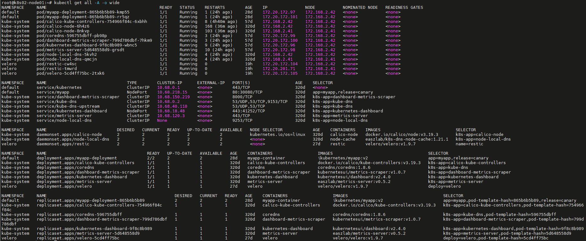
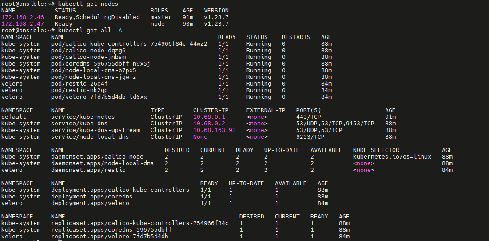
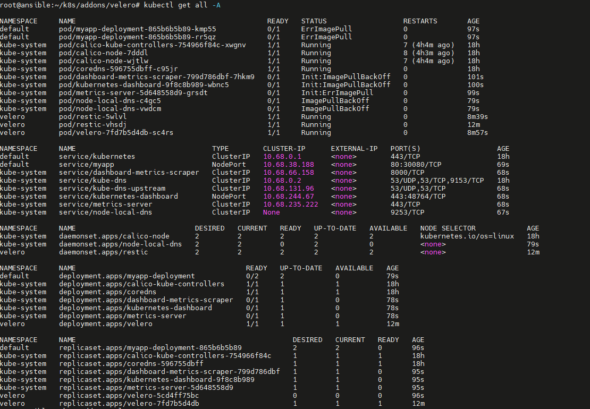
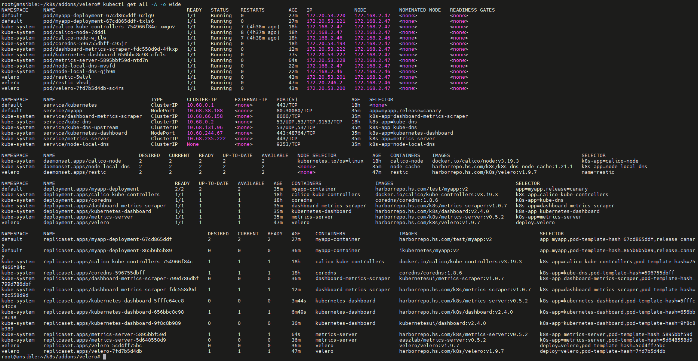
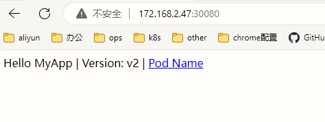
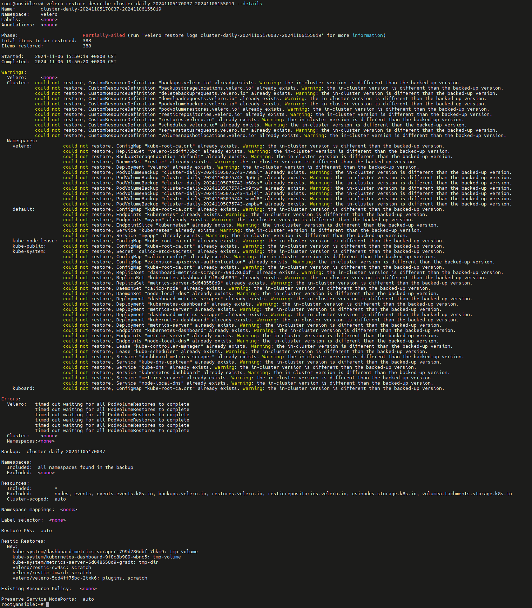
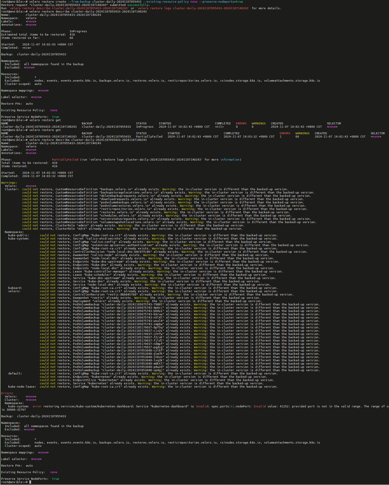
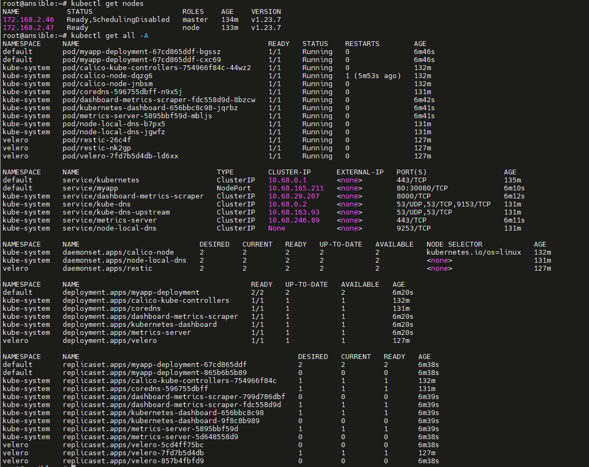
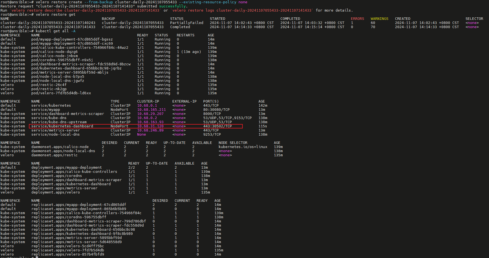
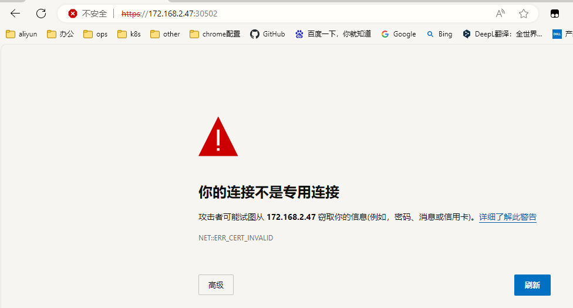

# Velero


## 1. 简介
[Velero](https://github.com/vmware-tanzu/velero) 前身是 Heptio Ark，是由 GO 语言编写的一款用于灾难恢复和迁移工具，可以安全的备份、恢复和迁移 Kubernetes 集群资源和持久卷。


### 1.1 优点

与直接访问Kubernetes etcd数据库以执行备份和还原的其他工具不同，Velero使用Kubernetes API捕获群集资源的状态并在必要时对其进行还原。这种由API驱动的方法具有许多关键优势：

- 备份可以捕获群集资源的子集，并按名称空间，资源类型和/或标签选择器进行过滤，从而为备份和还原的内容提供了高度的灵活性。
- 托管Kubernetes产品的用户通常无法访问底层的etcd数据库，因此无法对其进行直接备份/还原。
- 通过聚合的API服务器公开的资源可以轻松备份和还原，即使它们存储在单独的etcd数据库中也是如此。

> 注意: 备份过程中创建的对象是不会被备份的


### 1.2 相关组件

#### 1.2.1 Restic

Restic 是一款 GO 语言开发的数据加密备份工具，顾名思义，可以将本地数据加密后传输到指定的仓库。支持的仓库有 Local、SFTP、Aws S3、Minio、OpenStack Swift、Backblaze B2、Azure BS、Google Cloud storage、Rest Server。 项目地址：https://github.com/restic/restic

现阶段通过 `Restic` 备份会有一些限制。

- **不支持备份 hostPath**
- 备份数据标志只能通过 Pod 来识别
- 单线程操作大量文件比较慢


#### 1.2.2 Minio

Minio是一个基于Apache License v2.0开源协议的对象存储服务。它兼容亚马逊S3云存储服务接口，非常适合于存储大容量非结构化的数据，例如图片、视频、日志文件、备份数据和容器/虚拟机镜像等，而一个对象文件可以是任意大小，从几kb到最大5T不等。


## 2. 备份原理

Velero 的基本原理就是将 Kubernetes 集群资源对象数据备份到对象存储中，并能从对象存储中拉取备份数据来恢复集群资源对象数据。

不同于 etcd 备份——将集群的全部资源备份起来——Velero 是对 Kubernetes 集群内资源对象级别进行备份，可以通过对 Type、Namespace、Label 等对象进行分类备份或者恢复。

Velero 的操作（backup, scheduled backup, restore）都是 CRD 自定义资源，存储 etcd 中。

 Velero 的整体模块架构如下图 

* 客户端是一个简单的交互客户端 Velero-cli，封装了各种命令参数，可以执行安装、配置、备份、恢复等操作。
* 服务端则可以类比成一个典型的 kubebuild 的 operator，首先是不同的 CR，也就是 API。
* 中间 Controller 层需要用到一些相对比较独立的服务时，都会通过插件系统来对接到内部或者外部的插件服务。
* 底层的数据拷贝层是对接 Restic。其它都是外部的插件实现，velero.io/plugins 就代表内部的插件实现，由 Velero 或者第三方厂商来实现。


**备份过程**

1. 本地 `Velero` 客户端发送备份指令。
2. `Kubernetes` 集群内就会创建一个 `Backup` 对象。
3. `BackupController` 监测 `Backup` 对象并开始备份过程。
4. `BackupController` 会向 `API Server` 查询相关数据。
5. `BackupController` 将查询到的数据备份到远端的对象存储。


**后端存储**

`Velero` 支持两种关于后端存储的 `CRD`，分别是 `BackupStorageLocation` 和 `VolumeSnapshotLocation`。

- `BackupStorageLocation` 主要用来定义 `Kubernetes` 集群资源的数据存放位置，也就是集群对象数据，不是 `PVC` 的数据。主要支持的后端存储是 `S3` 兼容的存储，比如：`Mino` 和阿里云 `OSS` 等。
- `VolumeSnapshotLocation` 主要用来给 PV 做快照，需要云提供商提供插件。阿里云已经提供了插件，这个需要使用 CSI 等存储机制。你也可以使用专门的备份工具 `Restic`，把 PV 数据备份到阿里云 OSS 中去(安装时需要自定义选项)。


## 3. 备份和还原


### 3.1 按需备份

**backup：**

 将复制的 Kubernetes 资源对象上传到对象存储中，且可选择调用云环境提供的 API 来创建持久化卷快照，以及可选择指定在备份期间执行 backup hook 操作（比如：可能需要在快照之前告诉数据库将其内存中的缓存刷新到磁盘）。 

>  **Tips：** backup 操作并不是严格的原子性备份，在备份期间，若是有 Kubernetes 资源对象被新建或编辑操作，则这个操作变动可能不会被包含在 backup 备份中。 


**指令：** `velero backup create test-backup` 


**流程：**

- Velero 客户端向 Kubernetes API server 发起创建 Backup 对象的请求
- BackupController 检测到新建 Backup 对象，并进行参数验证
- BackupController 开始备份执行过程。通过与 API server 交互，获取需要备份的资源数据
- BackupController 向对象存储服务（如：AWS S3）发起上传备份数据请求
- 默认情况，backup 操作是会对持久卷（PV）进行磁盘快照备份的，不过是可以通过–snapshot-volumes=false 进行取消


### 3.2 备份还原

**restore：**

 对历史备份的 Kubernetes 资源对象和持久卷进行还原，且允许按需选择指定部分资源对象还原到指定命名空间（Namespace）中。且可以选择在备份还原期间或还原后执行 restore hook 操作（比如：执行自定义数据库的还原操作之后，再执行数据库应用容器启动动作）。 

> **Tips：** 默认情况下，Velero 进行的是非破坏性还原操作（non-destructive restore），这意味着它不会删除目标集群上的任何数据——即如果备份中的资源对象已经存在于目标集群中，restore 操作将会跳过该资源的还原。当然，也可通配置更新策略 (–existing-resource-policy=update)，尝试更新目标集群中已存在资源，以匹配备份中的资源数据。 


**指令：** `velero restore create` 


**流程：**

- Velero 客户端向 Kubernetes API server 发起创建 Restore 对象的请求
- RestoreController 检测到新建 Restore 对象，并进行参数验证
- RestoreController 从对象存储服务处获取待还原备份资源数据信息，并进行备份资源还原前的一些预处理工作（比如：备份资源的 API versions 版本验证）
- RestoreController 开始备份还原执行过程，一次性还原所有指定待还原资源


### 3.3 定时备份

**schedule：** 

可以定期备份数据。在 schedule 创建后，便创建第一次备份，随后备份将按照指定调度周期（由 Cron 表达式指定）进行备份。定时备份保存的名称为 -，其中 格式为 YYYYMMDDhhmmss。


**API versions:**

* Velero 备份资源时，使用 Kubernetes API 首选版本为每个组（group）/资源（CRD）备份。
* 而还原备份的目标集群中，必须存在相同 API 组（group）/资源（CRD）版本。需要注意的是：只是需要存在相同版本，而并不是需要首选版本。
* 例如，如果正在备份的集群在 things API 组中有一个 gizmos 资源，group/versions 为 things/v1alpha1、things/v1beta1 和 things/v1，并且服务器的首选group/versions 是 things/v1，那么所有 gizmos 将从 things/v1 API 端点备份。当从该集群恢复备份时，目标集群必须具有 things/v1 端点才能恢复 Gizmo。


### 3.4 备份存储数据

k8s数据有两种：

1. 集群对象数据

2. PVC数据


Velero 有 2 种备份存储方式：

**1. Restic 方式备份** 

Restic 是一款 GO 语言开发的开源免费且快速、高效和安全的跨平台备份工具。它是文件系统级别备份持久卷数据并将其发送到 Velero 的对象存储。执行速度取决于本地 IO 能力，网络带宽和对象存储性能，相对快照方式备份慢。但如果当前集群或者存储出现问题，由于所有资源和数据都存储在远端的对象存储上，用 Restic 方式备份可以很容易的将应用恢复。 **Tips：** 使用 Restic 来对 PV 进行备份会有一些限制：

- **不支持备份 hostPath**，支持 EFS、AzureFile、NFS、emptyDir、local 或其他没有本地快照概念的卷类型
- 备份数据标志只能通过 Pod 来识别
- 单线程操作大量文件比较慢


**2. 快照方式备份** 

* Velero 使用一组 BackupItemAction 插件针对 PersistentVolumeClaims 进行备份，执行速度快。它创建一个以 PersistentVolumeClaim 作为源的 VolumeSnapshot 对象，此 VolumeSnapshot 对象与用作源的 PersistentVolumeClaim 位于同一命名空间中，与 VolumeSnapshot 对应的 VolumeSnapshotContent 对象是一个集群范围的资源，将指向存储系统中基于磁盘的实际快照。

* Velero 备份时将所有 VolumeSnapshots 和 VolumeSnapshotContents 对象上传到对象存储系统，但是 Velero 备份后的数据资源仍然保存在集群的存储上。
* 数据可用性依赖于本地存储的高可用性，因为如果是由于存储故障导致的应用问题，Velero 的快照备份机制并不能恢复应用数据。


**数据一致性**

对象存储的数据是唯一的数据源，也就是说 `Kubernetes` 集群内的控制器会检查远程的 `OSS` 存储，恢复时发现有备份就会在集群内创建相关 `CRD` ，如果发现远端存储没有当前集群内的 `CRD` 所关联的存储数据，那么就会删除当前集群内的 `CRD`。


## 4. 部署

### 4.1 MinIO对象存储

Velero 依赖对象存储保存备份数据，这里部署 MinIO 替代公有云对象存储。

**minio.yaml**

```yaml
apiVersion: v1
kind: Namespace
metadata:
  name: velero
---
apiVersion: apps/v1
kind: Deployment
metadata:
  namespace: velero
  name: minio
  labels:
    component: minio
spec:
  strategy:
    type: Recreate
  selector:
    matchLabels:
      component: minio
  template:
    metadata:
      labels:
        component: minio
    spec:
      nodeSelector:
        kubernetes.io/hostname: 192.168.13.63
      volumes:
      - hostPath:
          path: /data/minio/data
          type: DirectoryOrCreate
        name: data
      - hostPath:
          path: /data/minio/config
          type: DirectoryOrCreate
        name: config
      containers:
      - name: minio
        image: bitnami/minio:latest
        imagePullPolicy: IfNotPresent
        command:
        - /bin/bash
        - -c
        args:
        - minio server /data --config-dir=/config --console-address=:9001
        env:
        - name: MINIO_ROOT_USER
          value: "admin"
        - name: MINIO_ROOT_PASSWORD
          value: "minio123"
        ports:
        - containerPort: 9000
        - containerPort: 9001
        volumeMounts:
        - name: data
          mountPath: /data
        - name: config
          mountPath: /config
        resources:
          limits:
            cpu: "1"
            memory: 2Gi
          requests:
            cpu: "1"
            memory: 2Gi
---
apiVersion: v1
kind: Service
metadata:
  namespace: velero
  name: minio
  labels:
    component: minio
spec:
  sessionAffinity: None
  type: NodePort
  ports:
  - name: port-9000
    port: 9000
    protocol: TCP
    targetPort: 9000
    nodePort: 30100
  - name: console
    port: 9001
    protocol: TCP
    targetPort: 9001
    nodePort: 30101
  selector:
    component: minio
---
apiVersion: batch/v1
kind: Job
metadata:
  namespace: velero
  name: minio-setup
  labels:
    component: minio
spec:
  template:
    metadata:
      name: minio-setup
    spec:
      nodeSelector:
        kubernetes.io/hostname: 192.168.13.63
      restartPolicy: OnFailure
      volumes:
      - hostPath:
          path: /data/minio/config-job
          type: DirectoryOrCreate
        name: config
      containers:
      - name: mc
        image: bitnami/minio-client:latest
        imagePullPolicy: IfNotPresent
        command:
        - /bin/sh
        - -c
        - "mc --config-dir=/config config host add velero http://minio.velero.svc.cluster.local:9000 admin minio123 && mc --config-dir=/config mb -p velero/velero"
        volumeMounts:
        - name: config
          mountPath: "/config"
```


```bash
[root@k8s-node04 minio]# mkdir -p /data/minio/{config,config-job,data}
[root@k8s-node04 minio]# chmod 777 /data/minio/{config,config-job,data}
[root@k8s-node04 minio]# ll -d /data/minio/{config,config-job,data}
drwxrwxrwx 2 root root 6 Mar 28 16:52 /data/minio/config
drwxrwxrwx 2 root root 6 Mar 28 16:52 /data/minio/config-job
drwxrwxrwx 2 root root 6 Mar 28 16:52 /data/minio/data

root@ansible:~/k8s/addons/velero# kubectl apply -f 01-minio.yaml
namespace/velero created
deployment.apps/minio created
service/minio created
job.batch/minio-setup created

root@ansible:~/k8s/addons/velero# kubectl get all -n velero
NAME                         READY   STATUS    RESTARTS   AGE
pod/minio-6594cd7bc7-mvpdw   1/1     Running   0          6s
pod/minio-setup-9m4rj        1/1     Running   0          5s

NAME            TYPE       CLUSTER-IP     EXTERNAL-IP   PORT(S)                         AGE
service/minio   NodePort   10.68.192.74   <none>        9000:30100/TCP,9001:30101/TCP   6s

NAME                    READY   UP-TO-DATE   AVAILABLE   AGE
deployment.apps/minio   1/1     1            1           6s

NAME                               DESIRED   CURRENT   READY   AGE
replicaset.apps/minio-6594cd7bc7   1         1         1       6s

NAME                    COMPLETIONS   DURATION   AGE
job.batch/minio-setup   0/1           4s         5s

# WebUI访问30101端口
root@ansible:~/k8s/addons/velero# kubectl get svc -n velero
NAME    TYPE       CLUSTER-IP     EXTERNAL-IP   PORT(S)                         AGE
minio   NodePort   10.68.192.74   <none>        9000:30100/TCP,9001:30101/TCP   15s

```


### 4.2 Velero 客户端

[Velero客户端下载](https://github.com/vmware-tanzu/velero/releases/download/v1.9.7/velero-v1.9.7-linux-amd64.tar.gz)

```bash
root@ansible:~/k8s/addons/velero# tar xf /download/velero-v1.9.7-linux-amd64.tar.gz
root@ansible:~/k8s/addons/velero# ls
01-minio.yaml  velero-v1.9.7-linux-amd64
root@ansible:~/k8s/addons/velero# tree velero-v1.9.7-linux-amd64/
.
├── LICENSE
├── examples
│   ├── README.md
│   ├── minio
│   │   └── 00-minio-deployment.yaml
│   └── nginx-app
│       ├── README.md
│       ├── base.yaml
│       └── with-pv.yaml
└── velero

root@ansible:~/k8s/addons/velero# mv velero-v1.9.7-linux-amd64/velero /usr/local/bin/
root@ansible:~/k8s/addons/velero# velero version
Client:
        Version: v1.9.7
        Git commit: 9ace4ecbdc08d57415786ab9c896f86dbb6dc0b7
<error getting server version: no matches for kind "ServerStatusRequest" in version "velero.io/v1">

```


### 4.3 Velero 服务端


#### 4.3.1 velero密钥配置

首先准备密钥文件，access key id 和 secret access key 为 MinIO 的用户名和密码，也可以为有读写权限的`service account`的AK和SK

```bash
root@ansible:~/k8s/addons/velero# cat credentials-velero
[default]
aws_access_key_id=admin
aws_secret_access_key=minio123
```


#### 4.3.2 安装velero服务端 

可以使用 velero 客户端来安装服务端，也可以使用 Helm Chart 来进行安装。比如本文以客户端来安装，velero 命令默认读取 kubectl 配置的集群上下文，所以前提是 velero 客户端所在的节点有可访问集群的 kubeconfig 配置


> - 这里使用 MinIO 作为对象存储，MinIO 是兼容 S3 的，所以配置的 provider（声明使用的 Velero 插件类型）是 AWS，
> - –secret-file 用来提供访问 MinIO 的密钥
> - –use-restic 表示使用开源免费备份工具 restic 备份和还原持久卷数据，启用该参数后会部署一个名为 restic 的 DaemonSet 对象
> - –plugins 使用的 velero 插件，本文使用 AWS S3 兼容插件。
> - s3Url 配置 MinIO 服务对外暴露的 nodePort 端口及部署节点 IP
> - 需要注意的是启动需要修改 Restic DaemonSet spec 配置，调整为实际环境中 Kubernetes 指定 pod 保存路径的 hostPath

```bash
# s3Url必须指向Minio的API端口，是30100而不是30101
root@ansible:~/k8s/addons/velero# cat velero-server-install.sh
#!/bin/bash
velero install \
--provider aws \
--bucket velero \
--image velero/velero:v1.9.7 \
--plugins velero/velero-plugin-for-aws:v1.5.5 \
--namespace velero \
--secret-file /root/k8s/addons/velero/credentials-velero \
--use-volume-snapshots=false \
--use-restic \
--default-volumes-to-restic=true \
--kubeconfig=/root/.kube/config \
--backup-location-config region=minio,s3ForcePathStyle="true",s3Url=http://192.168.13.63:30100


# 安装，可执行多次./velero-install.sh
root@ansible:~/k8s/addons/velero# ./velero-server-install.sh
CustomResourceDefinition/backups.velero.io: attempting to create resource
CustomResourceDefinition/backups.velero.io: attempting to create resource client
CustomResourceDefinition/backups.velero.io: created
CustomResourceDefinition/backupstoragelocations.velero.io: attempting to create resource
CustomResourceDefinition/backupstoragelocations.velero.io: attempting to create resource client
CustomResourceDefinition/backupstoragelocations.velero.io: created
CustomResourceDefinition/deletebackuprequests.velero.io: attempting to create resource
CustomResourceDefinition/deletebackuprequests.velero.io: attempting to create resource client
CustomResourceDefinition/deletebackuprequests.velero.io: created
CustomResourceDefinition/downloadrequests.velero.io: attempting to create resource
CustomResourceDefinition/downloadrequests.velero.io: attempting to create resource client
CustomResourceDefinition/downloadrequests.velero.io: created
CustomResourceDefinition/podvolumebackups.velero.io: attempting to create resource
CustomResourceDefinition/podvolumebackups.velero.io: attempting to create resource client
CustomResourceDefinition/podvolumebackups.velero.io: created
CustomResourceDefinition/podvolumerestores.velero.io: attempting to create resource
CustomResourceDefinition/podvolumerestores.velero.io: attempting to create resource client
CustomResourceDefinition/podvolumerestores.velero.io: created
CustomResourceDefinition/resticrepositories.velero.io: attempting to create resource
CustomResourceDefinition/resticrepositories.velero.io: attempting to create resource client
CustomResourceDefinition/resticrepositories.velero.io: created
CustomResourceDefinition/restores.velero.io: attempting to create resource
CustomResourceDefinition/restores.velero.io: attempting to create resource client
CustomResourceDefinition/restores.velero.io: created
CustomResourceDefinition/schedules.velero.io: attempting to create resource
CustomResourceDefinition/schedules.velero.io: attempting to create resource client
CustomResourceDefinition/schedules.velero.io: created
CustomResourceDefinition/serverstatusrequests.velero.io: attempting to create resource
CustomResourceDefinition/serverstatusrequests.velero.io: attempting to create resource client
CustomResourceDefinition/serverstatusrequests.velero.io: created
CustomResourceDefinition/volumesnapshotlocations.velero.io: attempting to create resource
CustomResourceDefinition/volumesnapshotlocations.velero.io: attempting to create resource client
CustomResourceDefinition/volumesnapshotlocations.velero.io: created
Waiting for resources to be ready in cluster...
Namespace/velero: attempting to create resource
Namespace/velero: attempting to create resource client
Namespace/velero: created
ClusterRoleBinding/velero: attempting to create resource
ClusterRoleBinding/velero: attempting to create resource client
ClusterRoleBinding/velero: created
ServiceAccount/velero: attempting to create resource
ServiceAccount/velero: attempting to create resource client
ServiceAccount/velero: created
Secret/cloud-credentials: attempting to create resource
Secret/cloud-credentials: attempting to create resource client
Secret/cloud-credentials: created
BackupStorageLocation/default: attempting to create resource
BackupStorageLocation/default: attempting to create resource client
BackupStorageLocation/default: created
Deployment/velero: attempting to create resource
Deployment/velero: attempting to create resource client
Deployment/velero: created
DaemonSet/restic: attempting to create resource
DaemonSet/restic: attempting to create resource client
DaemonSet/restic: created
Velero is installed! ⛵ Use 'kubectl logs deployment/velero -n velero' to view the status.


# 查看velero服务端程序 
root@ansible:~# kubectl get all -n velero
NAME                          READY   STATUS      RESTARTS   AGE
pod/minio-6594cd7bc7-7wlg9    1/1     Running     0          10m
pod/minio-setup-skch5         0/1     Completed   0          10m
pod/restic-5rmjb              1/1     Running     0          10m
pod/restic-6bgkv              1/1     Running     0          10m
pod/restic-fnk8j              1/1     Running     0          10m
pod/restic-gqk47              1/1     Running     0          10m
pod/restic-vq4bg              1/1     Running     0          10m
pod/restic-wclt4              1/1     Running     0          10m
pod/restic-xbr5x              1/1     Running     0          10m
pod/velero-5cd4ff75bc-cgpx6   1/1     Running     0          10m

NAME            TYPE       CLUSTER-IP     EXTERNAL-IP   PORT(S)                         AGE
service/minio   NodePort   10.68.65.221   <none>        9000:30100/TCP,9001:30101/TCP   10m

NAME                    DESIRED   CURRENT   READY   UP-TO-DATE   AVAILABLE   NODE SELECTOR   AGE
daemonset.apps/restic   7         7         7       7            7           <none>          10m

NAME                     READY   UP-TO-DATE   AVAILABLE   AGE
deployment.apps/minio    1/1     1            1           10m
deployment.apps/velero   1/1     1            1           10m

NAME                                DESIRED   CURRENT   READY   AGE
replicaset.apps/minio-6594cd7bc7    1         1         1       10m
replicaset.apps/velero-5cd4ff75bc   1         1         1       10m

NAME                    COMPLETIONS   DURATION   AGE
job.batch/minio-setup   1/1           14s        10m
---

# 再次查看版本，此时velero可以看到服务版本了
root@ansible:~# velero version
Client:
        Version: v1.9.7
        Git commit: 9ace4ecbdc08d57415786ab9c896f86dbb6dc0b7
Server:
        Version: v1.9.7
```


#### 4.3.3 velero卸载

如果有需要可按照如下命令拆除velero部署

```bash
velero uninstall
```

以下分步骤删除

```bash
kubectl delete clusterrolebinding/velero
kubectl delete crds -l component=velero
kubectl delete ns velero 
```


#### 4.3.4 Velero CRD

```bash
root@ansible:~# kubectl -n velero get crds -l component=velero
NAME                                CREATED AT
backups.velero.io                   2024-03-28T11:40:53Z
backupstoragelocations.velero.io    2024-03-28T11:40:53Z
deletebackuprequests.velero.io      2024-03-28T11:40:53Z
downloadrequests.velero.io          2024-03-28T11:40:53Z
podvolumebackups.velero.io          2024-03-28T11:40:53Z
podvolumerestores.velero.io         2024-03-28T11:40:54Z
resticrepositories.velero.io        2024-03-28T11:40:54Z
restores.velero.io                  2024-03-28T11:40:55Z
schedules.velero.io                 2024-03-28T11:40:55Z
serverstatusrequests.velero.io      2024-03-28T11:40:56Z
volumesnapshotlocations.velero.io   2024-03-28T11:40:57Z
```


##### 4.3.4.1 BackupStorageLocation

`BackupStorageLocation` 主要用来定义 `Kubernetes` 集群资源的数据存放位置，也就是集群对象数据，不是 `PVC` 的数据。主要支持的后端存储是 `S3` 兼容的存储，比如：`Mino` 和阿里云 `OSS` 等。

```bash
# Minio
apiVersion: velero.io/v1
kind: BackupStorageLocation
metadata:
  name: default
  namespace: velero
spec:
# 只有 aws gcp azure
  provider: aws
  # 存储主要配置
  objectStorage:
  # bucket 的名称
    bucket: myBucket
    # bucket内的
    prefix: backup
# 不同的 provider 不同的配置
  config:
    #bucket地区
    region: us-west-2
    # s3认证信息
    profile: "default"
    # 使用 Minio 的时候加上，默认为 false
    # AWS 的 S3 可以支持两种 Url Bucket URL
    # 1 Path style URL： http://s3endpoint/BUCKET
    # 2 Virtual-hosted style URL： http://oss-cn-beijing.s3endpoint 将 Bucker Name 放到了 Host Header中
    # 3 阿里云仅仅支持 Virtual hosted 如果下面写上 true, 阿里云 OSS 会报错 403
    s3ForcePathStyle: "false"
    # s3的地址，格式为 http://minio:9000
    s3Url: http://minio:9000
```

```yaml
# 阿里OSS
apiVersion: velero.io/v1
kind: BackupStorageLocation
metadata:
  labels:
    component: velero
  name: default
  namespace: velero
spec:
  config:
    region: oss-cn-beijing
    s3Url: http://oss-cn-beijing.aliyuncs.com
    s3ForcePathStyle: "false"
  objectStorage:
    bucket: build-jenkins
    prefix: ""
  provider: aws
```


**确保状态为可用**

```bash
root@ansible:~/k8s/addons/velero# kubectl get BackupStorageLocation -n velero default
NAME      PHASE       LAST VALIDATED   AGE     DEFAULT
default   Available   30s              2d18h   true
```

> bucket需要事先手动创建，否则此新动态不UnAvailable


##### 4.3.4.2 VolumeSnapshotLocation

VolumeSnapshotLocation 主要用来给 PV 做快照，需要云提供商提供插件，阿里云已经提供了插件，这个需要使用 CSI 等存储机制。

你也可以使用专门的备份工具 `Restic`而不使用`VolumeSnapshotLocation`，把 PV 数据备份到阿里云 OSS 中去(安装时需要自定义选项)。

```
# 安装时需要自定义选项，表示PV数据使用restic备份到BackupStorageLocation中，也就是备份到OSS(minio)中
--use-restic

# 因为使用了restic备份到OSS，也就是到BackupStorageLocation，因此不使用volume-snapshots，所以不用创建VolumeSnapshotLocation对象
--use-volume-snapshots=false

# --use-restic 和 --use-volume-snapshots是互斥的，只能选择其一。
```

`Restic` 是一款 GO 语言开发的数据加密备份工具，顾名思义，可以将本地数据加密后传输到指定的仓库。支持的仓库有 Local、SFTP、Aws S3、Minio、OpenStack Swift、Backblaze B2、Azure BS、Google Cloud storage、Rest Server。


#### 4.3.5 restic删除

```bash
# 获取restic数据
[root@prometheus velero]# velero restic repo get
NAME                         STATUS   LAST MAINTENANCE
argocd-default-f5msn         Ready    2024-10-10 14:10:10 +0800 CST
istio-system-default-mw2vw   Ready    2024-10-10 14:11:18 +0800 CST
kube-system-default-2pjkx    Ready    2024-10-10 14:20:21 +0800 CST
kuboard-default-hcn7d        Ready    2024-10-10 14:20:26 +0800 CST
velero-default-pspcv         Ready    2024-10-10 14:20:33 +0800 CST
[root@prometheus velero]# velero restic repo get -o yaml
[root@prometheus velero]# kubectl get resticrepositories -n velero
NAME                         AGE
argocd-default-f5msn         89m
istio-system-default-mw2vw   88m
kube-system-default-2pjkx    79m
kuboard-default-hcn7d        79m
velero-default-pspcv         79m


# 批量删除
#for repo in $(kubectl get resticrepositories -n velero -o jsonpath='{.items[*].metadata.name}'); do kubectl delete resticrepository $repo -n velero; done

# 删除一个进行测试
[root@prometheus velero]# kubectl delete resticrepository kuboard-default-hcn7d -n velero
resticrepository.velero.io "kuboard-default-hcn7d" deleted
[root@prometheus velero]# velero restic repo get
NAME                         STATUS   LAST MAINTENANCE
argocd-default-f5msn         Ready    2024-10-10 14:10:10 +0800 CST
istio-system-default-mw2vw   Ready    2024-10-10 14:11:18 +0800 CST
kube-system-default-2pjkx    Ready    2024-10-10 14:20:21 +0800 CST
velero-default-pspcv         Ready    2024-10-10 14:20:33 +0800 CST

# 最后在对象存储中删除restic数据即可完成删除，删除路径: 'object browser' -> ${bucket_name} -> 'restic' -> ${namespace_name}

# 最后删除velero名称空间下所有资源，使其重建，否则后续创建backup时会报restic的错
kubectl get pods -n velero | grep -v NAME | awk '{print $1}' | xargs -I {} kubectl delete pods -n velero {}
```


## 5. 部署Clusterpedia服务用作测试

### 5.1 部署Clusterpedia

**拉取项目**

```bash
root@ansible:~/k8s/addons/velero# git clone https://github.com/clusterpedia-io/clusterpedia.git
root@ansible:~/k8s/addons/velero# cd clusterpedia
root@ansible:~/k8s/addons/velero/clusterpedia# git checkout v0.7.0
Note: checking out 'v0.7.0'.
root@ansible:~/k8s/addons/velero/clusterpedia# git branch
* (HEAD detached at v0.7.0)
  main
```


**安装存储组件**

```bash
# 配置
root@ansible:~/k8s/addons/velero/clusterpedia# cd ./deploy/internalstorage/mysql/
root@ansible:~/k8s/addons/velero/clusterpedia/deploy/internalstorage/mysql# ll
total 12
drwxr-xr-x 3 root root  174 Mar 28 10:53 ./
drwxr-xr-x 4 root root   35 Mar 28 10:53 ../
-rw-r--r-- 1 root root  347 Mar 28 10:53 clusterpedia_internalstorage_configmap.yaml
-rw-r--r-- 1 root root 1822 Mar 28 10:53 clusterpedia_internalstorage_deployment.yaml
-rw-r--r-- 1 root root  235 Mar 28 10:53 clusterpedia_internalstorage_secret.yaml
drwxr-xr-x 2 root root  116 Mar 28 10:53 templates/

root@ansible:~/k8s/addons/velero/clusterpedia/deploy/internalstorage/mysql# export STORAGE_NODE_NAME='192.168.13.63'
root@ansible:~/k8s/addons/velero/clusterpedia/deploy/internalstorage/mysql# sed "s|__NODE_NAME__|$STORAGE_NODE_NAME|g" `grep __NODE_NAME__ -rl ./templates` > clusterpedia_internalstorage_pv.yaml

# 部署
root@ansible:~/k8s/addons/velero/clusterpedia/deploy/internalstorage/mysql# ll
total 16
drwxr-xr-x 3 root root  218 Mar 28 11:15 ./
drwxr-xr-x 4 root root   35 Mar 28 10:53 ../
-rw-r--r-- 1 root root  347 Mar 28 10:53 clusterpedia_internalstorage_configmap.yaml
-rw-r--r-- 1 root root 1822 Mar 28 10:53 clusterpedia_internalstorage_deployment.yaml
-rw-r--r-- 1 root root 1508 Mar 28 11:15 clusterpedia_internalstorage_pv.yaml
-rw-r--r-- 1 root root  235 Mar 28 10:53 clusterpedia_internalstorage_secret.yaml
drwxr-xr-x 2 root root  116 Mar 28 10:53 templates/
root@ansible:~/k8s/addons/velero/clusterpedia/deploy/internalstorage/mysql# kubectl apply -f .

root@ansible:~/k8s/addons/velero/clusterpedia/deploy/internalstorage/mysql# kubectl get all -n clusterpedia-system
NAME                                                      READY   STATUS      RESTARTS   AGE
pod/check-192.168.13.63-mysql-local-pv-dir-ww5ks          0/1     Completed   0          4m9s
pod/clusterpedia-internalstorage-mysql-5fc59c95c6-vlrhp   1/1     Running     0          4m9s

NAME                                         TYPE        CLUSTER-IP    EXTERNAL-IP   PORT(S)    AGE
service/clusterpedia-internalstorage-mysql   ClusterIP   10.68.34.91   <none>        3306/TCP   4m12s

NAME                                                 READY   UP-TO-DATE   AVAILABLE   AGE
deployment.apps/clusterpedia-internalstorage-mysql   1/1     1            1           4m9s

NAME                                                            DESIRED   CURRENT   READY   AGE
replicaset.apps/clusterpedia-internalstorage-mysql-5fc59c95c6   1         1         1       4m9s

NAME                                               COMPLETIONS   DURATION   AGE
job.batch/check-192.168.13.63-mysql-local-pv-dir   1/1           48s        4m9s


# 跳回 Clusterpedia 项目根目录
root@ansible:~/k8s/addons/velero/clusterpedia/deploy/internalstorage/mysql# cd ../../../
```


**安装Clusterpedia**

```bash
root@ansible:~/k8s/addons/velero/clusterpedia# ll deploy/
total 36
drwxr-xr-x  6 root root 4096 Mar 28 10:53 ./
drwxr-xr-x 14 root root 4096 Mar 28 10:53 ../
-rw-r--r--  1 root root   45 Mar 28 10:53 OWNERS
drwxr-xr-x  2 root root  162 Mar 28 10:53 binding-apiserver/
lrwxrwxrwx  1 root root   56 Mar 28 10:53 cluster.clusterpedia.io_clustersyncresources.yaml -> ./crds/cluster.clusterpedia.io_clustersyncresources.yaml
lrwxrwxrwx  1 root root   49 Mar 28 10:53 cluster.clusterpedia.io_pediaclusters.yaml -> ./crds/cluster.clusterpedia.io_pediaclusters.yaml
drwxr-xr-x  2 root root   92 Mar 28 10:53 clusterimportpolicy/
-rw-r--r--  1 root root  308 Mar 28 10:53 clusterpedia_apiserver_apiservice.yaml
-rw-r--r--  1 root root 1400 Mar 28 10:53 clusterpedia_apiserver_deployment.yaml
-rw-r--r--  1 root root  703 Mar 28 10:53 clusterpedia_apiserver_rbac.yaml
-rw-r--r--  1 root root 1326 Mar 28 10:53 clusterpedia_clustersynchro_manager_deployment.yaml
-rw-r--r--  1 root root  718 Mar 28 10:53 clusterpedia_controller_manager_deployment.yaml
-rw-r--r--  1 root root   69 Mar 28 10:53 clusterpedia_namespace.yaml
drwxr-xr-x  2 root root  228 Mar 28 10:53 crds/
drwxr-xr-x  4 root root   35 Mar 28 10:53 internalstorage/
lrwxrwxrwx  1 root root   56 Mar 28 10:53 policy.clusterpedia.io_clusterimportpolicies.yaml -> ./crds/policy.clusterpedia.io_clusterimportpolicies.yaml
lrwxrwxrwx  1 root root   57 Mar 28 10:53 policy.clusterpedia.io_pediaclusterlifecycles.yaml -> ./crds/policy.clusterpedia.io_pediaclusterlifecycles.yaml

root@ansible:~/k8s/addons/velero/clusterpedia# kubectl apply -f ./deploy
```


### 5.2 Clusterpedia集群接入

[Clusterpedia](https://clusterpedia.io/zh-cn/docs/usage/import-clusters/) 使用自定义资源 `PediaCluster` 资源来代表接入的集群

```yaml
apiVersion: cluster.clusterpedia.io/v1alpha2
kind: PediaCluster
metadata:
  name: cluster-example
spec:
  apiserver: "https://10.30.43.43:6443"
  kubeconfig:
  caData:
  tokenData:
  certData:
  keyData:
  syncResources: []
```

用户有两种方式来配置接入的集群:

1. 直接配置 base64 编码的 kube config 到 `kubeconfig` 字段用于集群连接和验证
2. 分别配置接入集群的地址，以及验证信息

在使用 `apiserver` 字段来设置接入集群的地址时，验证字段的配置有多种选择：

- `caData` + `tokenData`
- `caData` + `certData` + `keyData`

> `caData` 在集群 APIServer 允许 Insecure 连接的情况下，也可以不填

这些验证字段都需要 base64 编码，如果这些字段的值是直接从 ConfigMap 或者 Secret 中获取的话，那么就已经 base64 过。


**本地集群接入**

使用 ServiceAccount 来接入集群

用户也可以选择在**被接入集群**中创建 ServiceAccount 并配置相应的 RBAC 来接入集群。

```bash
# 配置RBAC
# 注意：当前 kubectl 连接到被接入集群
root@ansible:~/k8s/addons/velero/clusterpedia# cat examples/clusterpedia_synchro_rbac.yaml
apiVersion: rbac.authorization.k8s.io/v1
kind: ClusterRole
metadata:
  name: clusterpedia-synchro
rules:
- apiGroups:
  - '*'
  resources:
  - '*'
  verbs:
  - '*'
- nonResourceURLs:
  - '*'
  verbs:
  - '*'
---
apiVersion: v1
kind: ServiceAccount
metadata:
  name: clusterpedia-synchro
  namespace: default
---
apiVersion: rbac.authorization.k8s.io/v1
kind: ClusterRoleBinding
metadata:
  name: clusterpedia-synchro
roleRef:
  apiGroup: rbac.authorization.k8s.io
  kind: ClusterRole
  name: clusterpedia-synchro
subjects:
- kind: ServiceAccount
  name: clusterpedia-synchro
  namespace: default
---
root@ansible:~/k8s/addons/velero/clusterpedia# kubectl apply -f examples/clusterpedia_synchro_rbac.yaml


# 获取 Service Account 对应 CA 和 Token
root@ansible:~/k8s/addons/velero/clusterpedia# SYNCHRO_CA=$(kubectl -n default get secret $(kubectl -n default get serviceaccount clusterpedia-synchro -o jsonpath='{.secrets[0].name}') -o jsonpath='{.data.ca\.crt}')
root@ansible:~/k8s/addons/velero/clusterpedia# SYNCHRO_TOKEN=$(kubectl -n default get secret $(kubectl -n default get serviceaccount clusterpedia-synchro -o jsonpath='{.secrets[0].name}') -o jsonpath='{.data.token}')
root@ansible:~/k8s/addons/velero/clusterpedia# cd ..

# 编写yaml
root@ansible:~/k8s/addons/velero# cat >> clusterpedia-cluster-import.yaml << EOF
apiVersion: cluster.clusterpedia.io/v1alpha2
kind: PediaCluster
metadata:
  name: cluster-example
spec:
  apiserver: "https://172.168.2.21:6443"
  kubeconfig:
  caData: $SYNCHRO_CA
  tokenData: $SYNCHRO_TOKEN
  certData:
  keyData:
  syncResources:
  - group: apps
    resources:
    - "*"
  - group: ""
    resources:
    - "*"
EOF

# 导入集群
root@ansible:~/k8s/addons/velero# cat clusterpedia-cluster-import.yaml
apiVersion: cluster.clusterpedia.io/v1alpha2
kind: PediaCluster
metadata:
  name: cluster-example
spec:
  apiserver: "https://172.168.2.21:6443"
  kubeconfig:
  caData: LS0tLS1CRUdJTiBDRVJUSUZJQ0FURS0tLS0tCk1JSURsRENDQW55Z0F3SUJBZ0lVWCtNWU80M0dYSjFyQm5DeklmZTQ5ZXExbWg0d0RRWUpLb1pJaHZjTkFRRUwKQlFBd1lURUxNQWtHQTFVRUJoTUNRMDR4RVRBUEJnTlZCQWdUQ0VoaGJtZGFhRzkxTVFzd0NRWURWUVFIRXdKWQpVekVNTUFvR0ExVUVDaE1EYXpoek1ROHdEUVlEVlFRTEV3WlRlWE4wWlcweEV6QVJCZ05WQkFNVENtdDFZbVZ5CmJtVjBaWE13SUJjTk1qSXdOVEkxTURrME1qQXdXaGdQTWpFeU1qQTFNREV3T1RReU1EQmFNR0V4Q3pBSkJnTlYKQkFZVEFrTk9NUkV3RHdZRFZRUUlFd2hJWVc1bldtaHZkVEVMTUFrR0ExVUVCeE1DV0ZNeEREQUtCZ05WQkFvVApBMnM0Y3pFUE1BMEdBMVVFQ3hNR1UzbHpkR1Z0TVJNd0VRWURWUVFERXdwcmRXSmxjbTVsZEdWek1JSUJJakFOCkJna3Foa2lHOXcwQkFRRUZBQU9DQVE4QU1JSUJDZ0tDQVFFQXlYdXJ5VmRZeXJsT3ZjSjAyZ1lNL05GL2ZjWDEKYUNvTVhHMFM0ZmRWaU16VkFucWdNN2lKaytpb2xkbldtbk9TeVQ2c29hL3hsRHRtME04MGpESnpLeDhkQ25NQwptNWRkakorUXZ1ZFU2bExTQ3Fxb3dFb0tQaXgvZWpBdkc2ZVlzcmZBOXRSUTlHbEpiRGtCOVBzUzM5aWFBWmQvCm5PM0JEamx1ZDVDYjl5NUlNWUN1emIwUk1WNktqR2NaYVNxYlJjZVI0VXV0dVJJODlBTEx5MEk2Z2FFd0gzZi8KbVphQzlTT0YvbjlVMkFDYXprTjdDS0p4UGU3K0dIZkl6clhGYkUyMmVZYlg3TmZ0OTAyYW9ta0tLMURnaERhYQpoK2xrUkhCUGtmQnFIQ29xcm9CaDh5R3lmcTdQWjh0M0lvUDNRbVc4bkhyZW5URGxsMXJTWjhDR3p3SURBUUFCCm8wSXdRREFPQmdOVkhROEJBZjhFQkFNQ0FRWXdEd1lEVlIwVEFRSC9CQVV3QXdFQi96QWRCZ05WSFE0RUZnUVUKYjlPWFFKRTRhbWpXUEhTb3o3ajl4R3orWXBRd0RRWUpLb1pJaHZjTkFRRUxCUUFEZ2dFQkFENXBMeEZPd0NBYwowL0hyN2x2K1RkRmhYOWR5L3ZpWHNnV3JDS1MzQ1NBNkJVcEU4N042bnY0eCtCNkZNZlp3QkF2NlR4WkIrL3FUCmdBTEFxMDVQVVZ3SkpvMVhUWUdwUFU3eEUxVUVGaG9sV0JpSzk5Um9nVmR0TVdQTy9kbnkvY0tSUktuNXVpdHcKVFZNQVFNckhwd0ptSFAyeGJEZjFQRExJeGlzdVo4RnRXbGZ4bTcyZWhIOStucTVYMUZKVzNNTkxPeDFWNlFaSQpMWDgzWnBDYTZ3SHhhZ3daVWtUTURsaHdGbHorSkZtbkNsLzUramdzZ0lZaktmTW1HeHgrOEhRUzZ2ODJiNE5VClJieEFkL0RNZ2JGVHgzeHFLeHR5eUFpRXlTeStsTHlCaXZjWk4zdGJudUZLeExKRlIvdkpUVlF0Sk9nUlFnRksKdHV2VFdLU2VOM0U9Ci0tLS0tRU5EIENFUlRJRklDQVRFLS0tLS0K
  tokenData: ZXlKaGJHY2lPaUpTVXpJMU5pSXNJbXRwWkNJNklsOVRSMmxwVFhWa0xUUktVMHRRVG05Nk1uaDRVVEJMTTBOMk5IVnFUMGMzZFRadGF6aHhlVGhWYzFraWZRLmV5SnBjM01pT2lKcmRXSmxjbTVsZEdWekwzTmxjblpwWTJWaFkyTnZkVzUwSWl3aWEzVmlaWEp1WlhSbGN5NXBieTl6WlhKMmFXTmxZV05qYjNWdWRDOXVZVzFsYzNCaFkyVWlPaUprWldaaGRXeDBJaXdpYTNWaVpYSnVaWFJsY3k1cGJ5OXpaWEoyYVdObFlXTmpiM1Z1ZEM5elpXTnlaWFF1Ym1GdFpTSTZJbU5zZFhOMFpYSndaV1JwWVMxemVXNWphSEp2TFhSdmEyVnVMWEI0ZG5SNElpd2lhM1ZpWlhKdVpYUmxjeTVwYnk5elpYSjJhV05sWVdOamIzVnVkQzl6WlhKMmFXTmxMV0ZqWTI5MWJuUXVibUZ0WlNJNkltTnNkWE4wWlhKd1pXUnBZUzF6ZVc1amFISnZJaXdpYTNWaVpYSnVaWFJsY3k1cGJ5OXpaWEoyYVdObFlXTmpiM1Z1ZEM5elpYSjJhV05sTFdGalkyOTFiblF1ZFdsa0lqb2lZVFppT1dVM05XWXRNV0V6TXkwME5UazFMVGsxTmpZdE4yWmxNVEppT1RFeVlqVTRJaXdpYzNWaUlqb2ljM2x6ZEdWdE9uTmxjblpwWTJWaFkyTnZkVzUwT21SbFptRjFiSFE2WTJ4MWMzUmxjbkJsWkdsaExYTjVibU5vY204aWZRLnNUN0ViTEFEZUJKWUh6UGZWbWlpdnlWbUJBbjNFd05OWVdScU5OMnE5SjhBVmRLeld6OEtpbzRLMGd1VGQ2OHFhUUNXQWplWHhTMTlYeko2R3FOX0Zub3J0RFc5LVZXSTBrNnRweURubGpMNnJyaWFnYjByWlhNanZmTDF0NDM3dVNObm1kNnc4V0lRRzN4V2tSWHNXX0ZNMEJIMlk5NS1weUJ3OUl4RjVSU2NLTVhMQ2Y5Y2FfdXIwc0tuNlpoV0xTZzZTaExyeHQ4RzZfWi1yZjNtU0t5VlYxOURSNy03TTBjd2tsM2hqdTBZYjI2bWd6YVdac0VPZkFCdzU0RXozZ242NElLYUNvaEtTQXpBUzVMVU9CemJFNjFweWRKNl9JN2Q0RlpPTVFCZjBFeUp2TVYzbW9reW1qV0lxa0VwXzBxTWp6aEU0SlhYTGgxcUJ6Rzk5UQ==
  certData:
  keyData:
  syncResources:
  - group: apps
    resources:
    - "*"
  - group: ""
    resources:
    - "*"
root@ansible:~/k8s/addons/velero# kubectl apply -f clusterpedia-cluster-import.yaml
pediacluster.cluster.clusterpedia.io/cluster-example created
# 查看导入的集群
root@ansible:~/k8s/addons/velero# kubectl get PediaCluster
NAME              READY   VERSION   APISERVER
cluster-example   True    v1.23.1   https://172.168.2.21:6443
```


### 5.3 查看导入集群的数据

```bash
# 获取本地存储mysql的POD_NAME
kubectl exec -it -n clusterpedia-system $(kubectl get pods -n clusterpedia-system | grep internalstorage | awk '{print $1}') -- bash

# 查看数据
bash-4.4# mysql -uroot -p'dangerous0'
mysql> show databases;
+--------------------+
| Database           |
+--------------------+
| clusterpedia       |
| information_schema |
| mysql              |
| performance_schema |
| sys                |
+--------------------+
mysql> use clusterpedia;
mysql> select count(1) from clusterpedia.resources;
+----------+
| count(1) |
+----------+
|      637 |
+----------+
mysql> select r.id, r.group, r.version, r.resource, r.kind, r.name, r.namespace from clusterpedia.resources r order by id limit 10;
+----+-------+---------+------------------------+-----------------------+-----------------------------------------+---------------------+
| id | group | version | resource               | kind                  | name                                    | namespace           |
+----+-------+---------+------------------------+-----------------------+-----------------------------------------+---------------------+
|  1 |       | v1      | namespaces             | Namespace             | fat-frontend                            |                     |
|  2 |       | v1      | persistentvolumes      | PersistentVolume      | clusterpedia-internalstorage-mysql      |                     |
|  3 |       | v1      | endpoints              | Endpoints             | alertmanager-example                    | default             |
|  4 |       | v1      | persistentvolumeclaims | PersistentVolumeClaim | internalstorage-mysql                   | clusterpedia-system |
|  5 | apps  | v1      | daemonsets             | DaemonSet             | calico-node                             | kube-system         |
|  6 | apps  | v1      | statefulsets           | StatefulSet           | alertmanager-example                    | default             |
|  7 |       | v1      | namespaces             | Namespace             | istio-system                            |                     |
|  8 |       | v1      | serviceaccounts        | ServiceAccount        | argocd-applicationset-controller        | argocd              |
|  9 |       | v1      | nodes                  | Node                  | 172.168.2.25                            |                     |
| 10 | apps  | v1      | controllerrevisions    | ControllerRevision    | argocd-application-controller-ff64489d7 | argocd              |
+----+-------+---------+------------------------+-----------------------+-----------------------------------------+---------------------+
```


### 5.4 访问 Clusterpedia 资源

```bash
root@ansible:~# kubectl api-resources | grep clusterpedia.io
clustersyncresources                                 cluster.clusterpedia.io/v1alpha2       false        ClusterSyncResources
pediaclusters                                        cluster.clusterpedia.io/v1alpha2       false        PediaCluster
collectionresources                                  clusterpedia.io/v1beta1                false        CollectionResource
resources                                            clusterpedia.io/v1beta1                false        Resources
clusterimportpolicies                                policy.clusterpedia.io/v1alpha1        false        ClusterImportPolicy
pediaclusterlifecycles                               policy.clusterpedia.io/v1alpha1        false        PediaClusterLifecycle
# 所有集群资源路径
root@ansible:~# kubectl get --raw="/apis/clusterpedia.io/v1beta1/resources/version"
{
  "major": "1",
  "minor": "26",
  "gitVersion": "v1.26.3",
  "gitCommit": "b88e2675ecacb47a24465efe3f1774ffd36f8d30",
  "gitTreeState": "clean",
  "buildDate": "2023-07-04T05:58:34Z",
  "goVersion": "go1.19.5",
  "compiler": "gc",
  "platform": "linux/amd64"
}
# 特定集群资源路径
root@ansible:~# kubectl get --raw="/apis/clusterpedia.io/v1beta1/resources/clusters/cluster-example/version"
{
  "major": "1",
  "minor": "26",
  "gitVersion": "v1.26.3",
  "gitCommit": "b88e2675ecacb47a24465efe3f1774ffd36f8d30",
  "gitTreeState": "clean",
  "buildDate": "2023-07-04T05:58:34Z",
  "goVersion": "go1.19.5",
  "compiler": "gc",
  "platform": "linux/amd64"
}
```


**为 kubectl 生成集群访问的快捷配置[ ](https://clusterpedia.io/zh-cn/docs/usage/access-clusterpedia/#为-kubectl-生成集群访问的快捷配置)**

尽管我们可以使用 URL 来访问 Clusterpedia 资源，但是如果想要更方便的使用 kubectl 来查询的话，就需要配置集群的 kubeconfig cluster 配置。

Clusterpedia 提供了一个简单的脚本来帮助生成 `cluster kube config`

```bash
# 实际上在/root/.kube/config文件中添加了2个集群"clusterpedia"和"cluster-example"
root@ansible:~# curl -sfL https://raw.githubusercontent.com/clusterpedia-io/clusterpedia/v0.7.0/hack/gen-clusterconfigs.sh | sh -
Current Context: context-cluster1
Current Cluster: cluster1
        Server: https://172.168.2.21:6443
        TLS Server Name:
        Insecure Skip TLS Verify:
        Certificate Authority:
        Certificate Authority Data: ***

Cluster "clusterpedia" set.
Cluster "cluster-example" set.

# 查看
root@ansible:~# cat /root/.kube/config
apiVersion: v1
clusters:
- cluster:
    certificate-authority-data: LS0tLS1CRUdJTiBDRVJUSUZJQ0FURS0tLS0tCk1JSURsRENDQW55Z0F3SUJBZ0lVWCtNWU80M0dYSjFyQm5DeklmZTQ5ZXExbWg0d0RRWUpLb1pJaHZjTkFRRUwKQlFBd1lURUxNQWtHQTFVRUJoTUNRMDR4RVRBUEJnTlZCQWdUQ0VoaGJtZGFhRzkxTVFzd0NRWURWUVFIRXdKWQpVekVNTUFvR0ExVUVDaE1EYXpoek1ROHdEUVlEVlFRTEV3WlRlWE4wWlcweEV6QVJCZ05WQkFNVENtdDFZbVZ5CmJtVjBaWE13SUJjTk1qSXdOVEkxTURrME1qQXdXaGdQTWpFeU1qQTFNREV3T1RReU1EQmFNR0V4Q3pBSkJnTlYKQkFZVEFrTk9NUkV3RHdZRFZRUUlFd2hJWVc1bldtaHZkVEVMTUFrR0ExVUVCeE1DV0ZNeEREQUtCZ05WQkFvVApBMnM0Y3pFUE1BMEdBMVVFQ3hNR1UzbHpkR1Z0TVJNd0VRWURWUVFERXdwcmRXSmxjbTVsZEdWek1JSUJJakFOCkJna3Foa2lHOXcwQkFRRUZBQU9DQVE4QU1JSUJDZ0tDQVFFQXlYdXJ5VmRZeXJsT3ZjSjAyZ1lNL05GL2ZjWDEKYUNvTVhHMFM0ZmRWaU16VkFucWdNN2lKaytpb2xkbldtbk9TeVQ2c29hL3hsRHRtME04MGpESnpLeDhkQ25NQwptNWRkakorUXZ1ZFU2bExTQ3Fxb3dFb0tQaXgvZWpBdkc2ZVlzcmZBOXRSUTlHbEpiRGtCOVBzUzM5aWFBWmQvCm5PM0JEamx1ZDVDYjl5NUlNWUN1emIwUk1WNktqR2NaYVNxYlJjZVI0VXV0dVJJODlBTEx5MEk2Z2FFd0gzZi8KbVphQzlTT0YvbjlVMkFDYXprTjdDS0p4UGU3K0dIZkl6clhGYkUyMmVZYlg3TmZ0OTAyYW9ta0tLMURnaERhYQpoK2xrUkhCUGtmQnFIQ29xcm9CaDh5R3lmcTdQWjh0M0lvUDNRbVc4bkhyZW5URGxsMXJTWjhDR3p3SURBUUFCCm8wSXdRREFPQmdOVkhROEJBZjhFQkFNQ0FRWXdEd1lEVlIwVEFRSC9CQVV3QXdFQi96QWRCZ05WSFE0RUZnUVUKYjlPWFFKRTRhbWpXUEhTb3o3ajl4R3orWXBRd0RRWUpLb1pJaHZjTkFRRUxCUUFEZ2dFQkFENXBMeEZPd0NBYwowL0hyN2x2K1RkRmhYOWR5L3ZpWHNnV3JDS1MzQ1NBNkJVcEU4N042bnY0eCtCNkZNZlp3QkF2NlR4WkIrL3FUCmdBTEFxMDVQVVZ3SkpvMVhUWUdwUFU3eEUxVUVGaG9sV0JpSzk5Um9nVmR0TVdQTy9kbnkvY0tSUktuNXVpdHcKVFZNQVFNckhwd0ptSFAyeGJEZjFQRExJeGlzdVo4RnRXbGZ4bTcyZWhIOStucTVYMUZKVzNNTkxPeDFWNlFaSQpMWDgzWnBDYTZ3SHhhZ3daVWtUTURsaHdGbHorSkZtbkNsLzUramdzZ0lZaktmTW1HeHgrOEhRUzZ2ODJiNE5VClJieEFkL0RNZ2JGVHgzeHFLeHR5eUFpRXlTeStsTHlCaXZjWk4zdGJudUZLeExKRlIvdkpUVlF0Sk9nUlFnRksKdHV2VFdLU2VOM0U9Ci0tLS0tRU5EIENFUlRJRklDQVRFLS0tLS0K
    server: https://172.168.2.21:6443/apis/clusterpedia.io/v1beta1/resources/clusters/cluster-example
  name: cluster-example
- cluster:
    certificate-authority-data: LS0tLS1CRUdJTiBDRVJUSUZJQ0FURS0tLS0tCk1JSURsRENDQW55Z0F3SUJBZ0lVWCtNWU80M0dYSjFyQm5DeklmZTQ5ZXExbWg0d0RRWUpLb1pJaHZjTkFRRUwKQlFBd1lURUxNQWtHQTFVRUJoTUNRMDR4RVRBUEJnTlZCQWdUQ0VoaGJtZGFhRzkxTVFzd0NRWURWUVFIRXdKWQpVekVNTUFvR0ExVUVDaE1EYXpoek1ROHdEUVlEVlFRTEV3WlRlWE4wWlcweEV6QVJCZ05WQkFNVENtdDFZbVZ5CmJtVjBaWE13SUJjTk1qSXdOVEkxTURrME1qQXdXaGdQTWpFeU1qQTFNREV3T1RReU1EQmFNR0V4Q3pBSkJnTlYKQkFZVEFrTk9NUkV3RHdZRFZRUUlFd2hJWVc1bldtaHZkVEVMTUFrR0ExVUVCeE1DV0ZNeEREQUtCZ05WQkFvVApBMnM0Y3pFUE1BMEdBMVVFQ3hNR1UzbHpkR1Z0TVJNd0VRWURWUVFERXdwcmRXSmxjbTVsZEdWek1JSUJJakFOCkJna3Foa2lHOXcwQkFRRUZBQU9DQVE4QU1JSUJDZ0tDQVFFQXlYdXJ5VmRZeXJsT3ZjSjAyZ1lNL05GL2ZjWDEKYUNvTVhHMFM0ZmRWaU16VkFucWdNN2lKaytpb2xkbldtbk9TeVQ2c29hL3hsRHRtME04MGpESnpLeDhkQ25NQwptNWRkakorUXZ1ZFU2bExTQ3Fxb3dFb0tQaXgvZWpBdkc2ZVlzcmZBOXRSUTlHbEpiRGtCOVBzUzM5aWFBWmQvCm5PM0JEamx1ZDVDYjl5NUlNWUN1emIwUk1WNktqR2NaYVNxYlJjZVI0VXV0dVJJODlBTEx5MEk2Z2FFd0gzZi8KbVphQzlTT0YvbjlVMkFDYXprTjdDS0p4UGU3K0dIZkl6clhGYkUyMmVZYlg3TmZ0OTAyYW9ta0tLMURnaERhYQpoK2xrUkhCUGtmQnFIQ29xcm9CaDh5R3lmcTdQWjh0M0lvUDNRbVc4bkhyZW5URGxsMXJTWjhDR3p3SURBUUFCCm8wSXdRREFPQmdOVkhROEJBZjhFQkFNQ0FRWXdEd1lEVlIwVEFRSC9CQVV3QXdFQi96QWRCZ05WSFE0RUZnUVUKYjlPWFFKRTRhbWpXUEhTb3o3ajl4R3orWXBRd0RRWUpLb1pJaHZjTkFRRUxCUUFEZ2dFQkFENXBMeEZPd0NBYwowL0hyN2x2K1RkRmhYOWR5L3ZpWHNnV3JDS1MzQ1NBNkJVcEU4N042bnY0eCtCNkZNZlp3QkF2NlR4WkIrL3FUCmdBTEFxMDVQVVZ3SkpvMVhUWUdwUFU3eEUxVUVGaG9sV0JpSzk5Um9nVmR0TVdQTy9kbnkvY0tSUktuNXVpdHcKVFZNQVFNckhwd0ptSFAyeGJEZjFQRExJeGlzdVo4RnRXbGZ4bTcyZWhIOStucTVYMUZKVzNNTkxPeDFWNlFaSQpMWDgzWnBDYTZ3SHhhZ3daVWtUTURsaHdGbHorSkZtbkNsLzUramdzZ0lZaktmTW1HeHgrOEhRUzZ2ODJiNE5VClJieEFkL0RNZ2JGVHgzeHFLeHR5eUFpRXlTeStsTHlCaXZjWk4zdGJudUZLeExKRlIvdkpUVlF0Sk9nUlFnRksKdHV2VFdLU2VOM0U9Ci0tLS0tRU5EIENFUlRJRklDQVRFLS0tLS0K
    server: https://172.168.2.21:6443
  name: cluster1
- cluster:
    certificate-authority-data: LS0tLS1CRUdJTiBDRVJUSUZJQ0FURS0tLS0tCk1JSURsRENDQW55Z0F3SUJBZ0lVWCtNWU80M0dYSjFyQm5DeklmZTQ5ZXExbWg0d0RRWUpLb1pJaHZjTkFRRUwKQlFBd1lURUxNQWtHQTFVRUJoTUNRMDR4RVRBUEJnTlZCQWdUQ0VoaGJtZGFhRzkxTVFzd0NRWURWUVFIRXdKWQpVekVNTUFvR0ExVUVDaE1EYXpoek1ROHdEUVlEVlFRTEV3WlRlWE4wWlcweEV6QVJCZ05WQkFNVENtdDFZbVZ5CmJtVjBaWE13SUJjTk1qSXdOVEkxTURrME1qQXdXaGdQTWpFeU1qQTFNREV3T1RReU1EQmFNR0V4Q3pBSkJnTlYKQkFZVEFrTk9NUkV3RHdZRFZRUUlFd2hJWVc1bldtaHZkVEVMTUFrR0ExVUVCeE1DV0ZNeEREQUtCZ05WQkFvVApBMnM0Y3pFUE1BMEdBMVVFQ3hNR1UzbHpkR1Z0TVJNd0VRWURWUVFERXdwcmRXSmxjbTVsZEdWek1JSUJJakFOCkJna3Foa2lHOXcwQkFRRUZBQU9DQVE4QU1JSUJDZ0tDQVFFQXlYdXJ5VmRZeXJsT3ZjSjAyZ1lNL05GL2ZjWDEKYUNvTVhHMFM0ZmRWaU16VkFucWdNN2lKaytpb2xkbldtbk9TeVQ2c29hL3hsRHRtME04MGpESnpLeDhkQ25NQwptNWRkakorUXZ1ZFU2bExTQ3Fxb3dFb0tQaXgvZWpBdkc2ZVlzcmZBOXRSUTlHbEpiRGtCOVBzUzM5aWFBWmQvCm5PM0JEamx1ZDVDYjl5NUlNWUN1emIwUk1WNktqR2NaYVNxYlJjZVI0VXV0dVJJODlBTEx5MEk2Z2FFd0gzZi8KbVphQzlTT0YvbjlVMkFDYXprTjdDS0p4UGU3K0dIZkl6clhGYkUyMmVZYlg3TmZ0OTAyYW9ta0tLMURnaERhYQpoK2xrUkhCUGtmQnFIQ29xcm9CaDh5R3lmcTdQWjh0M0lvUDNRbVc4bkhyZW5URGxsMXJTWjhDR3p3SURBUUFCCm8wSXdRREFPQmdOVkhROEJBZjhFQkFNQ0FRWXdEd1lEVlIwVEFRSC9CQVV3QXdFQi96QWRCZ05WSFE0RUZnUVUKYjlPWFFKRTRhbWpXUEhTb3o3ajl4R3orWXBRd0RRWUpLb1pJaHZjTkFRRUxCUUFEZ2dFQkFENXBMeEZPd0NBYwowL0hyN2x2K1RkRmhYOWR5L3ZpWHNnV3JDS1MzQ1NBNkJVcEU4N042bnY0eCtCNkZNZlp3QkF2NlR4WkIrL3FUCmdBTEFxMDVQVVZ3SkpvMVhUWUdwUFU3eEUxVUVGaG9sV0JpSzk5Um9nVmR0TVdQTy9kbnkvY0tSUktuNXVpdHcKVFZNQVFNckhwd0ptSFAyeGJEZjFQRExJeGlzdVo4RnRXbGZ4bTcyZWhIOStucTVYMUZKVzNNTkxPeDFWNlFaSQpMWDgzWnBDYTZ3SHhhZ3daVWtUTURsaHdGbHorSkZtbkNsLzUramdzZ0lZaktmTW1HeHgrOEhRUzZ2ODJiNE5VClJieEFkL0RNZ2JGVHgzeHFLeHR5eUFpRXlTeStsTHlCaXZjWk4zdGJudUZLeExKRlIvdkpUVlF0Sk9nUlFnRksKdHV2VFdLU2VOM0U9Ci0tLS0tRU5EIENFUlRJRklDQVRFLS0tLS0K
    server: https://172.168.2.21:6443/apis/clusterpedia.io/v1beta1/resources
  name: clusterpedia
contexts:
- context:
    cluster: cluster1
    user: admin
  name: context-cluster1
current-context: context-cluster1
kind: Config
preferences: {}
..................


# 再次查看指定集群资源
root@ansible:~# kubectl --cluster cluster-example get deployments -n kube-system
CLUSTER           NAME                      READY   UP-TO-DATE   AVAILABLE   AGE
cluster-example   calico-kube-controllers   1/1     1            1           672d
cluster-example   coredns                   1/1     1            1           672d
cluster-example   kube-state-metrics        1/1     1            1           644d
cluster-example   metrics-server            1/1     1            1           667d
```


### 5.5 卸载Clusterpedia

**部署集群自动接入策略 —— ClusterImportPolicy**

0.4.0 后，Clusterpedia 提供了更加友好的接入多云平台的方式。

用户通过创建 `ClusterImportPolicy` 来自动发现多云平台中纳管的集群，并将这些集群自动同步为 `PediaCluster`，用户不需要根据纳管的集群来手动去维护 `PediaCluster` 了。


**删除 ClusterImportPolicy**

如果用户部署了 ClusterImportPolicy 那么需要先清理 ClusterImportPolicy 资源

```bash
kubectl get clusterimportpolicy
```


**清理 PediaCluster**

在卸载 Clusterpedia 前，需要查看环境中是否还存在 PediaCluster 资源，如果存在那么需要删除这些资源。

```bash
kubectl get pediacluster
```


**卸载 Clusterpedia**

PediaCluster 资源清理完成后，卸载 Clusterpedia 相关组件。

```bash
# delete compontents
kubectl delete -f ./deploy/clusterpedia_apiserver_apiservice.yaml
kubectl delete -f ./deploy/clusterpedia_apiserver_deployment.yaml
kubectl delete -f ./deploy/clusterpedia_clustersynchro_manager_deployment.yaml
kubectl delete -f ./deploy/clusterpedia_controller_manager_deployment.yaml
kubectl delete -f ./deploy/clusterpedia_apiserver_rbac.yaml

# delete crds
kubectl delete -f ./deploy/cluster.clusterpedia.io_clustersyncresources.yaml
kubectl delete -f ./deploy/cluster.clusterpedia.io_pediaclusers.yaml
kubectl delete -f ./deploy/policy.clusterpedia.io_clusterimportpolicies.yaml
kubectl delete -f ./deploy/policy.clusterpedia.io_pediaclusterlifecycles.yaml
```


**卸载存储组件**

根据选择的存储组件类型，来移除相关的资源。

```bash
kubectl delete -f ./deploy/internalstorage/<storage type>
```


**清理 Local PV 以及数据**

存储组件卸载后，PV 和相应的数据会依然遗留在节点中，我们需要手动清理。

通过 Local PV 资源详情，来查看挂载的节点。

```bash
kubectl get pv clusterpedia-internalstorage-<storage type>
```

得知数据保存的节点后，删除 Local PV。

```bash
kubectl delete pv clusterpedia-internalstorage-<storage type>
```

登录数据所在节点，清理数据。

```bash
# 遗留数据所在节点
rm -rf /var/local/clusterpedia/internalstorage/<storage type>
```


## 6. Velero实战

### 6.1 备份clusterpedia服务

**注意事项**

> - 在velero备份的时候，备份过程中创建的对象是不会被备份的。
> - `velero restore` 恢复不会覆盖`已有的资源`，只恢复当前集群中`不存在的资源`。已有的资源不会回滚到之前的版本，如需要回滚，需在restore之前提前删除现有的资源。
> - 后期可以让velero作为一个crontjob来运行，定期备份数据。
> - 在高版本1.16.x中，报错`error: unable to recognize "filebeat.yml": no matches for kind "DaemonSet" in version "extensions/v1beta1"` ,将yml配置文件内的api接口修改为 apps/v1 ，导致原因为之前使用的kubernetes 版本是1.14.x版本，1.16.x 版本放弃部分API支持！

```bash
# 创建一个新的备份，名称为：mybackup-001，只备份的名称空间：clusterpedia-system，备份所有 pod 卷的方式：restic（不写默认为restic）,此命令在名称空间velero下操作(默认是velero)
root@ansible:~# velero backup create mybackup-001 --include-namespaces clusterpedia-system --default-volumes-to-restic -n velero
Backup request "mybackup-001" submitted successfully.
Run `velero backup describe mybackup-001` or `velero backup logs mybackup-001` for more details.


# 查看备份列表
root@ansible:~/k8s/addons/velero# velero backup get -n velero
NAME           STATUS       ERRORS   WARNINGS   CREATED                         EXPIRES   STORAGE LOCATION   SELECTOR
mybackup-001   InProgress   0        0          2024-03-28 19:51:13 +0800 CST   29d       default            <none>

root@ansible:~/k8s/addons/velero# velero backup get -n velero
NAME           STATUS      ERRORS   WARNINGS   CREATED                         EXPIRES   STORAGE LOCATION   SELECTOR
mybackup-001   Completed   0        0          2024-03-28 19:51:13 +0800 CST   29d       default            <none>


root@ansible:~/k8s/addons/velero# velero backup describe mybackup-001
Name:         mybackup-001
Namespace:    velero
Labels:       velero.io/storage-location=default
Annotations:  velero.io/source-cluster-k8s-gitversion=v1.23.7
              velero.io/source-cluster-k8s-major-version=1
              velero.io/source-cluster-k8s-minor-version=23

Phase:  Completed

Errors:    0
Warnings:  0

Namespaces:
  Included:  clusterpedia-system
  Excluded:  <none>

Resources:
  Included:        *
  Excluded:        <none>
  Cluster-scoped:  auto

Label selector:  <none>

Storage Location:  default

Velero-Native Snapshot PVs:  auto

TTL:  720h0m0s

Hooks:  <none>

Backup Format Version:  1.1.0

Started:    2024-03-28 19:51:13 +0800 CST
Completed:  2024-03-28 19:51:25 +0800 CST

Expiration:  2024-04-27 19:51:13 +0800 CST

Total items to be backed up:  37
Items backed up:              37

Velero-Native Snapshots: <none included>

Restic Backups (specify --details for more information):
  Completed:  1

```


**定期备份**

```bash
# 定期备份
root@ansible:~# velero schedule create everyday-backup --schedule="0 1 */1 * *"
Schedule "everyday-backup" created successfully.

root@ansible:~# velero schedule get
NAME              STATUS    CREATED                         SCHEDULE      BACKUP TTL   LAST BACKUP   SELECTOR
everyday-backup   Enabled   2024-04-01 16:07:18 +0800 CST   0 1 */1 * *   0s           n/a           <none>

root@ansible:~# velero backup create --from-schedule everyday-backup
INFO[0000] No Schedule.template.metadata.labels set - using Schedule.labels for backup object  backup=velero/everyday-backup-20240401080757 labels="map[]"
Creating backup from schedule, all other filters are ignored.
Backup request "everyday-backup-20240401080757" submitted successfully.
Run `velero backup describe everyday-backup-20240401080757` or `velero backup logs everyday-backup-20240401080757` for more details.
root@ansible:~# velero backup get | grep everyday-backup
everyday-backup-20240401080757   InProgress   0        0          2024-04-01 16:07:58 +0800 CST   29d       default            <none>
```


### 6.2 删除clusterpedia服务

```bash
root@ansible:~/k8s/addons/velero# kubectl get clusterimportpolicy
root@ansible:~/k8s/addons/velero# kubectl get pediacluster
NAME              READY   VERSION   APISERVER
cluster-example   True    v1.23.1   https://172.168.2.21:6443
root@ansible:~/k8s/addons/velero# kubectl delete pediacluster cluster-example
root@ansible:~/k8s/addons/velero# cd clusterpedia/

# delete compontents
kubectl delete -f ./deploy/clusterpedia_apiserver_apiservice.yaml
kubectl delete -f ./deploy/clusterpedia_apiserver_deployment.yaml
kubectl delete -f ./deploy/clusterpedia_clustersynchro_manager_deployment.yaml
kubectl delete -f ./deploy/clusterpedia_controller_manager_deployment.yaml
kubectl delete -f ./deploy/clusterpedia_apiserver_rbac.yaml

# delete crds
kubectl delete -f ./deploy/cluster.clusterpedia.io_clustersyncresources.yaml
kubectl delete -f ./deploy/cluster.clusterpedia.io_pediaclusters.yaml
kubectl delete -f ./deploy/policy.clusterpedia.io_clusterimportpolicies.yaml
kubectl delete -f ./deploy/policy.clusterpedia.io_pediaclusterlifecycles.yaml

# 删除本地存储、但不删除PV卷，因为后面恢复时需要依赖，所以只删除如下3个文件
kubectl delete -f ./deploy/internalstorage/mysql/clusterpedia_internalstorage_configmap.yaml
kubectl delete -f ./deploy/internalstorage/mysql/clusterpedia_internalstorage_deployment.yaml
kubectl delete -f ./deploy/internalstorage/mysql/clusterpedia_internalstorage_secret.yaml

# 删除PV卷数据
[root@k8s-node04 ~]# rm -rf /var/local/clusterpedia/internalstorage/mysql/*
```


### 6.3 恢复clusterpedia服务

恢复时，应当先恢复被依赖的资源对象，最后再恢复服务，例如：

1. 先`创建/恢复`PV资源对象
2. 再恢复服务


#### 6.3.1 恢复服务

```bash
root@ansible:~/k8s/addons/velero/clusterpedia# velero backup get
NAME           STATUS      ERRORS   WARNINGS   CREATED                         EXPIRES   STORAGE LOCATION   SELECTOR
mybackup-001   Completed   0        0          2024-03-28 19:51:13 +0800 CST   29d       default            <none>
mybackup-002   Completed   0        0          2024-03-28 20:04:17 +0800 CST   29d       default            <none>

root@ansible:~/k8s/addons/velero/clusterpedia# velero restore create --from-backup mybackup-001
Restore request "mybackup-001-20240328202645" submitted successfully.
Run `velero restore describe mybackup-001-20240328202645` or `velero restore logs mybackup-001-20240328202645` for more details.
root@ansible:~/k8s/addons/velero/clusterpedia# velero get restore
NAME                          BACKUP         STATUS       STARTED                         COMPLETED   ERRORS   WARNINGS   CREATED                         SELECTOR
mybackup-001-20240328202645   mybackup-001   InProgress   2024-03-28 20:26:45 +0800 CST   <nil>       0        0          2024-03-28 20:26:45 +0800 CST   <none>

# 因为恢复时间较长，所以状态为：PartiallyFailed，原因：报了个超时的错误
root@ansible:~# velero restore get
NAME                          BACKUP         STATUS            STARTED                         COMPLETED                       ERRORS   WARNINGS   CREATED                         SELECTOR
mybackup-001-20240328202645   mybackup-001   PartiallyFailed   2024-03-28 20:26:45 +0800 CST   2024-03-29 00:26:46 +0800 CST   1        1          2024-03-28 20:26:45 +0800 CST   <none>

---
root@ansible:~# velero restore describe mybackup-001-20240328202645
Name:         mybackup-001-20240328202645
Namespace:    velero
Labels:       <none>
Annotations:  <none>

Phase:                       PartiallyFailed (run 'velero restore logs mybackup-001-20240328202645' for more information)
Total items to be restored:  37
Items restored:              37

Started:    2024-03-28 20:26:45 +0800 CST
Completed:  2024-03-29 00:26:46 +0800 CST

Warnings:
  Velero:     <none>
  Cluster:    <none>
  Namespaces:
    clusterpedia-system:  could not restore, Lease "clusterpedia-controller-manager" already exists. Warning: the in-cluster version is different than the backed-up version.

Errors:
  Velero:   timed out waiting for all PodVolumeRestores to complete
  Cluster:    <none>
  Namespaces:<none>

Backup:  mybackup-001

Namespaces:
  Included:  all namespaces found in the backup
  Excluded:  <none>

Resources:
  Included:        *
  Excluded:        nodes, events, events.events.k8s.io, backups.velero.io, restores.velero.io, resticrepositories.velero.io, csinodes.storage.k8s.io, volumeattachments.storage.k8s.io
  Cluster-scoped:  auto

Namespace mappings:  <none>

Label selector:  <none>

Restore PVs:  auto

Restic Restores (specify --details for more information):
  New:  1

Existing Resource Policy:   <none>

Preserve Service NodePorts:  auto
---
# 再次执行恢复
root@ansible:~# velero restore create --from-backup mybackup-001
Restore request "mybackup-001-20240329114835" submitted successfully.
Run `velero restore describe mybackup-001-20240329114835` or `velero restore logs mybackup-001-20240329114835` for more details.

# 再次执行恢复后状态
root@ansible:~# velero restore get
NAME                          BACKUP         STATUS            STARTED                         COMPLETED                       ERRORS   WARNINGS   CREATED                         SELECTOR
mybackup-001-20240328202645   mybackup-001   PartiallyFailed   2024-03-28 20:26:45 +0800 CST   2024-03-29 00:26:46 +0800 CST   1        1          2024-03-28 20:26:45 +0800 CST   <none>
mybackup-001-20240329114835   mybackup-001   Completed         2024-03-29 11:48:35 +0800 CST   2024-03-29 11:48:41 +0800 CST   0        9          2024-03-29 11:48:35 +0800 CST   <none>
# 查看详细状态
root@ansible:~# velero restore describe mybackup-001-20240329114835
Name:         mybackup-001-20240329114835
Namespace:    velero
Labels:       <none>
Annotations:  <none>

Phase:                       Completed
Total items to be restored:  36
Items restored:              36

Started:    2024-03-29 11:48:35 +0800 CST
Completed:  2024-03-29 11:48:41 +0800 CST

Warnings:
  Velero:     <none>
  Cluster:    <none>
  Namespaces:
    clusterpedia-system:  could not restore, Pod "clusterpedia-apiserver-54c895d445-vgvp6" already exists. Warning: the in-cluster version is different than the backed-up version.
                          could not restore, Pod "clusterpedia-clustersynchro-manager-58bc96b56c-2sztl" already exists. Warning: the in-cluster version is different than the backed-up version.
                          could not restore, Pod "clusterpedia-controller-manager-6467877f8f-5nx5q" already exists. Warning: the in-cluster version is different than the backed-up version.
                          could not restore, Pod "clusterpedia-internalstorage-mysql-5fc59c95c6-7bq6g" already exists. Warning: the in-cluster version is different than the backed-up version.
                          could not restore, Endpoints "clusterpedia-apiserver" already exists. Warning: the in-cluster version is different than the backed-up version.
                          could not restore, Endpoints "clusterpedia-internalstorage-mysql" already exists. Warning: the in-cluster version is different than the backed-up version.
                          could not restore, Lease "clusterpedia-controller-manager" already exists. Warning: the in-cluster version is different than the backed-up version.
                          could not restore, Service "clusterpedia-apiserver" already exists. Warning: the in-cluster version is different than the backed-up version.
                          could not restore, Service "clusterpedia-internalstorage-mysql" already exists. Warning: the in-cluster version is different than the backed-up version.

Backup:  mybackup-001

Namespaces:
  Included:  all namespaces found in the backup
  Excluded:  <none>

Resources:
  Included:        *
  Excluded:        nodes, events, events.events.k8s.io, backups.velero.io, restores.velero.io, resticrepositories.velero.io, csinodes.storage.k8s.io, volumeattachments.storage.k8s.io
  Cluster-scoped:  auto

Namespace mappings:  <none>

Label selector:  <none>

Restore PVs:  auto

Existing Resource Policy:   <none>

Preserve Service NodePorts:  auto
---
```

> 上面就算状态是Completed，但也还有错误，原因是我们上面在做`删除服务`时，将PV存储卷删除了，而服务是依赖PV的，所以我们不能删除PV，否则依赖PV的服务不能启动


#### 6.3.2 重新创建PV

使恢复的服务依赖问题被解决

```bash
# 查看clusterpedia-system的pod运行情况
root@ansible:~/k8s/addons/velero/clusterpedia# kubectl get pods -n clusterpedia-system
NAME                                                   READY   STATUS             RESTARTS        AGE
check-192.168.13.63-mysql-local-pv-dir-xsnnt           0/1     Completed          0               11s
clusterpedia-apiserver-54c895d445-vgvp6                0/1     CrashLoopBackOff   186 (33s ago)   15h
clusterpedia-clustersynchro-manager-58bc96b56c-2sztl   0/1     CrashLoopBackOff   186 (65s ago)   15h
clusterpedia-controller-manager-6467877f8f-5nx5q       1/1     Running            5 (14h ago)     15h
clusterpedia-internalstorage-mysql-5fc59c95c6-7bq6g    0/1     Pending            0               15h
# 查看pod未运行起来原因
root@ansible:~# kubectl describe pod/clusterpedia-internalstorage-mysql-5fc59c95c6-7bq6g -n clusterpedia-system
Events:
  Type     Reason            Age                  From               Message
  ----     ------            ----                 ----               -------
  Warning  FailedScheduling  43s (x874 over 14h)  default-scheduler  0/7 nodes are available: 7 pod has unbound immediate PersistentVolumeClaims.


# 重新创建PV
root@ansible:~/k8s/addons/velero/clusterpedia# cat deploy/internalstorage/mysql/clusterpedia_internalstorage_pv.yaml
---
apiVersion: v1
kind: PersistentVolume
metadata:
  name: clusterpedia-internalstorage-mysql
  labels:
    app: clusterpedia-internalstorage
    internalstorage.clusterpedia.io/type: mysql
spec:
  capacity:
    storage: 20Gi
  volumeMode: Filesystem
  accessModes:
  - ReadWriteOnce
  persistentVolumeReclaimPolicy: Retain
  local:
    path: /var/local/clusterpedia/internalstorage/mysql
  nodeAffinity:
    required:
      nodeSelectorTerms:
      - matchExpressions:
        - key: kubernetes.io/hostname
          operator: In
          values:
          - 192.168.13.63
---
apiVersion: batch/v1
kind: Job
metadata:
  name: check-192.168.13.63-mysql-local-pv-dir
  namespace: clusterpedia-system
  labels:
    app: clusterpedia-internalstorage
    internalstorage.clusterpedia.io/type: mysql
spec:
  ttlSecondsAfterFinished: 600
  template:
    metadata:
      labels:
        app: clusterpedia-internalstorage
        internalstorage.clusterpedia.io/type: mysql
        job: check-node-local-pv-dir
    spec:
      restartPolicy: Never
      nodeName: 192.168.13.63
      containers:
      - name: check-dir
        image: mysql:8
        command: ['sh', '-c', 'stat /var/lib/mysql']
        volumeMounts:
        - name: pv-dir
          mountPath: /var/lib/mysql
      volumes:
      - name: pv-dir
        hostPath:
          path: /var/local/clusterpedia/internalstorage/mysql
      tolerations:
      - key: "node-role.kubernetes.io/master"
        operator: "Exists"
        effect: "NoSchedule"
root@ansible:~/k8s/addons/velero/clusterpedia# kubectl apply -f deploy/internalstorage/mysql/clusterpedia_internalstorage_pv.yaml  
root@ansible:~# kubectl get pv
NAME                                 CAPACITY   ACCESS MODES   RECLAIM POLICY   STATUS   CLAIM                                       STORAGECLASS   REASON   AGE
clusterpedia-internalstorage-mysql   20Gi       RWO            Retain           Bound    clusterpedia-system/internalstorage-mysql                           3h57m


root@ansible:~/k8s/addons/velero/clusterpedia# kubectl get all -n clusterpedia-system
NAME                                                       READY   STATUS      RESTARTS      AGE
pod/check-192.168.13.63-mysql-local-pv-dir-xsnnt           0/1     Completed   0             81s
pod/clusterpedia-apiserver-54c895d445-95kl8                1/1     Running     0             22s
pod/clusterpedia-clustersynchro-manager-58bc96b56c-xdf8z   1/1     Running     0             22s
pod/clusterpedia-controller-manager-6467877f8f-5nx5q       1/1     Running     5 (14h ago)   15h
pod/clusterpedia-internalstorage-mysql-5fc59c95c6-7bq6g    1/1     Running     0             15h

NAME                                         TYPE        CLUSTER-IP      EXTERNAL-IP   PORT(S)    AGE
service/clusterpedia-apiserver               ClusterIP   10.68.253.115   <none>        443/TCP    15h
service/clusterpedia-internalstorage-mysql   ClusterIP   10.68.85.58     <none>        3306/TCP   15h

NAME                                                  READY   UP-TO-DATE   AVAILABLE   AGE
deployment.apps/clusterpedia-apiserver                1/1     1            1           15h
deployment.apps/clusterpedia-clustersynchro-manager   1/1     1            1           15h
deployment.apps/clusterpedia-controller-manager       1/1     1            1           15h
deployment.apps/clusterpedia-internalstorage-mysql    1/1     1            1           15h

NAME                                                             DESIRED   CURRENT   READY   AGE
replicaset.apps/clusterpedia-apiserver-54c895d445                1         1         1       15h
replicaset.apps/clusterpedia-clustersynchro-manager-58bc96b56c   1         1         1       15h
replicaset.apps/clusterpedia-controller-manager-6467877f8f       1         1         1       15h
replicaset.apps/clusterpedia-internalstorage-mysql-5fc59c95c6    1         1         1       15h

NAME                                               COMPLETIONS   DURATION   AGE
job.batch/check-192.168.13.63-mysql-local-pv-dir   1/1           6s         81s

```


### 6.4 验证数据

```bash
[root@k8s-node04 ~]# LOCAL_STORAGE_PODNAME=`kubectl get pods -n clusterpedia-system | grep internalstorage | awk '{print $1}'`
[root@k8s-node04 ~]# kubectl exec -it -n clusterpedia-system $LOCAL_STORAGE_PODNAME -- bash
bash-4.4# mysql -uroot -p'dangerous0'
mysql> show databases;
+--------------------+
| Database           |
+--------------------+
| clusterpedia       |
| information_schema |
| mysql              |
| performance_schema |
| sys                |
+--------------------+
mysql> select count(1) from clusterpedia.resources;
+----------+
| count(1) |
+----------+
|      630 |
+----------+
mysql> select r.id, r.group, r.version, r.resource, r.kind, r.name, r.namespace from clusterpedia.resources r order by id limit 10;
+----+-------+---------+------------------------+-----------------------+-----------------------------------------+---------------------+
| id | group | version | resource               | kind                  | name                                    | namespace           |
+----+-------+---------+------------------------+-----------------------+-----------------------------------------+---------------------+
|  1 |       | v1      | namespaces             | Namespace             | fat-frontend                            |                     |
|  2 |       | v1      | persistentvolumes      | PersistentVolume      | clusterpedia-internalstorage-mysql      |                     |
|  3 |       | v1      | endpoints              | Endpoints             | alertmanager-example                    | default             |
|  4 |       | v1      | persistentvolumeclaims | PersistentVolumeClaim | internalstorage-mysql                   | clusterpedia-system |
|  5 | apps  | v1      | daemonsets             | DaemonSet             | calico-node                             | kube-system         |
|  6 | apps  | v1      | statefulsets           | StatefulSet           | alertmanager-example                    | default             |
|  7 |       | v1      | namespaces             | Namespace             | istio-system                            |                     |
|  8 |       | v1      | serviceaccounts        | ServiceAccount        | argocd-applicationset-controller        | argocd              |
|  9 |       | v1      | nodes                  | Node                  | 172.168.2.25                            |                     |
| 10 | apps  | v1      | controllerrevisions    | ControllerRevision    | argocd-application-controller-ff64489d7 | argocd              |
+----+-------+---------+------------------------+-----------------------+-----------------------------------------+---------------------+

# 查看恢复后的服务
root@ansible:~/k8s/addons/velero/clusterpedia# kubectl get --raw="/apis/clusterpedia.io/v1beta1/resources/version"
{
  "major": "1",
  "minor": "26",
  "gitVersion": "v1.26.3",
  "gitCommit": "b88e2675ecacb47a24465efe3f1774ffd36f8d30",
  "gitTreeState": "clean",
  "buildDate": "2023-07-04T05:58:34Z",
  "goVersion": "go1.19.5",
  "compiler": "gc",
  "platform": "linux/amd64"
}root@ansible:~/k8s/addons/velero/clusterpedia# ^C
root@ansible:~/k8s/addons/velero/clusterpedia# cd
root@ansible:~# kubectl get --raw="/apis/clusterpedia.io/v1beta1/resources/version"
{
  "major": "1",
  "minor": "26",
  "gitVersion": "v1.26.3",
  "gitCommit": "b88e2675ecacb47a24465efe3f1774ffd36f8d30",
  "gitTreeState": "clean",
  "buildDate": "2023-07-04T05:58:34Z",
  "goVersion": "go1.19.5",
  "compiler": "gc",
  "platform": "linux/amd64"
}root@ansible:~# kubectl --cluster cluster-example get deployments -n kube-system
CLUSTER           NAME                      READY   UP-TO-DATE   AVAILABLE   AGE
cluster-example   calico-kube-controllers   1/1     1            1           673d
cluster-example   coredns                   1/1     1            1           673d
cluster-example   kube-state-metrics        1/1     1            1           645d
cluster-example   metrics-server            1/1     1            1           669d
```


### 6.5 velero常用命令

```bash
$ velero backup create mybackup-001 --include-namespaces clusterpedia-system --default-volumes-to-restic -n velero
$ velero backup get -n velero
$ velero backup describe mybackup-001
$ velero backup logs mybackup-001
$ velero restore create --from-backup mybackup-001
$ velero restore get 

# 配置凌晨1点进行备份，我们是东8区，所以需要加8小时
$ velero schedule create nginx-daily --schedule="0 17 * * *" --include-namespaces nginx-example
$ velero create schedule NAME --schedule="0 */6 * * *"
$ velero create schedule NAME --schedule="@every 6h"
# 使用一些非标准的速记 cron 表达式
$ velero schedule create nginx-daily --schedule="@daily" --include-namespaces nginx-example
# 手动触发定时任务
$ velero backup create --from-schedule nginx-daily
```


**备份集群并且不备份卷数据**

```bash
# 备份k8s集群，排除ns: velero， 默认卷数据到restic备份不启用
[root@prometheus ~]# velero schedule create pre-pro-cluster-daily --schedule="0 18 * * *" --default-volumes-to-restic=false --exclude-namespaces velero 
[root@prometheus ~]# velero backup create --from-schedule pre-pro-cluster-daily
[root@prometheus ~]# velero backup describe pre-pro-cluster-daily-20241112030004 
Name:         pre-pro-cluster-daily-20241112030004
Namespace:    velero
Labels:       velero.io/schedule-name=pre-pro-cluster-daily
              velero.io/storage-location=default
Annotations:  velero.io/source-cluster-k8s-gitversion=v1.23.7
              velero.io/source-cluster-k8s-major-version=1
              velero.io/source-cluster-k8s-minor-version=23

Phase:  Completed

Errors:    0
Warnings:  0

Namespaces:
  Included:  *
  Excluded:  velero

Resources:
  Included:        *
  Excluded:        <none>
  Cluster-scoped:  auto

Label selector:  <none>

Storage Location:  default

Velero-Native Snapshot PVs:  auto

TTL:  720h0m0s

Hooks:  <none>

Backup Format Version:  1.1.0

Started:    2024-11-12 11:00:04 +0800 CST
Completed:  2024-11-12 11:00:16 +0800 CST

Expiration:  2024-12-12 11:00:04 +0800 CST

Total items to be backed up:  2693
Items backed up:              2693

Velero-Native Snapshots: <none included>
```


**velero1.14版本支持资源策略，可以排除特定的卷类型，例如卷类型为emptyDir的不进行年轻人**

通过 VolumePolicy 功能支持三种操作：

- skip：不备份与操作匹配的卷的数据。
- 快照：以快照的方式备份动作匹配卷的数据。
- fs-backup：通过fs-backup方式备份动作匹配的卷的数据。

```bash
# 创建资源策略配置图
kubectl create cm <configmap-name> --from-file <yaml-file> -n velero
# 创建对已定义资源策略的备份引用
velero backup create --resource-policies-configmap <configmap-name>
```

```bash
# currently only supports v1 version
version: v1
volumePolicies:
# each policy consists of a list of conditions and an action
# we could have lots of policies, but if the resource matched the first policy, the latter will be ignored
# each key in the object is one condition, and one policy will apply to resources that meet ALL conditions
# NOTE: capacity or storageClass is suited for [Persistent Volumes](https://kubernetes.io/docs/concepts/storage/persistent-volumes), and pod [Volume](https://kubernetes.io/docs/concepts/storage/volumes) not support it.
- conditions:
    # capacity condition matches the volumes whose capacity falls into the range
    capacity: "10,100Gi"
    # pv matches specific csi driver
    csi:
      driver: ebs.csi.aws.com
    # pv matches one of the storage class list
    storageClass:
      - gp2
      - standard
  action:
    type: skip
- conditions:
    capacity: "0,100Gi"
    # nfs volume source with specific server and path (nfs could be empty or only config server or path)
    nfs:
      server: 192.168.200.90
      path: /mnt/data
  action:
    type: skip
- conditions:
    nfs:
      server: 192.168.200.90
  action:
    type: fs-backup
- conditions:
    # nfs could be empty which matches any nfs volume source
    nfs: {}
  action:
    type: skip
- conditions:
    # csi could be empty which matches any csi volume source
    csi: {}
  action:
    type: snapshot
- conditions:
    volumeTypes:
      - emptyDir
      - downwardAPI
      - configmap
      - cinder
  action:
    type: skip
```


**从备份中排除特定项目**

* 具有该标签的资源`velero.io/exclude-from-backup=true`不会包含在备份中，即使它包含匹配的选择器标签也不会进行备份。

```bash
# 例如不备份velero名称空间中的daemonset restic，此资源和卷都不会被备份
kubectl label -n velero restic daemonset/restic velero.io/exclude-from-backup=true
```


**使用以下命令删除 Velero 备份和数据：**

- `kubectl delete backup <backupName> -n <veleroNamespace>`将仅删除备份自定义资源，不会从对象/块存储中删除任何相关数据
- `velero backup delete <backupName>`将删除备份资源，包括对象/块存储中的所有数据


**恢复现有资源策略**

**--existing-resource-policy {none | update}**

* 默认情况下--existing-resource-policy none，Velero 在恢复期间配置为非破坏性的。这意味着它永远不会覆盖集群中已存在的数据。默认恢复策略的一个例外是 ServiceAccounts。在恢复目标集群上已存在的 ServiceAccount 时，Velero 将尝试将备份中的 ServiceAccount 的字段合并到现有 ServiceAccount 中。Secrets 和 ImagePullSecrets 将从备份的 ServiceAccount 中附加。Velero 将备份 ServiceAccount 中任何不存在的标签和注释添加到现有资源，同时保留现有标签和注释。
* --existing-resource-policy update，Velero 将尝试更新现有资源以匹配正在恢复的资源

> 建议使用默认即可，--existing-resource-policy none


**始终保留 NodePort**

**--preserve-nodeports=true**

* 如果存在此标志，Velero 在恢复服务时不会删除节点端口，但会尝试使用备份中的节点端口。如果失败则会使用随机端口。
* --preserve-nodeports=false，则会使用随机端口。


**Velero 将使用 Restic 备份所有 pod 卷，但以下情况除外：**

- default service account 、Kubernetes Secrets 和 ConfigMaps
- Hostpath volumes


**使用`backup.velero.io/backup-volumes-excludes`pod 上的注释来排除备份卷**

```bash
kubectl -n YOUR_POD_NAMESPACE annotate pod/YOUR_POD_NAME backup.velero.io/backup-volumes-excludes=YOUR_VOLUME_NAME_1,YOUR_VOLUME_NAME_2,...
```


**使用`backup.velero.io/backup-volumes`标注pod volume来使用 Restic 备份**

```bash
kubectl -n YOUR_POD_NAMESPACE annotate pod/YOUR_POD_NAME backup.velero.io/backup-volumes=YOUR_VOLUME_NAME_1,YOUR_VOLUME_NAME_2,...
```


**如果您计划使用 Velero 的 Restic 集成来备份 100GB 或更多的数据，则可能需要`自定义资源限制`以确保备份成功完成。**

```bash
kubectl patch deployment velero -n velero --patch \
'{"spec":{"template":{"spec":{"containers":[{"name": "velero", "resources": {"limits":{"cpu": "1", "memory": "512Mi"}, "requests": {"cpu": "1", "memory": "128Mi"}}}]}}}}'
```

> - Velero 的 Restic 集成通过访问运行 Pod 的节点文件系统来备份卷中的数据。因此，Velero 的 Restic 集成只能备份由 Pod 挂载的卷，而不能直接从 PVC 备份。对于孤立的 PVC/PV 对（没有运行 Pod），一些 Velero 用户通过运行暂存 Pod（即具有无限睡眠的 busybox 或 alpine 容器）来克服这一限制，以便在进行 Velero 备份之前挂载这些 PVC/PV 对。


### 6.6 恢复clusterpedia服务到集群k8s03

#### 6.6.1 安装velero客户端

```bash
root@ansible:~# ezctl checkout k8s03
2024-09-10 13:46:43 INFO set default kubeconfig: cluster k8s03 (current)
root@ansible:~# velero version
Client:
        Version: v1.9.7
        Git commit: 9ace4ecbdc08d57415786ab9c896f86dbb6dc0b7
<error getting server version: no matches for kind "ServerStatusRequest" in version "velero.io/v1">
```


#### 6.6.2 安装velero服务端

k8s03集群安装，准备密钥文件，access key id 和 secret access key 为 MinIO 的用户名和密码，也可以为有读写权限的`service account`的AK和SK

```bash
root@ansible:~/k8s/addons/velero# cat credentials-velero
[default]
aws_access_key_id=admin
aws_secret_access_key=minio123


root@ansible:~/k8s/addons/velero# cat credentials-velero
[default]
aws_access_key_id=4riuUbikp1MSHnGp5ruo
aws_secret_access_key=ornzNKxwvFsXTIHR8mboAMtyitC1wcs1Xw5jdbf6

root@ansible:~/k8s/addons/velero# cat velero-server-install-k8s03.sh
#!/bin/bash
velero install \
--provider aws \
--bucket k8s-opstest03-velero \
--image velero/velero:v1.9.7 \
--plugins velero/velero-plugin-for-aws:v1.5.5 \
--namespace velero \
--secret-file /root/k8s/addons/velero/credentials-velero \
--use-volume-snapshots=false \
--use-restic \
--default-volumes-to-restic=true \
--kubeconfig=/root/.kube/config \
--backup-location-config region=minio,s3ForcePathStyle="true",s3Url=http://minio-api.hs.com

root@ansible:~/k8s/addons/velero# ./velero-server-install-k8s03.sh


# 查看velero状态
root@ansible:~/k8s/addons/velero# kubectl get pods -o wide -n velero
NAME                      READY   STATUS    RESTARTS   AGE     IP               NODE           NOMINATED NODE   READINESS GATES
restic-48mkf              1/1     Running   0          9m57s   172.20.58.201    172.168.2.45   <none>           <none>
restic-k8dc9              1/1     Running   0          9m57s   172.20.235.194   172.168.2.43   <none>           <none>
restic-rkzv6              1/1     Running   0          9m57s   172.20.85.193    172.168.2.44   <none>           <none>
velero-5cd4ff75bc-zmjrn   1/1     Running   0          9m57s   172.20.58.199    172.168.2.45   <none>           <none>

root@ansible:~/k8s/addons/velero# kubectl get BackupStorageLocation -n velero
NAME      PHASE       LAST VALIDATED   AGE   DEFAULT
default   Available   15s              10m   true
root@ansible:~/k8s/addons/velero# kubectl describe BackupStorageLocation -n velero
Name:         default
Namespace:    velero
Labels:       component=velero
Annotations:  <none>
API Version:  velero.io/v1
Kind:         BackupStorageLocation
Metadata:
  Creation Timestamp:  2024-09-10T05:52:22Z
  Generation:          5
  Managed Fields:
    API Version:  velero.io/v1
    Fields Type:  FieldsV1
    fieldsV1:
      f:metadata:
        f:labels:
          .:
          f:component:
      f:spec:
        .:
        f:config:
          .:
          f:region:
          f:s3ForcePathStyle:
          f:s3Url:
        f:default:
        f:objectStorage:
          .:
          f:bucket:
        f:provider:
    Manager:      velero
    Operation:    Update
    Time:         2024-09-10T05:52:22Z
    API Version:  velero.io/v1
    Fields Type:  FieldsV1
    fieldsV1:
      f:status:
        .:
        f:lastValidationTime:
        f:phase:
    Manager:         velero-server
    Operation:       Update
    Time:            2024-09-10T05:59:49Z
  Resource Version:  4048
  UID:               6d45c50a-5eb1-44d8-8a44-8892dbac75dd
Spec:
  Config:
    Region:            minio
    s3ForcePathStyle:  true
    s3Url:             http://minio-api.hs.com
  Default:             true
  Object Storage:
    Bucket:  k8s-opstest03-velero
  Provider:  aws
Status:
  Last Validation Time:  2024-09-10T06:02:56Z
  Phase:                 Available
Events:                  <none>

```


#### 6.6.3 创建新的BackupStorageLocation

k8s03集群安装

```bash
root@ansible:~/k8s/addons/velero# cat BSL-k8s-opstest-velero-bucket-k8s03.yaml
apiVersion: velero.io/v1
kind: BackupStorageLocation
metadata:
  labels:
    component: velero
  name:  k8s-opstest-velero
  namespace: velero
spec:
  config:
    region: minio
    s3ForcePathStyle: "true"
    s3Url: http://minio-api.hs.com
  default: false
  objectStorage:
    bucket: k8s-opstest-velero
  provider: aws
root@ansible:~/k8s/addons/velero# kubectl apply -f BSL-k8s-opstest-velero-bucket-k8s03.yaml
backupstoragelocation.velero.io/k8s-opstest-velero created
root@ansible:~/k8s/addons/velero# kubectl get BackupStorageLocation -n velero
NAME                 PHASE       LAST VALIDATED   AGE   DEFAULT
default              Available   21s              27m   true
k8s-opstest-velero   Available   15s              15s   false

#  k8s03集群查看备份数据
root@ansible:~/k8s/addons/velero# kubectl get nodes
NAME           STATUS                     ROLES    AGE   VERSION
172.168.2.43   Ready,SchedulingDisabled   master   53m   v1.23.7
172.168.2.44   Ready                      node     51m   v1.23.7
172.168.2.45   Ready                      node     51m   v1.23.7

# 只要有存储位置，就可以获取取备份和恢复的数据
root@ansible:~/k8s/addons/velero# velero backup get
NAME           STATUS      ERRORS   WARNINGS   CREATED                         EXPIRES   STORAGE LOCATION     SELECTOR
mybackup-001   Completed   0        0          2024-09-10 09:11:25 +0800 CST   29d       k8s-opstest-velero   <none>
```


#### 6.6.4 k8s03恢复clusterpedia服务

恢复时，应当先恢复被依赖的资源对象，最后再恢复服务，例如：

1. 先`创建/恢复`PV资源对象
2. 再恢复服务


**1. 创建PV**

> 确保PV名称、大小，等信息不变，此目录/var/local/clusterpedia/internalstorage-k8s03/mysql是新创建的空目录

```bash
# 创建目录并赋权
root@k8s-node01:/data# mkdir -p /data/clusterpedia/internalstorage/mysql && chmod -R 777 /data/clusterpedia/internalstorage/mysql

root@ansible:~/k8s/addons/velero# cat clusterpedia_internalstorage_pv-k8s03.yaml
apiVersion: v1
kind: PersistentVolume
metadata:
  name: clusterpedia-internalstorage-mysql
  labels:
    app: clusterpedia-internalstorage
    internalstorage.clusterpedia.io/type: mysql
spec:
  capacity:
    storage: 20Gi
  volumeMode: Filesystem
  accessModes:
  - ReadWriteOnce
  persistentVolumeReclaimPolicy: Retain
  local:
    path: /data/clusterpedia/internalstorage/mysql
  nodeAffinity:
    required:
      nodeSelectorTerms:
      - matchExpressions:
        - key: kubernetes.io/hostname
          operator: In
          values:
          - 172.168.2.44
root@ansible:~/k8s/addons/velero# kubectl apply -f clusterpedia_internalstorage_pv-k8s03.yaml
persistentvolume/clusterpedia-internalstorage-mysql created
root@ansible:~/k8s/addons/velero# kubectl get pv
NAME                                 CAPACITY   ACCESS MODES   RECLAIM POLICY   STATUS      CLAIM   STORAGECLASS   REASON   AGE
clusterpedia-internalstorage-mysql   20Gi       RWO            Retain           Available                                   3s
```


**2. 恢复服务**

```bash
# 恢复方式1
root@ansible:~/k8s/addons/velero# velero restore create --from-backup mybackup-001
Restore request "mybackup-001-20240910145043" submitted successfully.
Run `velero restore describe mybackup-001-20240910145043` or `velero restore logs mybackup-001-20240910145043` for more details.


# 恢复方式2, 恢复后状态为New
root@ansible:~/k8s/addons/velero# velero restore get
NAME                          BACKUP         STATUS   STARTED   COMPLETED   ERRORS   WARNINGS   CREATED                         SELECTOR
mybackup-001-20240910162656   mybackup-001   New      <nil>     <nil>       0        0          2024-09-10 16:26:56 +0800 CST   <none>
# 删除velero重建Pod解决状态为New的问题
root@ansible:~/k8s/addons/velero# kubectl delete pod -n velero -l deploy=velero 


# 重新恢复，恢复指定名称空间到重命名名称空间
root@ansible:~/k8s/addons/velero# velero restore create --from-backup mybackup-001 --namespace-mappings clusterpedia-system:clusterpedia
Restore request "mybackup-001-20240910173515" submitted successfully.
Run `velero restore describe mybackup-001-20240910173515` or `velero restore logs mybackup-001-20240910173515` for more details.
# 查看恢复任务
root@ansible:~/k8s/addons/velero# velero  restore get
NAME                          BACKUP         STATUS       STARTED                         COMPLETED   ERRORS   WARNINGS   CREATED                         SELECTOR
mybackup-001-20240910173515   mybackup-001   InProgress   2024-09-10 17:35:15 +0800 CST   <nil>       0        0          2024-09-10 17:35:15 +0800 CST   <none>
# 验证名称空间映射是否成功
root@ansible:~/k8s/addons/velero/clusterpedia/deploy/internalstorage/mysql# velero restore describe mybackup-001-20240910173515 | grep -i mapp
Namespace mappings:  clusterpedia-system=clusterpedia


# 获取pod状态
root@k8s-node02:~# kubectl get pod -n clusterpedia
NAME                                                   READY   STATUS             RESTARTS        AGE
clusterpedia-apiserver-54c895d445-vn5p5                0/1     CrashLoopBackOff   7 (2m41s ago)   13m
clusterpedia-clustersynchro-manager-58bc96b56c-g72p7   0/1     CrashLoopBackOff   7 (2m24s ago)   13m
clusterpedia-controller-manager-6467877f8f-z6296       1/1     Running            0               13m
clusterpedia-internalstorage-mysql-5fc59c95c6-94x7b    0/1     CrashLoopBackOff   6 (4m53s ago)   13m


# 问题1：unknown variable 'default-authentication-plugin=mysql_native_password'
root@ansible:~/k8s/addons/velero/clusterpedia/deploy/internalstorage/mysql# kubectl logs -fn 100 pod/clusterpedia-internalstorage-mysql-5fc59c95c6-94x7b -n clusterpedia
2024-09-10 09:43:57+00:00 [Note] [Entrypoint]: Entrypoint script for MySQL Server 8.4.2-1.el9 started.
2024-09-10 09:43:58+00:00 [Note] [Entrypoint]: Switching to dedicated user 'mysql'
2024-09-10 09:43:58+00:00 [Note] [Entrypoint]: Entrypoint script for MySQL Server 8.4.2-1.el9 started.
'/var/lib/mysql/mysql.sock' -> '/var/run/mysqld/mysqld.sock'
2024-09-10T09:43:58.589642Z 0 [System] [MY-015015] [Server] MySQL Server - start.
2024-09-10T09:43:58.944104Z 0 [System] [MY-010116] [Server] /usr/sbin/mysqld (mysqld 8.4.2) starting as process 1
2024-09-10T09:43:58.956614Z 1 [System] [MY-013576] [InnoDB] InnoDB initialization has started.
2024-09-10T09:43:59.657984Z 1 [System] [MY-013577] [InnoDB] InnoDB initialization has ended.
2024-09-10T09:44:00.103455Z 0 [Warning] [MY-010068] [Server] CA certificate ca.pem is self signed.
2024-09-10T09:44:00.103551Z 0 [System] [MY-013602] [Server] Channel mysql_main configured to support TLS. Encrypted connections are now supported for this channel.
2024-09-10T09:44:00.108335Z 0 [Warning] [MY-011810] [Server] Insecure configuration for --pid-file: Location '/var/run/mysqld' in the path is accessible to all OS users. Consider choosing a different directory.
2024-09-10T09:44:00.113486Z 0 [ERROR] [MY-000067] [Server] unknown variable 'default-authentication-plugin=mysql_native_password'.
2024-09-10T09:44:00.114248Z 0 [ERROR] [MY-010119] [Server] Aborting
2024-09-10T09:44:01.675107Z 0 [System] [MY-010910] [Server] /usr/sbin/mysqld: Shutdown complete (mysqld 8.4.2)  MySQL Community Server - GPL.
2024-09-10T09:44:01.675142Z 0 [System] [MY-015016] [Server] MySQL Server - end.

# 解决：将deploy:clusterpedia-internalstorage-mysql的容器参数从default-authentication-plugin=mysql_native_password变更为--mysql_native_password=ON，因为mysql_8不支持旧参数
root@ansible:~/k8s/addons/velero/clusterpedia/deploy/internalstorage/mysql# kubectl get pods -n clusterpedia
NAME                                                   READY   STATUS             RESTARTS        AGE
clusterpedia-apiserver-54c895d445-vl4mm                0/1     CrashLoopBackOff   7 (2m32s ago)   13m
clusterpedia-clustersynchro-manager-58bc96b56c-9p8zx   1/1     Running            0               13m
clusterpedia-controller-manager-6467877f8f-z6296       1/1     Running            0               68m
clusterpedia-internalstorage-mysql-585d9fd45-kzc85     1/1     Running            0               15m


# 问题2: SA:clusterpedia-apiserver没有权限获取资源configmaps
"command failed" err="unable to load configmap based request-header-client-ca-file: configmaps \"extension-apiserver-authentication\" is forbidden: User \"system:serviceaccount:clusterpedia:clusterpedia-apiserver\" cannot get resource \"configmaps\" in API group \"\" in the namespace \"kube-system\""

# 原因：因为上面做了名称空间映射，将clusterpedia-system映射到clusterpedia，这里没有将clusterrolebinding中的名称空间更改，所以SA:clusterpedia-apiserver无权限
# 解决方法：删除clusterrolebinding:clusterpedia，再重新恢复
root@ansible:~/k8s/addons/velero/clusterpedia/deploy/internalstorage/mysql# kubectl get clusterrolebinding clusterpedia -o yaml
subjects:
- kind: ServiceAccount
  name: clusterpedia-apiserver
  namespace: clusterpedia-system
- kind: ServiceAccount
  name: clusterpedia-clustersynchro-manager
  namespace: clusterpedia-system
- kind: ServiceAccount
  name: clusterpedia-controller-manager
  namespace: clusterpedia-system


# 解决步骤
root@ansible:~/k8s/addons/velero/clusterpedia/deploy/internalstorage/mysql# kubectl delete clusterrolebinding  clusterpedia
clusterrolebinding.rbac.authorization.k8s.io "clusterpedia" deleted
root@ansible:~/k8s/addons/velero/clusterpedia/deploy/internalstorage/mysql# velero restore create --from-backup mybackup-001 --namespace-mappings clusterpedia-system:clusterpedia
Restore request "mybackup-001-20240910184616" submitted successfully.
Run `velero restore describe mybackup-001-20240910184616` or `velero restore logs mybackup-001-20240910184616` for more details.
```


## 7. 生产环境备份

### 7.1 k8s-test

```bash
# 生成velero命令对应的yaml文件
[root@prometheus velero]# velero backup create ns-default-`date +"%F-%H-%M-%S"` --snapshot-volumes=false --include-namespaces=default -o yaml
apiVersion: velero.io/v1
kind: Backup
metadata:
  creationTimestamp: null
  name: ns-default-2024-10-10-13-53-48
  namespace: velero
spec:
  csiSnapshotTimeout: 0s
  hooks: {}
  includedNamespaces:
  - default
  metadata: {}
  snapshotVolumes: false
  ttl: 0s
status: {}


# 创建整个集群备份
root@ansible:~# velero backup create cluster-`date +"%F-%H-%M-%S"`
Backup request "cluster-2024-10-09-14-53-49" submitted successfully.
Run `velero backup describe cluster-2024-10-09-14-53-49` or `velero backup logs cluster-2024-10-09-14-53-49` for more details.


# 查看集群备份信息
root@ansible:~# velero backup describe cluster-2024-10-09-14-53-49
Name:         cluster-2024-10-09-14-53-49
Namespace:    velero
Labels:       velero.io/storage-location=default
Annotations:  velero.io/source-cluster-k8s-gitversion=v1.23.7
              velero.io/source-cluster-k8s-major-version=1
              velero.io/source-cluster-k8s-minor-version=23

Phase:  Completed

Errors:    0
Warnings:  0

Namespaces:
  Included:  *
  Excluded:  <none>

Resources:
  Included:        *
  Excluded:        <none>
  Cluster-scoped:  auto

Label selector:  <none>

Storage Location:  default

Velero-Native Snapshot PVs:  auto

TTL:  720h0m0s

Hooks:  <none>

Backup Format Version:  1.1.0

Started:    2024-10-09 14:53:49 +0800 CST
Completed:  2024-10-09 14:54:19 +0800 CST

Expiration:  2024-11-08 14:53:49 +0800 CST

Total items to be backed up:  419
Items backed up:              419

Velero-Native Snapshots: <none included>

Restic Backups (specify --details for more information):
  Completed:  7

# 查看备份的Job
root@ansible:~# velero backup get
NAME                          STATUS      ERRORS   WARNINGS   CREATED                         EXPIRES   STORAGE LOCATION   SELECTOR
cluster-2024-10-09-14-53-49   Completed   0        0          2024-10-09 14:53:49 +0800 CST   29d       default            <none>
```


7.2 k8s-pre-pro

```bash
# 查看存储位置
[root@prometheus velero]# kubectl get BackupStorageLocation -n velero default
NAME      PHASE       LAST VALIDATED   AGE     DEFAULT
default   Available   29s              6m43s   true
[root@prometheus velero]# kubectl get BackupStorageLocation -n velero default -o yaml
apiVersion: velero.io/v1
kind: BackupStorageLocation
metadata:
  creationTimestamp: "2024-10-10T05:49:51Z"
  generation: 8
  labels:
    component: velero
  name: default
  namespace: velero
  resourceVersion: "127173677"
  uid: 2fdb2600-1605-4a59-a1b1-f4db2d1ffca3
spec:
  config:
    region: minio
    s3ForcePathStyle: "true"
    s3Url: http://minio-api.hs.com
  default: true
  objectStorage:
    bucket: k8s-prepro
  provider: aws
status:
  lastValidationTime: "2024-10-10T05:56:05Z"
  phase: Available


# 创建整个集群备份
[root@prometheus velero]# velero backup create cluster-`date +"%F-%H-%M-%S"`
Backup request "cluster-2024-10-10-13-57-15" submitted successfully.
Run `velero backup describe cluster-2024-10-10-13-57-15` or `velero backup logs cluster-2024-10-10-13-57-15` for more details.
[root@prometheus velero]# velero backup describe cluster-2024-10-10-13-57-15
Name:         cluster-2024-10-10-13-57-15
Namespace:    velero
Labels:       velero.io/storage-location=default
Annotations:  velero.io/source-cluster-k8s-gitversion=v1.23.7
              velero.io/source-cluster-k8s-major-version=1
              velero.io/source-cluster-k8s-minor-version=23

Phase:  Completed

Errors:    0
Warnings:  0

Namespaces:
  Included:  *
  Excluded:  <none>

Resources:
  Included:        *
  Excluded:        <none>
  Cluster-scoped:  auto

Label selector:  <none>

Storage Location:  default

Velero-Native Snapshot PVs:  auto

TTL:  720h0m0s

Hooks:  <none>

Backup Format Version:  1.1.0

Started:    2024-10-10 13:57:15 +0800 CST
Completed:  2024-10-10 13:58:14 +0800 CST

Expiration:  2024-11-09 13:57:15 +0800 CST

Total items to be backed up:  2842
Items backed up:              2842

Velero-Native Snapshots: <none included>

Restic Backups (specify --details for more information):
  Completed:  25


# 查看备份的Job
[root@prometheus velero]# velero backup get
NAME                          STATUS      ERRORS   WARNINGS   CREATED                         EXPIRES   STORAGE LOCATION   SELECTOR
cluster-2024-10-10-13-57-15   Completed   0        0          2024-10-10 13:57:15 +0800 CST   29d       default            <none>
```


### 7.3 k8s-pro

velero 版本，跟k8s-test、k8s-pre-pro环境一样

```bash
[root@prometheus velero]# kubectl get pods -n velero
NAME                      READY   STATUS    RESTARTS   AGE
restic-45w6w              1/1     Running   0          52s
restic-4wx8g              1/1     Running   0          52s
restic-52ptq              1/1     Running   0          52s
restic-b8x58              1/1     Running   0          52s
restic-fzqhf              1/1     Running   0          52s
restic-nm8qw              1/1     Running   0          52s
restic-pkpcz              1/1     Running   0          52s
restic-tg47r              1/1     Running   0          52s
restic-x4mmh              1/1     Running   0          52s
restic-zn742              1/1     Running   0          52s
velero-7fd7b5d4db-f5qxf   1/1     Running   0          52s

[root@prometheus velero]# velero  version
Client:
        Version: v1.9.7
        Git commit: 9ace4ecbdc08d57415786ab9c896f86dbb6dc0b7
Server:
        Version: v1.9.7
```


查看存储位置

```bash
[root@prometheus velero]# kubectl get BackupStorageLocation -n velero default
NAME      PHASE       LAST VALIDATED   AGE   DEFAULT
default   Available   26s              95s   true
[root@prometheus velero]# kubectl get BackupStorageLocation -n velero default -o yaml
apiVersion: velero.io/v1
kind: BackupStorageLocation
metadata:
  creationTimestamp: "2024-10-10T06:06:55Z"
  generation: 3
  labels:
    component: velero
  name: default
  namespace: velero
  resourceVersion: "261082309"
  uid: 3d90f108-10f4-4096-8fb1-d88137ffff9b
spec:
  config:
    region: minio
    s3ForcePathStyle: "true"
    s3Url: http://minio-api.hs.com
  default: true
  objectStorage:
    bucket: k8s-pro
  provider: aws
status:
  lastValidationTime: "2024-10-10T06:08:04Z"
  phase: Available
```


创建整个集群备份

```bash
[root@prometheus velero]# velero backup create cluster-`date +"%F-%H-%M-%S"`
Backup request "cluster-2024-10-10-14-10-00" submitted successfully.
Run `velero backup describe cluster-2024-10-10-14-10-00` or `velero backup logs cluster-2024-10-10-14-10-00` for more details.
[root@prometheus velero]# velero backup describe cluster-2024-10-10-14-10-00
Name:         cluster-2024-10-10-14-10-00
Namespace:    velero
Labels:       velero.io/storage-location=default
Annotations:  velero.io/source-cluster-k8s-gitversion=v1.23.7
              velero.io/source-cluster-k8s-major-version=1
              velero.io/source-cluster-k8s-minor-version=23

Phase:  PartiallyFailed (run `velero backup logs cluster-2024-10-10-14-10-00` for more information)

Errors:    1
Warnings:  4

Namespaces:
  Included:  *
  Excluded:  <none>

Resources:
  Included:        *
  Excluded:        <none>
  Cluster-scoped:  auto

Label selector:  <none>

Storage Location:  default

Velero-Native Snapshot PVs:  auto

TTL:  720h0m0s

Hooks:  <none>

Backup Format Version:  1.1.0

Started:    2024-10-10 14:10:00 +0800 CST
Completed:  2024-10-10 14:21:10 +0800 CST

Expiration:  2024-11-09 14:10:00 +0800 CST

Total items to be backed up:  4231
Items backed up:              4231

Velero-Native Snapshots: <none included>

Restic Backups (specify --details for more information):
  Completed:  64
  Failed:     1
```


有一个错误，POD prometheus-7fb9c86b46-4dnfm卷备份失败

```bash
[root@prometheus velero]# velero backup logs cluster-2024-10-10-14-10-00 | grep -iE '(warnning|error)'
time="2024-10-10T06:20:18Z" level=info msg="1 errors encountered backup up item" backup=velero/cluster-2024-10-10-14-10-00 logSource="pkg/backup/backup.go:413" name=prometheus-7fb9c86b46-4dnfm
time="2024-10-10T06:20:18Z" level=error msg="Error backing up item" backup=velero/cluster-2024-10-10-14-10-00 error="pod volume backup failed: running Restic backup, stderr=: signal: killed" error.file="/go/src/github.com/vmware-tanzu/velero/pkg/restic/backupper.go:199" error.function="github.com/vmware-tanzu/velero/pkg/restic.(*backupper).BackupPodVolumes" logSource="pkg/backup/backup.go:417" name=prometheus-7fb9c86b46-4dnfm
[root@prometheus velero]# velero backup describe cluster-2024-10-10-14-10-00 --details | grep -A 100 Failed:
  Failed:
    istio-system/prometheus-7fb9c86b46-4dnfm: storage-volume

# 查看pod的uid
[root@prometheus velero]# kubectl get pods prometheus-7fb9c86b46-4dnfm -n istio-system -o jsonpath='{.metadata.uid}'
a77891cc-a02b-4e66-b26b-475b73261e4c
# 查看卷信息，原来是卷太大了
root@k8s-node06:~# du -sh /var/lib/kubelet/pods/a77891cc-a02b-4e66-b26b-475b73261e4c/volumes/kubernetes.io~empty-dir/
22G     /var/lib/kubelet/pods/a77891cc-a02b-4e66-b26b-475b73261e4c/volumes/kubernetes.io~empty-dir/


# 排除此pod持久卷备份
root@k8s-node06:~# kubectl  get pods -A | grep prometheus-7fb9c86b46-4dnfm
istio-system    prometheus-7fb9c86b46-4dnfm                                       2/2     Running   0                55d
# 由于此卷不是很重要，注解pod的存储卷，对其不备份
[root@prometheus velero]# kubectl -n istio-system annotate pod/prometheus-7fb9c86b46-4dnfm backup.velero.io/backup-volumes-excludes=storage-volume
[root@prometheus velero]# kubectl get pods prometheus-7fb9c86b46-4dnfm -n istio-system -o jsonpath='{.metadata.annotations}'
{"backup.velero.io/backup-volumes-excludes":"storage-volume"}
# 删除pod的注解方法
#[root@prometheus velero]# kubectl -n istio-system annotate pod/prometheus-7fb9c86b46-4dnfm backup.velero.io/backup-volumes-excludes-
```


再次创建整个集群备份

```bash
[root@prometheus velero]# velero backup create cluster-`date +"%F-%H-%M-%S"`
Backup request "cluster-2024-10-10-14-39-58" submitted successfully.
Run `velero backup describe cluster-2024-10-10-14-39-58` or `velero backup logs cluster-2024-10-10-14-39-58` for more details.

[root@prometheus velero]# velero backup describe cluster-2024-10-10-14-39-58
Name:         cluster-2024-10-10-14-39-58
Namespace:    velero
Labels:       velero.io/storage-location=default
Annotations:  velero.io/source-cluster-k8s-gitversion=v1.23.7
              velero.io/source-cluster-k8s-major-version=1
              velero.io/source-cluster-k8s-minor-version=23

Phase:  Completed

Errors:    0
Warnings:  4

Namespaces:
  Included:  *
  Excluded:  <none>

Resources:
  Included:        *
  Excluded:        <none>
  Cluster-scoped:  auto

Label selector:  <none>

Storage Location:  default

Velero-Native Snapshot PVs:  auto

TTL:  720h0m0s

Hooks:  <none>

Backup Format Version:  1.1.0

Started:    2024-10-10 14:39:58 +0800 CST
Completed:  2024-10-10 14:42:20 +0800 CST

Expiration:  2024-11-09 14:39:58 +0800 CST

Total items to be backed up:  4238
Items backed up:              4238

Velero-Native Snapshots: <none included>

Restic Backups (specify --details for more information):
  Completed:  64
  
# 再次查看无报错
[root@prometheus velero]# velero backup get
NAME                          STATUS            ERRORS   WARNINGS   CREATED                         EXPIRES   STORAGE LOCATION   SELECTOR
cluster-2024-10-10-14-10-00   PartiallyFailed   1        4          2024-10-10 14:10:00 +0800 CST   29d       default            <none>
cluster-2024-10-10-14-39-58   Completed         0        4          2024-10-10 14:39:58 +0800 CST   29d       default            <none>

# 此命令查看备份的详细信息，可通过此信息来恢复到新的集群之上
[root@prometheus velero]# velero describe backups cluster-2024-10-10-14-39-58 --details
```


删除失败的备份，虽然restic失败，但集群对象数据都是备份成功的

```bash
[root@prometheus velero]# velero backup get
NAME                          STATUS            ERRORS   WARNINGS   CREATED                         EXPIRES   STORAGE LOCATION   SELECTOR
cluster-2024-10-10-14-10-00   PartiallyFailed   1        4          2024-10-10 14:10:00 +0800 CST   29d       default            <none>
cluster-2024-10-10-14-39-58   Completed         0        4          2024-10-10 14:39:58 +0800 CST   29d       default            <none>

[root@prometheus velero]# velero delete backup cluster-2024-10-10-14-10-00 --confirm
Request to delete backup "cluster-2024-10-10-14-10-00" submitted successfully.
The backup will be fully deleted after all associated data (disk snapshots, backup files, restores) are removed.
```


## 8. 集群迁移


### 8.1 集群信息

#### 8.1 旧集群信息

```bash
# 节点信息
root@ansible:~# kubectl get nodes -o wide
NAME           STATUS                     ROLES    AGE    VERSION   INTERNAL-IP    EXTERNAL-IP   OS-IMAGE             KERNEL-VERSION       CONTAINER-RUNTIME
172.168.2.41   Ready,SchedulingDisabled   master   319d   v8.23.7   172.168.2.41   <none>        Ubuntu 18.04.6 LTS   4.15.0-213-generic   docker://19.3.15
172.168.2.42   Ready                      node     319d   v8.23.7   172.168.2.42   <none>        Ubuntu 18.04.6 LTS   4.15.0-213-generic   docker://19.3.15
```

**集群所有资源**




#### 8.2 新集群信息

```bash
# 节点信息，全新安装的集群，
root@ansible:~/ansible# kubectl get nodes -o wide
NAME           STATUS                     ROLES    AGE    VERSION   INTERNAL-IP    EXTERNAL-IP   OS-IMAGE             KERNEL-VERSION       CONTAINER-RUNTIME
172.168.2.46   Ready,SchedulingDisabled   master   4m1s   v1.23.7   172.168.2.46   <none>        Ubuntu 18.04.6 LTS   4.15.0-213-generic   docker://19.3.15
172.168.2.47   Ready                      node     3m3s   v1.23.7   172.168.2.47   <none>        Ubuntu 18.04.6 LTS   4.15.0-213-generic   docker://19.3.15
```

 


### 8.2 备份旧集群数据

```bash
# 备份整个集群数据，配置凌晨1点进行备份，我们是东8区，所以需要加8小时
root@ansible:~# velero schedule create cluster-daily --schedule="0 17 * * *"
Schedule "cluster-daily" created successfully.
root@ansible:~# velero schedule get
NAME            STATUS    CREATED                         SCHEDULE     BACKUP TTL   LAST BACKUP   SELECTOR
cluster-daily   Enabled   2024-11-05 15:51:29 +0800 CST   0 17 * * *   0s           n/a           <none>

# 从调度任务进行创建
root@ansible:~# velero backup create --from-schedule cluster-daily
INFO[0000] No Schedule.template.metadata.labels set - using Schedule.labels for backup object  backup=velero/cluster-daily-20241105075743 labels="map[]"
Creating backup from schedule, all other filters are ignored.
Backup request "cluster-daily-20241105075743" submitted successfully.
Run `velero backup describe cluster-daily-20241105075743` or `velero backup logs cluster-daily-20241105075743` for more details.

# 已经备份成功
root@ansible:~# velero backup get
NAME                           STATUS      ERRORS   WARNINGS   CREATED                         EXPIRES   STORAGE LOCATION   SELECTOR
cluster-daily-20241105075743   Completed   0        0          2024-11-05 15:57:43 +0800 CST   29d       default            <none>
```


### 8.3 新集群安装velero

```bash
# 结果显示未安装server端
root@ansible:~# kubectl get nodes
NAME           STATUS                     ROLES    AGE   VERSION
172.168.2.46   Ready,SchedulingDisabled   master   17h   v1.23.7
172.168.2.47   Ready                      node     17h   v1.23.7
root@ansible:~# velero version
Client:
        Version: v1.9.7
        Git commit: 9ace4ecbdc08d57415786ab9c896f86dbb6dc0b7
<error getting server version: no matches for kind "ServerStatusRequest" in version "velero.io/v1">


# 安装server端
root@ansible:~/k8s/addons/velero# cat credentials-velero
[default]
aws_access_key_id=ACCESS_KEY
aws_secret_access_key=SECRET_KEY
# bucket名称为旧集群备份的bucket，因为恢复时需要从这里读取恢复
root@ansible:~/k8s/addons/velero# cat velero-server-install-k8s04.sh
#!/bin/bash
velero install \
--provider aws \
--bucket k8s-opstest-velero \
--image harborrepo.hs.com/k8s/velero:v1.9.7 \
--plugins harborrepo.hs.com/k8s/velero-plugin-for-aws:v1.5.5 \
--namespace velero \
--secret-file /root/k8s/addons/velero/credentials-velero \
--use-volume-snapshots=false \
--use-restic \
--default-volumes-to-restic=true \
--kubeconfig=/root/.kube/config \
--backup-location-config region=minio,s3ForcePathStyle="true",s3Url=http://minio-api.hs.com
# 执行安装
root@ansible:~/k8s/addons/velero# ./velero-server-install-k8s04.sh
# 查看状态
root@ansible:~/k8s/addons/velero# kubectl  get pods -o wide -n velero
NAME                      READY   STATUS    RESTARTS   AGE     IP              NODE           NOMINATED NODE   READINESS GATES
restic-5wlvl              1/1     Running   0          5s      172.20.53.201   172.168.2.47   <none>           <none>
restic-vhsdj              1/1     Running   0          4m18s   172.20.246.2    172.168.2.46   <none>           <none>
velero-7fd7b5d4db-sc4rs   1/1     Running   0          23s     172.20.53.200   172.168.2.47   <none>           <none>

# 查看备份存储位置
root@ansible:~/k8s/addons/velero#  kubectl get backupstoragelocation -n velero default -o yaml
apiVersion: velero.io/v1
kind: BackupStorageLocation
metadata:
  creationTimestamp: "2024-11-06T02:26:25Z"
  generation: 2
  labels:
    component: velero
  name: default
  namespace: velero
  resourceVersion: "86795"
  uid: 32ffcb17-fad1-43ab-9130-0ee4462c4777
spec:
  config:
    region: minio
    s3ForcePathStyle: "true"
    s3Url: http://minio-api.hs.com
  default: true
  objectStorage:
    bucket: k8s-opstest-velero
  provider: aws
status:
  lastValidationTime: "2024-11-06T02:30:37Z"
  phase: Available

# 查看服务端版本
root@ansible:~/k8s/addons/velero# velero version
Client:
        Version: v1.9.7
        Git commit: 9ace4ecbdc08d57415786ab9c896f86dbb6dc0b7
Server:
        Version: v1.9.7
```


### 8.4 恢复数据到新集群

#### 8.4.1 查看备份数据

```bash
root@ansible:~/k8s/addons/velero# velero backup get
NAME                           STATUS      ERRORS   WARNINGS   CREATED                         EXPIRES   STORAGE LOCATION   SELECTOR
cluster-daily-20241105170037   Completed   0        0          2024-11-06 01:00:37 +0800 CST   29d       default            <none>
cluster-daily-20241105075743   Completed   0        0          2024-11-05 15:57:43 +0800 CST   29d       default            <none>

# 查看备份数据详情，确定无问题后进行恢复
root@ansible:~/k8s/addons/velero# velero backup describe cluster-daily-20241105170037 --details
```


#### 8.4.2 恢复备份数据到新集群

```bash
root@ansible:~/k8s/addons/velero# velero restore create --from-backup cluster-daily-20241105170037

# 查看恢复情况
root@ansible:~/k8s/addons/velero# velero restore get
NAME                                          BACKUP                         STATUS       STARTED                         COMPLETED   ERRORS   WARNINGS   CREATED                         SELECTOR
cluster-daily-20241105170037-20241106103721   cluster-daily-20241105170037   InProgress   2024-11-06 10:37:21 +0800 CST   <nil>       0        0          2024-11-06 10:37:21 +0800 CST   <none>

root@ansible:~/k8s/addons/velero# velero restore describe cluster-daily-20241105170037-20241106103721
Name:         cluster-daily-20241105170037-20241106103721
Namespace:    velero
Labels:       <none>
Annotations:  <none>

Phase:                                 InProgress
Estimated total items to be restored:  391
Items restored so far:                 199

Started:    2024-11-06 10:37:21 +0800 CST
Completed:  <n/a>

Backup:  cluster-daily-20241105170037

Namespaces:
  Included:  all namespaces found in the backup
  Excluded:  <none>

Resources:
  Included:        *
  Excluded:        nodes, events, events.events.k8s.io, backups.velero.io, restores.velero.io, resticrepositories.velero.io, csinodes.storage.k8s.io, volumeattachments.storage.k8s.io
  Cluster-scoped:  auto

Namespace mappings:  <none>

Label selector:  <none>

Restore PVs:  auto

Restic Restores (specify --details for more information):
  New:  7

Existing Resource Policy:   <none>

Preserve Service NodePorts:  auto
```


下图镜像获取失败，需要手工介入解决




```bash
root@ansible:~/k8s/addons/velero# kubectl get deployments
NAME               READY   UP-TO-DATE   AVAILABLE   AGE
myapp-deployment   0/2     2            0           7m43s

root@ansible:~/k8s/addons/velero# kubectl describe pod/myapp-deployment-865b6b5b89-kmp55  | grep -A 10 Events
Events:
  Type     Reason          Age                    From               Message
  ----     ------          ----                   ----               -------
  Normal   Scheduled       5m32s                  default-scheduler  Successfully assigned default/myapp-deployment-865b6b5b89-kmp55 to 172.168.2.47
  Normal   SandboxChanged  4m39s (x4 over 5m6s)   kubelet            Pod sandbox changed, it will be killed and re-created.
  Normal   Pulling         4m20s (x3 over 5m21s)  kubelet            Pulling image "ikubernetes/myapp:v2"
  Warning  Failed          4m14s (x3 over 5m8s)   kubelet            Failed to pull image "ikubernetes/myapp:v2": rpc error: code = Unknown desc = Error response from daemon: Get https://registry-1.docker.io/v2/: dial tcp 128.121.146.109:443: connect: connection timed out
  Warning  Failed          4m14s (x3 over 5m8s)   kubelet            Error: ErrImagePull
  Warning  Failed          4m1s (x6 over 5m1s)    kubelet            Error: ImagePullBackOff
  Normal   BackOff         16s (x21 over 5m1s)    kubelet            Back-off pulling image "ikubernetes/myapp:v2"

# 从旧集群或者其它方式获取镜像，并导入到私有仓库
root@k8s02-node01:~# docker tag ikubernetes/myapp:v2 harborrepo.hs.com/test/myapp:v2
root@k8s02-node01:~# docker push harborrepo.hs.com/test/myapp:v2

# 更改新集群镜像地址
root@ansible:~/k8s/addons/velero# kubectl edit deploy myapp-deployment
# 再次查看，已经成功
root@ansible:~/k8s/addons/velero# kubectl get deployments
NAME               READY   UP-TO-DATE   AVAILABLE   AGE
myapp-deployment   2/2     2            2           8m49s
root@ansible:~/k8s/addons/velero# kubectl get pods
NAME                                READY   STATUS    RESTARTS   AGE
myapp-deployment-67cd865ddf-62lg9   1/1     Running   0          18s
myapp-deployment-67cd865ddf-txls6   1/1     Running   0          15s

# 通过patch方式来更改镜像
root@ansible:~/k8s/addons/velero# kubectl -n kube-system patch deploy dashboard-metrics-scraper --type='json' --patch '[{"op": "replace", "path": "/spec/template/spec/containers/0/image", "value": "harborrepo.hs.com/k8s/metrics-scraper:v1.0.7"}]'

root@ansible:~/k8s/addons/velero# kubectl get deploy -n kube-system | grep dashboard-metrics-scraper
dashboard-metrics-scraper   1/1     1            1           23m

```

> 其它镜像失败问题也是如此解决


**集群恢复成功**



**访问服务也是正常的**




**查看velero恢复信息时却一直是InProgress**

```bash
# 恢复状态一直是InProgress
root@ansible:~/k8s/addons/velero# velero restore get
NAME                                          BACKUP                         STATUS       STARTED                         COMPLETED   ERRORS   WARNINGS   CREATED                         SELECTOR
cluster-daily-20241105170037-20241106103721   cluster-daily-20241105170037   InProgress   2024-11-06 10:37:21 +0800 CST   <nil>       0        0          2024-11-06 10:37:21 +0800 CST   <none>

# 删除恢复任务并重启velero
root@ansible:~# velero restore delete cluster-daily-20241105170037-20241106141931 --confirm
root@ansible:~# kubectl delete pods -n velero velero-7fd7b5d4db-5j2mg restic-ll972 restic-wzrwv


## 重新创建恢复任务
# 查看存储库
root@ansible:~# kubectl get backupstoragelocation default -n velero -o yaml
apiVersion: velero.io/v1
kind: BackupStorageLocation
metadata:
  creationTimestamp: "2024-11-06T02:26:25Z"
  generation: 299
  labels:
    component: velero
  name: default
  namespace: velero
  resourceVersion: "113168"
  uid: 32ffcb17-fad1-43ab-9130-0ee4462c4777
spec:
  config:
    region: minio
    s3ForcePathStyle: "true"
    s3Url: http://minio-api.hs.com
  default: true
  objectStorage:
    bucket: k8s-opstest-velero
  provider: aws
status:
  lastValidationTime: "2024-11-06T07:29:36Z"
  phase: Available

# 将存储库置为只读
kubectl patch backupstoragelocation default \
    --namespace velero \
    --type merge \
    --patch '{"spec":{"accessMode":"ReadOnly"}}'
    
root@ansible:~# kubectl get backupstoragelocation default -n velero -o jsonpath='{.spec.accessMode}';echo
ReadOnly
root@ansible:~# velero backup-location get
NAME       PROVIDER   BUCKET/PREFIX        PHASE       LAST VALIDATED                  ACCESS MODE   DEFAULT
default    aws        k8s-opstest-velero   Available   2024-11-06 16:32:50 +0800 CST   ReadOnly      true
k8s-test   aws        k8s-test             Available   2024-11-06 16:32:50 +0800 CST   ReadWrite


# 再次恢复并经过4个小时的等待，最终有成功或失败状态了，restic默认超时时间为4小时
root@ansible:~# velero restore create --from-backup cluster-daily-20241105170037
Restore request "cluster-daily-20241105170037-20241106155019" submitted successfully.
Run `velero restore describe cluster-daily-20241105170037-20241106155019` or `velero root@ansible:~# velero restore get
NAME                                          BACKUP                         STATUS            STARTED                         COMPLETED                       ERRORS   WARNINGS   CREATED                         SELECTOR
cluster-daily-20241105170037-20241106155019   cluster-daily-20241105170037   PartiallyFailed   2024-11-06 15:50:19 +0800 CST   2024-11-06 19:50:20 +0800 CST   6        58         2024-11-06 15:50:19 +0800 CST   <none>
```

> 1. 等待过程中，状态依然是InProgress，原因是在等待所有PodVolumeRestores恢复完成，需要时间，最终等待4个小时超时后返回了错误。
> 2. 有6个ERRORS: 是在等待所有PodVolumeRestores恢复完成，结果等待超时，所以报了Errors
> 3. 有58个WARNINGS：查看日志得出`集群`和`名称空间`已经存在此对象，所以报了Warnning




> restic超时解决办法：
>
> 1. 调高restic的limit限制值 ，使resitc有充足的性能恢复卷数据
> 2. 配置超时时间，


## 9. 迁移k8s

### 9.1 备份集群(忽略特定pod的数据卷)

```bash
# 对特定pod的卷进行忽略，即不备份
root@ansible:~# kubectl -n kube-system annotate pod/dashboard-metrics-scraper-fdc558d9d-8bzcw backup.velero.io/backup-volumes-excludes=tmp-volume
root@ansible:~# kubectl -n kube-system annotate pod/kubernetes-dashboard-656bbc8c98-jqrbz backup.velero.io/backup-volumes-excludes=tmp-volume
root@ansible:~# kubectl -n kube-system annotate pod/metrics-server-5895bbf59d-mbljs backup.velero.io/backup-volumes-excludes=tmp-dir
root@ansible:~# kubectl get pods -n kube-system metrics-server-5895bbf59d-mbljs -o yaml | grep -A 5 annota
  annotations:
    backup.velero.io/backup-volumes-excludes: tmp-dir
  creationTimestamp: "2024-11-07T05:36:27Z"
  generateName: metrics-server-5895bbf59d-
  labels:
    k8s-app: metrics-server
    

# 对特定pod的卷进行忽略，即不备份
root@ansible:~# kubectl -n velero annotate pod/restic-57tsr backup.velero.io/backup-volumes-excludes=scratch
root@ansible:~# kubectl -n velero annotate pod/restic-g9pc4 backup.velero.io/backup-volumes-excludes=scratch
root@ansible:~# kubectl -n velero annotate pod/velero-857b4fbfd9-xjxc4 backup.velero.io/backup-volumes-excludes=plugins,scratch
root@ansible:~# kubectl get pods -n velero restic-57tsr -o yaml | grep -A 5 annota
  annotations:
    backup.velero.io/backup-volumes-excludes: scratch
  creationTimestamp: "2024-11-07T05:46:35Z"
  generateName: restic-
  labels:
    component: velero

root@ansible:~# kubectl get pods -n velero restic-g9pc4 -o yaml | grep -A 5 annota
  annotations:
    backup.velero.io/backup-volumes-excludes: scratch
  creationTimestamp: "2024-11-07T05:34:08Z"
  generateName: restic-
  labels:
    component: velero

root@ansible:~# kubectl get pods -n velero velero-857b4fbfd9-xjxc4 -o yaml | grep -A 5 annota
  annotations:
    backup.velero.io/backup-volumes-excludes: plugins,scratch
    prometheus.io/path: /metrics
    prometheus.io/port: "8085"
    prometheus.io/scrape: "true"
  creationTimestamp: "2024-11-07T05:32:18Z"
  


# 备份并查看是不是没有备份特定的pod卷
root@ansible:~# velero backup create --from-schedule cluster-daily
INFO[0000] No Schedule.template.metadata.labels set - using Schedule.labels for backup object  backup=velero/cluster-daily-20241107055433 labels="map[]"
Creating backup from schedule, all other filters are ignored.
Backup request "cluster-daily-20241107055433" submitted successfully.
Run `velero backup describe cluster-daily-20241107055433` or `velero backup logs cluster-daily-20241107055433` for more details.

root@ansible:~# velero backup get
NAME                           STATUS      ERRORS   WARNINGS   CREATED                         EXPIRES   STORAGE LOCATION   SELECTOR
cluster-daily-20241107055433   Completed   0        0          2024-11-07 13:54:33 +0800 CST   29d       default            <none>
cluster-daily-20241107053048   Completed   0        0          2024-11-07 13:30:48 +0800 CST   29d       default            <none>
cluster-daily-20241105170037   Completed   0        0          2024-11-06 01:00:37 +0800 CST   28d       default            <none>
cluster-daily-20241105075743   Completed   0        0          2024-11-05 15:57:43 +0800 CST   28d       default            <none>

# 经过查看确实未进行备份，结果为空
root@ansible:~# velero backup describe cluster-daily-20241107055433 | grep -i Restic

```


### 9.2 恢复集群

```bash
root@ansible:~# velero restore create --from-backup cluster-daily-20241107055433 --existing-resource-policy none --preserve-nodeports=true
Restore request "cluster-daily-20241107055433-20241107140243" submitted successfully.
Run `velero restore describe cluster-daily-20241107055433-20241107140243` or `velero restore logs cluster-daily-20241107055433-20241107140243` for more details.

root@ansible:~# velero restore get
NAME                                          BACKUP                         STATUS            STARTED                         COMPLETED                       ERRORS   WARNINGS   CREATED                         SELECTOR
cluster-daily-20241107055433-20241107140243   cluster-daily-20241107055433   PartiallyFailed   2024-11-07 14:02:43 +0800 CST   2024-11-07 14:03:32 +0800 CST   1        60         2024-11-07 14:02:43 +0800 CST   <none>
```




### 9.3 集群验证

```bash
root@ansible:~# kubectl get nodes
NAME           STATUS                     ROLES    AGE    VERSION
172.168.2.46   Ready,SchedulingDisabled   master   134m   v1.23.7
172.168.2.47   Ready                      node     133m   v1.23.7
root@ansible:~# kubectl get all -A
NAMESPACE     NAME                                            READY   STATUS    RESTARTS        AGE
default       pod/myapp-deployment-67cd865ddf-bgssz           1/1     Running   0               6m46s
default       pod/myapp-deployment-67cd865ddf-cxc69           1/1     Running   0               6m46s
kube-system   pod/calico-kube-controllers-754966f84c-44wz2    1/1     Running   0               132m
kube-system   pod/calico-node-dqzg6                           1/1     Running   1 (5m53s ago)   132m
kube-system   pod/calico-node-jnbsm                           1/1     Running   0               132m
kube-system   pod/coredns-596755dbff-n9x5j                    1/1     Running   0               131m
kube-system   pod/dashboard-metrics-scraper-fdc558d9d-8bzcw   1/1     Running   0               6m42s
kube-system   pod/kubernetes-dashboard-656bbc8c98-jqrbz       1/1     Running   0               6m41s
kube-system   pod/metrics-server-5895bbf59d-mbljs             1/1     Running   0               6m41s
kube-system   pod/node-local-dns-b7px5                        1/1     Running   0               131m
kube-system   pod/node-local-dns-jgwfz                        1/1     Running   0               131m
velero        pod/restic-26c4f                                1/1     Running   0               127m
velero        pod/restic-nk2gp                                1/1     Running   0               127m
velero        pod/velero-7fd7b5d4db-ld6xx                     1/1     Running   0               127m

NAMESPACE     NAME                                TYPE        CLUSTER-IP      EXTERNAL-IP   PORT(S)                  AGE
default       service/kubernetes                  ClusterIP   9. 68.0.1       <none>        443/TCP                  135m
default       service/myapp                       NodePort    10.68.165.211   <none>        80:30080/TCP             6m10s
kube-system   service/dashboard-metrics-scraper   ClusterIP   10.68.29.207    <none>        8000/TCP                 6m12s
kube-system   service/kube-dns                    ClusterIP   10.68.0.2       <none>        53/UDP,53/TCP,9153/TCP   131m
kube-system   service/kube-dns-upstream           ClusterIP   10.68.163.93    <none>        53/UDP,53/TCP            131m
kube-system   service/metrics-server              ClusterIP   10.68.246.89    <none>        443/TCP                  6m11s
kube-system   service/node-local-dns              ClusterIP   None            <none>        9253/TCP                 131m

NAMESPACE     NAME                            DESIRED   CURRENT   READY   UP-TO-DATE   AVAILABLE   NODE SELECTOR            AGE
kube-system   daemonset.apps/calico-node      2         2         2       2            2           kubernetes.io/os=linux   132m
kube-system   daemonset.apps/node-local-dns   2         2         2       2            2           <none>                   131m
velero        daemonset.apps/restic           2         2         2       2            2           <none>                   127m

NAMESPACE     NAME                                        READY   UP-TO-DATE   AVAILABLE   AGE
default       deployment.apps/myapp-deployment            2/2     2            2           6m20s
kube-system   deployment.apps/calico-kube-controllers     1/1     1            1           132m
kube-system   deployment.apps/coredns                     1/1     1            1           131m
kube-system   deployment.apps/dashboard-metrics-scraper   1/1     1            1           6m20s
kube-system   deployment.apps/kubernetes-dashboard        1/1     1            1           6m20s
kube-system   deployment.apps/metrics-server              1/1     1            1           6m20s
velero        deployment.apps/velero                      1/1     1            1           127m

NAMESPACE     NAME                                                   DESIRED   CURRENT   READY   AGE
default       replicaset.apps/myapp-deployment-67cd865ddf            2         2         2       6m38s
default       replicaset.apps/myapp-deployment-865b6b5b89            0         0         0       6m38s
kube-system   replicaset.apps/calico-kube-controllers-754966f84c     1         1         1       132m
kube-system   replicaset.apps/coredns-596755dbff                     1         1         1       131m
kube-system   replicaset.apps/dashboard-metrics-scraper-799d786dbf   0         0         0       6m39s
kube-system   replicaset.apps/dashboard-metrics-scraper-fdc558d9d    1         1         1       6m39s
kube-system   replicaset.apps/kubernetes-dashboard-656bbc8c98        1         1         1       6m39s
kube-system   replicaset.apps/kubernetes-dashboard-9f8c8b989         0         0         0       6m39s
kube-system   replicaset.apps/metrics-server-5895bbf59d              1         1         1       6m39s
kube-system   replicaset.apps/metrics-server-5d648558d9              0         0         0       6m38s
velero        replicaset.apps/velero-5cd4ff75bc                      0         0         0       6m38s
velero        replicaset.apps/velero-7fd7b5d4db                      1         1         1       127m
velero        replicaset.apps/velero-857b4fbfd9                      0         0         0       6m38s
```




> 经过对比，差的是上面那个错误导致的service，为解决这个问题，重新恢复一次，并去掉参数

```bash
Errors:
  Velero:     <none>
  Cluster:    <none>
  Namespaces:
    kube-system:  error restoring services/kube-system/kubernetes-dashboard: Service "kubernetes-dashboard" is invalid: spec.ports[0].nodePort: Invalid value: 41252: provided port is not in the valid range. The range of valid ports is 30000-32767
```


> 重新再次恢复后，经过对比是OK的

```bash
root@ansible:~# velero restore create --from-backup cluster-daily-20241107055433 --existing-resource-policy none
Restore request "cluster-daily-20241107055433-20241107141433" submitted successfully.
Run `velero restore describe cluster-daily-20241107055433-20241107141433` or `velero restore logs cluster-daily-20241107055433-20241107141433` for more details.

root@ansible:~# velero restore get
NAME                                          BACKUP                         STATUS            STARTED                         COMPLETED                       ERRORS   WARNINGS   CREATED                         SELECTOR
cluster-daily-20241107055433-20241107140243   cluster-daily-20241107055433   PartiallyFailed   2024-11-07 14:02:43 +0800 CST   2024-11-07 14:03:32 +0800 CST   1        60         2024-11-07 14:02:43 +0800 CST   <none>
cluster-daily-20241107055433-20241107141433   cluster-daily-20241107055433   Completed         2024-11-07 14:14:33 +0800 CST   2024-11-07 14:15:14 +0800 CST   0        70         2024-11-07 14:14:33 +0800 CST   <none>

root@ansible:~# kubectl get service/kubernetes-dashboard -n kube-system
NAME                   TYPE       CLUSTER-IP     EXTERNAL-IP   PORT(S)         AGE
kubernetes-dashboard   NodePort   10.68.31.120   <none>        443:30502/TCP   4m40s

```




**访问服务进行测试**





### 9.4 附生产环境备份任务

```bash
# k8s-test 不备份卷数据到restic，只备份集群中的所有资源对象
velero schedule create test-cluster-daily --schedule="0 17 * * *" --default-volumes-to-restic=false --exclude-namespaces velero  
velero backup create --from-schedule test-cluster-daily

# k8s-pre-pro 不备份卷数据到restic，只备份集群中的所有资源对象
velero schedule create pre-pro-cluster-daily --schedule="0 18 * * *" --default-volumes-to-restic=false --exclude-namespaces velero  
velero backup create --from-schedule pre-pro-cluster-daily

# k8s-pro 不备份卷数据到restic，只备份集群中的所有资源对象
velero schedule create pro-cluster-daily --schedule="0 19 * * *" --default-volumes-to-restic=false --exclude-namespaces velero  
velero backup create --from-schedule pro-cluster-daily
```


## 10. velero升级

[velero升级](https://velero.io/docs/v1.11/upgrade-to-1.11/)

**从 v1.10 或更高版本升级**

```bash
# 下载
root@ansible:/download# curl -OL https://github.com/vmware-tanzu/velero/releases/download/v1.11.1/velero-v1.11.1-linux-amd64.tar.gz
root@ansible:/download# cp velero-v1.11.1-linux-amd64/velero /usr/local/bin/
# 查看客户端版本
root@ansible:/download# velero version --client-only
Client:
        Version: v1.11.1
        Git commit: bdbe7eb242b0f64d5b04a7fea86d1edbb3a3587c

# 更新 Velero 自定义资源定义 (CRD)，以包含此版本中新功能核心的所有 CRD 的架构更改
root@ansible:/download# velero install --crds-only --dry-run -o yaml | kubectl apply -f -

# set the container and image of the init container for plugin accordingly,
# if you are using other plugin
kubectl set image deployment/velero \
    velero=velero/velero:v1.12.0 \
    velero-plugin-for-aws=velero/velero-plugin-for-aws:v1.8.0 \
    --namespace velero

# optional, if using the node agent daemonset
kubectl set image daemonset/node-agent \
    node-agent=velero/velero:v1.12.0 \
    --namespace velero

# 查看版本
velero version
```


## 11. velero错误汇总


### 11.1 k8s集群快照回滚后获取备份集出错 

```bash
root@ansible:~# velero backup get
NAME                           STATUS      ERRORS   WARNINGS   CREATED                         EXPIRES   STORAGE LOCATION   SELECTOR
cluster-daily-20241107053048   Completed   0        0          2024-11-07 13:30:48 +0800 CST   29d       default            <none>
cluster-daily-20241105170037   Completed   0        0          2024-11-06 01:00:37 +0800 CST   28d       default            <none>
cluster-daily-20241105075743   Completed   0        0          2024-11-05 15:57:43 +0800 CST   27d       default            <none>
root@ansible:~# velero backup describe cluster-daily-20241105170037
Resource List:  <error getting backup resource list: request failed: <?xml version="1.0" encoding="UTF-8"?>
<Error><Code>AccessDenied</Code><Message>Request has expired</Message><Key>backups/cluster-daily-20241105170037/cluster-daily-20241105170037-resource-list.json.gz</Key><BucketName>k8s-opstest-velero</BucketName><Resource>/k8s-opstest-velero/backups/cluster-daily-20241105170037/cluster-daily-20241105170037-resource-list.json.gz</Resource><RequestId>1805A4C7A55DEE4F</RequestId><HostId>dd9025bab4ad464b049177c95eb6ebf374d3b3fd1af9251148b658df7ac2e3e8</HostId></Error>>

# 从上得知访问拒绝，于是查看存储位置
root@ansible:~# velero backup-location get
NAME      PROVIDER   BUCKET/PREFIX        PHASE         LAST VALIDATED                  ACCESS MODE   DEFAULT
default   aws        k8s-opstest-velero   Unavailable   2024-11-07 14:03:56 +0800 CST   ReadWrite     true
root@ansible:~# kubectl get BackupStorageLocation -n velero
NAME      PHASE         LAST VALIDATED   AGE    DEFAULT
default   Unavailable   30s              123m   true

# 从上得知存储不可用，于是通过k8s查看状态
root@ansible:~# kubectl get BackupStorageLocation -n velero  -o yaml
root@ansible:~# velero backup-location get -o yaml
status:
  lastValidationTime: "2024-11-07T06:04:56Z"
  message: "BackupStorageLocation \"default\" is unavailable: rpc error: code = Unknown
    desc = RequestTimeTooSkewed: The difference between the request time and the server's
    time is too large.\n\tstatus code: 403, request id: 1805A4DD062576A1, host id:
    dd9025bab4ad464b049177c95eb6ebf374d3b3fd1af9251148b658df7ac2e3e8"

# 得出k8s跟minio时间不一致，跨度太大导致
root@ansible:~# date
Thu Nov  7 19:04:15 CST 2024
root@ansible:~# ansible k8s03 -m shell -a 'date'
172.168.2.47 | SUCCESS | rc=0 >>
Thu Nov  7 15:54:20 CST 2024

172.168.2.46 | SUCCESS | rc=0 >>
Thu Nov  7 15:54:34 CST 2024

# 修复时间问题
root@ansible:~# ansible k8s03 -m shell -a 'apt install -y ntpdate && echo "*/5 * * * * ntpdate ntp.aliyun.com" >> /var/spool/cron/crontabs/root && ntpdate ntp.aliyun.com && crontab -l'
# 验证已经正常
root@ansible:~# ansible k8s03 -m shell -a 'date'
172.168.2.46 | SUCCESS | rc=0 >>
Thu Nov  7 19:08:24 CST 2024

172.168.2.47 | SUCCESS | rc=0 >>
Thu Nov  7 19:08:24 CST 2024

root@ansible:~# date
Thu Nov  7 19:08:25 CST 2024
root@ansible:~# kubectl get BackupStorageLocation -n velero
NAME      PHASE       LAST VALIDATED   AGE    DEFAULT
default   Available   12s              7h6m   true

root@ansible:~# kubectl get nodes
NAME           STATUS                     ROLES    AGE     VERSION
172.168.2.46   Ready,SchedulingDisabled   master   7h13m   v1.23.7
172.168.2.47   Ready                      node     7h12m   v1.23.7
root@ansible:~# velero backup get
NAME                           STATUS      ERRORS   WARNINGS   CREATED                         EXPIRES   STORAGE LOCATION   SELECTOR
cluster-daily-20241107055433   Completed   0        0          2024-11-07 13:54:33 +0800 CST   29d       default            <none>
cluster-daily-20241107053048   Completed   0        0          2024-11-07 13:30:48 +0800 CST   29d       default            <none>
cluster-daily-20241105170037   Completed   0        0          2024-11-06 01:00:37 +0800 CST   28d       default            <none>
cluster-daily-20241105075743   Completed   0        0          2024-11-05 15:57:43 +0800 CST   27d       default            <none>
```

