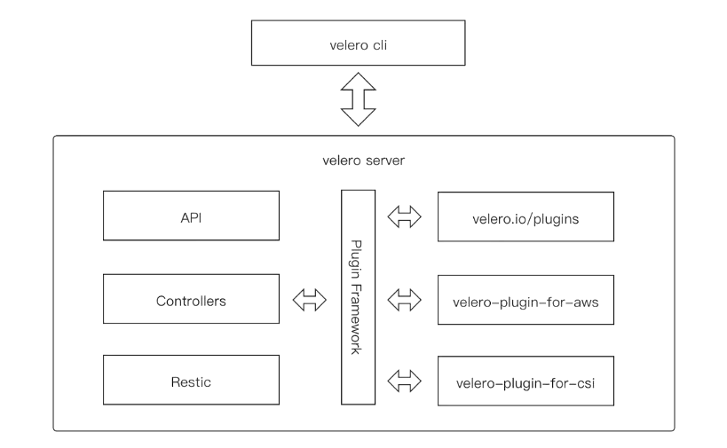
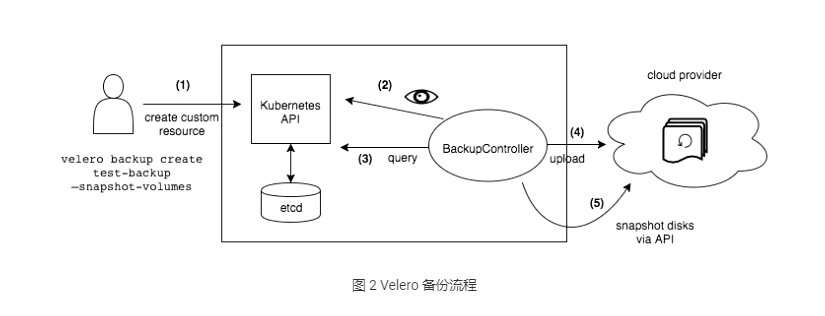
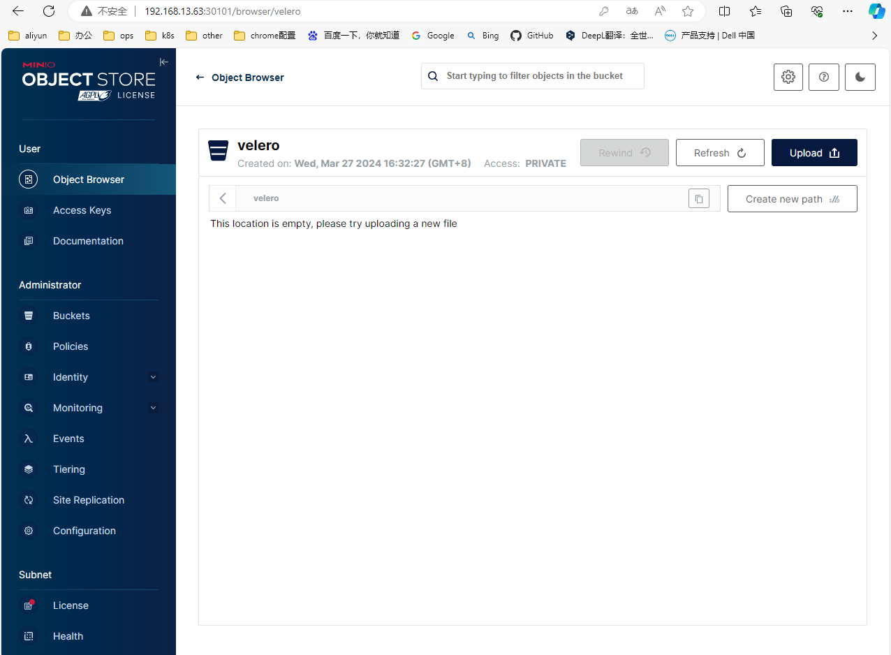
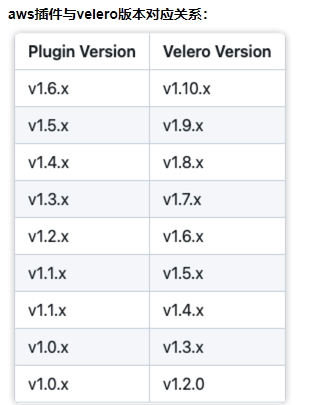
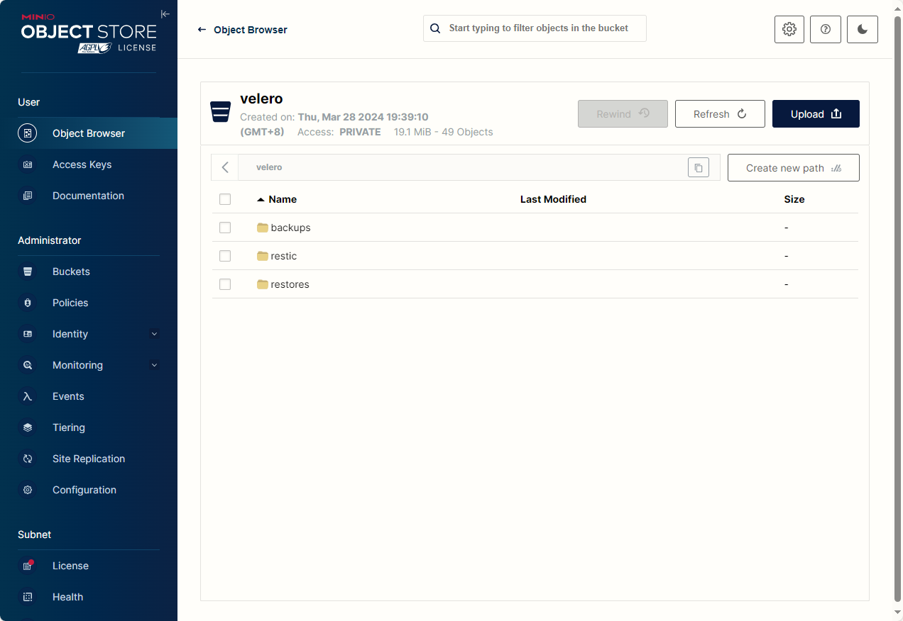

# Velero


## 简介
Velero 前身是 Heptio Ark，是由 GO 语言编写的一款用于灾难恢复和迁移工具，可以安全的备份、恢复和迁移 Kubernetes 集群资源和持久卷。

[github地址](https://github.com/vmware-tanzu/velero)


**Velero 主要提供以下能力**

* 备份 Kubernetes 集群资源，并在资源丢失情况下进行还原
* 将集群资源迁移到其他集群
* 将生产集群复制到开发和测试集群


**Velero 主要组件**

* Velero 组件主要包括服务器端和客户端两部分
* 服务端：运行在你 Kubernetes 的集群中
* 客户端：运行在本地的命令行工具，本地环境需要配置好 Kubernetes 集群的 kubeconfig 及 kubectl 客户端工具


**Velero 支持备份存储**

* Azure BloB 存储
* Google Cloud 存储
* AWS S3 及兼容 S3 的存储（比如：MinIO）
* Aliyun OSS 存储


## 原理

Velero 的基本原理就是将 Kubernetes 集群资源对象数据备份到对象存储中，并能从对象存储中拉取备份数据来恢复集群资源对象数据。

不同于 etcd 备份——将集群的全部资源备份起来——Velero 是对 Kubernetes 集群内资源对象级别进行备份，可以通过对 Type、Namespace、Label 等对象进行分类备份或者恢复。

Velero 的操作（backup, scheduled backup, restore）都是 CRD 自定义资源，存储 etcd 中。

 Velero 的整体模块架构如下图 

* 客户端是一个简单的交互客户端 Velero-cli，封装了各种命令参数，可以执行安装、配置、备份、恢复等操作。
* 服务端则可以类比成一个典型的 kubebuild 的 operator，首先是不同的 CR，也就是 API。
* 中间 Controller 层需要用到一些相对比较独立的服务时，都会通过插件系统来对接到内部或者外部的插件服务。
* 底层的数据拷贝层是对接 Restic。其它都是外部的插件实现，velero.io/plugins 就代表内部的插件实现，由 Velero 或者第三方厂商来实现。




## 按需备份


**backup：**

 将复制的 Kubernetes 资源对象上传到对象存储中，且可选择调用云环境提供的 API 来创建持久化卷快照，以及可选择指定在备份期间执行 backup hook 操作（比如：可能需要在快照之前告诉数据库将其内存中的缓存刷新到磁盘）。 

>  **Tips：** backup 操作并不是严格的原子性备份，在备份期间，若是有 Kubernetes 资源对象被新建或编辑操作，则这个操作变动可能不会被包含在 backup 备份中。 


**指令：** `velero backup create test-backup` 


**流程：**

- Velero 客户端向 Kubernetes API server 发起创建 Backup 对象的请求
- BackupController 检测到新建 Backup 对象，并进行参数验证
- BackupController 开始备份执行过程。通过与 API server 交互，获取需要备份的资源数据
- BackupController 向对象存储服务（如：AWS S3）发起上传备份数据请求
- 默认情况，backup 操作是会对持久卷（PV）进行磁盘快照备份的，不过是可以通过–snapshot-volumes=false 进行取消




## 备份还原


**restore：**

 对历史备份的 Kubernetes 资源对象和持久卷进行还原，且允许按需选择指定部分资源对象还原到指定命名空间（Namespace）中。且可以选择在备份还原期间或还原后执行 restore hook 操作（比如：执行自定义数据库的还原操作之后，再执行数据库应用容器启动动作）。 

> **Tips：** 默认情况下，Velero 进行的是非破坏性还原操作（non-destructive restore），这意味着它不会删除目标集群上的任何数据——即如果备份中的资源对象已经存在于目标集群中，restore 操作将会跳过该资源的还原。当然，也可通配置更新策略 (–existing-resource-policy=update)，尝试更新目标集群中已存在资源，以匹配备份中的资源数据。 


**指令：** `velero restore create` 


**流程：**

- Velero 客户端向 Kubernetes API server 发起创建 Restore 对象的请求
- RestoreController 检测到新建 Restore 对象，并进行参数验证
- RestoreController 从对象存储服务处获取待还原备份资源数据信息，并进行备份资源还原前的一些预处理工作（比如：备份资源的 API versions 版本验证）
- RestoreController 开始备份还原执行过程，一次性还原所有指定待还原资源


## 定时备份


**schedule：** 

可以定期备份数据。在 schedule 创建后，便创建第一次备份，随后备份将按照指定调度周期（由 Cron 表达式指定）进行备份。定时备份保存的名称为 -，其中 格式为 YYYYMMDDhhmmss。


## API versions

* Velero 备份资源时，使用 Kubernetes API 首选版本为每个组（group）/资源（CRD）备份。
* 而还原备份的目标集群中，必须存在相同 API 组（group）/资源（CRD）版本。需要注意的是：只是需要存在相同版本，而并不是需要首选版本。
* 例如，如果正在备份的集群在 things API 组中有一个 gizmos 资源，group/versions 为 things/v1alpha1、things/v1beta1 和 things/v1，并且服务器的首选group/versions 是 things/v1，那么所有 gizmos 将从 things/v1 API 端点备份。当从该集群恢复备份时，目标集群必须具有 things/v1 端点才能恢复 Gizmo。


## 备份存储


Velero 有 2 种备份存储方式：

**1.Restic 方式备份** 

Restic 是一款 GO 语言开发的开源免费且快速、高效和安全的跨平台备份工具。它是文件系统级别备份持久卷数据并将其发送到 Velero 的对象存储。执行速度取决于本地 IO 能力，网络带宽和对象存储性能，相对快照方式备份慢。但如果当前集群或者存储出现问题，由于所有资源和数据都存储在远端的对象存储上，用 Restic 方式备份可以很容易的将应用恢复。 **Tips：** 使用 Restic 来对 PV 进行备份会有一些限制：

- 不支持备份 hostPath，支持 EFS、AzureFile、NFS、emptyDir、local 或其他没有本地快照概念的卷类型
- 备份数据标志只能通过 Pod 来识别
- 单线程操作大量文件比较慢


**2.快照方式备份** 

* Velero 使用一组 BackupItemAction 插件针对 PersistentVolumeClaims 进行备份，执行速度快。它创建一个以 PersistentVolumeClaim 作为源的 VolumeSnapshot 对象，此 VolumeSnapshot 对象与用作源的 PersistentVolumeClaim 位于同一命名空间中，与 VolumeSnapshot 对应的 VolumeSnapshotContent 对象是一个集群范围的资源，将指向存储系统中基于磁盘的实际快照。

* Velero 备份时将所有 VolumeSnapshots 和 VolumeSnapshotContents 对象上传到对象存储系统，但是 Velero 备份后的数据资源仍然保存在集群的存储上。
* 数据可用性依赖于本地存储的高可用性，因为如果是由于存储故障导致的应用问题，Velero 的快照备份机制并不能恢复应用数据。


## 数据一致性

对象存储的数据是唯一的数据源，也就是说 `Kubernetes` 集群内的控制器会检查远程的 `OSS` 存储，恢复时发现有备份就会在集群内创建相关 `CRD` ，如果发现远端存储没有当前集群内的 `CRD` 所关联的存储数据，那么就会删除当前集群内的 `CRD`。


## 部署


### 1. MinIO对象存储


Velero 依赖对象存储保存备份数据，这里部署 MinIO 替代公有云对象存储。


**minio.yaml**

```yaml
apiVersion: v1
kind: Namespace
metadata:
  name: velero
---
apiVersion: apps/v1
kind: Deployment
metadata:
  namespace: velero
  name: minio
  labels:
    component: minio
spec:
  strategy:
    type: Recreate
  selector:
    matchLabels:
      component: minio
  template:
    metadata:
      labels:
        component: minio
    spec:
      nodeSelector:
        kubernetes.io/hostname: 192.168.13.63
      volumes:
      - hostPath:
          path: /data/minio/data
          type: DirectoryOrCreate
        name: data
      - hostPath:
          path: /data/minio/config
          type: DirectoryOrCreate
        name: config
      containers:
      - name: minio
        image: bitnami/minio:latest
        imagePullPolicy: IfNotPresent
        command:
        - /bin/bash
        - -c
        args:
        - minio server /data --config-dir=/config --console-address=:9001
        env:
        - name: MINIO_ROOT_USER
          value: "admin"
        - name: MINIO_ROOT_PASSWORD
          value: "minio123"
        ports:
        - containerPort: 9000
        - containerPort: 9001
        volumeMounts:
        - name: data
          mountPath: /data
        - name: config
          mountPath: /config
        resources:
          limits:
            cpu: "1"
            memory: 2Gi
          requests:
            cpu: "1"
            memory: 2Gi
---
apiVersion: v1
kind: Service
metadata:
  namespace: velero
  name: minio
  labels:
    component: minio
spec:
  sessionAffinity: None
  type: NodePort
  ports:
  - name: port-9000
    port: 9000
    protocol: TCP
    targetPort: 9000
    nodePort: 30100
  - name: console
    port: 9001
    protocol: TCP
    targetPort: 9001
    nodePort: 30101
  selector:
    component: minio
---
apiVersion: batch/v1
kind: Job
metadata:
  namespace: velero
  name: minio-setup
  labels:
    component: minio
spec:
  template:
    metadata:
      name: minio-setup
    spec:
      nodeSelector:
        kubernetes.io/hostname: 192.168.13.63
      restartPolicy: OnFailure
      volumes:
      - hostPath:
          path: /data/minio/config-job
          type: DirectoryOrCreate
        name: config
      containers:
      - name: mc
        image: bitnami/minio-client:latest
        imagePullPolicy: IfNotPresent
        command:
        - /bin/sh
        - -c
        - "mc --config-dir=/config config host add velero http://minio.velero.svc.cluster.local:9000 admin minio123 && mc --config-dir=/config mb -p velero/velero"
        volumeMounts:
        - name: config
          mountPath: "/config"
```


```bash
[root@k8s-node04 minio]# mkdir -p /data/minio/{config,config-job,data}
[root@k8s-node04 minio]# chmod 777 /data/minio/{config,config-job,data}
[root@k8s-node04 minio]# ll -d /data/minio/{config,config-job,data}
drwxrwxrwx 2 root root 6 Mar 28 16:52 /data/minio/config
drwxrwxrwx 2 root root 6 Mar 28 16:52 /data/minio/config-job
drwxrwxrwx 2 root root 6 Mar 28 16:52 /data/minio/data

root@ansible:~/k8s/addons/velero# kubectl apply -f 01-minio.yaml
namespace/velero created
deployment.apps/minio created
service/minio created
job.batch/minio-setup created

root@ansible:~/k8s/addons/velero# kubectl get all -n velero
NAME                         READY   STATUS    RESTARTS   AGE
pod/minio-6594cd7bc7-mvpdw   1/1     Running   0          6s
pod/minio-setup-9m4rj        1/1     Running   0          5s

NAME            TYPE       CLUSTER-IP     EXTERNAL-IP   PORT(S)                         AGE
service/minio   NodePort   10.68.192.74   <none>        9000:30100/TCP,9001:30101/TCP   6s

NAME                    READY   UP-TO-DATE   AVAILABLE   AGE
deployment.apps/minio   1/1     1            1           6s

NAME                               DESIRED   CURRENT   READY   AGE
replicaset.apps/minio-6594cd7bc7   1         1         1       6s

NAME                    COMPLETIONS   DURATION   AGE
job.batch/minio-setup   0/1           4s         5s

# WebUI访问30101端口
root@ansible:~/k8s/addons/velero# kubectl get svc -n velero
NAME    TYPE       CLUSTER-IP     EXTERNAL-IP   PORT(S)                         AGE
minio   NodePort   10.68.192.74   <none>        9000:30100/TCP,9001:30101/TCP   15s

```




### 2. Velero 客户端


[Velero客户端下载](https://github.com/vmware-tanzu/velero/releases/download/v1.9.7/velero-v1.9.7-linux-amd64.tar.gz)

```bash
root@ansible:~/k8s/addons/velero# tar xf /download/velero-v1.9.7-linux-amd64.tar.gz
root@ansible:~/k8s/addons/velero# ls
01-minio.yaml  velero-v1.9.7-linux-amd64
root@ansible:~/k8s/addons/velero# tree velero-v1.9.7-linux-amd64/
.
├── LICENSE
├── examples
│   ├── README.md
│   ├── minio
│   │   └── 00-minio-deployment.yaml
│   └── nginx-app
│       ├── README.md
│       ├── base.yaml
│       └── with-pv.yaml
└── velero

root@ansible:~/k8s/addons/velero# mv velero-v1.9.7-linux-amd64/velero /usr/local/bin/
root@ansible:~/k8s/addons/velero# velero version
Client:
        Version: v1.9.7
        Git commit: 9ace4ecbdc08d57415786ab9c896f86dbb6dc0b7
<error getting server version: no matches for kind "ServerStatusRequest" in version "velero.io/v1">

```


### 3. Velero 服务端


#### 3.1 velero密钥配置

首先准备密钥文件，access key id 和 secret access key 为 MinIO 的用户名和密码

```bash
root@ansible:~/k8s/addons/velero# cat credentials-velero
[default]
aws_access_key_id=admin
aws_secret_access_key=minio123
```


#### 3.2 安装velero服务端 

可以使用 velero 客户端来安装服务端，也可以使用 Helm Chart 来进行安装。比如本文以客户端来安装，velero 命令默认读取 kubectl 配置的集群上下文，所以前提是 velero 客户端所在的节点有可访问集群的 kubeconfig 配置



> - 这里使用 MinIO 作为对象存储，MinIO 是兼容 S3 的，所以配置的 provider（声明使用的 Velero 插件类型）是 AWS，
> - –secret-file 用来提供访问 MinIO 的密钥
> - –use-restic 表示使用开源免费备份工具 restic 备份和还原持久卷数据，启用该参数后会部署一个名为 restic 的 DaemonSet 对象
> - –plugins 使用的 velero 插件，本文使用 AWS S3 兼容插件。
> - s3Url 配置 MinIO 服务对外暴露的 nodePort 端口及部署节点 IP
> - 需要注意的是启动需要修改 Restic DaemonSet spec 配置，调整为实际环境中 Kubernetes 指定 pod 保存路径的 hostPath

```bash
# s3Url必须指向Minio的API端口，是30100而不是30101
root@ansible:~/k8s/addons/velero# cat velero-server-install.sh
#!/bin/bash
velero install \
--provider aws \
--bucket velero \
--image velero/velero:v1.9.7 \
--plugins velero/velero-plugin-for-aws:v1.5.5 \
--namespace velero \
--secret-file /root/k8s/addons/velero/credentials-velero \
--use-volume-snapshots=false \
--use-restic \
--default-volumes-to-restic=true \
--kubeconfig=/root/.kube/config \
--backup-location-config region=minio,s3ForcePathStyle="true",s3Url=http://192.168.13.63:30100


# 安装，可执行多次./velero-install.sh
root@ansible:~/k8s/addons/velero# ./velero-server-install.sh
CustomResourceDefinition/backups.velero.io: attempting to create resource
CustomResourceDefinition/backups.velero.io: attempting to create resource client
CustomResourceDefinition/backups.velero.io: created
CustomResourceDefinition/backupstoragelocations.velero.io: attempting to create resource
CustomResourceDefinition/backupstoragelocations.velero.io: attempting to create resource client
CustomResourceDefinition/backupstoragelocations.velero.io: created
CustomResourceDefinition/deletebackuprequests.velero.io: attempting to create resource
CustomResourceDefinition/deletebackuprequests.velero.io: attempting to create resource client
CustomResourceDefinition/deletebackuprequests.velero.io: created
CustomResourceDefinition/downloadrequests.velero.io: attempting to create resource
CustomResourceDefinition/downloadrequests.velero.io: attempting to create resource client
CustomResourceDefinition/downloadrequests.velero.io: created
CustomResourceDefinition/podvolumebackups.velero.io: attempting to create resource
CustomResourceDefinition/podvolumebackups.velero.io: attempting to create resource client
CustomResourceDefinition/podvolumebackups.velero.io: created
CustomResourceDefinition/podvolumerestores.velero.io: attempting to create resource
CustomResourceDefinition/podvolumerestores.velero.io: attempting to create resource client
CustomResourceDefinition/podvolumerestores.velero.io: created
CustomResourceDefinition/resticrepositories.velero.io: attempting to create resource
CustomResourceDefinition/resticrepositories.velero.io: attempting to create resource client
CustomResourceDefinition/resticrepositories.velero.io: created
CustomResourceDefinition/restores.velero.io: attempting to create resource
CustomResourceDefinition/restores.velero.io: attempting to create resource client
CustomResourceDefinition/restores.velero.io: created
CustomResourceDefinition/schedules.velero.io: attempting to create resource
CustomResourceDefinition/schedules.velero.io: attempting to create resource client
CustomResourceDefinition/schedules.velero.io: created
CustomResourceDefinition/serverstatusrequests.velero.io: attempting to create resource
CustomResourceDefinition/serverstatusrequests.velero.io: attempting to create resource client
CustomResourceDefinition/serverstatusrequests.velero.io: created
CustomResourceDefinition/volumesnapshotlocations.velero.io: attempting to create resource
CustomResourceDefinition/volumesnapshotlocations.velero.io: attempting to create resource client
CustomResourceDefinition/volumesnapshotlocations.velero.io: created
Waiting for resources to be ready in cluster...
Namespace/velero: attempting to create resource
Namespace/velero: attempting to create resource client
Namespace/velero: created
ClusterRoleBinding/velero: attempting to create resource
ClusterRoleBinding/velero: attempting to create resource client
ClusterRoleBinding/velero: created
ServiceAccount/velero: attempting to create resource
ServiceAccount/velero: attempting to create resource client
ServiceAccount/velero: created
Secret/cloud-credentials: attempting to create resource
Secret/cloud-credentials: attempting to create resource client
Secret/cloud-credentials: created
BackupStorageLocation/default: attempting to create resource
BackupStorageLocation/default: attempting to create resource client
BackupStorageLocation/default: created
Deployment/velero: attempting to create resource
Deployment/velero: attempting to create resource client
Deployment/velero: created
DaemonSet/restic: attempting to create resource
DaemonSet/restic: attempting to create resource client
DaemonSet/restic: created
Velero is installed! ⛵ Use 'kubectl logs deployment/velero -n velero' to view the status.


# 查看velero服务端程序 
root@ansible:~# kubectl get all -n velero
NAME                          READY   STATUS      RESTARTS   AGE
pod/minio-6594cd7bc7-7wlg9    1/1     Running     0          10m
pod/minio-setup-skch5         0/1     Completed   0          10m
pod/restic-5rmjb              1/1     Running     0          10m
pod/restic-6bgkv              1/1     Running     0          10m
pod/restic-fnk8j              1/1     Running     0          10m
pod/restic-gqk47              1/1     Running     0          10m
pod/restic-vq4bg              1/1     Running     0          10m
pod/restic-wclt4              1/1     Running     0          10m
pod/restic-xbr5x              1/1     Running     0          10m
pod/velero-5cd4ff75bc-cgpx6   1/1     Running     0          10m

NAME            TYPE       CLUSTER-IP     EXTERNAL-IP   PORT(S)                         AGE
service/minio   NodePort   10.68.65.221   <none>        9000:30100/TCP,9001:30101/TCP   10m

NAME                    DESIRED   CURRENT   READY   UP-TO-DATE   AVAILABLE   NODE SELECTOR   AGE
daemonset.apps/restic   7         7         7       7            7           <none>          10m

NAME                     READY   UP-TO-DATE   AVAILABLE   AGE
deployment.apps/minio    1/1     1            1           10m
deployment.apps/velero   1/1     1            1           10m

NAME                                DESIRED   CURRENT   READY   AGE
replicaset.apps/minio-6594cd7bc7    1         1         1       10m
replicaset.apps/velero-5cd4ff75bc   1         1         1       10m

NAME                    COMPLETIONS   DURATION   AGE
job.batch/minio-setup   1/1           14s        10m
---

# 再次查看版本，此时velero可以看到服务版本了
root@ansible:~# velero version
Client:
        Version: v1.9.7
        Git commit: 9ace4ecbdc08d57415786ab9c896f86dbb6dc0b7
Server:
        Version: v1.9.7
        
        
```


#### 3.3 velero卸载

如果有需要可按照如下命令拆除velero部署

```bash
velero uninstall
```

以下分步骤删除

```bash
kubectl delete clusterrolebinding/velero
kubectl delete crds -l component=velero
kubectl delete ns velero 
```


#### 3.4 Velero CRD

```bash
root@ansible:~# kubectl -n velero get crds -l component=velero
NAME                                CREATED AT
backups.velero.io                   2024-03-28T11:40:53Z
backupstoragelocations.velero.io    2024-03-28T11:40:53Z
deletebackuprequests.velero.io      2024-03-28T11:40:53Z
downloadrequests.velero.io          2024-03-28T11:40:53Z
podvolumebackups.velero.io          2024-03-28T11:40:53Z
podvolumerestores.velero.io         2024-03-28T11:40:54Z
resticrepositories.velero.io        2024-03-28T11:40:54Z
restores.velero.io                  2024-03-28T11:40:55Z
schedules.velero.io                 2024-03-28T11:40:55Z
serverstatusrequests.velero.io      2024-03-28T11:40:56Z
volumesnapshotlocations.velero.io   2024-03-28T11:40:57Z
```


##### 3.4.1 BackupStorageLocation

`BackupStorageLocation` 主要用来定义 `Kubernetes` 集群资源的数据存放位置，也就是集群对象数据，不是 `PVC` 的数据。主要支持的后端存储是 `S3` 兼容的存储，比如：`Mino` 和阿里云 `OSS` 等。

```bash
# Minio
apiVersion: velero.io/v1
kind: BackupStorageLocation
metadata:
  name: default
  namespace: velero
spec:
# 只有 aws gcp azure
  provider: aws
  # 存储主要配置
  objectStorage:
  # bucket 的名称
    bucket: myBucket
    # bucket内的
    prefix: backup
# 不同的 provider 不同的配置
  config:
    #bucket地区
    region: us-west-2
    # s3认证信息
    profile: "default"
    # 使用 Minio 的时候加上，默认为 false
    # AWS 的 S3 可以支持两种 Url Bucket URL
    # 1 Path style URL： http://s3endpoint/BUCKET
    # 2 Virtual-hosted style URL： http://oss-cn-beijing.s3endpoint 将 Bucker Name 放到了 Host Header中
    # 3 阿里云仅仅支持 Virtual hosted 如果下面写上 true, 阿里云 OSS 会报错 403
    s3ForcePathStyle: "false"
    # s3的地址，格式为 http://minio:9000
    s3Url: http://minio:9000
```

```yaml
# 阿里OSS
apiVersion: velero.io/v1
kind: BackupStorageLocation
metadata:
  labels:
    component: velero
  name: default
  namespace: velero
spec:
  config:
    region: oss-cn-beijing
    s3Url: http://oss-cn-beijing.aliyuncs.com
    s3ForcePathStyle: "false"
  objectStorage:
    bucket: build-jenkins
    prefix: ""
  provider: aws
```


##### 3.4.2 VolumeSnapshotLocation

VolumeSnapshotLocation 主要用来给 PV 做快照，需要云提供商提供插件，阿里云已经提供了插件，这个需要使用 CSI 等存储机制。

你也可以使用专门的备份工具 `Restic`，把 PV 数据备份到阿里云 OSS 中去(安装时需要自定义选项)。

```
# 安装时需要自定义选项
--use-restic

# 这里我们存储PV使用的是OSS，也就是BackupStorageLocation，因此不用创建VolumeSnapshotLocation对象
--use-volume-snapshots=false
```

`Restic` 是一款 GO 语言开发的数据加密备份工具，顾名思义，可以将本地数据加密后传输到指定的仓库。支持的仓库有 Local、SFTP、Aws S3、Minio、OpenStack Swift、Backblaze B2、Azure BS、Google Cloud storage、Rest Server。


### 4. 部署Clusterpedia服务用作测试


#### 4.1 部署Clusterpedia


**拉取项目**

```bash
root@ansible:~/k8s/addons/velero# git clone https://github.com/clusterpedia-io/clusterpedia.git
root@ansible:~/k8s/addons/velero# cd clusterpedia
root@ansible:~/k8s/addons/velero/clusterpedia# git checkout v0.7.0
Note: checking out 'v0.7.0'.
root@ansible:~/k8s/addons/velero/clusterpedia# git branch
* (HEAD detached at v0.7.0)
  main
```


**安装存储组件**

```bash
# 配置
root@ansible:~/k8s/addons/velero/clusterpedia# cd ./deploy/internalstorage/mysql/
root@ansible:~/k8s/addons/velero/clusterpedia/deploy/internalstorage/mysql# ll
total 12
drwxr-xr-x 3 root root  174 Mar 28 10:53 ./
drwxr-xr-x 4 root root   35 Mar 28 10:53 ../
-rw-r--r-- 1 root root  347 Mar 28 10:53 clusterpedia_internalstorage_configmap.yaml
-rw-r--r-- 1 root root 1822 Mar 28 10:53 clusterpedia_internalstorage_deployment.yaml
-rw-r--r-- 1 root root  235 Mar 28 10:53 clusterpedia_internalstorage_secret.yaml
drwxr-xr-x 2 root root  116 Mar 28 10:53 templates/

root@ansible:~/k8s/addons/velero/clusterpedia/deploy/internalstorage/mysql# export STORAGE_NODE_NAME='192.168.13.63'
root@ansible:~/k8s/addons/velero/clusterpedia/deploy/internalstorage/mysql# sed "s|__NODE_NAME__|$STORAGE_NODE_NAME|g" `grep __NODE_NAME__ -rl ./templates` > clusterpedia_internalstorage_pv.yaml

# 部署
root@ansible:~/k8s/addons/velero/clusterpedia/deploy/internalstorage/mysql# ll
total 16
drwxr-xr-x 3 root root  218 Mar 28 11:15 ./
drwxr-xr-x 4 root root   35 Mar 28 10:53 ../
-rw-r--r-- 1 root root  347 Mar 28 10:53 clusterpedia_internalstorage_configmap.yaml
-rw-r--r-- 1 root root 1822 Mar 28 10:53 clusterpedia_internalstorage_deployment.yaml
-rw-r--r-- 1 root root 1508 Mar 28 11:15 clusterpedia_internalstorage_pv.yaml
-rw-r--r-- 1 root root  235 Mar 28 10:53 clusterpedia_internalstorage_secret.yaml
drwxr-xr-x 2 root root  116 Mar 28 10:53 templates/
root@ansible:~/k8s/addons/velero/clusterpedia/deploy/internalstorage/mysql# kubectl apply -f .

root@ansible:~/k8s/addons/velero/clusterpedia/deploy/internalstorage/mysql# kubectl get all -n clusterpedia-system
NAME                                                      READY   STATUS      RESTARTS   AGE
pod/check-192.168.13.63-mysql-local-pv-dir-ww5ks          0/1     Completed   0          4m9s
pod/clusterpedia-internalstorage-mysql-5fc59c95c6-vlrhp   1/1     Running     0          4m9s

NAME                                         TYPE        CLUSTER-IP    EXTERNAL-IP   PORT(S)    AGE
service/clusterpedia-internalstorage-mysql   ClusterIP   10.68.34.91   <none>        3306/TCP   4m12s

NAME                                                 READY   UP-TO-DATE   AVAILABLE   AGE
deployment.apps/clusterpedia-internalstorage-mysql   1/1     1            1           4m9s

NAME                                                            DESIRED   CURRENT   READY   AGE
replicaset.apps/clusterpedia-internalstorage-mysql-5fc59c95c6   1         1         1       4m9s

NAME                                               COMPLETIONS   DURATION   AGE
job.batch/check-192.168.13.63-mysql-local-pv-dir   1/1           48s        4m9s


# 跳回 Clusterpedia 项目根目录
root@ansible:~/k8s/addons/velero/clusterpedia/deploy/internalstorage/mysql# cd ../../../
```


**安装Clusterpedia**

```bash
root@ansible:~/k8s/addons/velero/clusterpedia# ll deploy/
total 36
drwxr-xr-x  6 root root 4096 Mar 28 10:53 ./
drwxr-xr-x 14 root root 4096 Mar 28 10:53 ../
-rw-r--r--  1 root root   45 Mar 28 10:53 OWNERS
drwxr-xr-x  2 root root  162 Mar 28 10:53 binding-apiserver/
lrwxrwxrwx  1 root root   56 Mar 28 10:53 cluster.clusterpedia.io_clustersyncresources.yaml -> ./crds/cluster.clusterpedia.io_clustersyncresources.yaml
lrwxrwxrwx  1 root root   49 Mar 28 10:53 cluster.clusterpedia.io_pediaclusters.yaml -> ./crds/cluster.clusterpedia.io_pediaclusters.yaml
drwxr-xr-x  2 root root   92 Mar 28 10:53 clusterimportpolicy/
-rw-r--r--  1 root root  308 Mar 28 10:53 clusterpedia_apiserver_apiservice.yaml
-rw-r--r--  1 root root 1400 Mar 28 10:53 clusterpedia_apiserver_deployment.yaml
-rw-r--r--  1 root root  703 Mar 28 10:53 clusterpedia_apiserver_rbac.yaml
-rw-r--r--  1 root root 1326 Mar 28 10:53 clusterpedia_clustersynchro_manager_deployment.yaml
-rw-r--r--  1 root root  718 Mar 28 10:53 clusterpedia_controller_manager_deployment.yaml
-rw-r--r--  1 root root   69 Mar 28 10:53 clusterpedia_namespace.yaml
drwxr-xr-x  2 root root  228 Mar 28 10:53 crds/
drwxr-xr-x  4 root root   35 Mar 28 10:53 internalstorage/
lrwxrwxrwx  1 root root   56 Mar 28 10:53 policy.clusterpedia.io_clusterimportpolicies.yaml -> ./crds/policy.clusterpedia.io_clusterimportpolicies.yaml
lrwxrwxrwx  1 root root   57 Mar 28 10:53 policy.clusterpedia.io_pediaclusterlifecycles.yaml -> ./crds/policy.clusterpedia.io_pediaclusterlifecycles.yaml

root@ansible:~/k8s/addons/velero/clusterpedia# kubectl apply -f ./deploy

```


#### 4.2 Clusterpedia集群接入

[Clusterpedia](https://clusterpedia.io/zh-cn/docs/usage/import-clusters/) 使用自定义资源 `PediaCluster` 资源来代表接入的集群

```yaml
apiVersion: cluster.clusterpedia.io/v1alpha2
kind: PediaCluster
metadata:
  name: cluster-example
spec:
  apiserver: "https://10.30.43.43:6443"
  kubeconfig:
  caData:
  tokenData:
  certData:
  keyData:
  syncResources: []
```

用户有两种方式来配置接入的集群:

1. 直接配置 base64 编码的 kube config 到 `kubeconfig` 字段用于集群连接和验证
2. 分别配置接入集群的地址，以及验证信息

在使用 `apiserver` 字段来设置接入集群的地址时，验证字段的配置有多种选择：

- `caData` + `tokenData`
- `caData` + `certData` + `keyData`

> `caData` 在集群 APIServer 允许 Insecure 连接的情况下，也可以不填

这些验证字段都需要 base64 编码，如果这些字段的值是直接从 ConfigMap 或者 Secret 中获取的话，那么就已经 base64 过。


**本地集群接入**

使用 ServiceAccount 来接入集群

用户也可以选择在**被接入集群**中创建 ServiceAccount 并配置相应的 RBAC 来接入集群。

```bash
# 配置RBAC
# 注意：当前 kubectl 连接到被接入集群
root@ansible:~/k8s/addons/velero/clusterpedia# cat examples/clusterpedia_synchro_rbac.yaml
apiVersion: rbac.authorization.k8s.io/v1
kind: ClusterRole
metadata:
  name: clusterpedia-synchro
rules:
- apiGroups:
  - '*'
  resources:
  - '*'
  verbs:
  - '*'
- nonResourceURLs:
  - '*'
  verbs:
  - '*'
---
apiVersion: v1
kind: ServiceAccount
metadata:
  name: clusterpedia-synchro
  namespace: default
---
apiVersion: rbac.authorization.k8s.io/v1
kind: ClusterRoleBinding
metadata:
  name: clusterpedia-synchro
roleRef:
  apiGroup: rbac.authorization.k8s.io
  kind: ClusterRole
  name: clusterpedia-synchro
subjects:
- kind: ServiceAccount
  name: clusterpedia-synchro
  namespace: default
---
root@ansible:~/k8s/addons/velero/clusterpedia# kubectl apply -f examples/clusterpedia_synchro_rbac.yaml


# 获取 Service Account 对应 CA 和 Token
root@ansible:~/k8s/addons/velero/clusterpedia# SYNCHRO_CA=$(kubectl -n default get secret $(kubectl -n default get serviceaccount clusterpedia-synchro -o jsonpath='{.secrets[0].name}') -o jsonpath='{.data.ca\.crt}')
root@ansible:~/k8s/addons/velero/clusterpedia# SYNCHRO_TOKEN=$(kubectl -n default get secret $(kubectl -n default get serviceaccount clusterpedia-synchro -o jsonpath='{.secrets[0].name}') -o jsonpath='{.data.token}')
root@ansible:~/k8s/addons/velero/clusterpedia# cd ..


# 导入集群
root@ansible:~/k8s/addons/velero# cat clusterpedia-cluster-import.yaml
apiVersion: cluster.clusterpedia.io/v1alpha2
kind: PediaCluster
metadata:
  name: cluster-example
spec:
  apiserver: "https://172.168.2.21:6443"
  kubeconfig:
  caData: LS0tLS1CRUdJTiBDRVJUSUZJQ0FURS0tLS0tCk1JSURsRENDQW55Z0F3SUJBZ0lVWCtNWU80M0dYSjFyQm5DeklmZTQ5ZXExbWg0d0RRWUpLb1pJaHZjTkFRRUwKQlFBd1lURUxNQWtHQTFVRUJoTUNRMDR4RVRBUEJnTlZCQWdUQ0VoaGJtZGFhRzkxTVFzd0NRWURWUVFIRXdKWQpVekVNTUFvR0ExVUVDaE1EYXpoek1ROHdEUVlEVlFRTEV3WlRlWE4wWlcweEV6QVJCZ05WQkFNVENtdDFZbVZ5CmJtVjBaWE13SUJjTk1qSXdOVEkxTURrME1qQXdXaGdQTWpFeU1qQTFNREV3T1RReU1EQmFNR0V4Q3pBSkJnTlYKQkFZVEFrTk9NUkV3RHdZRFZRUUlFd2hJWVc1bldtaHZkVEVMTUFrR0ExVUVCeE1DV0ZNeEREQUtCZ05WQkFvVApBMnM0Y3pFUE1BMEdBMVVFQ3hNR1UzbHpkR1Z0TVJNd0VRWURWUVFERXdwcmRXSmxjbTVsZEdWek1JSUJJakFOCkJna3Foa2lHOXcwQkFRRUZBQU9DQVE4QU1JSUJDZ0tDQVFFQXlYdXJ5VmRZeXJsT3ZjSjAyZ1lNL05GL2ZjWDEKYUNvTVhHMFM0ZmRWaU16VkFucWdNN2lKaytpb2xkbldtbk9TeVQ2c29hL3hsRHRtME04MGpESnpLeDhkQ25NQwptNWRkakorUXZ1ZFU2bExTQ3Fxb3dFb0tQaXgvZWpBdkc2ZVlzcmZBOXRSUTlHbEpiRGtCOVBzUzM5aWFBWmQvCm5PM0JEamx1ZDVDYjl5NUlNWUN1emIwUk1WNktqR2NaYVNxYlJjZVI0VXV0dVJJODlBTEx5MEk2Z2FFd0gzZi8KbVphQzlTT0YvbjlVMkFDYXprTjdDS0p4UGU3K0dIZkl6clhGYkUyMmVZYlg3TmZ0OTAyYW9ta0tLMURnaERhYQpoK2xrUkhCUGtmQnFIQ29xcm9CaDh5R3lmcTdQWjh0M0lvUDNRbVc4bkhyZW5URGxsMXJTWjhDR3p3SURBUUFCCm8wSXdRREFPQmdOVkhROEJBZjhFQkFNQ0FRWXdEd1lEVlIwVEFRSC9CQVV3QXdFQi96QWRCZ05WSFE0RUZnUVUKYjlPWFFKRTRhbWpXUEhTb3o3ajl4R3orWXBRd0RRWUpLb1pJaHZjTkFRRUxCUUFEZ2dFQkFENXBMeEZPd0NBYwowL0hyN2x2K1RkRmhYOWR5L3ZpWHNnV3JDS1MzQ1NBNkJVcEU4N042bnY0eCtCNkZNZlp3QkF2NlR4WkIrL3FUCmdBTEFxMDVQVVZ3SkpvMVhUWUdwUFU3eEUxVUVGaG9sV0JpSzk5Um9nVmR0TVdQTy9kbnkvY0tSUktuNXVpdHcKVFZNQVFNckhwd0ptSFAyeGJEZjFQRExJeGlzdVo4RnRXbGZ4bTcyZWhIOStucTVYMUZKVzNNTkxPeDFWNlFaSQpMWDgzWnBDYTZ3SHhhZ3daVWtUTURsaHdGbHorSkZtbkNsLzUramdzZ0lZaktmTW1HeHgrOEhRUzZ2ODJiNE5VClJieEFkL0RNZ2JGVHgzeHFLeHR5eUFpRXlTeStsTHlCaXZjWk4zdGJudUZLeExKRlIvdkpUVlF0Sk9nUlFnRksKdHV2VFdLU2VOM0U9Ci0tLS0tRU5EIENFUlRJRklDQVRFLS0tLS0K
  tokenData: ZXlKaGJHY2lPaUpTVXpJMU5pSXNJbXRwWkNJNklsOVRSMmxwVFhWa0xUUktVMHRRVG05Nk1uaDRVVEJMTTBOMk5IVnFUMGMzZFRadGF6aHhlVGhWYzFraWZRLmV5SnBjM01pT2lKcmRXSmxjbTVsZEdWekwzTmxjblpwWTJWaFkyTnZkVzUwSWl3aWEzVmlaWEp1WlhSbGN5NXBieTl6WlhKMmFXTmxZV05qYjNWdWRDOXVZVzFsYzNCaFkyVWlPaUprWldaaGRXeDBJaXdpYTNWaVpYSnVaWFJsY3k1cGJ5OXpaWEoyYVdObFlXTmpiM1Z1ZEM5elpXTnlaWFF1Ym1GdFpTSTZJbU5zZFhOMFpYSndaV1JwWVMxemVXNWphSEp2TFhSdmEyVnVMWEI0ZG5SNElpd2lhM1ZpWlhKdVpYUmxjeTVwYnk5elpYSjJhV05sWVdOamIzVnVkQzl6WlhKMmFXTmxMV0ZqWTI5MWJuUXVibUZ0WlNJNkltTnNkWE4wWlhKd1pXUnBZUzF6ZVc1amFISnZJaXdpYTNWaVpYSnVaWFJsY3k1cGJ5OXpaWEoyYVdObFlXTmpiM1Z1ZEM5elpYSjJhV05sTFdGalkyOTFiblF1ZFdsa0lqb2lZVFppT1dVM05XWXRNV0V6TXkwME5UazFMVGsxTmpZdE4yWmxNVEppT1RFeVlqVTRJaXdpYzNWaUlqb2ljM2x6ZEdWdE9uTmxjblpwWTJWaFkyTnZkVzUwT21SbFptRjFiSFE2WTJ4MWMzUmxjbkJsWkdsaExYTjVibU5vY204aWZRLnNUN0ViTEFEZUJKWUh6UGZWbWlpdnlWbUJBbjNFd05OWVdScU5OMnE5SjhBVmRLeld6OEtpbzRLMGd1VGQ2OHFhUUNXQWplWHhTMTlYeko2R3FOX0Zub3J0RFc5LVZXSTBrNnRweURubGpMNnJyaWFnYjByWlhNanZmTDF0NDM3dVNObm1kNnc4V0lRRzN4V2tSWHNXX0ZNMEJIMlk5NS1weUJ3OUl4RjVSU2NLTVhMQ2Y5Y2FfdXIwc0tuNlpoV0xTZzZTaExyeHQ4RzZfWi1yZjNtU0t5VlYxOURSNy03TTBjd2tsM2hqdTBZYjI2bWd6YVdac0VPZkFCdzU0RXozZ242NElLYUNvaEtTQXpBUzVMVU9CemJFNjFweWRKNl9JN2Q0RlpPTVFCZjBFeUp2TVYzbW9reW1qV0lxa0VwXzBxTWp6aEU0SlhYTGgxcUJ6Rzk5UQ==
  certData:
  keyData:
  syncResources:
  - group: apps
    resources:
    - "*"
  - group: ""
    resources:
    - "*"
root@ansible:~/k8s/addons/velero# kubectl apply -f clusterpedia-cluster-import.yaml
pediacluster.cluster.clusterpedia.io/cluster-example created
# 查看导入的集群
root@ansible:~/k8s/addons/velero# kubectl get PediaCluster
NAME              READY   VERSION   APISERVER
cluster-example   True    v1.23.1   https://172.168.2.21:6443
```


#### 4.4 查看导入集群的数据

```bash
# 获取本地存储mysql的POD_NAME
kubectl exec -it -n clusterpedia-system $(kubectl get pods -n clusterpedia-system | grep internalstorage | awk '{print $1}') -- bash

# 查看数据
bash-4.4# mysql -uroot -p'dangerous0'
mysql> show databases;
+--------------------+
| Database           |
+--------------------+
| clusterpedia       |
| information_schema |
| mysql              |
| performance_schema |
| sys                |
+--------------------+
mysql> use clusterpedia;
mysql> select count(1) from clusterpedia.resources;
+----------+
| count(1) |
+----------+
|      637 |
+----------+
mysql> select r.id, r.group, r.version, r.resource, r.kind, r.name, r.namespace from clusterpedia.resources r order by id limit 10;
+----+-------+---------+------------------------+-----------------------+-----------------------------------------+---------------------+
| id | group | version | resource               | kind                  | name                                    | namespace           |
+----+-------+---------+------------------------+-----------------------+-----------------------------------------+---------------------+
|  1 |       | v1      | namespaces             | Namespace             | fat-frontend                            |                     |
|  2 |       | v1      | persistentvolumes      | PersistentVolume      | clusterpedia-internalstorage-mysql      |                     |
|  3 |       | v1      | endpoints              | Endpoints             | alertmanager-example                    | default             |
|  4 |       | v1      | persistentvolumeclaims | PersistentVolumeClaim | internalstorage-mysql                   | clusterpedia-system |
|  5 | apps  | v1      | daemonsets             | DaemonSet             | calico-node                             | kube-system         |
|  6 | apps  | v1      | statefulsets           | StatefulSet           | alertmanager-example                    | default             |
|  7 |       | v1      | namespaces             | Namespace             | istio-system                            |                     |
|  8 |       | v1      | serviceaccounts        | ServiceAccount        | argocd-applicationset-controller        | argocd              |
|  9 |       | v1      | nodes                  | Node                  | 172.168.2.25                            |                     |
| 10 | apps  | v1      | controllerrevisions    | ControllerRevision    | argocd-application-controller-ff64489d7 | argocd              |
+----+-------+---------+------------------------+-----------------------+-----------------------------------------+---------------------+

```


#### 4.5 访问 Clusterpedia 资源

```bash
root@ansible:~# kubectl api-resources | grep clusterpedia.io
clustersyncresources                                 cluster.clusterpedia.io/v1alpha2       false        ClusterSyncResources
pediaclusters                                        cluster.clusterpedia.io/v1alpha2       false        PediaCluster
collectionresources                                  clusterpedia.io/v1beta1                false        CollectionResource
resources                                            clusterpedia.io/v1beta1                false        Resources
clusterimportpolicies                                policy.clusterpedia.io/v1alpha1        false        ClusterImportPolicy
pediaclusterlifecycles                               policy.clusterpedia.io/v1alpha1        false        PediaClusterLifecycle
# 多集群资源路径
root@ansible:~# kubectl get --raw="/apis/clusterpedia.io/v1beta1/resources/version"
{
  "major": "1",
  "minor": "26",
  "gitVersion": "v1.26.3",
  "gitCommit": "b88e2675ecacb47a24465efe3f1774ffd36f8d30",
  "gitTreeState": "clean",
  "buildDate": "2023-07-04T05:58:34Z",
  "goVersion": "go1.19.5",
  "compiler": "gc",
  "platform": "linux/amd64"
}
# 定集群资源路径
root@ansible:~# kubectl get --raw="/apis/clusterpedia.io/v1beta1/resources/clusters/cluster-example/version"
{
  "major": "1",
  "minor": "26",
  "gitVersion": "v1.26.3",
  "gitCommit": "b88e2675ecacb47a24465efe3f1774ffd36f8d30",
  "gitTreeState": "clean",
  "buildDate": "2023-07-04T05:58:34Z",
  "goVersion": "go1.19.5",
  "compiler": "gc",
  "platform": "linux/amd64"
}

```


**为 kubectl 生成集群访问的快捷配置[ ](https://clusterpedia.io/zh-cn/docs/usage/access-clusterpedia/#为-kubectl-生成集群访问的快捷配置)**

尽管我们可以使用 URL 来访问 Clusterpedia 资源，但是如果想要更方便的使用 kubectl 来查询的话，就需要配置集群的 kubeconfig cluster 配置。

Clusterpedia 提供了一个简单的脚本来帮助生成 `cluster kube config`

```bash
# 实际上在/root/.kube/config文件中添加了2个集群"clusterpedia"和"cluster-example"
root@ansible:~# curl -sfL https://raw.githubusercontent.com/clusterpedia-io/clusterpedia/v0.7.0/hack/gen-clusterconfigs.sh | sh -
Current Context: context-cluster1
Current Cluster: cluster1
        Server: https://172.168.2.21:6443
        TLS Server Name:
        Insecure Skip TLS Verify:
        Certificate Authority:
        Certificate Authority Data: ***

Cluster "clusterpedia" set.
Cluster "cluster-example" set.

# 查看
root@ansible:~# cat /root/.kube/config
apiVersion: v1
clusters:
- cluster:
    certificate-authority-data: LS0tLS1CRUdJTiBDRVJUSUZJQ0FURS0tLS0tCk1JSURsRENDQW55Z0F3SUJBZ0lVWCtNWU80M0dYSjFyQm5DeklmZTQ5ZXExbWg0d0RRWUpLb1pJaHZjTkFRRUwKQlFBd1lURUxNQWtHQTFVRUJoTUNRMDR4RVRBUEJnTlZCQWdUQ0VoaGJtZGFhRzkxTVFzd0NRWURWUVFIRXdKWQpVekVNTUFvR0ExVUVDaE1EYXpoek1ROHdEUVlEVlFRTEV3WlRlWE4wWlcweEV6QVJCZ05WQkFNVENtdDFZbVZ5CmJtVjBaWE13SUJjTk1qSXdOVEkxTURrME1qQXdXaGdQTWpFeU1qQTFNREV3T1RReU1EQmFNR0V4Q3pBSkJnTlYKQkFZVEFrTk9NUkV3RHdZRFZRUUlFd2hJWVc1bldtaHZkVEVMTUFrR0ExVUVCeE1DV0ZNeEREQUtCZ05WQkFvVApBMnM0Y3pFUE1BMEdBMVVFQ3hNR1UzbHpkR1Z0TVJNd0VRWURWUVFERXdwcmRXSmxjbTVsZEdWek1JSUJJakFOCkJna3Foa2lHOXcwQkFRRUZBQU9DQVE4QU1JSUJDZ0tDQVFFQXlYdXJ5VmRZeXJsT3ZjSjAyZ1lNL05GL2ZjWDEKYUNvTVhHMFM0ZmRWaU16VkFucWdNN2lKaytpb2xkbldtbk9TeVQ2c29hL3hsRHRtME04MGpESnpLeDhkQ25NQwptNWRkakorUXZ1ZFU2bExTQ3Fxb3dFb0tQaXgvZWpBdkc2ZVlzcmZBOXRSUTlHbEpiRGtCOVBzUzM5aWFBWmQvCm5PM0JEamx1ZDVDYjl5NUlNWUN1emIwUk1WNktqR2NaYVNxYlJjZVI0VXV0dVJJODlBTEx5MEk2Z2FFd0gzZi8KbVphQzlTT0YvbjlVMkFDYXprTjdDS0p4UGU3K0dIZkl6clhGYkUyMmVZYlg3TmZ0OTAyYW9ta0tLMURnaERhYQpoK2xrUkhCUGtmQnFIQ29xcm9CaDh5R3lmcTdQWjh0M0lvUDNRbVc4bkhyZW5URGxsMXJTWjhDR3p3SURBUUFCCm8wSXdRREFPQmdOVkhROEJBZjhFQkFNQ0FRWXdEd1lEVlIwVEFRSC9CQVV3QXdFQi96QWRCZ05WSFE0RUZnUVUKYjlPWFFKRTRhbWpXUEhTb3o3ajl4R3orWXBRd0RRWUpLb1pJaHZjTkFRRUxCUUFEZ2dFQkFENXBMeEZPd0NBYwowL0hyN2x2K1RkRmhYOWR5L3ZpWHNnV3JDS1MzQ1NBNkJVcEU4N042bnY0eCtCNkZNZlp3QkF2NlR4WkIrL3FUCmdBTEFxMDVQVVZ3SkpvMVhUWUdwUFU3eEUxVUVGaG9sV0JpSzk5Um9nVmR0TVdQTy9kbnkvY0tSUktuNXVpdHcKVFZNQVFNckhwd0ptSFAyeGJEZjFQRExJeGlzdVo4RnRXbGZ4bTcyZWhIOStucTVYMUZKVzNNTkxPeDFWNlFaSQpMWDgzWnBDYTZ3SHhhZ3daVWtUTURsaHdGbHorSkZtbkNsLzUramdzZ0lZaktmTW1HeHgrOEhRUzZ2ODJiNE5VClJieEFkL0RNZ2JGVHgzeHFLeHR5eUFpRXlTeStsTHlCaXZjWk4zdGJudUZLeExKRlIvdkpUVlF0Sk9nUlFnRksKdHV2VFdLU2VOM0U9Ci0tLS0tRU5EIENFUlRJRklDQVRFLS0tLS0K
    server: https://172.168.2.21:6443/apis/clusterpedia.io/v1beta1/resources/clusters/cluster-example
  name: cluster-example
- cluster:
    certificate-authority-data: LS0tLS1CRUdJTiBDRVJUSUZJQ0FURS0tLS0tCk1JSURsRENDQW55Z0F3SUJBZ0lVWCtNWU80M0dYSjFyQm5DeklmZTQ5ZXExbWg0d0RRWUpLb1pJaHZjTkFRRUwKQlFBd1lURUxNQWtHQTFVRUJoTUNRMDR4RVRBUEJnTlZCQWdUQ0VoaGJtZGFhRzkxTVFzd0NRWURWUVFIRXdKWQpVekVNTUFvR0ExVUVDaE1EYXpoek1ROHdEUVlEVlFRTEV3WlRlWE4wWlcweEV6QVJCZ05WQkFNVENtdDFZbVZ5CmJtVjBaWE13SUJjTk1qSXdOVEkxTURrME1qQXdXaGdQTWpFeU1qQTFNREV3T1RReU1EQmFNR0V4Q3pBSkJnTlYKQkFZVEFrTk9NUkV3RHdZRFZRUUlFd2hJWVc1bldtaHZkVEVMTUFrR0ExVUVCeE1DV0ZNeEREQUtCZ05WQkFvVApBMnM0Y3pFUE1BMEdBMVVFQ3hNR1UzbHpkR1Z0TVJNd0VRWURWUVFERXdwcmRXSmxjbTVsZEdWek1JSUJJakFOCkJna3Foa2lHOXcwQkFRRUZBQU9DQVE4QU1JSUJDZ0tDQVFFQXlYdXJ5VmRZeXJsT3ZjSjAyZ1lNL05GL2ZjWDEKYUNvTVhHMFM0ZmRWaU16VkFucWdNN2lKaytpb2xkbldtbk9TeVQ2c29hL3hsRHRtME04MGpESnpLeDhkQ25NQwptNWRkakorUXZ1ZFU2bExTQ3Fxb3dFb0tQaXgvZWpBdkc2ZVlzcmZBOXRSUTlHbEpiRGtCOVBzUzM5aWFBWmQvCm5PM0JEamx1ZDVDYjl5NUlNWUN1emIwUk1WNktqR2NaYVNxYlJjZVI0VXV0dVJJODlBTEx5MEk2Z2FFd0gzZi8KbVphQzlTT0YvbjlVMkFDYXprTjdDS0p4UGU3K0dIZkl6clhGYkUyMmVZYlg3TmZ0OTAyYW9ta0tLMURnaERhYQpoK2xrUkhCUGtmQnFIQ29xcm9CaDh5R3lmcTdQWjh0M0lvUDNRbVc4bkhyZW5URGxsMXJTWjhDR3p3SURBUUFCCm8wSXdRREFPQmdOVkhROEJBZjhFQkFNQ0FRWXdEd1lEVlIwVEFRSC9CQVV3QXdFQi96QWRCZ05WSFE0RUZnUVUKYjlPWFFKRTRhbWpXUEhTb3o3ajl4R3orWXBRd0RRWUpLb1pJaHZjTkFRRUxCUUFEZ2dFQkFENXBMeEZPd0NBYwowL0hyN2x2K1RkRmhYOWR5L3ZpWHNnV3JDS1MzQ1NBNkJVcEU4N042bnY0eCtCNkZNZlp3QkF2NlR4WkIrL3FUCmdBTEFxMDVQVVZ3SkpvMVhUWUdwUFU3eEUxVUVGaG9sV0JpSzk5Um9nVmR0TVdQTy9kbnkvY0tSUktuNXVpdHcKVFZNQVFNckhwd0ptSFAyeGJEZjFQRExJeGlzdVo4RnRXbGZ4bTcyZWhIOStucTVYMUZKVzNNTkxPeDFWNlFaSQpMWDgzWnBDYTZ3SHhhZ3daVWtUTURsaHdGbHorSkZtbkNsLzUramdzZ0lZaktmTW1HeHgrOEhRUzZ2ODJiNE5VClJieEFkL0RNZ2JGVHgzeHFLeHR5eUFpRXlTeStsTHlCaXZjWk4zdGJudUZLeExKRlIvdkpUVlF0Sk9nUlFnRksKdHV2VFdLU2VOM0U9Ci0tLS0tRU5EIENFUlRJRklDQVRFLS0tLS0K
    server: https://172.168.2.21:6443
  name: cluster1
- cluster:
    certificate-authority-data: LS0tLS1CRUdJTiBDRVJUSUZJQ0FURS0tLS0tCk1JSURsRENDQW55Z0F3SUJBZ0lVWCtNWU80M0dYSjFyQm5DeklmZTQ5ZXExbWg0d0RRWUpLb1pJaHZjTkFRRUwKQlFBd1lURUxNQWtHQTFVRUJoTUNRMDR4RVRBUEJnTlZCQWdUQ0VoaGJtZGFhRzkxTVFzd0NRWURWUVFIRXdKWQpVekVNTUFvR0ExVUVDaE1EYXpoek1ROHdEUVlEVlFRTEV3WlRlWE4wWlcweEV6QVJCZ05WQkFNVENtdDFZbVZ5CmJtVjBaWE13SUJjTk1qSXdOVEkxTURrME1qQXdXaGdQTWpFeU1qQTFNREV3T1RReU1EQmFNR0V4Q3pBSkJnTlYKQkFZVEFrTk9NUkV3RHdZRFZRUUlFd2hJWVc1bldtaHZkVEVMTUFrR0ExVUVCeE1DV0ZNeEREQUtCZ05WQkFvVApBMnM0Y3pFUE1BMEdBMVVFQ3hNR1UzbHpkR1Z0TVJNd0VRWURWUVFERXdwcmRXSmxjbTVsZEdWek1JSUJJakFOCkJna3Foa2lHOXcwQkFRRUZBQU9DQVE4QU1JSUJDZ0tDQVFFQXlYdXJ5VmRZeXJsT3ZjSjAyZ1lNL05GL2ZjWDEKYUNvTVhHMFM0ZmRWaU16VkFucWdNN2lKaytpb2xkbldtbk9TeVQ2c29hL3hsRHRtME04MGpESnpLeDhkQ25NQwptNWRkakorUXZ1ZFU2bExTQ3Fxb3dFb0tQaXgvZWpBdkc2ZVlzcmZBOXRSUTlHbEpiRGtCOVBzUzM5aWFBWmQvCm5PM0JEamx1ZDVDYjl5NUlNWUN1emIwUk1WNktqR2NaYVNxYlJjZVI0VXV0dVJJODlBTEx5MEk2Z2FFd0gzZi8KbVphQzlTT0YvbjlVMkFDYXprTjdDS0p4UGU3K0dIZkl6clhGYkUyMmVZYlg3TmZ0OTAyYW9ta0tLMURnaERhYQpoK2xrUkhCUGtmQnFIQ29xcm9CaDh5R3lmcTdQWjh0M0lvUDNRbVc4bkhyZW5URGxsMXJTWjhDR3p3SURBUUFCCm8wSXdRREFPQmdOVkhROEJBZjhFQkFNQ0FRWXdEd1lEVlIwVEFRSC9CQVV3QXdFQi96QWRCZ05WSFE0RUZnUVUKYjlPWFFKRTRhbWpXUEhTb3o3ajl4R3orWXBRd0RRWUpLb1pJaHZjTkFRRUxCUUFEZ2dFQkFENXBMeEZPd0NBYwowL0hyN2x2K1RkRmhYOWR5L3ZpWHNnV3JDS1MzQ1NBNkJVcEU4N042bnY0eCtCNkZNZlp3QkF2NlR4WkIrL3FUCmdBTEFxMDVQVVZ3SkpvMVhUWUdwUFU3eEUxVUVGaG9sV0JpSzk5Um9nVmR0TVdQTy9kbnkvY0tSUktuNXVpdHcKVFZNQVFNckhwd0ptSFAyeGJEZjFQRExJeGlzdVo4RnRXbGZ4bTcyZWhIOStucTVYMUZKVzNNTkxPeDFWNlFaSQpMWDgzWnBDYTZ3SHhhZ3daVWtUTURsaHdGbHorSkZtbkNsLzUramdzZ0lZaktmTW1HeHgrOEhRUzZ2ODJiNE5VClJieEFkL0RNZ2JGVHgzeHFLeHR5eUFpRXlTeStsTHlCaXZjWk4zdGJudUZLeExKRlIvdkpUVlF0Sk9nUlFnRksKdHV2VFdLU2VOM0U9Ci0tLS0tRU5EIENFUlRJRklDQVRFLS0tLS0K
    server: https://172.168.2.21:6443/apis/clusterpedia.io/v1beta1/resources
  name: clusterpedia
contexts:
- context:
    cluster: cluster1
    user: admin
  name: context-cluster1
current-context: context-cluster1
kind: Config
preferences: {}
..................


# 再次查看指定集群资源
root@ansible:~# kubectl --cluster cluster-example get deployments -n kube-system
CLUSTER           NAME                      READY   UP-TO-DATE   AVAILABLE   AGE
cluster-example   calico-kube-controllers   1/1     1            1           672d
cluster-example   coredns                   1/1     1            1           672d
cluster-example   kube-state-metrics        1/1     1            1           644d
cluster-example   metrics-server            1/1     1            1           667d
```


#### 4.6 卸载Clusterpedia


**部署集群自动接入策略 —— ClusterImportPolicy**

0.4.0 后，Clusterpedia 提供了更加友好的接入多云平台的方式。

用户通过创建 `ClusterImportPolicy` 来自动发现多云平台中纳管的集群，并将这些集群自动同步为 `PediaCluster`，用户不需要根据纳管的集群来手动去维护 `PediaCluster` 了。


**删除 ClusterImportPolicy**

如果用户部署了 ClusterImportPolicy 那么需要先清理 ClusterImportPolicy 资源

```bash
kubectl get clusterimportpolicy
```


**清理 PediaCluster**

在卸载 Clusterpedia 前，需要查看环境中是否还存在 PediaCluster 资源，如果存在那么需要删除这些资源。

```bash
kubectl get pediacluster
```


**卸载 Clusterpedia**

PediaCluster 资源清理完成后，卸载 Clusterpedia 相关组件。

```bash
# delete compontents
kubectl delete -f ./deploy/clusterpedia_apiserver_apiservice.yaml
kubectl delete -f ./deploy/clusterpedia_apiserver_deployment.yaml
kubectl delete -f ./deploy/clusterpedia_clustersynchro_manager_deployment.yaml
kubectl delete -f ./deploy/clusterpedia_controller_manager_deployment.yaml
kubectl delete -f ./deploy/clusterpedia_apiserver_rbac.yaml

# delete crds
kubectl delete -f ./deploy/cluster.clusterpedia.io_clustersyncresources.yaml
kubectl delete -f ./deploy/cluster.clusterpedia.io_pediaclusers.yaml
kubectl delete -f ./deploy/policy.clusterpedia.io_clusterimportpolicies.yaml
kubectl delete -f ./deploy/policy.clusterpedia.io_pediaclusterlifecycles.yaml
```


**卸载存储组件**

根据选择的存储组件类型，来移除相关的资源。

```bash
kubectl delete -f ./deploy/internalstorage/<storage type>
```


**清理 Local PV 以及数据**

存储组件卸载后，PV 和相应的数据会依然遗留在节点中，我们需要手动清理。

通过 Local PV 资源详情，来查看挂载的节点。

```bash
kubectl get pv clusterpedia-internalstorage-<storage type>
```

得知数据保存的节点后，删除 Local PV。

```bash
kubectl delete pv clusterpedia-internalstorage-<storage type>
```

登录数据所在节点，清理数据。

```bash
# 遗留数据所在节点
rm -rf /var/local/clusterpedia/internalstorage/<storage type>
```


### 5. Velero创建备份


#### 5.1 备份

**注意事项**

> - 在velero备份的时候，备份过程中创建的对象是不会被备份的。
> - `velero restore` 恢复不会覆盖`已有的资源`，只恢复当前集群中`不存在的资源`。已有的资源不会回滚到之前的版本，如需要回滚，需在restore之前提前删除现有的资源。
> - 后期可以让velero作为一个crontjob来运行，定期备份数据。
> - 在高版本1.16.x中，报错`error: unable to recognize "filebeat.yml": no matches for kind "DaemonSet" in version "extensions/v1beta1"` ,将yml配置文件内的api接口修改为 apps/v1 ，导致原因为之间使用的kubernetes 版本是1.14.x版本，1.16.x 版本放弃部分API支持！

```bash
# 创建一个新的备份，名称为：mybackup-001，只备份的名称空间：clusterpedia-system，备份所有 pod 卷的方式：restic（不写默认为这）,此命令在名称空间velero下操作(默认是velero)
root@ansible:~# velero backup create mybackup-001 --include-namespaces clusterpedia-system --default-volumes-to-restic -n velero
Backup request "mybackup-001" submitted successfully.
Run `velero backup describe mybackup-001` or `velero backup logs mybackup-001` for more details.


# 查看备份列表
root@ansible:~/k8s/addons/velero# velero backup get -n velero
NAME           STATUS       ERRORS   WARNINGS   CREATED                         EXPIRES   STORAGE LOCATION   SELECTOR
mybackup-001   InProgress   0        0          2024-03-28 19:51:13 +0800 CST   29d       default            <none>

root@ansible:~/k8s/addons/velero# velero backup get -n velero
NAME           STATUS      ERRORS   WARNINGS   CREATED                         EXPIRES   STORAGE LOCATION   SELECTOR
mybackup-001   Completed   0        0          2024-03-28 19:51:13 +0800 CST   29d       default            <none>


root@ansible:~/k8s/addons/velero# velero backup describe mybackup-001
Name:         mybackup-001
Namespace:    velero
Labels:       velero.io/storage-location=default
Annotations:  velero.io/source-cluster-k8s-gitversion=v1.23.7
              velero.io/source-cluster-k8s-major-version=1
              velero.io/source-cluster-k8s-minor-version=23

Phase:  Completed

Errors:    0
Warnings:  0

Namespaces:
  Included:  clusterpedia-system
  Excluded:  <none>

Resources:
  Included:        *
  Excluded:        <none>
  Cluster-scoped:  auto

Label selector:  <none>

Storage Location:  default

Velero-Native Snapshot PVs:  auto

TTL:  720h0m0s

Hooks:  <none>

Backup Format Version:  1.1.0

Started:    2024-03-28 19:51:13 +0800 CST
Completed:  2024-03-28 19:51:25 +0800 CST

Expiration:  2024-04-27 19:51:13 +0800 CST

Total items to be backed up:  37
Items backed up:              37

Velero-Native Snapshots: <none included>

Restic Backups (specify --details for more information):
  Completed:  1

```




**定期备份**

```bash
# 定期备份
root@ansible:~# velero schedule create everyday-backup --schedule="0 1 */1 * *"
Schedule "everyday-backup" created successfully.

root@ansible:~# velero schedule get
NAME              STATUS    CREATED                         SCHEDULE      BACKUP TTL   LAST BACKUP   SELECTOR
everyday-backup   Enabled   2024-04-01 16:07:18 +0800 CST   0 1 */1 * *   0s           n/a           <none>

root@ansible:~# velero backup create --from-schedule everyday-backup
INFO[0000] No Schedule.template.metadata.labels set - using Schedule.labels for backup object  backup=velero/everyday-backup-20240401080757 labels="map[]"
Creating backup from schedule, all other filters are ignored.
Backup request "everyday-backup-20240401080757" submitted successfully.
Run `velero backup describe everyday-backup-20240401080757` or `velero backup logs everyday-backup-20240401080757` for more details.
root@ansible:~# velero backup get | grep everyday-backup
everyday-backup-20240401080757   InProgress   0        0          2024-04-01 16:07:58 +0800 CST   29d       default            <none>

```


#### 5.2 删除服务

```bash
root@ansible:~/k8s/addons/velero# kubectl get clusterimportpolicy
root@ansible:~/k8s/addons/velero# kubectl get pediacluster
NAME              READY   VERSION   APISERVER
cluster-example   True    v1.23.1   https://172.168.2.21:6443
root@ansible:~/k8s/addons/velero# kubectl delete pediacluster cluster-example
root@ansible:~/k8s/addons/velero# cd clusterpedia/

# delete compontents
kubectl delete -f ./deploy/clusterpedia_apiserver_apiservice.yaml
kubectl delete -f ./deploy/clusterpedia_apiserver_deployment.yaml
kubectl delete -f ./deploy/clusterpedia_clustersynchro_manager_deployment.yaml
kubectl delete -f ./deploy/clusterpedia_controller_manager_deployment.yaml
kubectl delete -f ./deploy/clusterpedia_apiserver_rbac.yaml

# delete crds
kubectl delete -f ./deploy/cluster.clusterpedia.io_clustersyncresources.yaml
kubectl delete -f ./deploy/cluster.clusterpedia.io_pediaclusters.yaml
kubectl delete -f ./deploy/policy.clusterpedia.io_clusterimportpolicies.yaml
kubectl delete -f ./deploy/policy.clusterpedia.io_pediaclusterlifecycles.yaml

# 删除本地存储、但不删除PV卷，因为后面恢复时需要依赖，所以只删除如下3个文件
kubectl delete -f ./deploy/internalstorage/mysql/clusterpedia_internalstorage_configmap.yaml
kubectl delete -f ./deploy/internalstorage/mysql/clusterpedia_internalstorage_deployment.yaml
kubectl delete -f ./deploy/internalstorage/mysql/clusterpedia_internalstorage_secret.yaml

# 删除PV卷数据
[root@k8s-node04 ~]# rm -rf /var/local/clusterpedia/internalstorage/mysql/*
```


#### 5.3 恢复


恢复时，应当先恢复被依赖的资源对象，最后再恢复服务，例如：

1. 先`创建/恢复`PV资源对象
2. 再恢复服务


##### 5.3.1 恢复服务

```bash
root@ansible:~/k8s/addons/velero/clusterpedia# velero backup get
NAME           STATUS      ERRORS   WARNINGS   CREATED                         EXPIRES   STORAGE LOCATION   SELECTOR
mybackup-001   Completed   0        0          2024-03-28 19:51:13 +0800 CST   29d       default            <none>
mybackup-002   Completed   0        0          2024-03-28 20:04:17 +0800 CST   29d       default            <none>

root@ansible:~/k8s/addons/velero/clusterpedia# velero restore create --from-backup mybackup-001
Restore request "mybackup-001-20240328202645" submitted successfully.
Run `velero restore describe mybackup-001-20240328202645` or `velero restore logs mybackup-001-20240328202645` for more details.
root@ansible:~/k8s/addons/velero/clusterpedia# velero get restore
NAME                          BACKUP         STATUS       STARTED                         COMPLETED   ERRORS   WARNINGS   CREATED                         SELECTOR
mybackup-001-20240328202645   mybackup-001   InProgress   2024-03-28 20:26:45 +0800 CST   <nil>       0        0          2024-03-28 20:26:45 +0800 CST   <none>

# 因为恢复时间较长，所以状态为：PartiallyFailed，原因：报了个超时的错误
root@ansible:~# velero restore get
NAME                          BACKUP         STATUS            STARTED                         COMPLETED                       ERRORS   WARNINGS   CREATED                         SELECTOR
mybackup-001-20240328202645   mybackup-001   PartiallyFailed   2024-03-28 20:26:45 +0800 CST   2024-03-29 00:26:46 +0800 CST   1        1          2024-03-28 20:26:45 +0800 CST   <none>

---
root@ansible:~# velero restore describe mybackup-001-20240328202645
Name:         mybackup-001-20240328202645
Namespace:    velero
Labels:       <none>
Annotations:  <none>

Phase:                       PartiallyFailed (run 'velero restore logs mybackup-001-20240328202645' for more information)
Total items to be restored:  37
Items restored:              37

Started:    2024-03-28 20:26:45 +0800 CST
Completed:  2024-03-29 00:26:46 +0800 CST

Warnings:
  Velero:     <none>
  Cluster:    <none>
  Namespaces:
    clusterpedia-system:  could not restore, Lease "clusterpedia-controller-manager" already exists. Warning: the in-cluster version is different than the backed-up version.

Errors:
  Velero:   timed out waiting for all PodVolumeRestores to complete
  Cluster:    <none>
  Namespaces:<none>

Backup:  mybackup-001

Namespaces:
  Included:  all namespaces found in the backup
  Excluded:  <none>

Resources:
  Included:        *
  Excluded:        nodes, events, events.events.k8s.io, backups.velero.io, restores.velero.io, resticrepositories.velero.io, csinodes.storage.k8s.io, volumeattachments.storage.k8s.io
  Cluster-scoped:  auto

Namespace mappings:  <none>

Label selector:  <none>

Restore PVs:  auto

Restic Restores (specify --details for more information):
  New:  1

Existing Resource Policy:   <none>

Preserve Service NodePorts:  auto
---
# 再次执行恢复
root@ansible:~# velero restore create --from-backup mybackup-001
Restore request "mybackup-001-20240329114835" submitted successfully.
Run `velero restore describe mybackup-001-20240329114835` or `velero restore logs mybackup-001-20240329114835` for more details.

# 再次执行恢复后状态
root@ansible:~# velero restore get
NAME                          BACKUP         STATUS            STARTED                         COMPLETED                       ERRORS   WARNINGS   CREATED                         SELECTOR
mybackup-001-20240328202645   mybackup-001   PartiallyFailed   2024-03-28 20:26:45 +0800 CST   2024-03-29 00:26:46 +0800 CST   1        1          2024-03-28 20:26:45 +0800 CST   <none>
mybackup-001-20240329114835   mybackup-001   Completed         2024-03-29 11:48:35 +0800 CST   2024-03-29 11:48:41 +0800 CST   0        9          2024-03-29 11:48:35 +0800 CST   <none>
# 查看详细状态
root@ansible:~# velero restore describe mybackup-001-20240329114835
Name:         mybackup-001-20240329114835
Namespace:    velero
Labels:       <none>
Annotations:  <none>

Phase:                       Completed
Total items to be restored:  36
Items restored:              36

Started:    2024-03-29 11:48:35 +0800 CST
Completed:  2024-03-29 11:48:41 +0800 CST

Warnings:
  Velero:     <none>
  Cluster:    <none>
  Namespaces:
    clusterpedia-system:  could not restore, Pod "clusterpedia-apiserver-54c895d445-vgvp6" already exists. Warning: the in-cluster version is different than the backed-up version.
                          could not restore, Pod "clusterpedia-clustersynchro-manager-58bc96b56c-2sztl" already exists. Warning: the in-cluster version is different than the backed-up version.
                          could not restore, Pod "clusterpedia-controller-manager-6467877f8f-5nx5q" already exists. Warning: the in-cluster version is different than the backed-up version.
                          could not restore, Pod "clusterpedia-internalstorage-mysql-5fc59c95c6-7bq6g" already exists. Warning: the in-cluster version is different than the backed-up version.
                          could not restore, Endpoints "clusterpedia-apiserver" already exists. Warning: the in-cluster version is different than the backed-up version.
                          could not restore, Endpoints "clusterpedia-internalstorage-mysql" already exists. Warning: the in-cluster version is different than the backed-up version.
                          could not restore, Lease "clusterpedia-controller-manager" already exists. Warning: the in-cluster version is different than the backed-up version.
                          could not restore, Service "clusterpedia-apiserver" already exists. Warning: the in-cluster version is different than the backed-up version.
                          could not restore, Service "clusterpedia-internalstorage-mysql" already exists. Warning: the in-cluster version is different than the backed-up version.

Backup:  mybackup-001

Namespaces:
  Included:  all namespaces found in the backup
  Excluded:  <none>

Resources:
  Included:        *
  Excluded:        nodes, events, events.events.k8s.io, backups.velero.io, restores.velero.io, resticrepositories.velero.io, csinodes.storage.k8s.io, volumeattachments.storage.k8s.io
  Cluster-scoped:  auto

Namespace mappings:  <none>

Label selector:  <none>

Restore PVs:  auto

Existing Resource Policy:   <none>

Preserve Service NodePorts:  auto
---
```

> 上面就算状态是Completed，但也还有错误，原因是我们上面在做`删除服务`时，将PV存储卷删除了，而服务是依赖PV的，所以我们不能删除PV，否则依赖PV的服务不能启动


##### 5.3.2 重新创建PV

使恢复的服务依赖问题被解决

```bash
# 查看clusterpedia-system的pod运行情况
root@ansible:~/k8s/addons/velero/clusterpedia# kubectl get pods -n clusterpedia-system
NAME                                                   READY   STATUS             RESTARTS        AGE
check-192.168.13.63-mysql-local-pv-dir-xsnnt           0/1     Completed          0               11s
clusterpedia-apiserver-54c895d445-vgvp6                0/1     CrashLoopBackOff   186 (33s ago)   15h
clusterpedia-clustersynchro-manager-58bc96b56c-2sztl   0/1     CrashLoopBackOff   186 (65s ago)   15h
clusterpedia-controller-manager-6467877f8f-5nx5q       1/1     Running            5 (14h ago)     15h
clusterpedia-internalstorage-mysql-5fc59c95c6-7bq6g    0/1     Pending            0               15h
# 查看pod未运行起来原因
root@ansible:~# kubectl describe pod/clusterpedia-internalstorage-mysql-5fc59c95c6-7bq6g -n clusterpedia-system
Events:
  Type     Reason            Age                  From               Message
  ----     ------            ----                 ----               -------
  Warning  FailedScheduling  43s (x874 over 14h)  default-scheduler  0/7 nodes are available: 7 pod has unbound immediate PersistentVolumeClaims.


# 重新创建PV
root@ansible:~/k8s/addons/velero/clusterpedia# cat deploy/internalstorage/mysql/clusterpedia_internalstorage_pv.yaml
---
apiVersion: v1
kind: PersistentVolume
metadata:
  name: clusterpedia-internalstorage-mysql
  labels:
    app: clusterpedia-internalstorage
    internalstorage.clusterpedia.io/type: mysql
spec:
  capacity:
    storage: 20Gi
  volumeMode: Filesystem
  accessModes:
  - ReadWriteOnce
  persistentVolumeReclaimPolicy: Retain
  local:
    path: /var/local/clusterpedia/internalstorage/mysql
  nodeAffinity:
    required:
      nodeSelectorTerms:
      - matchExpressions:
        - key: kubernetes.io/hostname
          operator: In
          values:
          - 192.168.13.63
---
apiVersion: batch/v1
kind: Job
metadata:
  name: check-192.168.13.63-mysql-local-pv-dir
  namespace: clusterpedia-system
  labels:
    app: clusterpedia-internalstorage
    internalstorage.clusterpedia.io/type: mysql
spec:
  ttlSecondsAfterFinished: 600
  template:
    metadata:
      labels:
        app: clusterpedia-internalstorage
        internalstorage.clusterpedia.io/type: mysql
        job: check-node-local-pv-dir
    spec:
      restartPolicy: Never
      nodeName: 192.168.13.63
      containers:
      - name: check-dir
        image: mysql:8
        command: ['sh', '-c', 'stat /var/lib/mysql']
        volumeMounts:
        - name: pv-dir
          mountPath: /var/lib/mysql
      volumes:
      - name: pv-dir
        hostPath:
          path: /var/local/clusterpedia/internalstorage/mysql
      tolerations:
      - key: "node-role.kubernetes.io/master"
        operator: "Exists"
        effect: "NoSchedule"
root@ansible:~/k8s/addons/velero/clusterpedia# kubectl apply -f deploy/internalstorage/mysql/clusterpedia_internalstorage_pv.yaml  
root@ansible:~# kubectl get pv
NAME                                 CAPACITY   ACCESS MODES   RECLAIM POLICY   STATUS   CLAIM                                       STORAGECLASS   REASON   AGE
clusterpedia-internalstorage-mysql   20Gi       RWO            Retain           Bound    clusterpedia-system/internalstorage-mysql                           3h57m


root@ansible:~/k8s/addons/velero/clusterpedia# kubectl get all -n clusterpedia-system
NAME                                                       READY   STATUS      RESTARTS      AGE
pod/check-192.168.13.63-mysql-local-pv-dir-xsnnt           0/1     Completed   0             81s
pod/clusterpedia-apiserver-54c895d445-95kl8                1/1     Running     0             22s
pod/clusterpedia-clustersynchro-manager-58bc96b56c-xdf8z   1/1     Running     0             22s
pod/clusterpedia-controller-manager-6467877f8f-5nx5q       1/1     Running     5 (14h ago)   15h
pod/clusterpedia-internalstorage-mysql-5fc59c95c6-7bq6g    1/1     Running     0             15h

NAME                                         TYPE        CLUSTER-IP      EXTERNAL-IP   PORT(S)    AGE
service/clusterpedia-apiserver               ClusterIP   10.68.253.115   <none>        443/TCP    15h
service/clusterpedia-internalstorage-mysql   ClusterIP   10.68.85.58     <none>        3306/TCP   15h

NAME                                                  READY   UP-TO-DATE   AVAILABLE   AGE
deployment.apps/clusterpedia-apiserver                1/1     1            1           15h
deployment.apps/clusterpedia-clustersynchro-manager   1/1     1            1           15h
deployment.apps/clusterpedia-controller-manager       1/1     1            1           15h
deployment.apps/clusterpedia-internalstorage-mysql    1/1     1            1           15h

NAME                                                             DESIRED   CURRENT   READY   AGE
replicaset.apps/clusterpedia-apiserver-54c895d445                1         1         1       15h
replicaset.apps/clusterpedia-clustersynchro-manager-58bc96b56c   1         1         1       15h
replicaset.apps/clusterpedia-controller-manager-6467877f8f       1         1         1       15h
replicaset.apps/clusterpedia-internalstorage-mysql-5fc59c95c6    1         1         1       15h

NAME                                               COMPLETIONS   DURATION   AGE
job.batch/check-192.168.13.63-mysql-local-pv-dir   1/1           6s         81s

```


#### 5.4 验证数据

```bash
[root@k8s-node04 ~]# LOCAL_STORAGE_PODNAME=`kubectl get pods -n clusterpedia-system | grep internalstorage | awk '{print $1}'`
[root@k8s-node04 ~]# kubectl exec -it -n clusterpedia-system $LOCAL_STORAGE_PODNAME -- bash
bash-4.4# mysql -uroot -p'dangerous0'
mysql> show databases;
+--------------------+
| Database           |
+--------------------+
| clusterpedia       |
| information_schema |
| mysql              |
| performance_schema |
| sys                |
+--------------------+
mysql> select count(1) from clusterpedia.resources;
+----------+
| count(1) |
+----------+
|      630 |
+----------+
mysql> select r.id, r.group, r.version, r.resource, r.kind, r.name, r.namespace from clusterpedia.resources r order by id limit 10;
+----+-------+---------+------------------------+-----------------------+-----------------------------------------+---------------------+
| id | group | version | resource               | kind                  | name                                    | namespace           |
+----+-------+---------+------------------------+-----------------------+-----------------------------------------+---------------------+
|  1 |       | v1      | namespaces             | Namespace             | fat-frontend                            |                     |
|  2 |       | v1      | persistentvolumes      | PersistentVolume      | clusterpedia-internalstorage-mysql      |                     |
|  3 |       | v1      | endpoints              | Endpoints             | alertmanager-example                    | default             |
|  4 |       | v1      | persistentvolumeclaims | PersistentVolumeClaim | internalstorage-mysql                   | clusterpedia-system |
|  5 | apps  | v1      | daemonsets             | DaemonSet             | calico-node                             | kube-system         |
|  6 | apps  | v1      | statefulsets           | StatefulSet           | alertmanager-example                    | default             |
|  7 |       | v1      | namespaces             | Namespace             | istio-system                            |                     |
|  8 |       | v1      | serviceaccounts        | ServiceAccount        | argocd-applicationset-controller        | argocd              |
|  9 |       | v1      | nodes                  | Node                  | 172.168.2.25                            |                     |
| 10 | apps  | v1      | controllerrevisions    | ControllerRevision    | argocd-application-controller-ff64489d7 | argocd              |
+----+-------+---------+------------------------+-----------------------+-----------------------------------------+---------------------+

# 查看恢复后的服务
root@ansible:~/k8s/addons/velero/clusterpedia# kubectl get --raw="/apis/clusterpedia.io/v1beta1/resources/version"
{
  "major": "1",
  "minor": "26",
  "gitVersion": "v1.26.3",
  "gitCommit": "b88e2675ecacb47a24465efe3f1774ffd36f8d30",
  "gitTreeState": "clean",
  "buildDate": "2023-07-04T05:58:34Z",
  "goVersion": "go1.19.5",
  "compiler": "gc",
  "platform": "linux/amd64"
}root@ansible:~/k8s/addons/velero/clusterpedia# ^C
root@ansible:~/k8s/addons/velero/clusterpedia# cd
root@ansible:~# kubectl get --raw="/apis/clusterpedia.io/v1beta1/resources/version"
{
  "major": "1",
  "minor": "26",
  "gitVersion": "v1.26.3",
  "gitCommit": "b88e2675ecacb47a24465efe3f1774ffd36f8d30",
  "gitTreeState": "clean",
  "buildDate": "2023-07-04T05:58:34Z",
  "goVersion": "go1.19.5",
  "compiler": "gc",
  "platform": "linux/amd64"
}root@ansible:~# kubectl --cluster cluster-example get deployments -n kube-system
CLUSTER           NAME                      READY   UP-TO-DATE   AVAILABLE   AGE
cluster-example   calico-kube-controllers   1/1     1            1           673d
cluster-example   coredns                   1/1     1            1           673d
cluster-example   kube-state-metrics        1/1     1            1           645d
cluster-example   metrics-server            1/1     1            1           669d
```


#### 5.5 velero常用命令

```bash
$ velero backup create mybackup-001 --include-namespaces clusterpedia-system --default-volumes-to-restic -n velero
$ velero backup get -n velero
$ velero backup describe mybackup-001
$ velero backup logs mybackup-001
$ velero restore create --from-backup mybackup-001
$ velero restore get 

# 使用cron表达式备份
$ velero schedule create nginx-daily --schedule="0 1 */1 * *" --include-namespaces nginx-example
$ velero create schedule NAME --schedule="0 */6 * * *"
$ velero create schedule NAME --schedule="@every 6h"
# 使用一些非标准的速记 cron 表达式
$ velero schedule create nginx-daily --schedule="@daily" --include-namespaces nginx-example
# 手动触发定时任务
$ velero backup create --from-schedule nginx-daily


```


