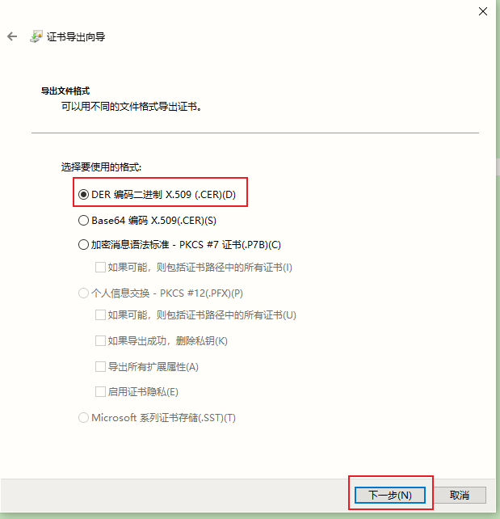

# CA签署一


## 生成CAkey和CA自签名证书

```
(umask 0077; openssl genrsa -out newca.key 2048)
openssl req -new -x509 -key newca.key -out newca.pem -days 36500 -subj "/C=CN/ST=Shanghai/O=HOMSOM Inc/OU=www.homsom.com/CN=HOMSOM RSA CA"
```


## 服务端证书申请
```
(umask 0077; openssl genrsa -out goaccess.key 1024)
openssl req -new -key goaccess.key -out goaccess.csr -subj "/C=CN/ST=Shanghai/O=HOMSOM Inc/OU=www.homsom.com/CN=*.hs.com"

用自己rsa key生成自签名证书
# openssl x509 -req -in goaccess.csr -signkey goaccess.key -out goaccess.pem -days 18250
```


## 指定CA签署证书

`谷歌浏览器报错误信息`
错误：此服务器无法证实它就是 goaccess.hs.com - 它的安全证书没有指定主题备用名称。这可能是因为某项配置有误或某个攻击者拦截了您的连接。
原因：生成证书的时候没有加上备用名称字段，目前的浏览器校验证书都需要这个字段
解决：生成证书的时候需要添加上备用名称(subjectAltName)扩展字段，使用openssl添加subjectAltName(备用名称)扩展，在DNS.x写上自己的域名如果多个域名，可以按照规律DNS.1/DNS.2...来添加，同时还支持IP地址，域名只支持1个`*`通配，不支持多个`*`匹配，例如`*.*.hs.com`就不支持，只支持`*.hs.com`

```
---
[root@salt /tmp/cert]# cat ext.ini 
basicConstraints = CA:FALSE
keyUsage = nonRepudiation, digitalSignature, keyEncipherment
subjectAltName = @alt_names
 
[alt_names]
DNS.1 = *.hs.com
DNS.2 = *.hscorp.com
DNS.3 = *.fat.qa.hs.com
DNS.4 = *.uat.qa.hs.com
---

- 用CA签署服务端证书
[root@salt /tmp/cert]# openssl x509 -req -in goaccess.csr -CAkey newca.key -CA newca.pem -CAcreateserial -out goaccess.pem -days 18250 -extfile ext.ini #需要加此参数-CAcreateserial
Signature ok
subject=/C=CN/ST=Shanghai/O=HOMSOM Inc/OU=www.homsom.com/CN=*.hs.com
Getting CA Private Key

- 验证证书信任关系
[root@salt /tmp/cert]# openssl verify -CAfile newca.pem goaccess.pem 
goaccess.pem: OK

- 生成证书信息
[root@salt /tmp/cert/bak]# openssl x509 -noout -text -in goaccess.pem  
Certificate:
    Data:
        Version: 3 (0x2)
        Serial Number:
            9d:12:8e:e6:38:a3:c0:e3
    Signature Algorithm: sha256WithRSAEncryption
        Issuer: C=CN, ST=Shanghai, O=HOMSOM Inc, OU=www.homsom.com, CN=HOMSOM RSA CA
        Validity
            Not Before: Jun 27 01:22:26 2023 GMT
            Not After : Jun 14 01:22:26 2073 GMT
        Subject: C=CN, ST=Shanghai, O=HOMSOM Inc, OU=www.homsom.com, CN=*.hs.com
        Subject Public Key Info:
            Public Key Algorithm: rsaEncryption
                Public-Key: (1024 bit)
                Modulus:
                    00:9d:f2:b8:0f:38:70:0b:64:d4:f9:7f:3d:a4:4c:
                    f7:60:64:84:71:9a:73:46:0e:bb:d4:51:2a:90:6a:
                    53:82:ce:35:a1:2b:8d:fa:10:0c:a7:a7:e3:b2:1a:
                    02:df:2d:c7:e3:5e:94:b0:d4:b9:f2:00:ee:29:99:
                    fb:d0:20:ef:50:a2:57:b6:33:10:ec:3e:61:74:98:
                    84:a1:c7:88:52:8f:be:65:c2:48:7c:ef:b4:3e:d9:
                    f6:53:bc:31:63:f4:4c:59:23:0a:ef:12:47:1d:eb:
                    27:ee:ef:fe:e2:c0:b7:2e:f6:d3:d1:07:e0:59:81:
                    fd:87:2b:c4:08:73:00:2f:f9
                Exponent: 65537 (0x10001)
        X509v3 extensions:
            X509v3 Basic Constraints: 
                CA:FALSE
            X509v3 Key Usage: 
                Digital Signature, Non Repudiation, Key Encipherment
            X509v3 Subject Alternative Name: 
                DNS:*.hs.com, DNS:*.hscorp.com, DNS:*.fat.qa.hs.com, DNS:*.uat.qa.hs.com
    Signature Algorithm: sha256WithRSAEncryption
         b5:39:c7:f4:36:5e:d4:01:1b:ae:3f:92:47:81:e6:3f:f8:b7:
         0f:cf:f4:11:a6:df:99:95:a8:3b:2d:de:b4:84:ff:f4:4c:c8:
         0a:31:e0:1e:0c:2d:9d:ee:3e:0e:96:f0:32:ac:f0:21:53:dd:
         51:a1:c0:9d:9c:b9:e4:1a:27:90:ed:39:d2:aa:ca:d0:12:aa:
         f9:a4:8e:05:f7:a9:c5:df:60:92:3f:08:89:6c:d8:f3:9b:c1:
         49:57:51:62:00:5b:1f:20:0f:c5:3f:ba:22:3a:3c:11:be:f4:
         1f:94:5a:15:17:98:a7:e7:cc:cf:67:16:60:ef:45:62:57:a6:
         7f:74:81:97:31:90:da:94:3a:26:13:c0:34:b0:e8:93:f4:cb:
         46:7a:56:bc:b6:04:4c:d6:5b:2e:2b:fe:0b:d1:09:1e:be:b6:
         51:6f:99:bd:9c:e1:26:f4:30:14:cf:58:be:e3:b3:42:36:2c:
         c6:7e:c1:9d:01:25:b5:0c:c9:58:ab:0e:09:5b:08:8f:fc:63:
         5f:6f:c3:b6:f9:e3:9e:c0:fe:e7:d5:24:dd:b9:bf:5c:21:1f:
         b3:49:43:ab:9c:0d:01:fa:8a:b5:ec:98:bd:ec:67:f5:d4:d1:
         0b:fe:36:54:57:7c:9a:09:90:09:a4:33:38:1c:53:39:f8:3b:
         4e:af:57:82
```


windows客户端安装newca.pem证书到`受信息的根证书颁发机构`


# CA签署二


## 配置CA环境

从/etc/pki/tls/openssl.cnf看出`[ CA_default ]`环境配置

```bash
# 生成CA私钥及CA自签名证书
cd /etc/pki/CA && touch index.txt serial && echo 01 > serial && (umask 077;openssl genrsa -out /etc/pki/CA/private/cakey.pem 4096) && openssl req -new -x509 -key /etc/pki/CA/private/cakey.pem -out /etc/pki/CA/cacert.pem -days 36500 
```


## 生成服务器key和csr

```bash
[root@salt /etc/pki/CA]# (umask 0077;openssl genrsa -out myrsa/hs.com.key 2048)

[root@salt /etc/pki/CA]# openssl req -new -key myrsa/hs.com.key -out myrsa/hs.com.csr -days 365 -subj "/C=CN/ST=Shanghai/O=hs/OU=ops/CN=*.hs.com"

[root@salt /etc/pki/CA]# ls myrsa/
hs.com.csr  hs.com.key

[root@salt /etc/pki/CA]# cat myrsa/ext.ini
basicConstraints = CA:FALSE
keyUsage = nonRepudiation, digitalSignature, keyEncipherment
subjectAltName = @alt_names
 
[alt_names]
DNS.1 = *.hs.com
DNS.2 = *.hscorp.com
DNS.3 = *.fat.qa.hs.com
DNS.4 = *.uat.qa.hs.com
```


## CA签署证书

```bash
# 签署服务器发送给CA的csr
[root@salt /etc/pki/CA]# openssl ca -in myrsa/hs.com.csr -out myrsa/hs.com.pem -days 18250 -extfile myrsa/ext.ini 
........
Certificate is to be certified until Jun 14 03:47:38 2073 GMT (18250 days)
Sign the certificate? [y/n]:y
failed to update database
TXT_DB error number 2		#报错，原因是subject不唯一，需要重新生成myrsa/hs.com.csr的subject

[root@salt /etc/pki/CA]# cat index.txt	#R开头的中吊销的证书
R	310303024223Z	210305060657Z	01	unknown	/C=CN/ST=Shanghai/O=hs/OU=ops/CN=jumpserver.hs.com
R	410228063222Z	210305071329Z	02	unknown	/C=CN/ST=Shanghai/O=hs/OU=ops/CN=jumpserver.hs.com
R	250304065419Z	210305071516Z	03	unknown	/C=CN/ST=Shanghai/O=hs/OU=ops/CN=*.hs.com
V	20610223071904Z		04	unknown	/C=CN/ST=Shanghai/O=hs/OU=ops/CN=*.hs.com	#此处相同报错
V	310602050917Z		05	unknown	/C=CN/ST=Shanghai/O=hs/OU=it/CN=harborrepo.hs.com

# 重新生成csr及签署
[root@salt /etc/pki/CA]# rm -rf myrsa/hs.com.pem myrsa/hs.com.csr
[root@salt /etc/pki/CA]# openssl req -new -key myrsa/hs.com.key -out myrsa/hs.com.csr -days 365 -subj "/C=CN/ST=Shanghai/O=hs/OU=tech/CN=*.hs.com"

# 重新签署服务器发送给CA的csr
[root@salt /etc/pki/CA]# openssl ca -in myrsa/hs.com.csr -out myrsa/hs.com.pem -days 18250 -extfile myrsa/ext.ini 
Using configuration from /etc/pki/tls/openssl.cnf
Check that the request matches the signature
Signature ok
Certificate Details:
        Serial Number: 6 (0x6)
        Validity
            Not Before: Jun 27 04:01:40 2023 GMT
            Not After : Jun 14 04:01:40 2073 GMT
        Subject:
            countryName               = CN
            stateOrProvinceName       = Shanghai
            organizationName          = hs
            organizationalUnitName    = tech
            commonName                = *.hs.com
        X509v3 extensions:
            X509v3 Basic Constraints: 
                CA:FALSE
            X509v3 Key Usage: 
                Digital Signature, Non Repudiation, Key Encipherment
            X509v3 Subject Alternative Name: 
                DNS:*.hs.com, DNS:*.hscorp.com, DNS:*.fat.qa.hs.com, DNS:*.uat.qa.hs.com
Certificate is to be certified until Jun 14 04:01:40 2073 GMT (18250 days)
Sign the certificate? [y/n]:y


1 out of 1 certificate requests certified, commit? [y/n]y
Write out database with 1 new entries
Data Base Updated

[root@salt /etc/pki/CA]# cat index.txt
R	310303024223Z	210305060657Z	01	unknown	/C=CN/ST=Shanghai/O=hs/OU=ops/CN=jumpserver.hs.com
R	410228063222Z	210305071329Z	02	unknown	/C=CN/ST=Shanghai/O=hs/OU=ops/CN=jumpserver.hs.com
R	250304065419Z	210305071516Z	03	unknown	/C=CN/ST=Shanghai/O=hs/OU=ops/CN=*.hs.com
V	20610223071904Z		04	unknown	/C=CN/ST=Shanghai/O=hs/OU=ops/CN=*.hs.com
V	310602050917Z		05	unknown	/C=CN/ST=Shanghai/O=hs/OU=it/CN=harborrepo.hs.com
V	20730614040140Z		06	unknown	/C=CN/ST=Shanghai/O=hs/OU=tech/CN=*.hs.com	#新签署的证书

[root@salt /etc/pki/CA]# openssl x509 -noout -text -in newcerts/06.pem 
Certificate:
    Data:
        Version: 3 (0x2)
        Serial Number: 6 (0x6)
    Signature Algorithm: sha256WithRSAEncryption
        Issuer: C=CN, ST=Shanghai, L=Shanghai, O=hs, OU=ops, CN=localhost
        Validity
            Not Before: Jun 27 04:01:40 2023 GMT
            Not After : Jun 14 04:01:40 2073 GMT
        Subject: C=CN, ST=Shanghai, O=hs, OU=tech, CN=*.hs.com
        Subject Public Key Info:
            Public Key Algorithm: rsaEncryption
                Public-Key: (2048 bit)
                Modulus:
                    00:af:f8:25:13:96:f7:33:ba:5a:a8:3b:a5:e9:39:
                    ce:51:be:a7:ef:5b:9c:93:0f:31:97:fa:32:45:00:
                    95:14:bd:6d:aa:88:68:ba:4c:db:f4:40:6b:bc:8f:
                    d5:66:55:d5:3c:1f:23:0c:25:d5:71:44:2c:53:93:
                    b5:54:1d:b8:d2:96:6c:45:16:43:55:2b:0d:1d:b9:
                    42:3b:be:9f:3e:27:3f:6c:dc:50:c7:f8:f6:2e:26:
                    f4:37:0d:17:e6:23:3c:ca:4b:b1:63:ac:0c:0d:28:
                    fa:a2:b5:b4:c7:75:e6:2f:1f:7b:4d:19:25:05:8b:
                    92:01:15:ff:13:11:74:92:5d:cc:75:1c:be:f7:dd:
                    f3:e0:73:c0:d1:3c:8b:b2:c8:06:76:d3:20:c7:c3:
                    ee:b2:88:d3:9a:12:82:14:93:34:4f:52:ce:cc:a7:
                    4e:6a:4a:46:a7:bd:db:82:ea:b2:54:81:84:9f:e0:
                    c7:a7:f0:f5:29:1f:43:34:84:91:ef:07:04:26:f7:
                    54:88:5a:32:5b:07:54:a3:0f:f0:ba:39:53:ee:0e:
                    aa:77:eb:01:df:12:c1:0e:3d:66:0f:eb:8f:6b:cd:
                    b4:8a:e1:13:f0:67:29:ea:d3:a4:cc:93:eb:78:2c:
                    c4:18:5b:8d:e9:7f:1d:0a:51:a4:72:51:c5:1b:93:
                    86:f7
                Exponent: 65537 (0x10001)
        X509v3 extensions:
            X509v3 Basic Constraints: 
                CA:FALSE
            X509v3 Key Usage: 
                Digital Signature, Non Repudiation, Key Encipherment
            X509v3 Subject Alternative Name: 
                DNS:*.hs.com, DNS:*.hscorp.com, DNS:*.fat.qa.hs.com, DNS:*.uat.qa.hs.com
    Signature Algorithm: sha256WithRSAEncryption
         09:7f:0b:41:8e:3d:07:9f:30:06:60:8a:e9:bd:7d:01:6e:48:
         03:93:31:56:14:7f:74:4a:07:2a:8a:76:c1:fb:8d:e9:75:d1:
         5d:b1:df:32:34:f1:c9:14:26:e9:cc:39:ad:e4:2c:51:bc:9e:
         20:ed:32:3c:92:c2:eb:ab:14:1e:2c:24:6a:15:54:32:c4:65:
         f2:d6:8a:9a:d1:9f:75:1c:38:84:b8:d9:b2:99:c7:40:10:27:
         e2:ac:72:7a:fc:32:53:c9:e0:ee:f2:35:8e:1f:2c:5c:75:a4:
         55:b9:cf:9c:78:1d:bb:97:bf:58:7a:58:2f:d1:37:d6:71:4b:
         26:e1:63:80:a5:66:95:8a:f2:85:f5:b2:a4:59:82:ab:7a:ff:
         9d:c8:4f:01:50:f8:a5:3d:42:99:72:ee:8e:1d:4a:b5:a3:ce:
         20:f7:be:04:45:2b:45:e4:ac:76:b3:47:0e:c3:39:73:cb:12:
         5f:8c:af:44:99:d3:e0:64:bc:f2:b9:86:db:17:17:25:e7:a9:
         cb:8d:88:50:93:59:d3:28:54:46:b4:4f:91:e8:d5:98:40:ef:
         8d:e5:ea:4e:b9:46:18:c2:79:fe:d5:ea:c7:be:54:b6:aa:54:
         bf:f9:6e:80:74:a7:22:a1:6f:9c:51:fe:44:1e:d6:15:31:f2:
         9d:8c:02:c8:75:b2:d6:22:66:4c:67:be:a0:21:82:b4:fe:5d:
         2c:48:5f:bd:ec:38:b6:c2:ab:fc:8a:59:a4:14:14:ea:4d:21:
         25:df:b5:54:32:97:01:f8:6f:d7:17:57:5f:51:5b:2f:0d:36:
         36:d9:7d:ca:53:e0:1d:30:f9:99:71:2c:17:02:f8:df:22:a3:
         8b:9f:41:92:2b:8d:68:3f:97:94:e0:ab:f9:d8:08:d6:57:ae:
         02:b8:7d:0b:86:76:25:bb:46:48:f0:07:ee:ba:7e:5d:51:d0:
         95:45:6a:3e:3c:6c:10:4f:2b:82:bf:c8:34:9c:bb:4a:ac:0e:
         fd:6e:f6:64:6b:6f:59:22:03:34:0d:69:9f:23:02:65:90:45:
         dc:40:b0:df:2a:ba:a4:77:5d:bc:5a:eb:2c:16:26:d2:74:45:
         88:0d:8a:08:1d:a9:f0:40:66:aa:1b:47:ea:28:5b:ce:a9:f0:
         0f:b4:57:37:86:aa:eb:7a:c3:ca:89:02:79:79:8d:e2:c7:0b:
         34:7e:be:d9:53:5d:d5:68:53:4e:e3:99:97:8e:dd:ef:cd:10:
         b9:82:82:f1:c8:2d:ed:18:fa:24:cd:c7:49:12:76:0b:07:8b:
         95:d8:fa:d9:d3:85:b1:6a:be:64:4f:ed:59:42:76:d4:06:df:
         bf:1e:dd:46:a2:83:bd:f8


## 吊销证书方法
# 确认证书是否要被吊销
[root@salt /etc/pki/CA]# openssl x509 -noout -text -dates -serial -subject  -in newcerts/06.pem 
......
notBefore=Jun 27 04:01:40 2023 GMT
notAfter=Jun 14 04:01:40 2073 GMT
serial=06
subject= /C=CN/ST=Shanghai/O=hs/OU=tech/CN=*.hs.com

openssl ca -revoke /etc/pki/CA/newcerts/06.pem 
echo 06 > /etc/pki/CA/crlnumber	#serial号06从index.txt中也可看出
openssl ca -gencrl -out /etc/pki/CA/crl/06.pem.crl 
[root@salt /etc/pki/CA]# ls crl
02.crl  03.crl  jumpserver.crl 06.pem.crl
```


# 生产CA签署证书


## 1. 生成CA密钥对

```bash
[root@prometheus linux]# (umask 0077; openssl genrsa -out ca.key 2048)
[root@prometheus linux]# openssl req -new -x509 -key ca.key -out ca.pem -days 365000 -subj "/C=CN/ST=Shanghai/O=HOMSOM Inc/OU=Tech/CN=LinuxCA"
[root@prometheus ca]# cd ..
[root@prometheus linux]# ll ca
total 8
-rw------- 1 root root 1679 Apr 18 16:54 ca.key
-rw-r--r-- 1 root root 1294 Apr 18 16:56 ca.pem

[root@prometheus ca]# openssl x509 -in ca.pem -noout -text
Certificate:
    Data:
        Version: 3 (0x2)
        Serial Number:
            01:42:ee:82:50:77:07:d8:4b:18:c8:c0:48:88:05:4d:69:51:3c:27
        Signature Algorithm: sha256WithRSAEncryption
        Issuer: C = CN, ST = Shanghai, O = HOMSOM Inc, OU = Tech, CN = LinuxCA
        Validity
            Not Before: Apr 18 08:56:39 2024 GMT
            Not After : Aug 20 08:56:39 3023 GMT
        Subject: C = CN, ST = Shanghai, O = HOMSOM Inc, OU = Tech, CN = LinuxCA
        Subject Public Key Info:
            Public Key Algorithm: rsaEncryption
                RSA Public-Key: (2048 bit)
.......
```


## 2. 生成server key

```bash
[root@prometheus ca_signed_server]# (umask 0077; openssl genrsa -out server.key 1024)
Generating RSA private key, 1024 bit long modulus (2 primes)
...............................................+++++
.....+++++
e is 65537 (0x010001)
[root@prometheus ca_signed_server]# ll
-rw------- 1 root root  887 Apr 18 17:35 server.key
```


## 3. 制作配置文件

```bash
[root@prometheus server]# cat myssl.conf
[ req ]
default_bits       = 4096
distinguished_name = req_distinguished_name
req_extensions     = req_ext

[ req_distinguished_name ]
countryName                 = Country Name (2 letter code)
countryName_default         = CN
stateOrProvinceName         = State or Province Name (full name)
stateOrProvinceName_default = Shanghai
localityName                = Locality Name (eg, city)
localityName_default        = Shanghai
organizationName            = Organization Name (eg, company)
organizationName_default    = Homsom
organizationalUnitName            = Organizational Unit Name (eg, section)
organizationalUnitName_default    = Tech
commonName                  = Common Name (e.g. server FQDN or YOUR name)
commonName_max              = 64
commonName_default          = hs.com

[ req_ext ]
subjectAltName = @alt_names

# 此段落标题的方括号两边【没有空格】，只有同时配有IP和域名，才能在IP和域名访问时都成功识别。
[alt_names]
IP.1    = 192.168.13.207
IP.2    = 192.168.13.208
DNS.1 = *.hs.com
DNS.2 = *.hscorp.com
DNS.3 = *.fat.qa.hs.com
DNS.4 = *.uat.qa.hs.com
DNS.5 = *.service.hs.com
DNS.6 = *.api.hs.com
DNS.7 = *.service.fat.qa.hs.com
DNS.8 = *.api.fat.qa.hs.com
DNS.9 = *.service.uat.qa.hs.com
DNS.10 = *.api.uat.qa.hs.com
DNS.11 = *.k8s.hs.com
DNS.12 = *.k8s.fat.qa.hs.com
DNS.13 = *.k8s.uat.qa.hs.com
```


## 4. 生成证书签署请求

```bash
[root@prometheus ca_signed_server]# ll
total 8
-rw-r--r-- 1 root root 1358 Apr 18 17:33 myssl.conf
-rw------- 1 root root  887 Apr 18 17:35 server.key

# 生成证书签署请求，直接Enter完成，使用配置好的默认值
[root@prometheus server]# openssl req -new -key server.key -out server.csr -config myssl.conf
You are about to be asked to enter information that will be incorporated
into your certificate request.
What you are about to enter is what is called a Distinguished Name or a DN.
There are quite a few fields but you can leave some blank
For some fields there will be a default value,
If you enter '.', the field will be left blank.
-----
Country Name (2 letter code) [CN]:
State or Province Name (full name) [Shanghai]:
Locality Name (eg, city) [Shanghai]:
Organization Name (eg, company) [Homsom]:
Organizational Unit Name (eg, section) [Tech]:
Common Name (e.g. server FQDN or YOUR name) [hs.com]:

[root@prometheus ca_signed_server]# ll
total 12
-rw-r--r-- 1 root root 1358 Apr 18 17:33 myssl.conf
-rw-r--r-- 1 root root 1037 Apr 18 17:37 server.csr
-rw------- 1 root root  887 Apr 18 17:35 server.key
```


## 5. 使用CA签署证书

```bash
[root@prometheus ca_signed_server]# openssl x509 -req -in server.csr -CAkey ../ca/ca.key -CA ../ca/ca.pem -CAcreateserial -out server.pem -days 36500 -extensions req_ext -extfile myssl.confSignature ok
subject=C = CN, ST = Shanghai, L = Shanghai, O = Homsom, OU = Tech, CN = hs.com
Getting CA Private Key

# 查看生成的证书
[root@prometheus ca_signed_server]#  openssl x509 -noout -text -in server.pem 
Certificate:
    Data:
        Version: 3 (0x2)
        Serial Number:
            21:b5:6f:ca:93:44:6f:ef:f9:df:3c:54:71:02:c9:a9:8f:41:c4:fb
        Signature Algorithm: sha256WithRSAEncryption
        Issuer: C = CN, ST = Shanghai, O = HOMSOM Inc, OU = Tech, CN = LinuxCA
        Validity
            Not Before: Apr 18 09:47:28 2024 GMT
            Not After : Mar 25 09:47:28 2124 GMT
        Subject: C = CN, ST = Shanghai, L = Shanghai, O = Homsom, OU = Tech, CN = hs.com
        Subject Public Key Info:
            Public Key Algorithm: rsaEncryption
                RSA Public-Key: (1024 bit)
                Modulus:
                    00:ad:ce:ea:72:09:64:6b:bf:58:61:f4:e1:67:92:
                    1b:5f:5d:f6:5d:c9:a9:99:52:f1:3a:1d:13:3d:34:
                    5f:93:f6:58:fc:e4:2e:08:41:2f:e5:23:8f:3f:db:
                    46:13:54:77:a0:13:68:ad:05:74:56:3f:71:42:bc:
                    5d:f8:6f:b5:ff:a8:d1:1f:29:e0:ac:b1:0a:63:4b:
                    99:98:09:c7:c2:5e:8c:d4:29:23:82:66:63:bd:6e:
                    5e:15:60:49:47:dc:08:9a:1c:e6:f5:f1:99:4d:ef:
                    48:18:ba:1f:37:bc:17:5f:7b:22:0d:bb:22:81:8a:
                    fb:c1:c6:5a:3c:05:c3:c6:5f
                Exponent: 65537 (0x10001)
        X509v3 extensions:
            X509v3 Subject Alternative Name: 
                IP Address:192.168.13.207, IP Address:192.168.13.208, DNS:*.hs.com, DNS:*.hscorp.com, DNS:*.fat.qa.hs.com, DNS:*.uat.qa.hs.com, DNS:*.service.hs.com, DNS:*.api.hs.com, DNS:*.service.fat.qa.hs.com, DNS:*.api.fat.qa.hs.com, DNS:*.service.uat.qa.hs.com, DNS:*.api.uat.qa.hs.com, DNS:*.k8s.hs.com, DNS:*.k8s.fat.qa.hs.com, DNS:*.k8s.uat.qa.hs.com
    Signature Algorithm: sha256WithRSAEncryption
         71:85:4b:e0:76:91:c8:96:0a:6d:26:86:fc:4d:37:e2:e6:d1:
         b0:47:d8:4a:1e:7e:aa:38:ab:fe:13:97:62:66:a1:5f:76:2c:
         96:86:5a:fa:23:9b:91:41:44:7c:cb:f8:8f:7f:cd:a8:a0:2e:
         9f:39:00:79:8f:e4:af:d2:46:46:e6:52:b8:61:5b:55:99:93:
         89:77:07:1a:23:63:88:24:dc:27:76:cd:ee:c6:e3:8e:a6:ac:
         93:7f:63:cf:f0:2f:9f:ba:20:54:2f:ea:96:0a:0a:37:f1:e3:
         e0:a0:16:ab:d6:c5:be:af:84:95:61:b1:01:63:18:de:a1:7f:
         7d:78:1a:ee:40:bf:29:28:c8:c4:1b:a5:4c:7c:ae:1b:22:f1:
         70:59:fd:13:5b:ff:d0:c2:4c:27:cc:ca:75:9f:03:19:da:11:
         6a:16:c8:75:7f:9c:c9:37:7a:2f:23:b8:af:96:22:f8:85:12:
         3c:9b:35:eb:b2:d3:e8:97:39:6a:99:2f:2b:49:9b:29:c3:f4:
         3c:4d:04:7f:86:80:88:0e:39:65:fc:e4:65:a8:3c:87:e2:1b:
         1f:e4:cd:0e:33:5d:e5:29:e9:7f:8f:ba:ae:2a:27:0a:35:b7:
         e9:38:82:eb:0f:ea:1d:30:bd:69:ae:03:fd:93:c3:9b:cd:53:
         2b:af:24:64
```


## 6. 验证证书和CA关系

```bash
[root@prometheus ca_signed_server]# openssl verify -CAfile ../ca/ca.pem server.pem 
server.pem: OK
```


# 自签名证书


## 1. 生成服务器key

```bash
# 生成服务器key
[root@prometheus server]# (umask 0077; openssl genrsa -out server.key 1024)
```


## 2. 制作配置文件

```bash
# 制作配置文件
[root@prometheus server]# cat myssl.conf
[ req ]
default_bits       = 4096
distinguished_name = req_distinguished_name
req_extensions     = req_ext

[ req_distinguished_name ]
countryName                 = Country Name (2 letter code)
countryName_default         = CN
stateOrProvinceName         = State or Province Name (full name)
stateOrProvinceName_default = Shanghai
localityName                = Locality Name (eg, city)
localityName_default        = Shanghai
organizationName            = Organization Name (eg, company)
organizationName_default    = Homsom
organizationalUnitName            = Organizational Unit Name (eg, section)
organizationalUnitName_default    = Tech
commonName                  = Common Name (e.g. server FQDN or YOUR name)
commonName_max              = 64
commonName_default          = hs.com

[ req_ext ]
subjectAltName = @alt_names

# 此段落标题的方括号两边【没有空格】，只有同时配有IP和域名，才能在IP和域名访问时都成功识别。
[alt_names]
IP.1    = 192.168.13.207
IP.2    = 192.168.13.208
DNS.1 = *.hs.com
DNS.2 = *.hscorp.com
DNS.3 = *.fat.qa.hs.com
DNS.4 = *.uat.qa.hs.com
DNS.5 = *.service.hs.com
DNS.6 = *.api.hs.com
DNS.7 = *.service.fat.qa.hs.com
DNS.8 = *.api.fat.qa.hs.com
DNS.9 = *.service.uat.qa.hs.com
DNS.10 = *.api.uat.qa.hs.com
DNS.11 = *.k8s.hs.com
DNS.12 = *.k8s.fat.qa.hs.com
DNS.13 = *.k8s.uat.qa.hs.com
```


## 3. 生成证书签署请求

```bash
# 生成证书签署请求，直接Enter完成，使用配置好的默认值
[root@prometheus server]# openssl req -new -key server.key -out server.csr -config myssl.conf
You are about to be asked to enter information that will be incorporated
into your certificate request.
What you are about to enter is what is called a Distinguished Name or a DN.
There are quite a few fields but you can leave some blank
For some fields there will be a default value,
If you enter '.', the field will be left blank.
-----
Country Name (2 letter code) [CN]:
State or Province Name (full name) [Shanghai]:
Locality Name (eg, city) [Shanghai]:
Organization Name (eg, company) [Homsom]:
Organizational Unit Name (eg, section) [Tech]:
Common Name (e.g. server FQDN or YOUR name) [hs.com]:

[root@prometheus server]# ll
-rw-r--r-- 1 root root 1358 Apr 18 17:06 myssl.conf
-rw-r--r-- 1 root root 1037 Apr 18 17:11 server.csr
-rw------- 1 root root  887 Apr 18 16:58 server.key
```


## 4. 使用自己的key签署自己的csr

```bash
[root@prometheus server]# openssl x509 -req -days 365000 -in server.csr -signkey server.key -out server.crt -extensions req_ext -extfile myssl.conf
Signature ok
subject=C = CN, ST = Shanghai, L = Shanghai, O = Homsom, OU = Tech, CN = hs.com
Getting Private key
```


## 5. 查看证书信息

```bash
[root@prometheus server]# ll
-rw-r--r-- 1 root root 1358 Apr 18 17:06 myssl.conf
-rw-r--r-- 1 root root 1233 Apr 18 17:17 server.crt
-rw-r--r-- 1 root root 1037 Apr 18 17:11 server.csr
-rw------- 1 root root  887 Apr 18 16:58 server.key
[root@prometheus server]# openssl req -in server.crt -noout -text
unable to load X509 request
139637541758784:error:0909006C:PEM routines:get_name:no start line:crypto/pem/pem_lib.c:745:Expecting: CERTIFICATE REQUEST
[root@prometheus server]# openssl x509 -in server.crt -noout -text
Certificate:
    Data:
        Version: 3 (0x2)
        Serial Number:
            7a:ae:85:f9:01:2c:5b:3b:ef:86:7e:92:b3:5a:70:ed:a3:f6:a5:63
        Signature Algorithm: sha256WithRSAEncryption
        Issuer: C = CN, ST = Shanghai, L = Shanghai, O = Homsom, OU = Tech, CN = hs.com
        Validity
            Not Before: Apr 18 09:17:17 2024 GMT
            Not After : Aug 20 09:17:17 3023 GMT
        Subject: C = CN, ST = Shanghai, L = Shanghai, O = Homsom, OU = Tech, CN = hs.com
        Subject Public Key Info:
            Public Key Algorithm: rsaEncryption
                RSA Public-Key: (1024 bit)
                Modulus:
                    00:b1:b0:82:75:ab:a2:47:2c:bf:27:8a:82:b7:72:
                    96:88:fd:59:d6:49:ad:cc:ae:cc:23:a6:fc:b8:53:
                    52:63:d6:15:c8:d3:6e:d4:b2:08:b3:f4:1e:78:ad:
                    a4:7f:0d:be:54:64:1f:ba:8d:3d:fa:5f:87:9c:35:
                    66:1c:fd:66:b1:95:31:1f:eb:1b:d9:f4:70:47:cc:
                    5e:64:29:69:a0:0b:09:ec:4d:4e:a7:10:48:16:46:
                    5a:80:0e:1d:bb:d6:64:bf:8d:40:ae:57:5d:75:46:
                    cf:bc:40:52:f8:2e:32:6d:20:0c:e3:73:42:38:56:
                    16:42:36:83:3a:a2:22:7e:87
                Exponent: 65537 (0x10001)
        X509v3 extensions:
            X509v3 Subject Alternative Name: 
                IP Address:192.168.13.207, IP Address:192.168.13.208, DNS:*.hs.com, DNS:*.hscorp.com, DNS:*.fat.qa.hs.com, DNS:*.uat.qa.hs.com, DNS:*.service.hs.com, DNS:*.api.hs.com, DNS:*.service.fat.qa.hs.com, DNS:*.api.fat.qa.hs.com, DNS:*.service.uat.qa.hs.com, DNS:*.api.uat.qa.hs.com, DNS:*.k8s.hs.com, DNS:*.k8s.fat.qa.hs.com, DNS:*.k8s.uat.qa.hs.com
    Signature Algorithm: sha256WithRSAEncryption
         a0:73:26:99:87:1e:e7:35:b6:7b:d4:11:e7:e7:a0:f5:91:a8:
         bd:7a:90:a3:b8:7e:4c:c0:79:6f:af:84:f6:82:c5:6e:c8:ed:
         7a:53:ae:32:e1:5b:7a:08:8d:61:3c:b1:c4:83:ab:9c:f4:cd:
         83:06:21:33:25:bb:c3:b8:16:09:bb:48:c4:71:20:96:6d:28:
         8d:70:70:99:d0:51:af:39:47:29:6a:78:4a:f0:68:e5:2c:7f:
         78:fe:ca:a7:08:84:96:6f:4f:28:2c:b6:f6:e1:e6:43:8c:54:
         0f:93:6f:69:a4:3e:eb:47:3e:fb:a1:41:ac:69:e5:de:39:8e:
         c4:e8
```


# 禁用TLS低版本，启用TLS1.2，TLS1.3


## nginx配置Strict Transport Security

* 一个网站接受一个HTTP的请求，然后跳转到HTTPS，用户可能在开始跳转前，通过没有加密的方式和服务器对话，比如，用户输入http://zt.test.com或者直接zt.test.com。这样存在中间人攻击潜在威胁，跳转过程可能被恶意网站利用来直接接触用户信息，而不是原来的加密信息。网站通过HTTP Strict Transport Security通知浏览器，这个网站禁止使用HTTP方式加载，浏览器应该自动把所有尝试使用HTTP的请求自动替换为HTTPS请求。
* 有的网站开启了https，但为了照顾用户的使用体验（因为用户总是很赖的，一般不会主动键入https，而是直接输入域名, 直接输入域名访问，默认就是http访问）同时也支持http访问，当用户http访问的时候，就会返回给用户一个302重定向，重定向到https的地址，然后后续的访问都使用https传输,这种通信模式看起来貌似没有问题，但细致分析，就会发现种通信模式也存在一个风险，那就是这个302重定向可能会被劫持篡改，如果被改成一个恶意的或者钓鱼的https站点，然后，你懂得，一旦落入钓鱼站点，数据还有安全可言吗？
* 对于篡改302的攻击，建议服务器开启HTTP Strict Transport Security功能，这个功能的含义是：
* 当用户已经安全的登录开启过htst功能的网站 (支持hsts功能的站点会在响应头中插入：Strict-Transport-Security) 之后，支持htst的浏览器(比如chrome. firefox)会自动将这个域名加入到HSTS列表，下次即使用户使用http访问这个网站，支持htst功能的浏览器就会自动发送https请求（前提是用户没有清空缓存，如果清空了缓存第一次访问还是明文，后续浏览器接收到服务器响应头中的Strict-Transport-Security，就会把域名加入到hsts缓存中，然后才会在发送请求前将http内部转换成https），而不是先发送http，然后重定向到https，这样就能避免中途的302重定向URL被篡改。进一步提高通信的安全性。
* HSTS的作用是强制客户端（如浏览器）使用HTTPS与服务器创建连接。服务器开启HSTS的方法是，当客户端通过HTTPS发出请求时，在服务器返回的超文本传输协议响应头中包含Strict-Transport-Security字段。非加密传输时设置的HSTS字段无效。
* 比如，https://example.com/ 的响应头含有Strict-Transport-Security: max-age=31536000; includeSubDomains。这意味着两点：
	* 在接下来的一年（即31536000秒）中，浏览器只要向example.com或其子域名发送HTTP请求时，必须采用HTTPS来发起连接。比如，用户点击超链接或在地址栏输入 http://www.example.com/ ，浏览器应当自动将 http 转写成 https，然后直接向 https://www.example.com/ 发送请求。
	* 在接下来的一年中，如果 example.com 服务器发送的TLS证书无效，用户不能忽略浏览器警告继续访问网站。
* tls版本测试网站：[ssllabs](https://www.ssllabs.com/)，[myssl](https://myssl.com/)
* nginx配置生成网站：[NGINXConfig | DigitalOcean](https://www.digitalocean.com/community/tools/nginx?global.app.lang=zhCN)，[nginxconfig](https://nginxconfig.io)
* webserer ssl配置生成网站：[ssl-config](https://ssl-config.mozilla.org/)

```bash
server {
        listen 443 ssl;
        server_name www.homsom.com;

        ssl_certificate   cert/homsom.com.pem;
        ssl_certificate_key  cert/homsom.com.key;
        ssl_session_timeout 5m;
		# tls1.2,1.3加密方法，不兼容tls1.0,tls1.1
        ssl_ciphers ECDHE-ECDSA-AES128-GCM-SHA256:ECDHE-RSA-AES128-GCM-SHA256:ECDHE-ECDSA-AES256-GCM-SHA384:ECDHE-RSA-AES256-GCM-SHA384:ECDHE-ECDSA-CHACHA20-POLY1305:ECDHE-RSA-CHACHA20-POLY1305:DHE-RSA-AES128-GCM-SHA256:DHE-RSA-AES256-GCM-SHA384:DHE-RSA-CHACHA20-POLY1305;
        ssl_protocols TLSv1.2 TLSv1.3;
        ssl_prefer_server_ciphers on;

        location / {
				# 告诉浏览顺器访问http://www.homsom.com的网站初强制走https
                add_header Strict-Transport-Security "max-age=31536000";
                add_header X-Frame-Options "SAMEORIGIN";
                add_header X-XSS-Protection "1; mode=block";
                add_header X-Content-Type-Options "nosniff";
                proxy_redirect off;
                proxy_set_header Host $host;
                proxy_set_header X-Real-IP $remote_addr;
                proxy_set_header X-Real-Port $remote_port;
                proxy_set_header X-Forwarded-For $proxy_add_x_forwarded_for;
                proxy_http_version 1.1;
                proxy_pass http://k8s_istio-ingressgateway/;
                limit_conn connzone 20;
                limit_req zone=reqzone burst=20;
        }
}
```


## openssl测试TLS协议版本是否启用

```bash
[root@prometheus ~]# openssl s_client -connect alist.markli.cn:443 -servername alist.markli.cn -tls1
CONNECTED(00000003)
139929988339600:error:14094410:SSL routines:ssl3_read_bytes:sslv3 alert handshake failure:s3_pkt.c:1493:SSL alert number 40
139929988339600:error:1409E0E5:SSL routines:ssl3_write_bytes:ssl handshake failure:s3_pkt.c:659:
---
no peer certificate available
---
No client certificate CA names sent
---
SSL handshake has read 7 bytes and written 0 bytes
---
New, (NONE), Cipher is (NONE)
Secure Renegotiation IS NOT supported
Compression: NONE
Expansion: NONE
No ALPN negotiated
SSL-Session:
    Protocol  : TLSv1
    Cipher    : 0000
    Session-ID: 
    Session-ID-ctx: 
    Master-Key: 
    Key-Arg   : None
    Krb5 Principal: None
    PSK identity: None
    PSK identity hint: None
    Start Time: 1689577289
    Timeout   : 7200 (sec)
    Verify return code: 0 (ok)
---

[root@prometheus ~]# openssl s_client -connect alist.markli.cn:443 -servername alist.markli.cn -tls1_1
CONNECTED(00000003)
139795953530768:error:14094410:SSL routines:ssl3_read_bytes:sslv3 alert handshake failure:s3_pkt.c:1493:SSL alert number 40
139795953530768:error:1409E0E5:SSL routines:ssl3_write_bytes:ssl handshake failure:s3_pkt.c:659:
---
no peer certificate available
---
No client certificate CA names sent
---
SSL handshake has read 7 bytes and written 0 bytes
---
New, (NONE), Cipher is (NONE)
Secure Renegotiation IS NOT supported
Compression: NONE
Expansion: NONE
No ALPN negotiated
SSL-Session:
    Protocol  : TLSv1.1
    Cipher    : 0000
    Session-ID: 
    Session-ID-ctx: 
    Master-Key: 
    Key-Arg   : None
    Krb5 Principal: None
    PSK identity: None
    PSK identity hint: None
    Start Time: 1689577298
    Timeout   : 7200 (sec)
    Verify return code: 0 (ok)
---

[root@prometheus ~]# openssl s_client -connect alist.markli.cn:443 -servername alist.markli.cn -tls1_2
CONNECTED(00000003)
depth=3 O = Digital Signature Trust Co., CN = DST Root CA X3
verify error:num=10:certificate has expired
notAfter=Sep 30 14:01:15 2021 GMT
---
Certificate chain
 0 s:/CN=alist.markli.cn
   i:/C=US/O=Let's Encrypt/CN=R3
 1 s:/C=US/O=Let's Encrypt/CN=R3
   i:/C=US/O=Internet Security Research Group/CN=ISRG Root X1
 2 s:/C=US/O=Internet Security Research Group/CN=ISRG Root X1
   i:/O=Digital Signature Trust Co./CN=DST Root CA X3
---
Server certificate
-----BEGIN CERTIFICATE-----
MIIE7DCCA9SgAwIBAgISBOafvUEttrBaQCkaXudtWlWAMA0GCSqGSIb3DQEBCwUA
MDIxCzAJBgNVBAYTAlVTMRYwFAYDVQQKEw1MZXQncyBFbmNyeXB0MQswCQYDVQQD
EwJSMzAeFw0yMzA2MzAxNzIwMjNaFw0yMzA5MjgxNzIwMjJaMBoxGDAWBgNVBAMT
D2FsaXN0Lm1hcmtsaS5jbjCCASIwDQYJKoZIhvcNAQEBBQADggEPADCCAQoCggEB
ALobf0qeXHI9WWc1aykCS+M7dzVjNx8/UNUAu2poSxxNg+sLl1+dpocwPbeR+weQ
lSOeh6PKAKuwj1MG1wUgbxBLZ5wZ5AaeQbMXy3nI78crS5eh+1FwBYxURs0aSnyK
NUrQC3dchiVLNqDPMQFOQIK3nM/kP8KgkR0O1Nf5yZERxpjhWc7I00/4/Jyd24Gh
lOoWi88kP6MDt2sLor5CnxOeDO4fQGCmofV68vn1hIGmW+M2mYqldxN37sqqNCWW
/0xgaQv/wjJYn3dyWOq7BSx48KZPl9ekNqT4kZQidJC6TsWcSH3HFddFK/a22q96
GdO38ZkuBaudeOI7Edh/lgUCAwEAAaOCAhIwggIOMA4GA1UdDwEB/wQEAwIFoDAd
BgNVHSUEFjAUBggrBgEFBQcDAQYIKwYBBQUHAwIwDAYDVR0TAQH/BAIwADAdBgNV
HQ4EFgQUsbcM81B8nxnLAmnla0rqizaPvEEwHwYDVR0jBBgwFoAUFC6zF7dYVsuu
UAlA5h+vnYsUwsYwVQYIKwYBBQUHAQEESTBHMCEGCCsGAQUFBzABhhVodHRwOi8v
cjMuby5sZW5jci5vcmcwIgYIKwYBBQUHMAKGFmh0dHA6Ly9yMy5pLmxlbmNyLm9y
Zy8wGgYDVR0RBBMwEYIPYWxpc3QubWFya2xpLmNuMBMGA1UdIAQMMAowCAYGZ4EM
AQIBMIIBBQYKKwYBBAHWeQIEAgSB9gSB8wDxAHYAtz77JN+cTbp18jnFulj0bF38
Qs96nzXEnh0JgSXttJkAAAGJDYjoOAAABAMARzBFAiBmq+X/jZyseGocOGLGs72w
mjmvxAmJdCGzQJCMG8FinQIhAIBGR2eWxQ6Ulcp7UUpkRDzwRatxSsA/hIy52RIY
A5sxAHcAejKMVNi3LbYg6jjgUh7phBZwMhOFTTvSK8E6V6NS61IAAAGJDYjoQQAA
BAMASDBGAiEAx87BluzmlWsNxBKcc3AcnkuvWoSGp1h+s9TmnPRhrFgCIQD5NeCS
AQiTf+boulYiTSj562Xff0bw+rUeZDnzkhxMAzANBgkqhkiG9w0BAQsFAAOCAQEA
hDvZCBhGj243B9oT+HfvFd86ndhsq4FfBNknf/MJC50E+fr/sjP25WVLqzOVvRvO
NqM24yjMMK4qLS5aYsaPaHvvaHLYXNtNVxcARD8D8UuJTikKuBuigAi8LUZoNv8X
cb/hoA01nCkO8qUnYAXtzWFxxUO9bUtbuHcP63nUtyfVCm26Za6gJCqShPDghAl6
0AhkbWzDEunTnUUSCJaV4w3N0bj4q16sPh0HEvbRv8/npyHS05YzB2l1hdFBXwTw
otqq6comccNkKOvNHpwmnTXJnS9misK+Ct9IE9vS8JYSAwIixQpIb5s3VHNQTjch
TcaEsGyNoX30rnwGG5j/qg==
-----END CERTIFICATE-----
subject=/CN=alist.markli.cn
issuer=/C=US/O=Let's Encrypt/CN=R3
---
No client certificate CA names sent
Peer signing digest: SHA512
Server Temp Key: ECDH, P-256, 256 bits
---
SSL handshake has read 4651 bytes and written 439 bytes
---
New, TLSv1/SSLv3, Cipher is ECDHE-RSA-AES128-GCM-SHA256
Server public key is 2048 bit
Secure Renegotiation IS supported
Compression: NONE
Expansion: NONE
No ALPN negotiated
SSL-Session:
    Protocol  : TLSv1.2
    Cipher    : ECDHE-RSA-AES128-GCM-SHA256
    Session-ID: 087F598E2B3C7FC592C1C6A5DCA1191E86A00AF560AE6A95389EFFACF769AF9B
    Session-ID-ctx: 
    Master-Key: 38060624E7832CA1DAA883F16A267D5E8C031D7A0D20226ADEF1A311DFC885AD1BB5F1FAD1A36F97FE6598A535FA0FD1
    Key-Arg   : None
    Krb5 Principal: None
    PSK identity: None
    PSK identity hint: None
    TLS session ticket lifetime hint: 300 (seconds)
    TLS session ticket:
    0000 - 31 10 26 91 cf 95 84 b3-e6 2d f9 42 65 b9 02 a5   1.&......-.Be...
    0010 - 4e 6d 19 51 a8 5a 38 86-7a 6b 3b 73 61 19 6b 82   Nm.Q.Z8.zk;sa.k.
    0020 - 99 41 4e 58 08 8b a4 8e-db 3d 6d 8f 6d f5 26 e3   .ANX.....=m.m.&.
    0030 - 88 57 37 4a 95 cd d4 87-e5 4f aa e9 a9 c8 0b c5   .W7J.....O......
    0040 - f1 5a ec 43 29 7d d8 b9-f6 13 b1 46 61 10 b5 3b   .Z.C)}.....Fa..;
    0050 - d4 b3 ff c6 83 a7 5f 9b-dd 02 6d 3a 64 f1 be 18   ......_...m:d...
    0060 - 2d d1 c2 8a d6 7f 04 47-2e 19 6f b3 77 2d c9 d0   -......G..o.w-..
    0070 - d9 d8 ee 4b cd 98 ab 13-fc 8e c7 59 52 b7 fb b6   ...K.......YR...
    0080 - 75 d3 f5 cd 42 7f 63 c5-52 fe 7e 07 79 ff b8 ed   u...B.c.R.~.y...
    0090 - 8e 04 be 07 7f 7c 3b 62-d2 01 ce cb 2a 3b b1 b0   .....|;b....*;..
    00a0 - be 03 bd 5b 86 b3 07 dc-5e 5b 33 f8 a3 c6 e5 32   ...[....^[3....2
    00b0 - c4 4b 5c 8d 12 b4 bd ce-7f 7e 6d 65 b3 6d 81 c7   .K\......~me.m..

    Start Time: 1689577299
    Timeout   : 7200 (sec)
    Verify return code: 10 (certificate has expired)
---
```


## 开启TLS1.3

### 升级openssl-1.0.2k到1.1.1t

```BASH
[root@prometheus download]# curl -OL https://www.openssl.org/source/old/1.1.1/openssl-1.1.1t.tar.gz
[root@prometheus download]# tar xf openssl-1.1.1t.tar.gz 
[root@prometheus download]# cd openssl-1.1.1t/
[root@prometheus openssl-1.1.1t]# ./config --prefix=/usr/local/openssl-1.1.1t
[root@prometheus openssl-1.1.1t]# make -j4 && make install ;echo $?
ln -sv /usr/local/openssl-1.1.1t/ /usr/local/openssl
mv /usr/bin/openssl{,.bak}
mv /usr/include/openssl{,.bak}
ln -sv /usr/local/openssl/bin/openssl  /usr/bin/openssl
ln -sv /usr/local/openssl/include/openssl/ /usr/include/openssl
echo "/usr/local/openssl/lib/" > /etc/ld.so.conf.d/openssl.conf
ldconfig -v | grep openssl
openssl version

[root@prometheus conf]# openssl ciphers -tls1_3
TLS_AES_256_GCM_SHA384:TLS_CHACHA20_POLY1305_SHA256:TLS_AES_128_GCM_SHA256:ECDHE-ECDSA-AES256-GCM-SHA384:ECDHE-RSA-AES256-GCM-SHA384:DHE-RSA-AES256-GCM-SHA384:ECDHE-ECDSA-CHACHA20-POLY1305:ECDHE-RSA-CHACHA20-POLY1305:DHE-RSA-CHACHA20-POLY1305:ECDHE-ECDSA-AES128-GCM-SHA256:ECDHE-RSA-AES128-GCM-SHA256:DHE-RSA-AES128-GCM-SHA256:ECDHE-ECDSA-AES256-SHA384:ECDHE-RSA-AES256-SHA384:DHE-RSA-AES256-SHA256:ECDHE-ECDSA-AES128-SHA256:ECDHE-RSA-AES128-SHA256:DHE-RSA-AES128-SHA256:ECDHE-ECDSA-AES256-SHA:ECDHE-RSA-AES256-SHA:DHE-RSA-AES256-SHA:ECDHE-ECDSA-AES128-SHA:ECDHE-RSA-AES128-SHA:DHE-RSA-AES128-SHA:RSA-PSK-AES256-GCM-SHA384:DHE-PSK-AES256-GCM-SHA384:RSA-PSK-CHACHA20-POLY1305:DHE-PSK-CHACHA20-POLY1305:ECDHE-PSK-CHACHA20-POLY1305:AES256-GCM-SHA384:PSK-AES256-GCM-SHA384:PSK-CHACHA20-POLY1305:RSA-PSK-AES128-GCM-SHA256:DHE-PSK-AES128-GCM-SHA256:AES128-GCM-SHA256:PSK-AES128-GCM-SHA256:AES256-SHA256:AES128-SHA256:ECDHE-PSK-AES256-CBC-SHA384:ECDHE-PSK-AES256-CBC-SHA:SRP-RSA-AES-256-CBC-SHA:SRP-AES-256-CBC-SHA:RSA-PSK-AES256-CBC-SHA384:DHE-PSK-AES256-CBC-SHA384:RSA-PSK-AES256-CBC-SHA:DHE-PSK-AES256-CBC-SHA:AES256-SHA:PSK-AES256-CBC-SHA384:PSK-AES256-CBC-SHA:ECDHE-PSK-AES128-CBC-SHA256:ECDHE-PSK-AES128-CBC-SHA:SRP-RSA-AES-128-CBC-SHA:SRP-AES-128-CBC-SHA:RSA-PSK-AES128-CBC-SHA256:DHE-PSK-AES128-CBC-SHA256:RSA-PSK-AES128-CBC-SHA:DHE-PSK-AES128-CBC-SHA:AES128-SHA:PSK-AES128-CBC-SHA256:PSK-AES128-CBC-SHA

[root@prometheus openssl-1.1.1t]# openssl ciphers -V -tls1_3 | column -t
0x13,0x02  -  TLS_AES_256_GCM_SHA384         TLSv1.3  Kx=any       Au=any    Enc=AESGCM(256)             Mac=AEAD
0x13,0x03  -  TLS_CHACHA20_POLY1305_SHA256   TLSv1.3  Kx=any       Au=any    Enc=CHACHA20/POLY1305(256)  Mac=AEAD
0x13,0x01  -  TLS_AES_128_GCM_SHA256         TLSv1.3  Kx=any       Au=any    Enc=AESGCM(128)             Mac=AEAD
0xC0,0x2C  -  ECDHE-ECDSA-AES256-GCM-SHA384  TLSv1.2  Kx=ECDH      Au=ECDSA  Enc=AESGCM(256)             Mac=AEAD
0xC0,0x30  -  ECDHE-RSA-AES256-GCM-SHA384    TLSv1.2  Kx=ECDH      Au=RSA    Enc=AESGCM(256)             Mac=AEAD
0x00,0x9F  -  DHE-RSA-AES256-GCM-SHA384      TLSv1.2  Kx=DH        Au=RSA    Enc=AESGCM(256)             Mac=AEAD
0xCC,0xA9  -  ECDHE-ECDSA-CHACHA20-POLY1305  TLSv1.2  Kx=ECDH      Au=ECDSA  Enc=CHACHA20/POLY1305(256)  Mac=AEAD
0xCC,0xA8  -  ECDHE-RSA-CHACHA20-POLY1305    TLSv1.2  Kx=ECDH      Au=RSA    Enc=CHACHA20/POLY1305(256)  Mac=AEAD
0xCC,0xAA  -  DHE-RSA-CHACHA20-POLY1305      TLSv1.2  Kx=DH        Au=RSA    Enc=CHACHA20/POLY1305(256)  Mac=AEAD
0xC0,0x2B  -  ECDHE-ECDSA-AES128-GCM-SHA256  TLSv1.2  Kx=ECDH      Au=ECDSA  Enc=AESGCM(128)             Mac=AEAD
0xC0,0x2F  -  ECDHE-RSA-AES128-GCM-SHA256    TLSv1.2  Kx=ECDH      Au=RSA    Enc=AESGCM(128)             Mac=AEAD
0x00,0x9E  -  DHE-RSA-AES128-GCM-SHA256      TLSv1.2  Kx=DH        Au=RSA    Enc=AESGCM(128)             Mac=AEAD
0xC0,0x24  -  ECDHE-ECDSA-AES256-SHA384      TLSv1.2  Kx=ECDH      Au=ECDSA  Enc=AES(256)                Mac=SHA384
0xC0,0x28  -  ECDHE-RSA-AES256-SHA384        TLSv1.2  Kx=ECDH      Au=RSA    Enc=AES(256)                Mac=SHA384
0x00,0x6B  -  DHE-RSA-AES256-SHA256          TLSv1.2  Kx=DH        Au=RSA    Enc=AES(256)                Mac=SHA256
0xC0,0x23  -  ECDHE-ECDSA-AES128-SHA256      TLSv1.2  Kx=ECDH      Au=ECDSA  Enc=AES(128)                Mac=SHA256
0xC0,0x27  -  ECDHE-RSA-AES128-SHA256        TLSv1.2  Kx=ECDH      Au=RSA    Enc=AES(128)                Mac=SHA256
0x00,0x67  -  DHE-RSA-AES128-SHA256          TLSv1.2  Kx=DH        Au=RSA    Enc=AES(128)                Mac=SHA256
0xC0,0x0A  -  ECDHE-ECDSA-AES256-SHA         TLSv1    Kx=ECDH      Au=ECDSA  Enc=AES(256)                Mac=SHA1
0xC0,0x14  -  ECDHE-RSA-AES256-SHA           TLSv1    Kx=ECDH      Au=RSA    Enc=AES(256)                Mac=SHA1
0x00,0x39  -  DHE-RSA-AES256-SHA             SSLv3    Kx=DH        Au=RSA    Enc=AES(256)                Mac=SHA1
0xC0,0x09  -  ECDHE-ECDSA-AES128-SHA         TLSv1    Kx=ECDH      Au=ECDSA  Enc=AES(128)                Mac=SHA1
0xC0,0x13  -  ECDHE-RSA-AES128-SHA           TLSv1    Kx=ECDH      Au=RSA    Enc=AES(128)                Mac=SHA1
0x00,0x33  -  DHE-RSA-AES128-SHA             SSLv3    Kx=DH        Au=RSA    Enc=AES(128)                Mac=SHA1
0x00,0xAD  -  RSA-PSK-AES256-GCM-SHA384      TLSv1.2  Kx=RSAPSK    Au=RSA    Enc=AESGCM(256)             Mac=AEAD
0x00,0xAB  -  DHE-PSK-AES256-GCM-SHA384      TLSv1.2  Kx=DHEPSK    Au=PSK    Enc=AESGCM(256)             Mac=AEAD
0xCC,0xAE  -  RSA-PSK-CHACHA20-POLY1305      TLSv1.2  Kx=RSAPSK    Au=RSA    Enc=CHACHA20/POLY1305(256)  Mac=AEAD
0xCC,0xAD  -  DHE-PSK-CHACHA20-POLY1305      TLSv1.2  Kx=DHEPSK    Au=PSK    Enc=CHACHA20/POLY1305(256)  Mac=AEAD
0xCC,0xAC  -  ECDHE-PSK-CHACHA20-POLY1305    TLSv1.2  Kx=ECDHEPSK  Au=PSK    Enc=CHACHA20/POLY1305(256)  Mac=AEAD
0x00,0x9D  -  AES256-GCM-SHA384              TLSv1.2  Kx=RSA       Au=RSA    Enc=AESGCM(256)             Mac=AEAD
0x00,0xA9  -  PSK-AES256-GCM-SHA384          TLSv1.2  Kx=PSK       Au=PSK    Enc=AESGCM(256)             Mac=AEAD
0xCC,0xAB  -  PSK-CHACHA20-POLY1305          TLSv1.2  Kx=PSK       Au=PSK    Enc=CHACHA20/POLY1305(256)  Mac=AEAD
0x00,0xAC  -  RSA-PSK-AES128-GCM-SHA256      TLSv1.2  Kx=RSAPSK    Au=RSA    Enc=AESGCM(128)             Mac=AEAD
0x00,0xAA  -  DHE-PSK-AES128-GCM-SHA256      TLSv1.2  Kx=DHEPSK    Au=PSK    Enc=AESGCM(128)             Mac=AEAD
0x00,0x9C  -  AES128-GCM-SHA256              TLSv1.2  Kx=RSA       Au=RSA    Enc=AESGCM(128)             Mac=AEAD
0x00,0xA8  -  PSK-AES128-GCM-SHA256          TLSv1.2  Kx=PSK       Au=PSK    Enc=AESGCM(128)             Mac=AEAD
0x00,0x3D  -  AES256-SHA256                  TLSv1.2  Kx=RSA       Au=RSA    Enc=AES(256)                Mac=SHA256
0x00,0x3C  -  AES128-SHA256                  TLSv1.2  Kx=RSA       Au=RSA    Enc=AES(128)                Mac=SHA256
0xC0,0x38  -  ECDHE-PSK-AES256-CBC-SHA384    TLSv1    Kx=ECDHEPSK  Au=PSK    Enc=AES(256)                Mac=SHA384
0xC0,0x36  -  ECDHE-PSK-AES256-CBC-SHA       TLSv1    Kx=ECDHEPSK  Au=PSK    Enc=AES(256)                Mac=SHA1
0xC0,0x21  -  SRP-RSA-AES-256-CBC-SHA        SSLv3    Kx=SRP       Au=RSA    Enc=AES(256)                Mac=SHA1
0xC0,0x20  -  SRP-AES-256-CBC-SHA            SSLv3    Kx=SRP       Au=SRP    Enc=AES(256)                Mac=SHA1
0x00,0xB7  -  RSA-PSK-AES256-CBC-SHA384      TLSv1    Kx=RSAPSK    Au=RSA    Enc=AES(256)                Mac=SHA384
0x00,0xB3  -  DHE-PSK-AES256-CBC-SHA384      TLSv1    Kx=DHEPSK    Au=PSK    Enc=AES(256)                Mac=SHA384
0x00,0x95  -  RSA-PSK-AES256-CBC-SHA         SSLv3    Kx=RSAPSK    Au=RSA    Enc=AES(256)                Mac=SHA1
0x00,0x91  -  DHE-PSK-AES256-CBC-SHA         SSLv3    Kx=DHEPSK    Au=PSK    Enc=AES(256)                Mac=SHA1
0x00,0x35  -  AES256-SHA                     SSLv3    Kx=RSA       Au=RSA    Enc=AES(256)                Mac=SHA1
0x00,0xAF  -  PSK-AES256-CBC-SHA384          TLSv1    Kx=PSK       Au=PSK    Enc=AES(256)                Mac=SHA384
0x00,0x8D  -  PSK-AES256-CBC-SHA             SSLv3    Kx=PSK       Au=PSK    Enc=AES(256)                Mac=SHA1
0xC0,0x37  -  ECDHE-PSK-AES128-CBC-SHA256    TLSv1    Kx=ECDHEPSK  Au=PSK    Enc=AES(128)                Mac=SHA256
0xC0,0x35  -  ECDHE-PSK-AES128-CBC-SHA       TLSv1    Kx=ECDHEPSK  Au=PSK    Enc=AES(128)                Mac=SHA1
0xC0,0x1E  -  SRP-RSA-AES-128-CBC-SHA        SSLv3    Kx=SRP       Au=RSA    Enc=AES(128)                Mac=SHA1
0xC0,0x1D  -  SRP-AES-128-CBC-SHA            SSLv3    Kx=SRP       Au=SRP    Enc=AES(128)                Mac=SHA1
0x00,0xB6  -  RSA-PSK-AES128-CBC-SHA256      TLSv1    Kx=RSAPSK    Au=RSA    Enc=AES(128)                Mac=SHA256
0x00,0xB2  -  DHE-PSK-AES128-CBC-SHA256      TLSv1    Kx=DHEPSK    Au=PSK    Enc=AES(128)                Mac=SHA256
0x00,0x94  -  RSA-PSK-AES128-CBC-SHA         SSLv3    Kx=RSAPSK    Au=RSA    Enc=AES(128)                Mac=SHA1
0x00,0x90  -  DHE-PSK-AES128-CBC-SHA         SSLv3    Kx=DHEPSK    Au=PSK    Enc=AES(128)                Mac=SHA1
0x00,0x2F  -  AES128-SHA                     SSLv3    Kx=RSA       Au=RSA    Enc=AES(128)                Mac=SHA1
0x00,0xAE  -  PSK-AES128-CBC-SHA256          TLSv1    Kx=PSK       Au=PSK    Enc=AES(128)                Mac=SHA256
0x00,0x8C  -  PSK-AES128-CBC-SHA             SSLv3    Kx=PSK       Au=PSK    Enc=AES(128)                Mac=SHA1
```


### 重新编译nginx，使nginx支持TLS1.3和HTTP 2.0

```bash
# 原先nginx编译配置
[root@prometheus download]# /usr/local/nginx/sbin/nginx -V
Tengine version: Tengine/2.3.2
nginx version: nginx/1.17.3
built by gcc 4.8.5 20150623 (Red Hat 4.8.5-44) (GCC) 
built with OpenSSL 1.0.2k-fips  26 Jan 2017
TLS SNI support enabled
configure arguments: --prefix=/usr/local/nginx --user=nginx --group=nginx --with-pcre=/usr/local/pcre-8.44 --with-http_ssl_module --with-http_flv_module --with-http_stub_status_module --with-http_gzip_static_module --with-http_sub_module --with-stream --with-stream_ssl_module --with-http_auth_request_module --with-http_gzip_static_module --with-http_random_index_module --with-http_sub_module


# 重新编译nginx，使nginx支持TLS1.3和HTTP 2.0
[root@prometheus openssl]# pwd
/download/tengine-2.3.2/auto/lib/openssl
[root@prometheus openssl]# cp conf conf.bak
[root@prometheus openssl]# vim conf
将
            CORE_INCS="$CORE_INCS $OPENSSL/.openssl/include"
            CORE_DEPS="$CORE_DEPS $OPENSSL/.openssl/include/openssl/ssl.h"
            CORE_LIBS="$CORE_LIBS $OPENSSL/.openssl/lib/libssl.a"
            CORE_LIBS="$CORE_LIBS $OPENSSL/.openssl/lib/libcrypto.a"
            CORE_LIBS="$CORE_LIBS $NGX_LIBDL"
修改为
            CORE_INCS="$CORE_INCS $OPENSSL/include"
            CORE_DEPS="$CORE_DEPS $OPENSSL/include/openssl/ssl.h"
            CORE_LIBS="$CORE_LIBS $OPENSSL/lib/libssl.a"
            CORE_LIBS="$CORE_LIBS $OPENSSL/lib/libcrypto.a"
            CORE_LIBS="$CORE_LIBS $NGX_LIBDL"

[root@prometheus tengine-2.3.2]# ./configure --prefix=/usr/local/nginx --user=nginx --group=nginx --with-pcre=/usr/local/pcre-8.44 --with-http_ssl_module --with-http_flv_module --with-http_stub_status_module --with-http_gzip_static_module --with-http_sub_module --with-stream --with-stream_ssl_module --with-http_auth_request_module --with-http_gzip_static_module --with-http_random_index_module --with-http_sub_module --with-http_v2_module --with-openssl-opt=enable-tlsext --with-openssl-opt=enable-tls1_3 --with-openssl=/usr/local/openssl
[root@prometheus tengine-2.3.2]# make
[root@prometheus tengine-2.3.2]# mv /usr/local/nginx/sbin/nginx{,.bak}
[root@prometheus tengine-2.3.2]# cp /download/tengine-2.3.2/objs/nginx /usr/local/nginx/sbin/
[root@prometheus tengine-2.3.2]# make upgrade
/usr/local/nginx/sbin/nginx -t
nginx: the configuration file /usr/local/nginx/conf/nginx.conf syntax is ok
nginx: configuration file /usr/local/nginx/conf/nginx.conf test is successful
kill -USR2 `cat /usr/local/nginx/logs/nginx.pid`
sleep 1
test -f /usr/local/nginx/logs/nginx.pid.oldbin
kill -QUIT `cat /usr/local/nginx/logs/nginx.pid.oldbin`

[root@prometheus tengine-2.3.2]# /usr/local/nginx/sbin/nginx -V
Tengine version: Tengine/2.3.2
nginx version: nginx/1.17.3
built by gcc 4.8.5 20150623 (Red Hat 4.8.5-44) (GCC) 
built with OpenSSL 1.1.1t  7 Feb 2023
TLS SNI support enabled
configure arguments: --prefix=/usr/local/nginx --user=nginx --group=nginx --with-pcre=/usr/local/pcre-8.44 --with-http_ssl_module --with-http_flv_module --with-http_stub_status_module --with-http_gzip_static_module --with-http_sub_module --with-stream --with-stream_ssl_module --with-http_auth_request_module --with-http_gzip_static_module --with-http_random_index_module --with-http_sub_module --with-http_v2_module --with-openssl-opt=enable-tlsext --with-openssl-opt=enable-tls1_3 --with-openssl=/usr/local/openssl


# 完整nginx配置文件
[root@prometheus conf]# cat nginx.conf
worker_processes  1;

events {
    worker_connections  1024;
}


http {
    include       mime.types;
    default_type  application/octet-stream;
    sendfile        on;
    keepalive_timeout  65;
    log_format log_json '{ "@timestamp": "$time_local", '
        '"remote_addr": "$remote_addr", '
        '"referer": "$http_referer", '
        '"host": "$host", '
        '"request": "$request", '
        '"status": $status, '
        '"bytes": $body_bytes_sent, '
        '"agent": "$http_user_agent", '
        '"x_forwarded": "$http_x_forwarded_for", '
        '"up_addr": "$upstream_addr",'
        '"up_host": "$upstream_http_host",'
        '"up_resp_time": "$upstream_response_time",'
        '"request_time": "$request_time"'
        ' }';
    access_log  logs/access.log  log_json;


    upstream grafana {
	server 127.0.0.1:3000;
    }

    upstream prometheus {
	server 127.0.0.1:9090;
    }

    upstream alertmanager {
	server 127.0.0.1:9093;
    }

    upstream blackbox {
	server 127.0.0.1:9115;
    }

	# 如果启用tls1.3，则不能启用listen 443 ssl default_server;，否则tls1.3始终起不来，会降级支持TLS1.2
    server {
        listen 80 default_server;
	#listen 443 ssl default_server;
	#ssl_certificate   /etc/letsencrypt/live/markli.cn/fullchain.pem;
	#ssl_certificate_key  /etc/letsencrypt/live/markli.cn/privkey.pem;
	return 444;
    
        #location / {
        #    return 301 https://$host$request_uri;
        #}
    }

    server {
        listen       443 ssl;
        server_name  markli.cn;
	ssl_certificate   /etc/letsencrypt/live/markli.cn/fullchain.pem;
        ssl_certificate_key  /etc/letsencrypt/live/markli.cn/privkey.pem;
        ssl_session_timeout 1d;
        ssl_session_cache shared:MozSSL:10m;  # about 40000 sessions
        ssl_session_tickets off;
	ssl_ciphers ECDHE-ECDSA-AES128-GCM-SHA256:ECDHE-RSA-AES128-GCM-SHA256:ECDHE-ECDSA-AES256-GCM-SHA384:ECDHE-RSA-AES256-GCM-SHA384:ECDHE-ECDSA-CHACHA20-POLY1305:ECDHE-RSA-CHACHA20-POLY1305:DHE-RSA-AES128-GCM-SHA256:DHE-RSA-AES256-GCM-SHA384:DHE-RSA-CHACHA20-POLY1305;
        ssl_protocols TLSv1.2 TLSv1.3;
	ssl_prefer_server_ciphers off;

        location / {
		add_header Strict-Transport-Security "max-age=31536000";
            	return 445;
        }
    }

    server {
        listen       80;
        server_name  monitor.markli.cn;
	rewrite ^(.*)$ https://${server_name}$1 permanent;
    }
    server {
        listen       443 ssl;
        server_name  monitor.markli.cn;
	ssl_certificate   /etc/letsencrypt/live/monitor.markli.cn/fullchain.pem;
        ssl_certificate_key  /etc/letsencrypt/live/monitor.markli.cn/privkey.pem;
        ssl_session_timeout 1d;
        ssl_session_cache shared:MozSSL:10m;  # about 40000 sessions
        ssl_session_tickets off;
	ssl_ciphers ECDHE-ECDSA-AES128-GCM-SHA256:ECDHE-RSA-AES128-GCM-SHA256:ECDHE-ECDSA-AES256-GCM-SHA384:ECDHE-RSA-AES256-GCM-SHA384:ECDHE-ECDSA-CHACHA20-POLY1305:ECDHE-RSA-CHACHA20-POLY1305:DHE-RSA-AES128-GCM-SHA256:DHE-RSA-AES256-GCM-SHA384:DHE-RSA-CHACHA20-POLY1305;
        ssl_protocols TLSv1.2 TLSv1.3;
	ssl_prefer_server_ciphers off;

        location / {
		#root html;
		add_header Strict-Transport-Security "max-age=31536000";
            	return 445;
        }

	location ^~ /grafana/ {
	        proxy_set_header Host $proxy_host;
	        proxy_set_header X-Real-IP $remote_addr;
		proxy_set_header X-Real-Port $remote_port;
	        proxy_set_header X-Forwarded-For $proxy_add_x_forwarded_for;
		proxy_pass       http://grafana/;
	}

	location ^~ /prometheus/ {
	        proxy_set_header Host $proxy_host;
	        proxy_set_header X-Real-IP $remote_addr;
		proxy_set_header X-Real-Port $remote_port;
	        proxy_set_header X-Forwarded-For $proxy_add_x_forwarded_for;
		proxy_pass       http://prometheus/prometheus/;
		auth_basic_user_file /usr/local/nginx/conf/passwdfile;
		auth_basic	"Prometheus";
	}

	location ^~ /alertmanager/ {
	        proxy_set_header Host $proxy_host;
	        proxy_set_header X-Real-IP $remote_addr;
		proxy_set_header X-Real-Port $remote_port;
	        proxy_set_header X-Forwarded-For $proxy_add_x_forwarded_for;
		proxy_pass       http://alertmanager/alertmanager/;
		auth_basic_user_file /usr/local/nginx/conf/passwdfile;
		auth_basic	"Alertmanager";
	}

	location ^~ /blackbox/ {
	        proxy_set_header Host $proxy_host;
	        proxy_set_header X-Real-IP $remote_addr;
		proxy_set_header X-Real-Port $remote_port;
	        proxy_set_header X-Forwarded-For $proxy_add_x_forwarded_for;
		proxy_pass       http://blackbox/blackbox/;
		auth_basic_user_file /usr/local/nginx/conf/passwdfile;
		auth_basic	"Blackbox";
	}
        error_page   500 502 503 504  /50x.html;
        location = /50x.html {
            root   html;
        }
    }

    server {
        listen       80;
        server_name  syncthing.markli.cn;
	rewrite ^(.*)$ https://${server_name}$1 permanent;
    }
    server {
        listen       443 ssl;
        server_name  syncthing.markli.cn;
	ssl_certificate /etc/letsencrypt/live/syncthing.markli.cn/fullchain.pem;
        ssl_certificate_key /etc/letsencrypt/live/syncthing.markli.cn/privkey.pem;
        ssl_session_timeout 1d;
        ssl_session_cache shared:MozSSL:10m;  # about 40000 sessions
        ssl_session_tickets off;
	ssl_ciphers ECDHE-ECDSA-AES128-GCM-SHA256:ECDHE-RSA-AES128-GCM-SHA256:ECDHE-ECDSA-AES256-GCM-SHA384:ECDHE-RSA-AES256-GCM-SHA384:ECDHE-ECDSA-CHACHA20-POLY1305:ECDHE-RSA-CHACHA20-POLY1305:DHE-RSA-AES128-GCM-SHA256:DHE-RSA-AES256-GCM-SHA384:DHE-RSA-CHACHA20-POLY1305;
        ssl_protocols TLSv1.2 TLSv1.3;
        ssl_prefer_server_ciphers off;

        location / {
		add_header Strict-Transport-Security "max-age=31536000";
		proxy_pass http://127.0.0.1:8384;
		proxy_set_header    Host            $proxy_host;
                proxy_set_header    X-Real-IP       $remote_addr;
                proxy_set_header    X-Forwarded-For $proxy_add_x_forwarded_for;
                proxy_hide_header   X-Powered-By;
		auth_basic_user_file /usr/local/nginx/conf/passwdfile;
		auth_basic	"syncthing";
        }
    }

    server {
        listen       80;
        server_name  alist.markli.cn;
	rewrite ^(.*)$ https://${server_name}$1 permanent;
    }
    server {
        listen       443 ssl;
        server_name  alist.markli.cn;
	ssl_certificate /etc/letsencrypt/live/alist.markli.cn/fullchain.pem;
        ssl_certificate_key /etc/letsencrypt/live/alist.markli.cn/privkey.pem;
        ssl_session_timeout 1d;
        ssl_session_cache shared:MozSSL:10m;  # about 40000 sessions
        ssl_session_tickets off;
	ssl_ciphers ECDHE-ECDSA-AES128-GCM-SHA256:ECDHE-RSA-AES128-GCM-SHA256:ECDHE-ECDSA-AES256-GCM-SHA384:ECDHE-RSA-AES256-GCM-SHA384:ECDHE-ECDSA-CHACHA20-POLY1305:ECDHE-RSA-CHACHA20-POLY1305:DHE-RSA-AES128-GCM-SHA256:DHE-RSA-AES256-GCM-SHA384:DHE-RSA-CHACHA20-POLY1305;
        ssl_protocols TLSv1.2 TLSv1.3;
        ssl_prefer_server_ciphers off;

        location / {
		add_header Strict-Transport-Security "max-age=31536000";
		proxy_pass http://127.0.0.1:5244;
		proxy_set_header    Host            $proxy_host;
                proxy_set_header    X-Real-IP       $remote_addr;
                proxy_set_header    X-Forwarded-For $proxy_add_x_forwarded_for;
                proxy_hide_header   X-Powered-By;
		#auth_basic_user_file /usr/local/nginx/conf/passwdfile;
		#auth_basic	"alist authentication";
        }
    }

    server {
        listen       80;
        server_name  blog.markli.cn;
	rewrite ^(.*)$ https://${server_name}$1 permanent;
    }
    server {
        listen       443 ssl;
        server_name  blog.markli.cn;
	ssl_certificate /etc/letsencrypt/live/blog.markli.cn/fullchain.pem;
        ssl_certificate_key /etc/letsencrypt/live/blog.markli.cn/privkey.pem;
        ssl_session_timeout 1d;
        ssl_session_cache shared:MozSSL:10m;  # about 40000 sessions
        ssl_session_tickets off;
	ssl_ciphers ECDHE-ECDSA-AES128-GCM-SHA256:ECDHE-RSA-AES128-GCM-SHA256:ECDHE-ECDSA-AES256-GCM-SHA384:ECDHE-RSA-AES256-GCM-SHA384:ECDHE-ECDSA-CHACHA20-POLY1305:ECDHE-RSA-CHACHA20-POLY1305:DHE-RSA-AES128-GCM-SHA256:DHE-RSA-AES256-GCM-SHA384:DHE-RSA-CHACHA20-POLY1305;
        ssl_protocols TLSv1.2 TLSv1.3;
        ssl_prefer_server_ciphers off;

        location / {
		add_header Strict-Transport-Security "max-age=31536000";
		proxy_pass http://127.0.0.1:1313;
		proxy_set_header    Host            $proxy_host;
                proxy_set_header    X-Real-IP       $remote_addr;
                proxy_set_header    X-Forwarded-For $proxy_add_x_forwarded_for;
                proxy_hide_header   X-Powered-By;
        }
    }

    include conf.d/*.conf;
}

```


### 测试tls1.3

```bash
# openssl s_client命令测试
[root@prometheus ~]# openssl s_client -connect alist.markli.cn:443 -servername alist.markli.cn -tls1_3
CONNECTED(00000004)
depth=2 C = US, O = Internet Security Research Group, CN = ISRG Root X1
verify error:num=20:unable to get local issuer certificate
verify return:1
depth=1 C = US, O = Let's Encrypt, CN = R3
verify return:1
depth=0 CN = alist.markli.cn
verify return:1
---
Certificate chain
 0 s:CN = alist.markli.cn
   i:C = US, O = Let's Encrypt, CN = R3
 1 s:C = US, O = Let's Encrypt, CN = R3
   i:C = US, O = Internet Security Research Group, CN = ISRG Root X1
 2 s:C = US, O = Internet Security Research Group, CN = ISRG Root X1
   i:O = Digital Signature Trust Co., CN = DST Root CA X3
---
Server certificate
-----BEGIN CERTIFICATE-----
MIIE7DCCA9SgAwIBAgISBOafvUEttrBaQCkaXudtWlWAMA0GCSqGSIb3DQEBCwUA
MDIxCzAJBgNVBAYTAlVTMRYwFAYDVQQKEw1MZXQncyBFbmNyeXB0MQswCQYDVQQD
EwJSMzAeFw0yMzA2MzAxNzIwMjNaFw0yMzA5MjgxNzIwMjJaMBoxGDAWBgNVBAMT
D2FsaXN0Lm1hcmtsaS5jbjCCASIwDQYJKoZIhvcNAQEBBQADggEPADCCAQoCggEB
ALobf0qeXHI9WWc1aykCS+M7dzVjNx8/UNUAu2poSxxNg+sLl1+dpocwPbeR+weQ
lSOeh6PKAKuwj1MG1wUgbxBLZ5wZ5AaeQbMXy3nI78crS5eh+1FwBYxURs0aSnyK
NUrQC3dchiVLNqDPMQFOQIK3nM/kP8KgkR0O1Nf5yZERxpjhWc7I00/4/Jyd24Gh
lOoWi88kP6MDt2sLor5CnxOeDO4fQGCmofV68vn1hIGmW+M2mYqldxN37sqqNCWW
/0xgaQv/wjJYn3dyWOq7BSx48KZPl9ekNqT4kZQidJC6TsWcSH3HFddFK/a22q96
GdO38ZkuBaudeOI7Edh/lgUCAwEAAaOCAhIwggIOMA4GA1UdDwEB/wQEAwIFoDAd
BgNVHSUEFjAUBggrBgEFBQcDAQYIKwYBBQUHAwIwDAYDVR0TAQH/BAIwADAdBgNV
HQ4EFgQUsbcM81B8nxnLAmnla0rqizaPvEEwHwYDVR0jBBgwFoAUFC6zF7dYVsuu
UAlA5h+vnYsUwsYwVQYIKwYBBQUHAQEESTBHMCEGCCsGAQUFBzABhhVodHRwOi8v
cjMuby5sZW5jci5vcmcwIgYIKwYBBQUHMAKGFmh0dHA6Ly9yMy5pLmxlbmNyLm9y
Zy8wGgYDVR0RBBMwEYIPYWxpc3QubWFya2xpLmNuMBMGA1UdIAQMMAowCAYGZ4EM
AQIBMIIBBQYKKwYBBAHWeQIEAgSB9gSB8wDxAHYAtz77JN+cTbp18jnFulj0bF38
Qs96nzXEnh0JgSXttJkAAAGJDYjoOAAABAMARzBFAiBmq+X/jZyseGocOGLGs72w
mjmvxAmJdCGzQJCMG8FinQIhAIBGR2eWxQ6Ulcp7UUpkRDzwRatxSsA/hIy52RIY
A5sxAHcAejKMVNi3LbYg6jjgUh7phBZwMhOFTTvSK8E6V6NS61IAAAGJDYjoQQAA
BAMASDBGAiEAx87BluzmlWsNxBKcc3AcnkuvWoSGp1h+s9TmnPRhrFgCIQD5NeCS
AQiTf+boulYiTSj562Xff0bw+rUeZDnzkhxMAzANBgkqhkiG9w0BAQsFAAOCAQEA
hDvZCBhGj243B9oT+HfvFd86ndhsq4FfBNknf/MJC50E+fr/sjP25WVLqzOVvRvO
NqM24yjMMK4qLS5aYsaPaHvvaHLYXNtNVxcARD8D8UuJTikKuBuigAi8LUZoNv8X
cb/hoA01nCkO8qUnYAXtzWFxxUO9bUtbuHcP63nUtyfVCm26Za6gJCqShPDghAl6
0AhkbWzDEunTnUUSCJaV4w3N0bj4q16sPh0HEvbRv8/npyHS05YzB2l1hdFBXwTw
otqq6comccNkKOvNHpwmnTXJnS9misK+Ct9IE9vS8JYSAwIixQpIb5s3VHNQTjch
TcaEsGyNoX30rnwGG5j/qg==
-----END CERTIFICATE-----
subject=CN = alist.markli.cn

issuer=C = US, O = Let's Encrypt, CN = R3

---
No client certificate CA names sent
Peer signing digest: SHA256
Peer signature type: RSA-PSS
Server Temp Key: X25519, 253 bits
---
SSL handshake has read 4520 bytes and written 319 bytes
Verification error: unable to get local issuer certificate
---
New, TLSv1.3, Cipher is TLS_AES_256_GCM_SHA384
Server public key is 2048 bit
Secure Renegotiation IS NOT supported
Compression: NONE
Expansion: NONE
No ALPN negotiated
Early data was not sent
Verify return code: 20 (unable to get local issuer certificate)
---
---
Post-Handshake New Session Ticket arrived:
SSL-Session:
    Protocol  : TLSv1.3
    Cipher    : TLS_AES_256_GCM_SHA384
    Session-ID: 7BCBB1DB34677CD5282BA6777ADD55030A74122B6BD17DFA6209EE3D6155C9D0
    Session-ID-ctx: 
    Resumption PSK: 9982222B7032DEA62C2FDF3B67F559F18200E697732F3E99D08082B314560D4D50EDCB6CA65141C88C4FC7B31487E704
    PSK identity: None
    PSK identity hint: None
    SRP username: None
    TLS session ticket lifetime hint: 86400 (seconds)
    TLS session ticket:
    0000 - ad 07 50 12 6c a1 86 04-56 45 33 46 94 39 f4 11   ..P.l...VE3F.9..
    0010 - 4f 2a 08 48 99 35 42 20-55 cc a1 54 5f 04 7f 36   O*.H.5B U..T_..6

    Start Time: 1689674454
    Timeout   : 7200 (sec)
    Verify return code: 20 (unable to get local issuer certificate)
    Extended master secret: no
    Max Early Data: 0
---
read R BLOCK
---
Post-Handshake New Session Ticket arrived:
SSL-Session:
    Protocol  : TLSv1.3
    Cipher    : TLS_AES_256_GCM_SHA384
    Session-ID: B5EF7063485BB4A59EECC1BD58303991499193C9253CF3D59764068634D16BDD
    Session-ID-ctx: 
    Resumption PSK: 08C6109FC2A8CC3E62046389D3009A82921C4F881BA524C97EC4EC24C4BBD947E4F942AD98D56C5057020171BD6EF5F3
    PSK identity: None
    PSK identity hint: None
    SRP username: None
    TLS session ticket lifetime hint: 86400 (seconds)
    TLS session ticket:
    0000 - bb 01 f0 c3 1e 1a a4 27-02 c0 2d fb fc 25 12 61   .......'..-..%.a
    0010 - 6a 67 15 c2 7d 36 f7 62-17 11 6b 13 da 71 fe 37   jg..}6.b..k..q.7

    Start Time: 1689674454
    Timeout   : 7200 (sec)
    Verify return code: 20 (unable to get local issuer certificate)
    Extended master secret: no
    Max Early Data: 0
---


# curl命令测试
[root@prometheus ~]# curl -Ivvv --tlsv1.3 https://alist.markli.cn
* About to connect() to alist.markli.cn port 443 (#0)
*   Trying 119.3.29.174...
* Connected to alist.markli.cn (119.3.29.174) port 443 (#0)
* Initializing NSS with certpath: sql:/etc/pki/nssdb
*   CAfile: /etc/pki/tls/certs/ca-bundle.crt
  CApath: none
* SSL connection using TLS_AES_128_GCM_SHA256
* Server certificate:
* 	subject: CN=alist.markli.cn
* 	start date: Jun 30 17:20:23 2023 GMT
* 	expire date: Sep 28 17:20:22 2023 GMT
* 	common name: alist.markli.cn
* 	issuer: CN=R3,O=Let's Encrypt,C=US
> HEAD / HTTP/1.1
> User-Agent: curl/7.29.0
> Host: alist.markli.cn
> Accept: */*
> 
< HTTP/1.1 200 OK
HTTP/1.1 200 OK
< Server: Tengine/2.3.2
Server: Tengine/2.3.2
< Date: Tue, 18 Jul 2023 10:01:21 GMT
Date: Tue, 18 Jul 2023 10:01:21 GMT
< Content-Type: text/html
Content-Type: text/html
< Connection: keep-alive
Connection: keep-alive
< Strict-Transport-Security: max-age=31536000
Strict-Transport-Security: max-age=31536000

< 
* Connection #0 to host alist.markli.cn left intact

```


# mkcert

[mkcert](https://github.com/FiloSottile/mkcert) 是一个零配置、快速生成本地自签HTTPS|SSL证书的工具

请千万记住 mkcert 是用于开发目的的，**不建议用于生产**，所以它不应该被用到用户终端上，并且你不应该导出或者共享 rootCA-key.pem 。


## 安装

```bash
# 安装mkcert
curl -JLO "https://dl.filippo.io/mkcert/latest?for=linux/amd64"
chmod +x mkcert-v*-linux-amd64
cp mkcert-v*-linux-amd64 /usr/local/bin/mkcert

# 查看命令帮助
root@ansible:~/mkcert# mkcert --help
Usage of mkcert:

        $ mkcert -install
        Install the local CA in the system trust store.

        $ mkcert example.org
        Generate "example.org.pem" and "example.org-key.pem".

        $ mkcert example.com myapp.dev localhost 127.0.0.1 ::1
        Generate "example.com+4.pem" and "example.com+4-key.pem".

        $ mkcert "*.example.it"
        Generate "_wildcard.example.it.pem" and "_wildcard.example.it-key.pem".

        $ mkcert -uninstall
        Uninstall the local CA (but do not delete it).

Advanced options:

        -cert-file FILE, -key-file FILE, -p12-file FILE
            Customize the output paths.

        -client
            Generate a certificate for client authentication.

        -ecdsa
            Generate a certificate with an ECDSA key.

        -pkcs12
            Generate a ".p12" PKCS #12 file, also know as a ".pfx" file,
            containing certificate and key for legacy applications.

        -csr CSR
            Generate a certificate based on the supplied CSR. Conflicts with
            all other flags and arguments except -install and -cert-file.

        -CAROOT
            Print the CA certificate and key storage location.

        $CAROOT (environment variable)
            Set the CA certificate and key storage location. (This allows
            maintaining multiple local CAs in parallel.)

        $TRUST_STORES (environment variable)
            A comma-separated list of trust stores to install the local
            root CA into. Options are: "system", "java" and "nss" (includes
            Firefox). Autodetected by default.
```


## 常用证书命令

```bash
# 生成example.com证书，证书格式默认为rsa
mkcert -key-file key.pem -cert-file cert.pem example.com *.example.com

# 打印mkcert CAROOT的文件位置，默认在/root/.local/share/mkcert/
mkcert --CAROOT
# 查看证书信息
openssl x509 -noout -text -in /root/.local/share/mkcert/rootCA.pem

# 使用证书签署请求进行签署证书
(umask 0077; openssl genrsa -out goaccess.key 1024)
openssl req -new -key goaccess.key -out goaccess.csr -subj "/C=CN/ST=Shanghai/O=markli/OU=Tech/CN=*.markli.cn"
# 使用mkcert进行证书签署
root@ansible:~/mkcert/tmp# mkcert -csr goaccess.csr
Created a new certificate valid for the following names 📜
 - "*.hs.com"
Reminder: X.509 wildcards only go one level deep, so this won't match a.b.hs.com ℹ️
The certificate is at "./_wildcard.hs.com.pem" ✅
It will expire on 12 July 2026 🗓

# 验证证书跟CA的信任关系
[root@prometheus a]# openssl verify -CAfile rootCA.pem _wildcard.hs.com.pem
_wildcard.hs.com.pem: OK

# 自动将CAROOT安装到本机的根证书颁发机构
# 默认在/etc/ssl/certs/ca-bundle.crt，可通过命令curl -Iv https://mkcert.example.com查看
mkcert -install

# 卸载mkcert的CAROOT证书
mkcert -uninstall

# 生成pfx格式的证书，用于iis，密码为changeit
mkcert -pkcs12 atest.com
# 生成ecdsa格式的证书
mkcert -ecdsa btest.com

```


## 配置nginx

```bash
root@ansible:~/mkcert# cat /usr/local/nginx/conf/conf.d/mkcert.conf
server {
        listen       80;
        server_name mkcert.example.com;

        location / {
                root   /usr/local/nginx/html;
                index  mkcert.html index.html index.htm;

                error_page   500 502 503 504  /50x.html;
                location = /50x.html {
                        root   /usr/share/nginx/html;
                }
        }
}

server {
        listen 443 ssl;
        server_name mkcert.example.com;
        ssl_certificate   mkcert/cert.pem;
        ssl_certificate_key  mkcert/key.pem;
        ssl_session_timeout 5m;
        ssl_ciphers ECDHE-RSA-AES128-GCM-SHA256:ECDHE:ECDH:AES:HIGH:!NULL:!aNULL:!MD5:!ADH:!RC4;
        ssl_protocols TLSv1 TLSv1.1 TLSv1.2;
        ssl_prefer_server_ciphers on;

        location / {
                root   /usr/local/nginx/html;
                index  mkcert.html index.html index.htm;

                error_page   500 502 503 504  /50x.html;
                location = /50x.html {
                        root   /usr/share/nginx/html;
                }
        }
}


```


# 其它


## 从windows导出CA并导入到linux


**原因**

```bash
# 访问自签名证书的https服务不被信任
[root@prometheus windows]# curl -I https://jenkins.hs.com
curl: (60) Peer's Certificate issuer is not recognized.
More details here: http://curl.haxx.se/docs/sslcerts.html

curl performs SSL certificate verification by default, using a "bundle"
 of Certificate Authority (CA) public keys (CA certs). If the default
 bundle file isn't adequate, you can specify an alternate file
 using the --cacert option.
If this HTTPS server uses a certificate signed by a CA represented in
 the bundle, the certificate verification probably failed due to a
 problem with the certificate (it might be expired, or the name might
 not match the domain name in the URL).
If you'd like to turn off curl's verification of the certificate, use
 the -k (or --insecure) option.
```


**导出**




**导入**

```bash
[root@prometheus windows]# realpath homsom-ca.cer 
/root/openssl-cert/windows/homsom-ca.cer
# 转换证书格式为linux
[root@prometheus windows]# openssl x509 -inform der -in homsom-ca.cer -out homsom-ca-linux.cer 
[root@prometheus windows]# cp homsom-ca-linux.cer /etc/pki/ca-trust/source/anchors/
[root@prometheus windows]# ls -l /etc/pki/ca-trust/source/anchors/
total 12
-rw-r--r-- 1 root root 2000 Dec 30  2021 harbor_ca.cer
-rw-r--r-- 1 root root 1025 Apr 18 15:56 homsom-ca-linux.cer
-rw-r--r-- 1 root root 1610 Apr 12 18:44 mkcert_development_CA.crt
# 自动导入证书到根证书颁发机构文件中
[root@prometheus windows]# update-ca-trust 
```


**再次访问**

```bash
[root@prometheus windows]# curl -I https://jenkins.hs.com/login
HTTP/1.1 200 OK
Server: Tengine
Date: Thu, 18 Apr 2024 08:01:16 GMT
Content-Type: text/html;charset=utf-8
Content-Length: 1872
Connection: keep-alive
Vary: Accept-Encoding
X-Content-Type-Options: nosniff
Expires: Thu, 01 Jan 1970 00:00:00 GMT
Cache-Control: no-cache,no-store,must-revalidate
X-Hudson: 1.395
X-Jenkins: 2.155
X-Jenkins-Session: 819e054e
X-Hudson-CLI-Port: 49211
X-Jenkins-CLI-Port: 49211
X-Jenkins-CLI2-Port: 49211
X-Frame-Options: sameorigin
X-Instance-Identity: MIIBIjANBgkqhkiG9w0BAQEFAAOCAQ8AMIIBCgKCAQEAjmCEkqhq81xE7IMXL40sIqoY1xT8eHDn0/0g35cPVXox3xWakx6M6942cJ3t1fQD4MTmNg5V+7QyEl902imEcgZcH/rfEXYz1rT3pd1BMdZCQr70/M8N849K+hOiQ7Cy7iBan5VpD+sLUCCLRYDS5rcmkJKFhoT6j4nwm4oc8lEy0bLtgA/0BEQrAsQNvjM/U40CJg916O+YU53PQ+hdKKmWFgeA2XihMXTrhinp1s4AMaHw5JqCQenNJr/nqo5L774IHWFse14khXEzH3Jk3V/9mcFhQ118RHQ4mu2gKQ6/lompRgcCVlk8QCwCSneS2e+aAJNcljaRrQfH6za92QIDAQAB
Set-Cookie: JSESSIONID.091f6099=node0mft5t1tiany51uxav5oh9l39a11802324.node0;Path=/;HttpOnly

```


## 手动添加CA证书到根证书颁发机构

```bash
# ubuntu
root@ansible:~/mkcert# cp /root/.local/share/mkcert/rootCA.pem /usr/local/share/ca-certificates/mkcert_development_CA.crt
root@ansible:~/mkcert# update-ca-certificates
Updating certificates in /etc/ssl/certs...
rehash: warning: skipping ca-certificates.crt,it does not contain exactly one certificate or CRL
1 added, 0 removed; done.
Running hooks in /etc/ca-certificates/update.d...
done.
root@ansible:~/mkcert# ll /etc/ssl/certs/ | grep mkcert
lrwxrwxrwx 1 root root     25 Apr 12 18:39 a9f8c356.0 -> mkcert_development_CA.pem
lrwxrwxrwx 1 root root     58 Apr 12 18:39 mkcert_development_CA.pem -> /usr/local/share/ca-certificates/mkcert_development_CA.crt


# centos
# 未信任证书所以访问https报错
[root@prometheus a]# curl -Iv https://mkcert.example.com
* About to connect() to mkcert.example.com port 443 (#0)
*   Trying 172.168.2.12...
* Connected to mkcert.example.com (172.168.2.12) port 443 (#0)
* Initializing NSS with certpath: sql:/etc/pki/nssdb
*   CAfile: /etc/pki/tls/certs/ca-bundle.crt
  CApath: none
* Server certificate:
* 	subject: OU=root@ansible,O=mkcert development certificate
* 	start date: Apr 12 08:58:36 2024 GMT
* 	expire date: Jul 12 08:58:36 2026 GMT
* 	common name: (nil)
* 	issuer: CN=mkcert root@ansible,OU=root@ansible,O=mkcert development CA
* NSS error -8179 (SEC_ERROR_UNKNOWN_ISSUER)
* Peer's Certificate issuer is not recognized.
* Closing connection 0
curl: (60) Peer's Certificate issuer is not recognized.
More details here: http://curl.haxx.se/docs/sslcerts.html

curl performs SSL certificate verification by default, using a "bundle"
 of Certificate Authority (CA) public keys (CA certs). If the default
 bundle file isn't adequate, you can specify an alternate file
 using the --cacert option.
If this HTTPS server uses a certificate signed by a CA represented in
 the bundle, the certificate verification probably failed due to a
 problem with the certificate (it might be expired, or the name might
 not match the domain name in the URL).
If you'd like to turn off curl's verification of the certificate, use
 the -k (or --insecure) option.
# 复制证书到/etc/pki/ca-trust/source/anchors目录下，证书是crt格式，并更新证书
[root@prometheus a]# cp rootCA.pem /etc/pki/ca-trust/source/anchors/mkcert_development_CA.crt 
[root@prometheus a]# update-ca-trust 
[root@prometheus a]# curl -Iv https://mkcert.example.com
* About to connect() to mkcert.example.com port 443 (#0)
*   Trying 172.168.2.12...
* Connected to mkcert.example.com (172.168.2.12) port 443 (#0)
* Initializing NSS with certpath: sql:/etc/pki/nssdb
*   CAfile: /etc/pki/tls/certs/ca-bundle.crt
  CApath: none
* SSL connection using TLS_ECDHE_RSA_WITH_AES_128_GCM_SHA256
* Server certificate:
* 	subject: OU=root@ansible,O=mkcert development certificate
* 	start date: Apr 12 08:58:36 2024 GMT
* 	expire date: Jul 12 08:58:36 2026 GMT
* 	common name: (nil)
* 	issuer: CN=mkcert root@ansible,OU=root@ansible,O=mkcert development CA
> HEAD / HTTP/1.1
> User-Agent: curl/7.29.0
> Host: mkcert.example.com
> Accept: */*
> 
< HTTP/1.1 200 OK
HTTP/1.1 200 OK
< Server: Tengine
Server: Tengine
< Date: Fri, 12 Apr 2024 10:44:25 GMT
Date: Fri, 12 Apr 2024 10:44:25 GMT
< Content-Type: text/html
Content-Type: text/html
< Content-Length: 14
Content-Length: 14
< Last-Modified: Fri, 12 Apr 2024 09:00:23 GMT
Last-Modified: Fri, 12 Apr 2024 09:00:23 GMT
< Connection: keep-alive
Connection: keep-alive
< ETag: "6618f827-e"
ETag: "6618f827-e"
< Accept-Ranges: bytes
Accept-Ranges: bytes

< 
* Connection #0 to host mkcert.example.com left intact


# 查看根证书添加的位置
[root@prometheus a]# nl /etc/pki/tls/certs/ca-bundle.crt | grep -A 30 mkcert
    34	# mkcert root@ansible
    35	-----BEGIN CERTIFICATE-----
    36	MIIEeTCCAuGgAwIBAgIQGJRFB5hnxBkbCxVGneXp8zANBgkqhkiG9w0BAQsFADBV
    37	MR4wHAYDVQQKExVta2NlcnQgZGV2ZWxvcG1lbnQgQ0ExFTATBgNVBAsMDHJvb3RA
    38	YW5zaWJsZTEcMBoGA1UEAwwTbWtjZXJ0IHJvb3RAYW5zaWJsZTAeFw0yNDA0MTIw
    39	ODU4MzZaFw0zNDA0MTIwODU4MzZaMFUxHjAcBgNVBAoTFW1rY2VydCBkZXZlbG9w
    40	bWVudCBDQTEVMBMGA1UECwwMcm9vdEBhbnNpYmxlMRwwGgYDVQQDDBNta2NlcnQg
    41	cm9vdEBhbnNpYmxlMIIBojANBgkqhkiG9w0BAQEFAAOCAY8AMIIBigKCAYEArJ9K
    42	UIZvxJhq7RGpkMw9rBtYCCHEi2R5qktf/OLJqq26dSYkuB7FuE8J9xG3y33FYVTD
    43	iV53A0GVRxspsVNd1grP7p6W7xjqRF/l9X0nDJ4l0o9e2XHJE51qe+jjHNCFML4I
    44	efzbNYCQfOFDMuhqcq2vcC1C9OxMQJ42RYjJ6V/8oqIG42RCivR1zRp1RpqxVZJW
    45	hzzSPSQbOGZ/kXFv2P7YpqvLBffXRy4FVS8BeHjLY3WzDuX228O0UDJL2c/tq7Jz
    46	fAbcc/fy8HYTde62Lxzxv/dMS50TJZLQiJlxlA/DxLQww1BYJ9gugjZZnfFpEXCO
    47	+eSoesXJwufCJKJtmBUhFlPZOcSUqpnZsa+zypT6xvfVpPCpi/jZf0t+droX/7o0
    48	nft4U/vR9Y3CmmQQWOQpJ5X5E0GnYb5lOQzvooYhjxkzNQpLi4MG6JvKFKVjkmRZ
    49	3D7NSYsW5wOdxywe8PbnGV/Ax2m6nj8PdtuaVaukJnaCMaT7kcJ0ozcTR2qbAgMB
    50	AAGjRTBDMA4GA1UdDwEB/wQEAwICBDASBgNVHRMBAf8ECDAGAQH/AgEAMB0GA1Ud
    51	DgQWBBS1M8UhCF4q0nwnOK+xENz4LqdGgTANBgkqhkiG9w0BAQsFAAOCAYEAQ1/L
    52	6LYZ/p5lBwLcKPFQqwEcYiElrG+VrYpC9lDEz0a8pOFBNq2phj4f44y3I+U8YH93
    53	do1pvm6Sy2f1P7AvNST/LCvvsmHYjkvWME1L25bQ90Fayl+UHHqNaBt/6YjgFpQ+
    54	9mHt9IcZ6xK7iMmD4FWRvZtuz9CNPzZSI5n3MrhUTjSGIgg02m3o1tY5mLPJWpWq
    55	WI3pREcL7/UZ027+yJc3iTIOcwYl0U0SP4RjnK4n7XN5AZ43WHOxjnHi38/q/8dc
    56	d6S9Sjq01ASERLzSGhvEWbUpb9tXHIg1YE37A030drfp7Brw9+5wWaEOzFS9mOxo
    57	cqBH/6Dxzi+UwQky+6fHjNDv7Q0dwQ9bUec1sCTnP950IegSFSE3UOYtBv5QYSqN
    58	CnWJ0XqCADKbhm0Q9e/koh0MSY0lH1roTwKJAm7FHPhc264NT+etfnd1BdcUHfeQ
    59	tQhkEKrugrgjhmMKobUAjRgW6y+/QOTWNkQ7pzS1ayEJ3zm8mxc9NUgZK77u
    60	-----END CERTIFICATE-----
       
    61	# ACCVRAIZ1
    62	-----BEGIN CERTIFICATE-----
    63	MIIH0zCCBbugAwIBAgIIXsO3pkN/pOAwDQYJKoZIhvcNAQEFBQAwQjESMBAGA1UE


```

