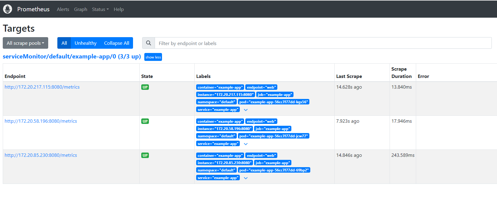
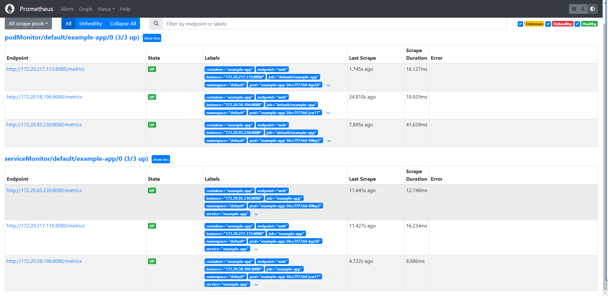
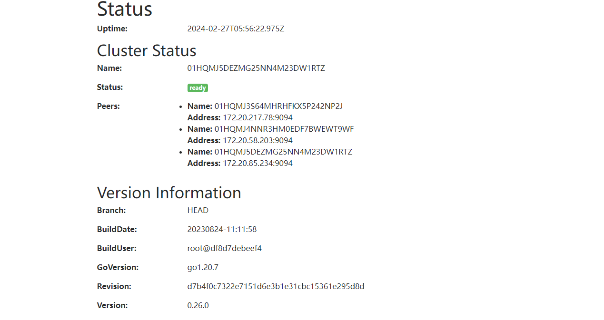
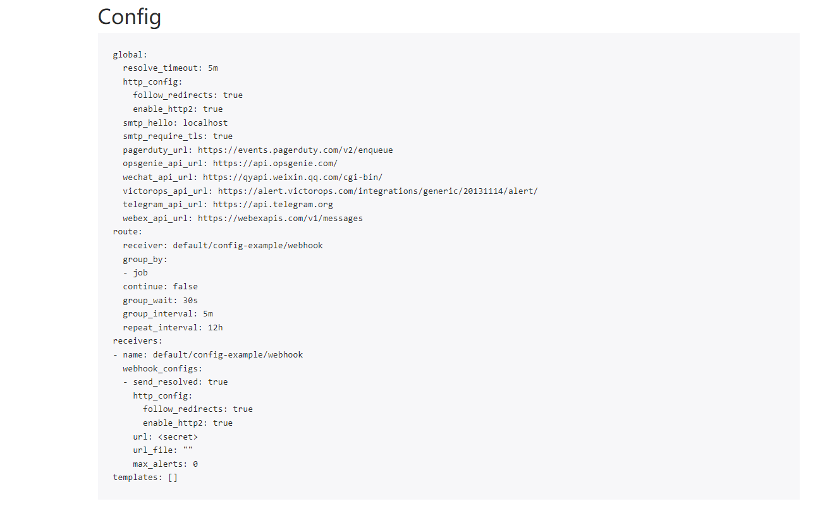
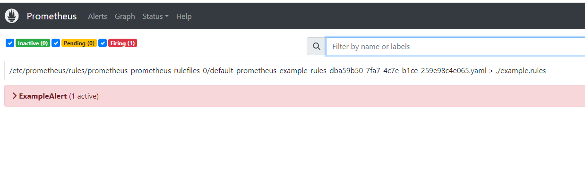

# Prometheus Operator


[Documents](https://prometheus-operator.dev/docs/user-guides)


## 安装


### 安装Prometheus Operator

```bash
# method 1
LATEST=$(curl -s https://api.github.com/repos/prometheus-operator/prometheus-operator/releases/latest | jq -cr .tag_name)
curl -sL https://github.com/prometheus-operator/prometheus-operator/releases/download/${LATEST}/bundle.yaml | kubectl create -f -

# method 2
root@ansible:~/k8s/prometheus# curl -OL https://github.com/prometheus-operator/prometheus-operator/releases/download/v0.71.2/bundle.yaml
root@ansible:~/k8s/prometheus# mv bundle.yaml prometheus-operator-bundle.yaml
root@ansible:~/k8s/prometheus# kubectl create ns monitoring
root@ansible:~/k8s/prometheus# grep -i '  namespace: ' prometheus-operator-bundle.yaml
  namespace: default
  namespace: default
  namespace: default
  namespace: default
root@ansible:~/k8s/prometheus# sed -i 's/  namespace: default/  namespace: monitoring/g' prometheus-operator-bundle.yaml
root@ansible:~/k8s/prometheus# grep -i '  namespace: ' prometheus-operator-bundle.yaml
  namespace: monitoring
  namespace: monitoring
  namespace: monitoring
  namespace: monitoring
root@ansible:~/k8s/prometheus# kubectl -n monitoring create -f prometheus-operator-bundle.yaml
root@ansible:~/k8s/prometheus# kubectl api-resources | grep monitoring.coreos.com
alertmanagerconfigs               amcfg              monitoring.coreos.com/v1alpha1         true         AlertmanagerConfig
alertmanagers                     am                 monitoring.coreos.com/v1               true         Alertmanager
podmonitors                       pmon               monitoring.coreos.com/v1               true         PodMonitor
probes                            prb                monitoring.coreos.com/v1               true         Probe
prometheusagents                  promagent          monitoring.coreos.com/v1alpha1         true         PrometheusAgent
prometheuses                      prom               monitoring.coreos.com/v1               true         Prometheus
prometheusrules                   promrule           monitoring.coreos.com/v1               true         PrometheusRule
scrapeconfigs                     scfg               monitoring.coreos.com/v1alpha1         true         ScrapeConfig
servicemonitors                   smon               monitoring.coreos.com/v1               true         ServiceMonitor
thanosrulers                      ruler              monitoring.coreos.com/v1               true         ThanosRuler

```


### 查看安装状态

```bash
# 查看特定标签的pod，当状态为Ready后则停止watch
root@ansible:~# kubectl wait --for=condition=Ready pods -l  app.kubernetes.io/name=prometheus-operator -n monitoring
pod/prometheus-operator-779b6db695-wjqpq condition met

```


## 部署测试app


### 部署测试deployment

用于侦听并公开8080端口上的指标
```bash
root@ansible:~/k8s/prometheus/prometheus-operator# cat example-app.yaml
apiVersion: apps/v1
kind: Deployment
metadata:
  name: example-app
spec:
  replicas: 3
  selector:
    matchLabels:
      app: example-app
  template:
    metadata:
      labels:
        app: example-app
    spec:
      containers:
      - name: example-app
        image: fabxc/instrumented_app
        ports:
        - name: web
          containerPort: 8080
---
kind: Service
apiVersion: v1
metadata:
  name: example-app
  labels:
    app: example-app
spec:
  selector:
    app: example-app
  ports:
  - name: web
    port: 8080
---
root@ansible:~/k8s/prometheus/prometheus-operator# kubectl apply -f example-app.yaml
deployment.apps/example-app created
service/example-app created

# 查看8080端口上的指标
root@k8s-master01:~# curl -s 10.68.34.186:8080/metrics | head -n 10
# HELP codelab_api_http_requests_in_progress The current number of API HTTP requests in progress.
# TYPE codelab_api_http_requests_in_progress gauge
codelab_api_http_requests_in_progress 2
# HELP codelab_api_request_duration_seconds A histogram of the API HTTP request durations in seconds.
# TYPE codelab_api_request_duration_seconds histogram
codelab_api_request_duration_seconds_bucket{method="GET",path="/api/bar",status="200",le="0.0001"} 0
codelab_api_request_duration_seconds_bucket{method="GET",path="/api/bar",status="200",le="0.00015000000000000001"} 0
codelab_api_request_duration_seconds_bucket{method="GET",path="/api/bar",status="200",le="0.00022500000000000002"} 0
codelab_api_request_duration_seconds_bucket{method="GET",path="/api/bar",status="200",le="0.0003375"} 0
codelab_api_request_duration_seconds_bucket{method="GET",path="/api/bar",status="200",le="0.00050625"} 0

```


### 创建ServiceMonitor

ServiceMonitor 对象，它选择带有该app: example-app标签的所有 Service 对象。ServiceMonitor 对象还有一个team 标签来标识哪个团队负责监视应用程序/服务。
```bash
root@ansible:~/k8s/prometheus/prometheus-operator# cat service-monitor.yaml
apiVersion: monitoring.coreos.com/v1
kind: ServiceMonitor
metadata:
  name: example-app
  labels:
    team: frontend
spec:
  selector:
    matchLabels:
      app: example-app
  endpoints:
  - port: web
root@ansible:~/k8s/prometheus/prometheus-operator# kubectl apply -f service-monitor.yaml
servicemonitor.monitoring.coreos.com/example-app created

```


## 部署prometheus


### 创建prometheus-operator RBAC

如果您的集群开启了RBAC 授权，您必须先为Prometheus服务帐号创建RBAC规则
```bash
root@ansible:~/k8s/prometheus/prometheus-operator# cat prometheus-operator-rbac.yaml
apiVersion: v1
kind: ServiceAccount
metadata:
  name: prometheus
---
apiVersion: rbac.authorization.k8s.io/v1
kind: ClusterRole
metadata:
  name: prometheus
rules:
- apiGroups: [""]
  resources:
  - nodes
  - nodes/metrics
  - services
  - endpoints
  - pods
  verbs: ["get", "list", "watch"]
- apiGroups: [""]
  resources:
  - configmaps
  verbs: ["get"]
- apiGroups:
  - networking.k8s.io
  resources:
  - ingresses
  verbs: ["get", "list", "watch"]
- nonResourceURLs: ["/metrics"]
  verbs: ["get"]
---
apiVersion: rbac.authorization.k8s.io/v1
kind: ClusterRoleBinding
metadata:
  name: prometheus
roleRef:
  apiGroup: rbac.authorization.k8s.io
  kind: ClusterRole
  name: prometheus
subjects:
- kind: ServiceAccount
  name: prometheus
  namespace: default
---
root@ansible:~/k8s/prometheus/prometheus-operator# kubectl apply -f prometheus-operator-rbac.yaml
serviceaccount/prometheus created
clusterrole.rbac.authorization.k8s.io/prometheus created
clusterrolebinding.rbac.authorization.k8s.io/prometheus created

```


### 创建prometheus


```bash
# 默认情况下，Prometheus 只会从当前命名空间中获取 ServiceMonitors。要从其他命名空间选择ServiceMonitors，您可以更新 spec.serviceMonitorNamespaceSelectorPrometheus资源的字段。
root@ansible:~/k8s/prometheus/prometheus-operator# cat prometheus.yaml
apiVersion: monitoring.coreos.com/v1
kind: Prometheus
metadata:
  name: prometheus
spec:
  serviceAccountName: prometheus
  serviceMonitorSelector:
    matchLabels:
      team: frontend
  resources:
    requests:
      memory: 400Mi
  enableAdminAPI: false
root@ansible:~/k8s/prometheus/prometheus-operator# kubectl apply -f prometheus.yaml
prometheus.monitoring.coreos.com/prometheus created

# 查看实例是否已启动并正在运行
root@ansible:~/k8s/prometheus/prometheus-operator# kubectl get -n default prometheus prometheus
NAME         VERSION   DESIRED   READY   RECONCILED   AVAILABLE   AGE
prometheus                       1       True         True        108s

root@ansible:~/k8s/prometheus/prometheus-operator# kubectl get pods -o wide --show-labels | grep prometheus
prometheus-prometheus-0        2/2     Running   0                 12m   172.20.217.108   192.168.13.63   <none>           <none>            app.kubernetes.io/instance=prometheus,app.kubernetes.io/managed-by=prometheus-operator,app.kubernetes.io/name=prometheus,app.kubernetes.io/version=2.48.1,controller-revision-hash=prometheus-prometheus-66885c679b,operator.prometheus.io/name=prometheus,operator.prometheus.io/shard=0,prometheus=prometheus,statefulset.kubernetes.io/pod-name=prometheus-prometheus-0

root@ansible:~/k8s/prometheus/prometheus-operator# kubectl describe svc prometheus-operated
Name:              prometheus-operated
Namespace:         default
Labels:            managed-by=prometheus-operator
                   operated-prometheus=true
Annotations:       <none>
Selector:          app.kubernetes.io/name=prometheus
Type:              ClusterIP
IP Family Policy:  SingleStack
IP Families:       IPv4
IP:                None
IPs:               None
Port:              web  9090/TCP
TargetPort:        web/TCP
Endpoints:         172.20.217.108:9090
Session Affinity:  None
Events:            <none>
```


### 公开Prometheus服务


```bash
root@ansible:~/k8s/prometheus/prometheus-operator# cat prometheus.yaml
apiVersion: monitoring.coreos.com/v1
kind: Prometheus
metadata:
  name: prometheus
spec:
  serviceAccountName: prometheus
  serviceMonitorSelector:
    matchLabels:
      team: frontend
  resources:
    requests:
      memory: 400Mi
  enableAdminAPI: false
---
apiVersion: v1
kind: Service
metadata:
  name: prometheus	# 增加一个svc
spec:
  type: NodePort
  ports:
  - name: web
    nodePort: 30900
    port: 9090
    protocol: TCP
    targetPort: web
  selector:
    prometheus: prometheus
---
root@ansible:~/k8s/prometheus/prometheus-operator# kubectl apply -f prometheus.yaml
prometheus.monitoring.coreos.com/prometheus unchanged
service/prometheus created
oot@ansible:~/k8s/prometheus/prometheus-operator# kubectl get svc | grep prometheus
prometheus            NodePort    10.68.192.13   <none>        9090:30900/TCP   58s		# 增加的
prometheus-operated   ClusterIP   None           <none>        9090/TCP         41m
```


**访问prometheus服务**




### 公开Prometheus管理API

警告：启用管理 API 会导致端点发生变化、删除数据、关闭 Prometheus 等。启用此功能时应小心谨慎，建议用户通过代理添加额外的身份验证/授权，以确保只有授权执行这些操作的客户端才能执行此操作

```bash
root@ansible:~/k8s/prometheus/prometheus-operator# cat prometheus.yaml
apiVersion: monitoring.coreos.com/v1
kind: Prometheus
metadata:
  name: prometheus
spec:
  serviceAccountName: prometheus
  serviceMonitorSelector:
    matchLabels:
      team: frontend
  resources:
    requests:
      memory: 400Mi
  enableAdminAPI: true		# 开启管理API
---
apiVersion: v1
kind: Service
metadata:
  name: prometheus
spec:
  type: NodePort
  ports:
  - name: web
    nodePort: 30900
    port: 9090
    protocol: TCP
    targetPort: web
  selector:
    prometheus: prometheus
---
root@ansible:~/k8s/prometheus/prometheus-operator# kubectl apply -f prometheus.yaml

root@ansible:~/k8s/prometheus/prometheus-operator# kubectl get pods | grep prometheus
prometheus-prometheus-0        2/2     Terminating   0                 45m
root@ansible:~/k8s/prometheus/prometheus-operator# kubectl get pods | grep prometheus
prometheus-prometheus-0        2/2     Running   0                 38s

```


### 使用PodMonitor

创建PodMonitor


```bash
root@ansible:~/k8s/prometheus/prometheus-operator# cat pod-monitor.yaml
apiVersion: monitoring.coreos.com/v1
kind: PodMonitor
metadata:
  name: example-app
  labels:
    team: frontend
spec:
  selector:
    matchLabels:
      app: example-app
  podMetricsEndpoints:
  - port: web
---

root@ansible:~/k8s/prometheus/prometheus-operator# kubectl apply -f pod-monitor.yaml
podmonitor.monitoring.coreos.com/example-app created
root@ansible:~/k8s/prometheus/prometheus-operator# kubectl get PodMonitor
NAME          AGE
example-app   6s

```


配置prometheus关联PodMonitor

```bash
root@ansible:~/k8s/prometheus/prometheus-operator# cat prometheus.yaml
apiVersion: monitoring.coreos.com/v1
kind: Prometheus
metadata:
  name: prometheus
spec:
  serviceAccountName: prometheus
  serviceMonitorSelector:
    matchLabels:
      team: frontend
  podMonitorSelector:
    matchLabels:
      team: frontend
  resources:
    requests:
      memory: 400Mi
  enableAdminAPI: true
---
apiVersion: v1
kind: Service
metadata:
  name: prometheus
spec:
  type: NodePort
  ports:
  - name: web
    nodePort: 30900
    port: 9090
    protocol: TCP
    targetPort: web
  selector:
    prometheus: prometheus

root@ansible:~/k8s/prometheus/prometheus-operator# kubectl apply -f prometheus.yaml
prometheus.monitoring.coreos.com/prometheus configured
service/prometheus unchanged
# 配置
root@ansible:~/k8s/prometheus/prometheus-operator# kubectl get pods | grep prometheus
prometheus-prometheus-0        2/2     Running   0                 20m

```




## 部署alertmanager


### 创建alertmanager

创建一个包含三个副本的 Alertmanager 集群

```bash
root@ansible:~/k8s/prometheus/prometheus-operator# cat alertmanager-server.yaml
apiVersion: monitoring.coreos.com/v1
kind: Alertmanager
metadata:
  name: example
spec:
  replicas: 3
root@ansible:~/k8s/prometheus/prometheus-operator# kubectl apply -f alertmanager-server.yaml
alertmanager.monitoring.coreos.com/example created
root@ansible:~/k8s/prometheus/prometheus-operator# kubectl get pods -l alertmanager=example -w
NAME                     READY   STATUS     RESTARTS   AGE
alertmanager-example-0   0/2     Init:0/1   0          4s
alertmanager-example-1   0/2     Init:0/1   0          4s
alertmanager-example-2   0/2     Init:0/1   0          3s
alertmanager-example-0   0/2     Init:0/1   0          7s
alertmanager-example-0   0/2     PodInitializing   0          16s
alertmanager-example-1   0/2     Init:0/1          0          32s
alertmanager-example-0   1/2     Running           0          33s
alertmanager-example-0   2/2     Running           0          35s
alertmanager-example-1   0/2     PodInitializing   0          39s
alertmanager-example-2   0/2     Init:0/1          0          45s
alertmanager-example-1   1/2     Running           0          63s
alertmanager-example-1   2/2     Running           0          65s
alertmanager-example-2   0/2     PodInitializing   0          65s
alertmanager-example-2   1/2     Running           0          90s
alertmanager-example-2   2/2     Running           0          91s

```


### 管理Alertmanager配置

默认情况下，Alertmanager 实例将以最小配置启动，但该配置并不真正有用，因为它在接收警报时不会发送任何通知。

您有多种选项来提供[Alertmanager 配置](https://prometheus.io/docs/alerting/configuration/)：

1. 您可以使用存储在 Kubernetes Secret中的本机 Alertmanager 配置文件。
2. 您可以用来`spec.alertmanagerConfiguration`引用同一命名空间中的 AlertmanagerConfig 对象，该对象定义了主要的 Alertmanager 配置。
3. 您可以定义`spec.alertmanagerConfigSelector`并用 `spec.alertmanagerConfigNamespaceSelector`告诉Operator应选择哪些 AlertmanagerConfigs 对象并将其与主 Alertmanager 配置合并。


#### 使用 Kubernetes Secret

本机 Alertmanager 配置将通知发送到虚构的 Webhook 服务：

```bash
root@ansible:~/k8s/prometheus/prometheus-operator# cat alertmanager-config.yaml
route:
  group_by: ['job']
  group_wait: 30s
  group_interval: 5m
  repeat_interval: 12h
  receiver: 'webhook'
receivers:
- name: 'webhook'
  webhook_configs:
  - url: 'http://example.com/'
root@ansible:~/k8s/prometheus/prometheus-operator# kubectl create secret generic alertmanager-example --from-file=alertmanager.yaml
secret/alertmanager-example created
root@ansible:~/k8s/prometheus/prometheus-operator# kubectl describe secret alertmanager-example
Name:         alertmanager-example
Namespace:    default
Labels:       <none>
Annotations:  <none>

Type:  Opaque

Data
====
alertmanager.yaml:  190 bytes
```

Prometheus Operator要求 Secret 的命名类似于 `alertmanager-{ALERTMANAGER_NAME}`，在前面的示例中，Alertmanager 的名称是`example`，因此机密名称必须是`alertmanager-example`。Secret 中保存配置数据的密钥名称必须是 `alertmanager.yaml`。

> 注意：如果您想使用不同的密钥名称，可以使用`spec.configSecret`Alertmanager 资源中的字段指定它。


Alertmanager 配置可能会引用磁盘上的自定义模板或密码文件。这些可以与配置文件一起添加到 Secret 中`alertmanager.yaml` 。例如，假设我们有以下 Secret：

```yaml
apiVersion: v1
kind: Secret
metadata:
  name: alertmanager-example
data:
  alertmanager.yaml: {BASE64_CONFIG}
  template_1.tmpl: {BASE64_TEMPLATE_1}
  template_2.tmpl: {BASE64_TEMPLATE_2}
```

该目录下的 Alertmanager 容器可以访问模板 `/etc/alertmanager/config`。Alertmanager 配置可以像这样引用它们：

```yaml
templates:
- '/etc/alertmanager/config/*.tmpl'
```


#### 使用AlertmanagerConfig资源

创建一个 AlertmanagerConfig 资源，该资源将通知发送到虚构的 Webhook 服务。

```bash
root@ansible:~/k8s/prometheus/prometheus-operator# cat alertmanager-config-example.yaml
apiVersion: monitoring.coreos.com/v1alpha1
kind: AlertmanagerConfig
metadata:
  name: config-example
  labels:
    alertmanagerConfig: example
spec:
  route:
    groupBy: ['job']
    groupWait: 30s
    groupInterval: 5m
    repeatInterval: 12h
    receiver: 'webhook'
  receivers:
  - name: 'webhook'
    webhookConfigs:
    - url: 'http://example.com/'
root@ansible:~/k8s/prometheus/prometheus-operator# kubectl apply -f alertmanager-config-example.yaml
alertmanagerconfig.monitoring.coreos.com/config-example created
```

`spec.alertmanagerConfigSelector`需要更新 Alertmanager 资源中的字段，以便操作员选择 AlertmanagerConfig 资源。在前面的示例中，添加了标签`alertmanagerConfig: example`，因此 Alertmanager 对象应该像这样更新：

```bash
root@ansible:~/k8s/prometheus/prometheus-operator# cat alertmanager-server.yaml
apiVersion: monitoring.coreos.com/v1
kind: Alertmanager
metadata:
  name: example
spec:
  replicas: 3
  alertmanagerConfigSelector:
    matchLabels:
      alertmanagerConfig: example
root@ansible:~/k8s/prometheus/prometheus-operator# kubectl apply -f alertmanager-server.yaml
alertmanager.monitoring.coreos.com/example configured
# 应用配置并不会重启Pod
root@ansible:~/k8s/prometheus/prometheus-operator# kubectl get pods | grep alertmanager
alertmanager-example-0         2/2     Running   0                 164m
alertmanager-example-1         2/2     Running   0                 164m
alertmanager-example-2         2/2     Running   0                 164m

```


#### 使用AlertmanagerConfig进行全局配置

创建一个 Alertmanager 资源，该资源使用要用于 Alertmanager 配置的 AlertmanagerConfig 资源而不是Secret `alertmanager-example`

```bash
root@ansible:~/k8s/prometheus/prometheus-operator# cat alertmanager-server.yaml
apiVersion: monitoring.coreos.com/v1
kind: Alertmanager
metadata:
  name: example
spec:
  replicas: 3
  #alertmanagerConfigSelector:
  #  matchLabels:
  #    alertmanagerConfig: example
  alertmanagerConfiguration:
    name: config-example
root@ansible:~/k8s/prometheus/prometheus-operator# kubectl apply -f alertmanager-server.yaml
alertmanager.monitoring.coreos.com/example configured
```

```default` 命名空间中命名的 example-config AlertmanagerConfig 资源将是全局 AlertmanagerConfig。当Operator从中生成 Alertmanager 配置时，不会对路由和禁止规则强制使用名称空间标签。


### 公开Alertmanager服务

创建服务后，Alertmanager Web 服务器即可在节点 IP 地址的端口 下使用`30903`。

```bash
root@ansible:~/k8s/prometheus/prometheus-operator# kubectl get pods --show-labels | grep alertmanager
alertmanager-example-0         2/2     Running   0                 177m    alertmanager=example,app.kubernetes.io/instance=example,app.kubernetes.io/managed-by=prometheus-operator,app.kubernetes.io/name=alertmanager,app.kubernetes.io/version=0.26.0,controller-revision-hash=alertmanager-example-6df57c7fcd,statefulset.kubernetes.io/pod-name=alertmanager-example-0
alertmanager-example-1         2/2     Running   0                 177m    alertmanager=example,app.kubernetes.io/instance=example,app.kubernetes.io/managed-by=prometheus-operator,app.kubernetes.io/name=alertmanager,app.kubernetes.io/version=0.26.0,controller-revision-hash=alertmanager-example-6df57c7fcd,statefulset.kubernetes.io/pod-name=alertmanager-example-1
alertmanager-example-2         2/2     Running   0                 177m    alertmanager=example,app.kubernetes.io/instance=example,app.kubernetes.io/managed-by=prometheus-operator,app.kubernetes.io/name=alertmanager,app.kubernetes.io/version=0.26.0,controller-revision-hash=alertmanager-example-6df57c7fcd,statefulset.kubernetes.io/pod-name=alertmanager-example-2
root@ansible:~/k8s/prometheus/prometheus-operator# cat alertmanager-server.yaml
apiVersion: monitoring.coreos.com/v1
kind: Alertmanager
metadata:
  name: example
spec:
  replicas: 3
  #alertmanagerConfigSelector:
  #  matchLabels:
  #    alertmanagerConfig: example
  alertmanagerConfiguration:
    name: config-example
---
apiVersion: v1
kind: Service
metadata:
  name: alertmanager-example
spec:
  type: NodePort
  ports:
  - name: web
    nodePort: 30903
    port: 9093
    protocol: TCP
    targetPort: web
  selector:
    alertmanager: example
---
root@ansible:~/k8s/prometheus/prometheus-operator# kubectl apply -f alertmanager-server.yaml
alertmanager.monitoring.coreos.com/example unchanged
service/alertmanager-example created
```






## Prometheus与Alertmanager集成

创建一个 Prometheus 实例，它将向 Alertmanger 集群发送警报，并将prometheus副本扩展为2

```bash
root@ansible:~/k8s/prometheus/prometheus-operator# cat prometheus.yaml
apiVersion: monitoring.coreos.com/v1
kind: Prometheus
metadata:
  name: prometheus
spec:
  serviceAccountName: prometheus
  replicas: 2
  alerting:
    alertmanagers:
    - namespace: default
      name: alertmanager-example
      port: web
  serviceMonitorSelector:
    matchLabels:
      team: frontend
  podMonitorSelector:
    matchLabels:
      team: frontend
  resources:
    requests:
      memory: 400Mi
  enableAdminAPI: true
---
apiVersion: v1
kind: Service
metadata:
  name: prometheus
spec:
  type: NodePort
  ports:
  - name: web
    nodePort: 30900
    port: 9090
    protocol: TCP
    targetPort: web
  selector:
    prometheus: prometheus
---
root@ansible:~/k8s/prometheus/prometheus-operator# kubectl apply -f prometheus.yaml
prometheus.monitoring.coreos.com/prometheus configured
service/prometheus unchanged
```

该`Prometheus`资源会发现之前创建的所有 Alertmanager 实例`Service`（注意`name`、`namespace`和`port` 字段应与 Alertmanager 服务的定义相匹配）。

打开Prometheus Web界面，进入“Status > Runtime & Build Information”页面，检查Prometheus是否发现了3个Alertmanager实例。


## 部署Prometheus规则

CRD`PrometheusRule`允许定义警报和记录规则。操作员根据字段`spec.ruleSelector`知道 Prometheus 选择哪些 PrometheusRule 对象。

> 注意：默认情况下，`spec.ruleSelector`为零意味着操作员不选择任何规则。

默认情况下，Prometheus 资源仅发现同一命名空间中的`PrometheusRule`资源。这可以通过该`ruleNamespaceSelector`字段进行细化：

- 要发现所有命名空间中的规则，请传递一个空字典 ( `ruleNamespaceSelector: {}`)。
- 要从与特定标签匹配的所有命名空间中发现规则，请使用该`matchLabels`字段。

使用标签`team=frontend`关联特定命名空间、使用标签 `prometheus=example`和`role=alert-rules`关联特定PrometheusRule资源

```bash
root@ansible:~/k8s/prometheus/prometheus-operator# cat prometheus.yaml
apiVersion: monitoring.coreos.com/v1
kind: Prometheus
metadata:
  name: prometheus
spec:
  serviceAccountName: prometheus
  replicas: 2
  alerting:
    alertmanagers:
    - namespace: default
      name: alertmanager-example
      port: web
  serviceMonitorSelector:
    matchLabels:
      team: frontend
  podMonitorSelector:
    matchLabels:
      team: frontend
  resources:
    requests:
      memory: 400Mi
  enableAdminAPI: true
  ruleSelector:
    matchLabels:
      role: alert-rules
      prometheus: example
  ruleNamespaceSelector:
    matchLabels:
      team: frontend
---
apiVersion: v1
kind: Service
metadata:
  name: prometheus
spec:
  type: NodePort
  ports:
  - name: web
    nodePort: 30900
    port: 9090
    protocol: TCP
    targetPort: web
  selector:
    prometheus: prometheus
---
root@ansible:~/k8s/prometheus/prometheus-operator# kubectl apply -f prometheus.yaml
prometheus.monitoring.coreos.com/prometheus configured
service/prometheus unchanged
```

如果您想按名称选择单个命名空间，您可以使用标签 `kubernetes.io/metadata.name`，该标签会自动填充 [`NamespaceDefaultLabelName`](https://kubernetes.io/docs/reference/labels-annotations-taints/#kubernetes-io-metadata-name) 。

从以下清单创建 PrometheusRule 对象。请注意，该对象的标签与`spec.ruleSelector`Prometheus 对象的标签相匹配。

```bash
root@ansible:~/k8s/prometheus/prometheus-operator# cat prometheus-rule.yaml
apiVersion: monitoring.coreos.com/v1
kind: PrometheusRule
metadata:
  creationTimestamp: null
  labels:
    prometheus: example
    role: alert-rules
  name: prometheus-example-rules
spec:
  groups:
  - name: ./example.rules
    rules:
    - alert: ExampleAlert
      expr: vector(1)
root@ansible:~/k8s/prometheus/prometheus-operator# kubectl apply -f prometheus-rule.yaml
prometheusrule.monitoring.coreos.com/prometheus-example-rules created
# 结default名称空间打上标签，使PrometheusRule被Prometheus的ruleNamespaceSelector选中
root@ansible:~/k8s/prometheus/prometheus-operator# kubectl label ns default team=frontend
namespace/default labeled

```

出于测试目的，PrometheusRule 对象始终触发警报 `ExampleAlert`




## Prometheus Agent 

Prometheus Agent 是一种针对所有收集的数据都转发（远程写）到长期存储解决方案（例如 Cortex、Thanos 或 Prometheus）的环境进行优化的部署模型。


## ScrapeConfig CRD

从 prometheus-operator v0.65.x 开始，可以使用CRD 来抓取 Kubernetes 集群外部的目标。

> 先决条件
>
> * `prometheus-operator` `>v0.65.1`
> * `ScrapeConfig`CRD 安装在集群中。确保在创建/更新 CRD 后（重新）启动Prometheus Operator


### 配置 Prometheus 或 PrometheusAgent 选择 ScrapeConfigs

Prometheus 和 PrometheusAgent CRD 都有一个`scrapeConfigSelector`字段。该字段需要设置为要匹配的标签列表`ScrapeConfigs`：

```yaml
spec:
  scrapeConfigSelector:
    prometheus: system-monitoring-prometheus
```

在此示例中，所有`ScrapeConfig`具有`prometheus`标签设置的内容`system-monitoring-prometheus`都将用于生成抓取配置。


### 使用ScrapeConfig抓取外部目标

`ScrapeConfig`目前支持一组有限的服务发现：

- `static_config`
- `file_sd`
- `http_sd`
- `kubernetes_sd`
- `consul_sd`


#### `static_config`

例如，要抓取位于 的目标`http://prometheus.demo.do.prometheus.io:9090`，请使用以下命令：

```yaml
apiVersion: monitoring.coreos.com/v1alpha1
kind: ScrapeConfig
metadata:
  name: static-config
  namespace: my-namespace
  labels:
    prometheus: system-monitoring-prometheus
spec:
  staticConfigs:
    - labels:
        job: prometheus
      targets:
        - prometheus.demo.do.prometheus.io:9090
```


#### `file_sd` 

要使用`file_sd`，必须将文件安装在 Prometheus 或 PrometheusAgent pod 中。以下configmap是一个服务发现文件：

```yaml
apiVersion: v1
kind: ConfigMap
metadata:
  name: scrape-file-sd-targets
  namespace: monitoring
  labels:
    prometheus: system-monitoring-prometheus
data:
  targets.yaml: |
    - labels:
        job: node-demo
      targets:
      - node.demo.do.prometheus.io:9100
    - labels:
        job: prometheus
      targets:
      - prometheus.demo.do.prometheus.io:9090    
```

`ConfigMap`然后需要将其安装在`Prometheus`规范中：

```yaml
apiVersion: monitoring.coreos.com/v1
kind: Prometheus
metadata:
  name: your-prometheus
  namespace: my-namespace
  labels:
    prometheus: system-monitoring-prometheus
spec:
  scrapeConfigSelector:
    prometheus: system-monitoring-prometheus
  configMaps:
    - scrape-file-sd-targets
```

然后，您可以使用 ScrapeConfig 引用该文件并抓取关联的目标：

```yaml
apiVersion: monitoring.coreos.com/v1alpha1
kind: ScrapeConfig
metadata:
  name: file-sd
  namespace: my-namespace
  labels:
    prometheus: system-monitoring-prometheus
    app.kubernetes.io/name: scrape-config-example
spec:
  fileSDConfigs:
    - files:
        - /etc/prometheus/configmaps/scrape-file-sd-targets/targets.yaml
```


## `http_sd` 

`http_sd`工作方式与`file_sd`相同，但需要一个端点提供该数据而不是文件。例如：

```yaml
apiVersion: monitoring.coreos.com/v1alpha1
kind: ScrapeConfig
metadata:
  name: http-sd
  namespace: my-namespace
  labels:
    prometheus: system-monitoring-prometheus
    app.kubernetes.io/name: scrape-config-example
spec:
  httpSDConfigs:
    - url: http://my-external-api/discovery
      refreshInterval: 15s
```