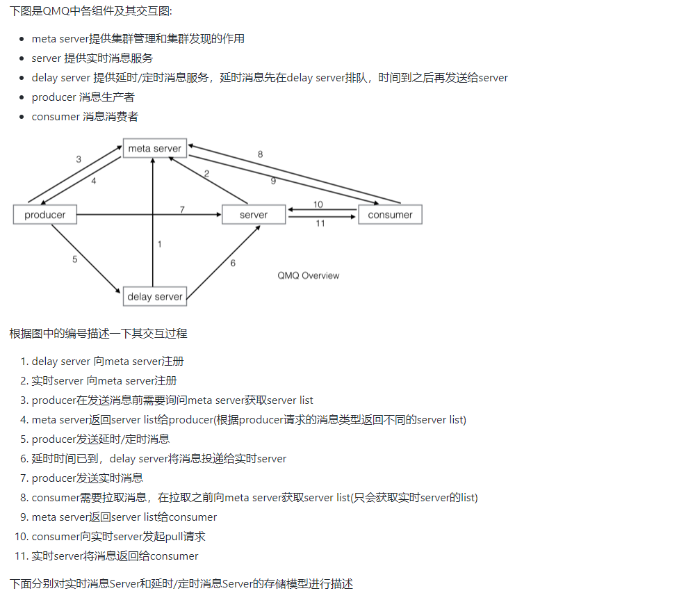
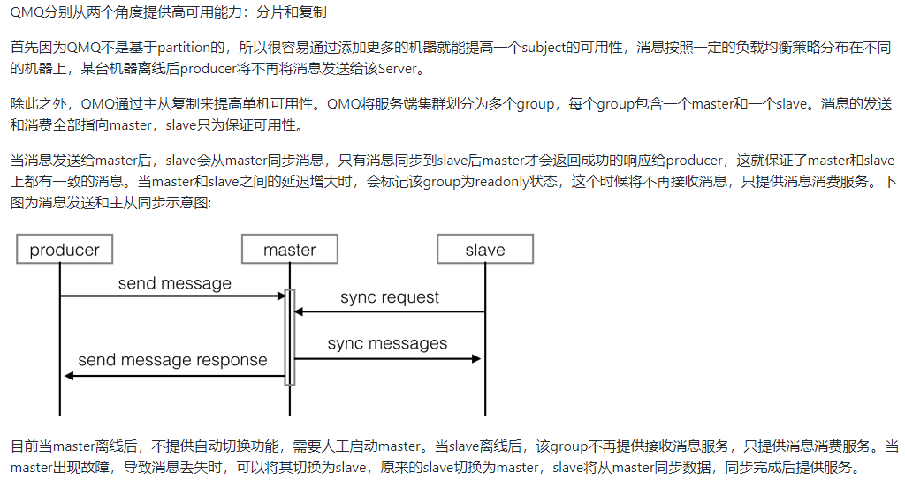
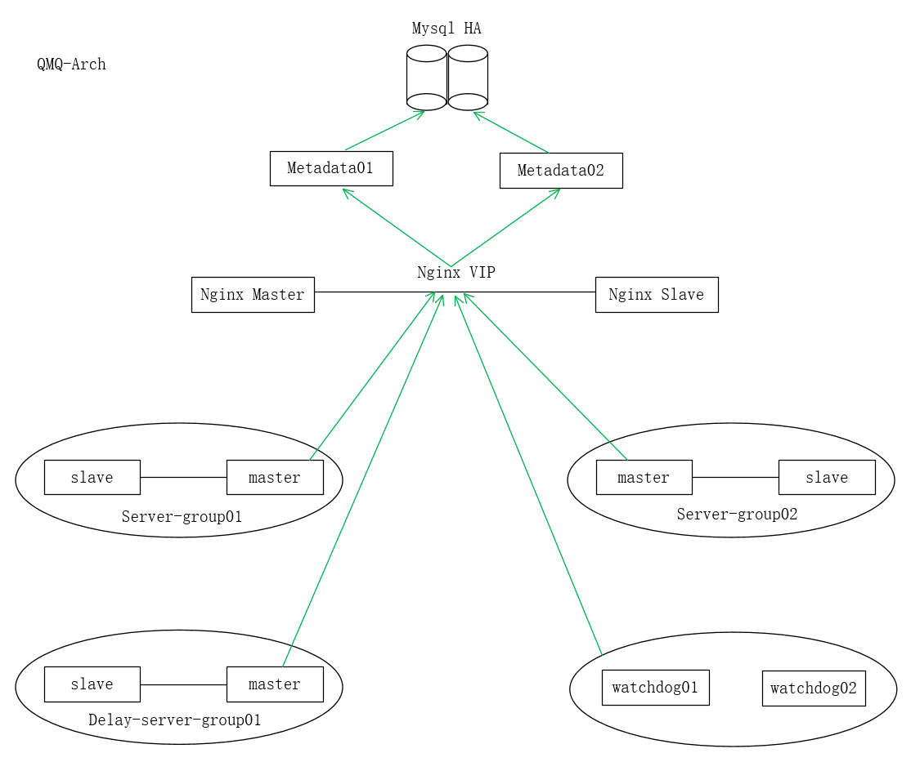

# QMP消息队列
QMQ是去哪儿网内部广泛使用的消息中间件，自2012年诞生以来在去哪儿网所有业务场景中广泛的应用，包括跟交易息息相关的订单场景； 也包括报价搜索等高吞吐量场景。目前在公司内部日常消息qps在60W左右，生产上承载将近4W+消息topic，消息的端到端延迟可以控制在10ms以内。

主要提供以下特性：

* 异步实时消息
* 延迟/定时消息(支持任意秒级)
* 广播消息(每个Consumer都收到相同消息，比如本地cache更新)
* 基于Tag的服务端过滤
* Consumer端幂等处理支持
* Consumer端filter
* 消费端支持按条ack消息
* 死信消息
* 结合Spring annotation使用的简单API
* 提供丰富的监控指标
* 接入OpenTracing
* 事务消息
* Consumer的处理能力也可以方便扩容缩容
* Server可以随心所欲扩容缩容
* Java Client, .NET Client
* 读写分离
* 消息投递轨迹
* 历史消息的自动备份
* 有序消息(即将开源)

### JDK最低版本要求

----

* Client: 1.7及其以上版本

- Server: 1.8及其以上版本

### Maven

---

qmq的客户端已经发布到maven中央仓库，可以通过下面的方式获取

```
<dependency>
    <groupId>com.qunar.qmq</groupId>
    <artifactId>qmq</artifactId>
    <version>{see maven}</version>
</dependency>
```


### 安装

#### QMQ HA架构

---







#### 最小化部署

---

为了可用性建议按照如下配置进行最小化部署

* metaserver
  * 部署两台应用，然后配置nginx作为负载均衡。metaserver依赖mysql，请确保mysql的可用性，但metaserver运行时不强依赖mysql，如果mysql故障，只会影响新上线的消息主题和新上线的消费者，对已有的无影响。

* broker
  * 部署两组，每组为一主一从两台，则至少部署4台
* delay server
  * 同broker部署方式(如没有延时消息可以不部署)
* watchdog
  * 建议部署两台，但某个时刻只有一台工作，当一台故障会自动切换(如无事务或持久化消息可以不部署)
* backup server(最小化部署可不用部署，依赖hbase)
  * 负责消息内容、消费轨迹、死信消息的备份及查询功能。

规划：

qmq-server01:  metaserver01、broker01、broker03、delay01、watchdog01

qmq-server02:  metaserver02、broker02、broker04、delay02、watchdog02

broker01、broker02(qmq_group01)

broker03、broker04(qmq_group02)




#### 1.1 Linux配置

---

环境：

```
### qmq-server01
root@qmq-server01:/usr/local# cat /etc/issue
Ubuntu 18.04.5 LTS \n \l
root@qmq-server01:~# ip a s eth0
2: eth0: <BROADCAST,MULTICAST,UP,LOWER_UP> mtu 1500 qdisc fq_codel state UP group default qlen 1000
    link/ether 00:0c:29:6d:e5:57 brd ff:ff:ff:ff:ff:ff
    inet 172.168.2.27/24 brd 172.168.2.255 scope global eth0
       valid_lft forever preferred_lft forever
    inet6 fe80::20c:29ff:fe6d:e557/64 scope link
       valid_lft forever preferred_lft forever
root@qmq-server01:~# cat /etc/security/limits.conf | grep nofile
#        - nofile - max number of open files
*       soft        nofile  655350
*       hard        nofile  655350
root        soft        nofile  655350
root        hard        nofile  655350
root@qmq-server01:~# ulimit -n 655350
root@qmq-server01:~# cat /etc/sysctl.d/90-qmq.conf
vm.max_map_count = 262144
root@qmq-server01:~# sysctl --system &> /dev/null
root@qmq-server01:~# sysctl -a | grep vm.max_map_count
vm.max_map_count = 262144
root@qmq-server01:/usr/local/qmq-metaserver/conf# cat /etc/hosts
172.168.2.27    qmq-server01
172.168.2.28    qmq-server02


### qmq-server02
root@qmq-server02:/usr/local/qmq-dist# cat /etc/issue
Ubuntu 18.04.5 LTS \n \l

root@qmq-server02:~# ip a s eth0
2: eth0: <BROADCAST,MULTICAST,UP,LOWER_UP> mtu 1500 qdisc fq_codel state UP group default qlen 1000
    link/ether 00:0c:29:f8:c8:91 brd ff:ff:ff:ff:ff:ff
    inet 172.168.2.28/24 brd 172.168.2.255 scope global eth0
       valid_lft forever preferred_lft forever
root@qmq-server02:~# cat /etc/security/limits.conf | grep nofile
#        - nofile - max number of open files
*       soft        nofile  655350
*       hard        nofile  655350
root        soft        nofile  655350
root        hard        nofile  655350
root@qmq-server02:~# ulimit -n 655350
root@qmq-server02:~# cat /etc/sysctl.d/90-qmq.conf
vm.max_map_count = 262144
root@qmq-server02:~# sysctl --system &> /dev/null
root@qmq-server02:~# sysctl -a | grep vm.max_map_count
vm.max_map_count = 262144
root@qmq-server02:/usr/local/qmq-metaserver/conf# cat /etc/hosts
172.168.2.27    qmq-server01
172.168.2.28    qmq-server02

```


#### 1.2 下载

---

推荐直接下载编译好的文件来运行应用

```
### qmq-server01
root@qmq-server01:/usr/local/src# wget https://github.com/qunarcorp/qmq/releases/download/v1.1.3.5/qmq-dist-1.1.3.5-bin.tar.gz
root@qmq-server01:/usr/local/src# tar xf qmq-dist-1.1.3.5-bin.tar.gz -C .
root@qmq-server01:/usr/local/src# mv qmq-dist-1.1.3.5-bin ../qmq-dist
root@qmq-server01:/usr/local/src# cd ..
root@qmq-server01:/usr/local/qmq-dist# ls -l
total 4
drwxr-xr-x 2 root root  329 Jan  7  2019 bin
drwxr-xr-x 2 root root  220 Jan  2  2019 conf
drwxr-xr-x 2 root root 4096 Nov 17 16:44 lib
drwxr-xr-x 2 root root   45 Jan  7  2019 sql

### qmq-server02
root@qmq-server01:/usr/local# scp -r qmq-dist/ root@172.168.2.28:/usr/local/
root@qmq-server02:~# cd /usr/local/qmq-dist/
root@qmq-server02:/usr/local/qmq-dist# ls -l
total 4
drwxr-xr-x 2 root root  329 Nov 17 17:10 bin
drwxr-xr-x 2 root root  220 Nov 17 17:10 conf
drwxr-xr-x 2 root root 4096 Nov 17 17:10 lib
drwxr-xr-x 2 root root   45 Nov 17 17:10 sql
```

安装jdk，server版本最低为JDK 1.8（openjdk11不能用）

```
### qmq-server01
root@qmq-server01:/usr/local/src# wget https://repo.huaweicloud.com/java/jdk/8u202-b08/jdk-8u202-linux-x64.tar.gz
root@qmq-server01:/usr/local/src# ls
jdk-8u202-linux-x64.tar.gz  qmq-dist-1.1.3.5-bin.tar.gz
root@qmq-server01:/usr/local/src# tar xf jdk-8u202-linux-x64.tar.gz -C /usr/local/
root@qmq-server01:/usr/local/src# ln -sv /usr/local/jdk1.8.0_202/ /usr/local/jdk
'/usr/local/jdk' -> '/usr/local/jdk1.8.0_202/'
root@qmq-server01:/usr/local/src# cat >> /etc/profile.d/jdk.sh << EOF
#!/bin/sh
export PATH=$PATH:/usr/local/jdk/bin
EOF
root@qmq-server01:/usr/local/src# source /etc/profile
root@qmq-server01:/usr/local/src# java -version
java version "1.8.0_202"
Java(TM) SE Runtime Environment (build 1.8.0_202-b08)
Java HotSpot(TM) 64-Bit Server VM (build 25.202-b08, mixed mode)

### qmq-server02
root@qmq-server01:/usr/local/qmq-metaserver/conf# scp /usr/local/src/jdk-8u202-linux-x64.tar.gz root@172.168.2.28:/usr/local/src/
root@qmq-server02:/usr/local/src# tar xf jdk-8u202-linux-x64.tar.gz -C /usr/local/
root@qmq-server02:/usr/local/src# ln -sv /usr/local/jdk1.8.0_202/ /usr/local/jdk
'/usr/local/jdk' -> '/usr/local/jdk1.8.0_202/'
root@qmq-server02:/usr/local/src# cat >> /etc/profile.d/jdk.sh << EOF
#!/bin/sh
export PATH=$PATH:/usr/local/jdk/bin
EOF
root@qmq-server02:/usr/local/src# source /etc/profile
root@qmq-server02:/usr/local/src# java -version
java version "1.8.0_202"
Java(TM) SE Runtime Environment (build 1.8.0_202-b08)
Java HotSpot(TM) 64-Bit Server VM (build 25.202-b08, mixed mode)
```


#### 1.3 JVM基本配置

---

分别在metaserver-env.sh, broker-env.sh, delay-env.sh, watchdog-env.sh, backup-env.sh里的JAVA_OPTS里配置JVM相关参数，GC日志相关参数已经配置。

- MetaServer最低-Xmx1G -Xms1G、最佳-Xmx2G -Xms2G
- broker最低-Xmx2G -Xms2G、最佳-Xms8G -Xms8G
- delay-server最低-Xmx2G -Xms2G、最佳-Xmx8G -Xms8G
- watchdog最低-Xmx1G -Xms1G、最佳-Xmx2G -Xms2G
- BackupServer最低-Xmx2G -Xms2G、最佳-Xmx4G -Xms4G（最小化部署时不部署）

```
### qmq-server01
root@qmq-server01:/usr/local/qmq-dist# cat bin/metaserver-env.sh
#!/usr/bin/env bash
set -euo pipefail
JAVA_HOME=""
JAVA_OPTS="-Xms512m -Xmx512m"

root@qmq-server:/usr/local/qmq-dist# cat bin/broker-env.sh
#!/usr/bin/env bash
set -euo pipefail
JAVA_HOME=""
JAVA_OPTS="-Xms512m -Xmx512m"

root@qmq-server:/usr/local/qmq-dist# cat bin/delay-env.sh
#!/usr/bin/env bash
set -euo pipefail
JAVA_HOME=""
JAVA_OPTS="-Xms512m -Xmx512m"

root@qmq-server:/usr/local/qmq-dist# cat bin/watchdog-env.sh
#!/usr/bin/env bash
set -euo pipefail
JAVA_HOME=""
JAVA_OPTS="-Xms512m -Xmx512m"


### qmq-server02

root@qmq-server02:/usr/local/qmq-dist# cat bin/metaserver-env.sh
#!/usr/bin/env bash
set -euo pipefail
JAVA_HOME=""
JAVA_OPTS="-Xms512m -Xmx512m"

root@qmq-server02:/usr/local/qmq-dist# cat bin/broker-env.sh
#!/usr/bin/env bash
set -euo pipefail
JAVA_HOME=""
JAVA_OPTS="-Xms512m -Xmx512m"

root@qmq-server02:/usr/local/qmq-dist# cat bin/delay-env.sh
#!/usr/bin/env bash
set -euo pipefail
JAVA_HOME=""
JAVA_OPTS="-Xms512m -Xmx512m"

root@qmq-server02:/usr/local/qmq-dist# cat bin/watchdog-env.sh
#!/usr/bin/env bash
set -euo pipefail
JAVA_HOME=""
JAVA_OPTS="-Xms512m -Xmx512m"
```


#### 2. 配置并运行MetaServer

---

负责集群管理和集群发现

```
### qmq-server01 == qmq-metaserver01
root@qmq-server01:/usr/local# cp -a qmq-dist/ qmq-metaserver

### qmq-server02 == qmq-metaserver02
root@qmq-server02:/usr/local# cp -r qmq-dist/ qmq-metaserver
```


##### 初始化数据库

运行下载的压缩包sql目录里的init.sql，初始化metaserver所需要的数据库，metaserver01和metaserver02用的同一数据库，这里数据使用的是devmysql.hs.com

```
### qmq-metaserver01
root@qmq-server01:/usr/local# cd qmq-metaserver/
root@qmq-server01:/usr/local/qmq-metaserver# ll
total 4
drwxr-xr-x  6 root root   51 Nov 17 19:05 ./
drwxr-xr-x 12 root root  152 Nov 17 19:05 ../
drwxr-xr-x  2 root root  329 Nov 17 19:05 bin/
drwxr-xr-x  2 root root  220 Nov 17 19:05 conf/
drwxr-xr-x  2 root root 4096 Nov 17 19:05 lib/
drwxr-xr-x  2 root root   45 Nov 17 19:05 sql/
# 将init.sql导入到数据库
root@qmq-server01:/usr/local/qmq-metaserver# ls sql/
init_client.sql  init.sql
[root@prometheus blackbox_tcp]# cat /dev/urandom | tr -dc 'a-zA-Z0-9!@#' | head -c 16 ;echo	#制作mysql用户密码
tnxwbzU8y@63Le6p

### devmysql.hs.comm，导入init.sql完成后的表
mysql> use qmq_metaserver;
mysql> show tables;
+-------------------------------+
| Tables_in_qmq_metaserver      |
+-------------------------------+
| broker                        |
| broker_group                  |
| client_meta_info              |
| client_offline_state          |
| datasource_config             |
| leader_election               |
| readonly_broker_group_setting |
| subject_info                  |
| subject_route                 |
+-------------------------------+
9 rows in set (0.00 sec)
# 授权qmq mysql用户相关权限
mysql> grant insert,delete,update,select on qmq_metaserver.* to qmq@'%' identified by 'tnxwbzU8y@63Le6p';
mysql> flush privileges;
```

##### 配置文件

```
### qmq-metaserver01
# 配置datasource.properties
root@qmq-server01:/usr/local/qmq-metaserver/conf# cat datasource.properties
jdbc.driverClassName=com.mysql.jdbc.Driver
jdbc.url=jdbc:mysql://devmysql.hs.com:3306/qmq_metaserver?useSSL=false
jdbc.username=qmq
jdbc.password=tnxwbzU8y@63Le6p
#可选，连接池最大连接数
pool.size.max=10

# 配置metaserver.properties
root@qmq-server01:/usr/local/qmq-metaserver/conf# cat metaserver.properties
#提供http服务，用于meta server的服务发现
meta.server.discover.port=8080
#以tcp的方式监听，供client和server访问
meta.server.port=20880
#可选，动态生效，broker心跳超时时间
heartbeat.timeout.ms=30000
#可选，动态生效，每个主题至少分配多少broker group
min.group.num=2

# 配置valid-api-tokens.properties，metaserver的管理工具token列表，用于控制权限。下面的tools.sh工具使用时需要该token，每行一个token，等号左边是token，在命令中使用；等号右边是描述，只起提示作用，无实际用途,#token通过命令生成
root@qmq-server01:/usr/local/qmq-metaserver/conf# cat valid-api-tokens.properties
9p4lGl8JoTH9GhemH9QFtfVmmRj!DR@OjIcYyqoDN8MLSY!6Fx6twXoZL0K3tV11=token1
DGjGatYKb2MOdzpc3Cn7bMVNrY0tiXi6V2PaW72RrLOin9LFz8oLZWn8HRTj54wR=token2

# 配置client_log_switch.properties
root@qmq-server01:/usr/local/qmq-metaserver/conf# cat client_log_switch.properties
# 是否输出所有主题的详细请求信息，主要用于metaserver问题诊断
default=false
# 可以控制单个主题是否输出详细请求信息
<subject a>=true
<subject b>=false


### qmq-metaserver02
# 配置datasource.properties
root@qmq-server02:/usr/local/qmq-metaserver/conf# cat datasource.properties
jdbc.driverClassName=com.mysql.jdbc.Driver
jdbc.url=jdbc:mysql://devmysql.hs.com:3306/qmq_metaserver?useSSL=false
jdbc.username=qmq
jdbc.password=tnxwbzU8y@63Le6p
pool.size.max=10

# 配置metaserver.properties
root@qmq-server02:/usr/local/qmq-metaserver/conf# cat metaserver.properties
#提供http服务，用于meta server的服务发现
meta.server.discover.port=8080		
#以tcp的方式监听，供client和server访问
meta.server.port=20880
heartbeat.timeout.ms=30000
min.group.num=2

# 配置valid-api-tokens.properties，跟qmq-metaserver01相同
root@qmq-server02:/usr/local/qmq-metaserver/conf# cat valid-api-tokens.properties	
9p4lGl8JoTH9GhemH9QFtfVmmRj!DR@OjIcYyqoDN8MLSY!6Fx6twXoZL0K3tV11=token1
DGjGatYKb2MOdzpc3Cn7bMVNrY0tiXi6V2PaW72RrLOin9LFz8oLZWn8HRTj54wR=token2

# 配置client_log_switch.properties
root@qmq-server02:/usr/local/qmq-metaserver/conf# cat client_log_switch.properties
# 是否输出所有主题的详细请求信息，主要用于metaserver问题诊断
default=false
# 可以控制单个主题是否输出详细请求信息
<subject a>=true
<subject b>=false
```

##### 启动metaserver服务

```
### qmq-metaserver01
root@qmq-server01:/usr/local/qmq-metaserver/conf# /usr/local/qmq-metaserver/bin/metaserver.sh start
Starting qmq meta server ... STARTED
root@qmq-server01:/usr/local/qmq-metaserver/conf# ss -tnlp | grep java
LISTEN   0         50                  0.0.0.0:8080             0.0.0.0:*        users:(("java",pid=13168,fd=87))
LISTEN   0         128                 0.0.0.0:20880            0.0.0.0:*        users:(("java",pid=13168,fd=82))

### qmq-metaserver02
root@qmq-server02:/usr/local/qmq-metaserver/conf# /usr/local/qmq-metaserver/bin/metaserver.sh start
Starting qmq meta server ... STARTED
root@qmq-server02:/usr/local/qmq-metaserver/conf# ss -tnlp | grep java
LISTEN   0         50                  0.0.0.0:8080             0.0.0.0:*        users:(("java",pid=13409,fd=88))
LISTEN   0         128                 0.0.0.0:20880            0.0.0.0:*        users:(("java",pid=13409,fd=82))
```


#### 3. 配置并运行Server

Server需要将消息写入磁盘，磁盘性能和机器空闲内存是影响其性能的关键因素，Server本身的jvm占用内存并不多，分配8G基本上足够，但是因为频繁读写磁盘文件需要消耗大量page cache，所以请为Server预备大内存的物理机。另外，请根据消息的多少来预估磁盘大小，避免后期容量调整带来麻烦。有状态应用，需要持久化数据到本地盘。

##### 配置文件

```
### qmq-server01 == broker01(qmq_group01)
# 配置broker.properties
root@qmq-server01:/usr/local# cp -a qmq-dist/ qmq-server
root@qmq-server01:/usr/local# cat qmq-server/conf/broker.properties
#必填，metaserver地址，即你第一步安装的meta server的ip地址，注意这里的地址的端口是meta.server.discover.port指定的端口，默认是8080,多台应用7层负载均衡代理
meta.server.endpoint=http://127.0.0.1:8080/meta/address
#可选，broker服务端口
broker.port=20881
#可选，同步数据端口
sync.port=20882
#可选，动态生效，slave向master同步请求的超时时间
slave.sync.timeout=3000
#必填，数据存放目录
store.root=/data
#可选，动态生效，主是否等待从写入完成再返回写入结果
wait.slave.wrote=true
#可选，动态生效，重试消息延迟派发时间
message.retry.delay.seconds=5
#可选，动态生效，messagelog过期时间
messagelog.retention.hours=72
#可选，动态生效，consumerlog过期时间
consumerlog.retention.hours=72
#可选，动态生效，pulllog过期时间
#pulllog.retention.hours
# 可选，动态生效，数据文件过期检查周期
#log.retention.check.interval.seconds
#可选，动态生效，数据文件过期检查周期
log.expired.delete.enable=true
#可选，动态生效，checkpoint文件保留数量
checkpoint.retain.count=5
#可选，动态生效，action checkpoint强制写入周期，单位为日志数量
action.checkpoint.interval=100000
#可选，动态生效，message checkpoint强制写入周期，单位为日志数量
message.checkpoint.interval=100000
#可选，动态生效，重试消息写入QPS限制
put_need_retry_message.limiter=50
#可选，动态生效，从机一次最多拉取多少数据
sync.batch.size=100000
#可选，动态生效，slave与master同步时，如果master没数据的时候，master会hold请求的最长时间，该时间不能比slave.sync.timeout长，一般不用修改
message.sync.timeout.ms=10
root@qmq-server01:/usr/local# mkdir -p /data


### qmq-server02 == broker02(qmq_group01)
root@qmq-server02:/usr/local# cp -a qmq-dist/ qmq-server
root@qmq-server02:/usr/local# cat qmq-server/conf/broker.properties
meta.server.endpoint=http://127.0.0.1:8080/meta/address
broker.port=20881
sync.port=20882
slave.sync.timeout=3000
store.root=/data
wait.slave.wrote=true
message.retry.delay.seconds=5
messagelog.retention.hours=72
consumerlog.retention.hours=72
log.expired.delete.enable=true
checkpoint.retain.count=5
action.checkpoint.interval=100000
message.checkpoint.interval=100000
put_need_retry_message.limiter=50
sync.batch.size=100000
message.sync.timeout.ms=10
root@qmq-server02:/usr/local/qmq-server/conf# mkdir -p /data


### qmq-server01 == broker03(qmq_group02)
root@qmq-server01:/usr/local# cp -a qmq-server/ qmq-server02
root@qmq-server01:/usr/local# cat qmq-server02/conf/broker.properties
meta.server.endpoint=http://127.0.0.1:8080/meta/address
broker.port=20891
sync.port=20892
slave.sync.timeout=3000
store.root=/data02
wait.slave.wrote=true
message.retry.delay.seconds=5
messagelog.retention.hours=72
consumerlog.retention.hours=72
log.expired.delete.enable=true
checkpoint.retain.count=5
action.checkpoint.interval=100000
message.checkpoint.interval=100000
put_need_retry_message.limiter=50
sync.batch.size=100000
message.sync.timeout.ms=10
root@qmq-server01:/usr/local# mkdir -p /data02


### qmq-server02 == broker04(qmq_group02)
root@qmq-server02:/usr/local# cp -a qmq-server/ qmq-server02
root@qmq-server02:/usr/local# cat qmq-server02/conf/broker.properties
meta.server.endpoint=http://127.0.0.1:8080/meta/address
broker.port=20891
sync.port=20892
slave.sync.timeout=3000
store.root=/data02
wait.slave.wrote=true
message.retry.delay.seconds=5
messagelog.retention.hours=72
consumerlog.retention.hours=72
log.expired.delete.enable=true
checkpoint.retain.count=5
action.checkpoint.interval=100000
message.checkpoint.interval=100000
put_need_retry_message.limiter=50
sync.batch.size=100000
message.sync.timeout.ms=10
root@qmq-server02:~# mkdir -p /data02
```

##### 启动server服务

在启动broker之前，请先将其在metaserver里注册，broker启动时候需要从metaserver获取元数据信息。运行bin目录的tools.sh(windows平台使用tools.cmd)，执行以下命令:

```
### qmq-server01 == broker01(qmq_group01,master)
# 注册实时server的组qmq_group01的master节点
root@qmq-server02:/usr/local# /usr/local/qmq-server/bin/tools.sh AddBroker --metaserver=127.0.0.1:8080 --token='9p4lGl8JoTH9GhemH9QFtfVmmRj!DR@OjIcYyqoDN8MLSY!6Fx6twXoZL0K3tV11' --brokerGroup=qmq_group01 --role=0 --hostname=qmq-server01 --ip=172.168.2.27 --servePort=20881 --syncPort=20882
{"status":0,"message":"","data":{"group":"qmq_group01","role":"MASTER","hostname":"qmq-server01","ip":"172.168.2.27","servePort":20881,"syncPort":20882}}
# 查看注册的broker
root@qmq-server02:/usr/local# /usr/local/qmq-server/bin/tools.sh ListBrokers --metaserver=127.0.0.1:8080
{"status":0,"message":"","data":[{"group":"qmq_group01","role":"MASTER","hostname":"qmq-server01","ip":"172.168.2.27","servePort":20881,"syncPort":20882}]}


### qmq-server02 == broker02(qmq_group01,slave)
# 注册实时server的组qmq_group01的slave节点
root@qmq-server02:/usr/local# /usr/local/qmq-server/bin/tools.sh AddBroker --metaserver=127.0.0.1:8080 --token='9p4lGl8JoTH9GhemH9QFtfVmmRj!DR@OjIcYyqoDN8MLSY!6Fx6twXoZL0K3tV11' --brokerGroup=qmq_group01 --role=1 --hostname=qmq-server02 --ip=172.168.2.28 --servePort=20881 --syncPort=20882
# 查看注册的broker
root@qmq-server02:/usr/local# /usr/local/qmq-server/bin/tools.sh ListBrokers --metaserver=127.0.0.1:8080
{"status":0,"message":"","data":[{"group":"qmq_group01","role":"MASTER","hostname":"qmq-server01","ip":"172.168.2.27","servePort":20881,"syncPort":20882},{"group":"qmq_group01","role":"SLAVE","hostname":"qmq-server02","ip":"172.168.2.28","servePort":20881,"syncPort":20882}]}


### qmq-server01 == broker03(qmq_group02,slave)
# 注册实时server的组qmq_group02的slave节点
root@qmq-server01:/usr/local/qmq-server# /usr/local/qmq-server02/bin/tools.sh AddBroker --metaserver=127.0.0.1:8080 --token='9p4lGl8JoTH9GhemH9QFtfVmmRj!DR@OjIcYyqoDN8MLSY!6Fx6twXoZL0K3tV11' --brokerGroup=qmq_group02 --role=1 --hostname=qmq-server01 --ip=172.168.2.27 --servePort=20891 --syncPort=20892
{"status":0,"message":"","data":{"group":"qmq_group02","role":"SLAVE","hostname":"qmq-server01","ip":"172.168.2.27","servePort":20891,"syncPort":20892}}
# 查看注册的broker
root@qmq-server01:/usr/local# /usr/local/qmq-server02/bin/tools.sh ListBrokers --metaserver=127.0.0.1:8080
{"status":0,"message":"","data":[{"group":"qmq_group01","role":"MASTER","hostname":"qmq-server01","ip":"172.168.2.27","servePort":20881,"syncPort":20882},{"group":"qmq_group01","role":"SLAVE","hostname":"qmq-server02","ip":"172.168.2.28","servePort":20881,"syncPort":20882},{"group":"qmq_group02","role":"SLAVE","hostname":"qmq-server01","ip":"172.168.2.27","servePort":20891,"syncPort":20892}]}


### qmq-server02 == broker04(qmq_group02,master)
# 注册实时server的组qmq_group02的master节点
root@qmq-server02:/usr/local# /usr/local/qmq-server02/bin/tools.sh AddBroker --metaserver=127.0.0.1:8080 --token='9p4lGl8JoTH9GhemH9QFtfVmmRj!DR@OjIcYyqoDN8MLSY!6Fx6twXoZL0K3tV11' --brokerGroup=qmq_group02 --role=0 --hostname=qmq-server02 --ip=172.168.2.28 --servePort=20891 --syncPort=20892
{"status":0,"message":"","data":{"group":"qmq_group02","role":"MASTER","hostname":"qmq-server02","ip":"172.168.2.28","servePort":20891,"syncPort":20892}}
# 查看注册的broker
root@qmq-server02:/usr/local# /usr/local/qmq-server02/bin/tools.sh ListBrokers --metaserver=127.0.0.1:8080
{"status":0,"message":"","data":[{"group":"qmq_group01","role":"MASTER","hostname":"qmq-server01","ip":"172.168.2.27","servePort":20881,"syncPort":20882},{"group":"qmq_group01","role":"SLAVE","hostname":"qmq-server02","ip":"172.168.2.28","servePort":20881,"syncPort":20882},{"group":"qmq_group02","role":"SLAVE","hostname":"qmq-server01","ip":"172.168.2.27","servePort":20891,"syncPort":20892},{"group":"qmq_group02","role":"MASTER","hostname":"qmq-server02","ip":"172.168.2.28","servePort":20891,"syncPort":20892}]}

```

* metaserver address指的是ip:port,port默认是8080
* token即metaserver的配置valid-api-tokens.properties里任何一项
* brokerGroup 这一组的名字，每一组分为一主一从(默认可以不配置slave，但是在生产环境强烈建议配置slave，brokerGroup必须全局唯一，主从两个节点的brokerGroup必须相同，实时Server和延时Server的brokerGroup必须不能相同)
* role 角色 0 - master, 1 - slave, 5 - delay master, 6 - delay slave
* hostname 机器的主机名，注意必须是真实有效的主机名，可以使用hostname命令查看主机名
* ip 机器的ip地址
* servePort 接收消息的端口
* syncPort 主从同步端口

```
### qmq-server01 == broker01(qmq_group01,master)
root@qmq-server01:/usr/local# /usr/local/qmq-server/bin/broker.sh start
Starting qmq broker ... STARTED
root@qmq-server01:/usr/local/qmq-server# ss -tnlp | grep java
LISTEN   0         50                  0.0.0.0:8080             0.0.0.0:*        users:(("java",pid=13168,fd=87))
LISTEN   0         128                 0.0.0.0:20880            0.0.0.0:*        users:(("java",pid=13168,fd=82))
LISTEN   0         128                 0.0.0.0:20881            0.0.0.0:*        users:(("java",pid=13800,fd=99))
LISTEN   0         128                 0.0.0.0:20882            0.0.0.0:*        users:(("java",pid=13800,fd=83))


### qmq-server02 == broker02(qmq_group01,slave)
root@qmq-server02:/usr/local# /usr/local/qmq-server/bin/broker.sh start
Starting qmq broker ... STARTED
root@qmq-server02:/usr/local# ss -tnlp | grep java
LISTEN   0         50                        *:8080                   *:*        users:(("java",pid=721,fd=94))
LISTEN   0         128                       *:20880                  *:*        users:(("java",pid=721,fd=85))
LISTEN   0         128                       *:20881                  *:*        users:(("java",pid=915,fd=100))
LISTEN   0         128                       *:20882                  *:*        users:(("java",pid=915,fd=84))


### qmq-server02 == broker04(qmq_group02,master)，master必需比slave先启动，否则slave不会监听端口
root@qmq-server02:/usr/local# /usr/local/qmq-server02/bin/broker.sh start
Starting qmq broker ... STARTED
root@qmq-server02:/usr/local# ss -tnlp | grep java
LISTEN   0         50                        *:8080                   *:*        users:(("java",pid=721,fd=94))
LISTEN   0         128                       *:20880                  *:*        users:(("java",pid=721,fd=85))
LISTEN   0         128                       *:20881                  *:*        users:(("java",pid=915,fd=100))
LISTEN   0         128                       *:20882                  *:*        users:(("java",pid=915,fd=84))
LISTEN   0         128                       *:20891                  *:*        users:(("java",pid=2305,fd=99))
LISTEN   0         128                       *:20892                  *:*        users:(("java",pid=2305,fd=83))


### qmq-server01 == broker03(qmq_group02,slave)
root@qmq-server01:/usr/local# /usr/local/qmq-server02/bin/broker.sh start
Starting qmq broker ... STARTED
root@qmq-server01:/usr/local# ss -tnlp | grep java
LISTEN   0         50                  0.0.0.0:8080             0.0.0.0:*        users:(("java",pid=13168,fd=87))
LISTEN   0         128                 0.0.0.0:20880            0.0.0.0:*        users:(("java",pid=13168,fd=82))
LISTEN   0         128                 0.0.0.0:20881            0.0.0.0:*        users:(("java",pid=13800,fd=99))
LISTEN   0         128                 0.0.0.0:20882            0.0.0.0:*        users:(("java",pid=13800,fd=83))
LISTEN   0         128                 0.0.0.0:20891            0.0.0.0:*        users:(("java",pid=15114,fd=100))
LISTEN   0         128                 0.0.0.0:20892            0.0.0.0:*        users:(("java",pid=15114,fd=84))
```

```
### qmq-metaserver01日志输出
root@qmq-server01:~# tail -f /usr/local/qmq-metaserver/logs/metaserver.out
[2022-11-18 08:59:15  INFO qunar.tc.qmq.meta.cache.CachedMetaInfoManager] refresh meta info
[2022-11-18 08:59:20  INFO qunar.tc.qmq.meta.cache.CachedMetaInfoManager] refresh meta info
[2022-11-18 08:59:20  INFO qunar.tc.qmq.meta.cache.CachedOfflineStateManager] refreshed onoffline state 1668733160000
[2022-11-18 08:59:22  INFO qunar.tc.qmq.meta.processor.BrokerRegisterProcessor] broker register request received. request: BrokerRegisterRequest{groupName='qmq_group01', brokerRole=0, brokerState=1, requestType=1, brokerAddress='172.168.2.27:20881'}
[2022-11-18 08:59:22  INFO qunar.tc.qmq.meta.processor.BrokerRegisterProcessor] Broker heartbeat response, request:BrokerRegisterRequest{groupName='qmq_group01', brokerRole=0, brokerState=1, requestType=1, brokerAddress='172.168.2.27:20881'}
[2022-11-18 08:59:23  INFO qunar.tc.qmq.meta.processor.BrokerRegisterProcessor] broker register request received. request: BrokerRegisterRequest{groupName='qmq_group02', brokerRole=1, brokerState=1, requestType=1, brokerAddress='172.168.2.27:20891'}


### qmq-metaserver02日志输出
root@qmq-server02:~# tail -f /usr/local/qmq-metaserver/logs/metaserver.out
[2022-11-18 08:59:13  INFO qunar.tc.qmq.meta.cache.CachedMetaInfoManager] refresh meta info
[2022-11-18 08:59:18  INFO qunar.tc.qmq.meta.cache.CachedMetaInfoManager] refresh meta info
[2022-11-18 08:59:21  INFO qunar.tc.qmq.meta.processor.BrokerRegisterProcessor] broker register request received. request: BrokerRegisterRequest{groupName='qmq_group02', brokerRole=0, brokerState=1, requestType=1, brokerAddress='172.168.2.28:20891'}
[2022-11-18 08:59:21  INFO qunar.tc.qmq.meta.processor.BrokerRegisterProcessor] Broker heartbeat response, request:BrokerRegisterRequest{groupName='qmq_group02', brokerRole=0, brokerState=1, requestType=1, brokerAddress='172.168.2.28:20891'}
[2022-11-18 08:59:22  INFO qunar.tc.qmq.meta.processor.BrokerRegisterProcessor] broker register request received. request: BrokerRegisterRequest{groupName='qmq_group01', brokerRole=1, brokerState=1, requestType=1, brokerAddress='172.168.2.28:20881'}

```


#### 4. 配置并运行Delay Server

延迟/定时消息Server

##### 配置文件

```
### qmq-server01 == delay-server(master)
root@qmq-server01:/usr/local# cp -a qmq-dist/ qmq-delay-server
root@qmq-server01:/usr/local# cat qmq-delay-server/conf/delay.properties
#必填，metaserver地址，即你第一步安装的meta server的ip地址，注意这里的地址的端口是meta.server.discover.port指定的端口，默认是8080
meta.server.endpoint=http://127.0.0.1:8080/meta/address
#可选，broker服务端口
broker.port=20801
#可选，同步数据端口
sync.port=20802
#可选，动态生效，从机同步请求超时时间
slave.sync.timeout=3000
#必填，数据存放目录
store.root=/delay-server-data
#可选，动态生效，主是否等待从写入完成再返回写入结果
wait.slave.wrote=true
#可选，动态生效，从机一次最多拉取多少数据
sync.batch.size=100000
#可选，动态生效，从机同步dispatch数据超时时间
dispatch.sync.timeout.ms=10
#可选，动态生效，从机同步message数据超时时间
message.sync.timeout.ms=10
#可选，动态生效，是否删除过期数据
log.expired.delete.enable=true
#可选，动态生效，数据文件过期检查周期
log.retention.check.interval.seconds=60
#可选，动态生效，dispatch文件过期时间
dispatch.log.keep.hour=72
#可选，动态生效，messagelog过期时间
messagelog.retention.hours=72
#可选，一旦设置后该参数就不允许修改，如果必须修改则需要将消息数据全部清理。该参数用于控制多久生成一个刻度的schedule log（默认一个小时一个刻度），因为QMQ会预先加载一个刻度的消息索引，每条索引32 bytes，如果延时消息量极大，则默认一个小时一个刻度过大。举例：假设延时消息每秒10000 qps，则1个小时的索引大小为: 10000 * 60 * 60 * 32 / 1024 / 1024 = 1098MB。如果比qps比这个数据更高将占用更高的内存，那么如果你的延时消息的最大延时时间不是一两年之久，则可以将这个刻度调小，比如10分钟一个刻度，则10000 qps的内存占用为： 10000 * 60 * 10 * 32 / 1024 / 1024 = 5MB，这个内存占用就小多了
segment.scale.minute=10
#可选，slave web端口，用于backup查询
slave.server.http.port=8090
root@qmq-server01:/usr/local# mkdir -p /delay-server-data


### qmq-server02 == delay-server(slave)
root@qmq-server02:/usr/local# cp -a qmq-dist/ qmq-delay-server
root@qmq-server02:/usr/local# cat qmq-delay-server/conf/delay.properties
meta.server.endpoint=http://127.0.0.1:8080/meta/address
broker.port=20801
sync.port=20802
slave.sync.timeout=3000
store.root=/delay-server-data
wait.slave.wrote=true
sync.batch.size=100000
dispatch.sync.timeout.ms=10
message.sync.timeout.ms=10
log.expired.delete.enable=true
log.retention.check.interval.seconds=60
dispatch.log.keep.hour=72
messagelog.retention.hours=72
segment.scale.minute=10
slave.server.http.port=8090
root@qmq-server02:/usr/local# mkdir -p /delay-server-data
```

##### 启动delay-server

在启动delay之前，请先将其在metaserver里注册，delay启动时候需要从metaserver获取元数据信息。

运行bin目录的tools.sh(windows平台使用tools.cmd)，执行以下命令:

```
### qmq-server01 == delay-server(master)
# 注册delay server的master节点
root@qmq-server01:/usr/local# /usr/local/qmq-delay-server/bin/tools.sh AddBroker --metaserver=127.0.0.1:8080 --token='9p4lGl8JoTH9GhemH9QFtfVmmRj!DR@OjIcYyqoDN8MLSY!6Fx6twXoZL0K3tV11' --brokerGroup=qmq_delayserver_group01 --role=5 --hostname=qmq-server01 --ip=172.168.2.27 --servePort=20801 --syncPort=20802
{"status":0,"message":"","data":{"group":"qmq_delayserver_group01","role":"DELAY_MASTER","hostname":"qmq-server01","ip":"172.168.2.27","servePort":20801,"syncPort":20802}}
# 查看注册的delay server信息
root@qmq-server01:/usr/local# /usr/local/qmq-delay-server/bin/tools.sh ListBrokers --metaserver=127.0.0.1:8080
{"status":0,"message":"","data":[{"group":"qmq_group01","role":"MASTER","hostname":"qmq-server01","ip":"172.168.2.27","servePort":20881,"syncPort":20882},{"group":"qmq_group01","role":"SLAVE","hostname":"qmq-server02","ip":"172.168.2.28","servePort":20881,"syncPort":20882},{"group":"qmq_group02","role":"SLAVE","hostname":"qmq-server01","ip":"172.168.2.27","servePort":20891,"syncPort":20892},{"group":"qmq_group02","role":"MASTER","hostname":"qmq-server02","ip":"172.168.2.28","servePort":20891,"syncPort":20892},{"group":"qmq_delayserver_group01","role":"DELAY_MASTER","hostname":"qmq-server01","ip":"172.168.2.27","servePort":20801,"syncPort":20802}]}


### qmq-server02 == delay-server(slave)
# 注册delay server的slave节点
root@qmq-server02:/usr/local# /usr/local/qmq-delay-server/bin/tools.sh AddBroker --metaserver=127.0.0.1:8080 --token='9p4lGl8JoTH9GhemH9QFtfVmmRj!DR@OjIcYyqoDN8MLSY!6Fx6twXoZL0K3tV11' --brokerGroup=qmq_delayserver_group01 --role=6 --hostname=qmq-server02 --ip=172.168.2.28 --servePort=20801 --syncPort=20802
{"status":0,"message":"","data":{"group":"qmq_delayserver_group01","role":"DELAY_SLAVE","hostname":"qmq-server02","ip":"172.168.2.28","servePort":20801,"syncPort":20802}}
# 查看注册的delay slave信息
root@qmq-server02:/usr/local# /usr/local/qmq-delay-server/bin/tools.sh ListBrokers --metaserver=127.0.0.1:8080
{"status":0,"message":"","data":[{"group":"qmq_group01","role":"MASTER","hostname":"qmq-server01","ip":"172.168.2.27","servePort":20881,"syncPort":20882},{"group":"qmq_group01","role":"SLAVE","hostname":"qmq-server02","ip":"172.168.2.28","servePort":20881,"syncPort":20882},{"group":"qmq_group02","role":"SLAVE","hostname":"qmq-server01","ip":"172.168.2.27","servePort":20891,"syncPort":20892},{"group":"qmq_group02","role":"MASTER","hostname":"qmq-server02","ip":"172.168.2.28","servePort":20891,"syncPort":20892},{"group":"qmq_delayserver_group01","role":"DELAY_MASTER","hostname":"qmq-server01","ip":"172.168.2.27","servePort":20801,"syncPort":20802},{"group":"qmq_delayserver_group01","role":"DELAY_SLAVE","hostname":"qmq-server02","ip":"172.168.2.28","servePort":20801,"syncPort":20802}]}
# 仅查看qmq_delayserver_group01这个组
root@qmq-server02:/usr/local# /usr/local/qmq-delay-server/bin/tools.sh ListBrokers --metaserver=127.0.0.1:8080 --brokerGroup=qmq_delayserver_group01
{"status":0,"message":"","data":[{"group":"qmq_delayserver_group01","role":"DELAY_MASTER","hostname":"qmq-server01","ip":"172.168.2.27","servePort":20801,"syncPort":20802},{"group":"qmq_delayserver_group01","role":"DELAY_SLAVE","hostname":"qmq-server02","ip":"172.168.2.28","servePort":20801,"syncPort":20802}]}
```

- metaserver address指的是ip:port,port默认是8080
- token即metaserver的配置valid-api-tokens.properties里任何一项
- brokerGroup 这一组的名字，每一组分为一主一从(默认可以不配置slave，但是在生产环境强烈建议配置slave，brokerGroup必须全局唯一，主从两个节点的brokerGroup必须相同，实时Server和延时Server的brokerGroup必须不能相同)
- role 角色 0 - master, 1 - slave, 5 - delay master, 6 - delay slave
- hostname 机器的主机名，注意必须是真实有效的主机名，可以使用hostname命令查看主机名
- ip 机器的ip地址
- servePort 接收消息的端口
- syncPort 主从同步端口

```
### qmq-server01 == delay-server(master)
root@qmq-server01:/usr/local# /usr/local/qmq-delay-server/bin/delay.sh start
Starting qmq delay server ... STARTED
root@qmq-server01:/usr/local# ss -tnlp | grep java
LISTEN   0         50                  0.0.0.0:8080             0.0.0.0:*        users:(("java",pid=13168,fd=87))
LISTEN   0         128                 0.0.0.0:20880            0.0.0.0:*        users:(("java",pid=13168,fd=82))
LISTEN   0         128                 0.0.0.0:20881            0.0.0.0:*        users:(("java",pid=13800,fd=99))
LISTEN   0         128                 0.0.0.0:20882            0.0.0.0:*        users:(("java",pid=13800,fd=83))
LISTEN   0         128                 0.0.0.0:20891            0.0.0.0:*        users:(("java",pid=15114,fd=100))
LISTEN   0         128                 0.0.0.0:20892            0.0.0.0:*        users:(("java",pid=15114,fd=84))
LISTEN   0         128                 0.0.0.0:20801            0.0.0.0:*        users:(("java",pid=15300,fd=86))
LISTEN   0         128                 0.0.0.0:20802            0.0.0.0:*        users:(("java",pid=15300,fd=102))

### qmq-server02 == delay-server(slave)
root@qmq-server02:/usr/local# /usr/local/qmq-delay-server/bin/delay.sh start
Starting qmq delay server ... STARTED
root@qmq-server02:/usr/local# ss -tnlp | grep java
LISTEN   0         50                        *:8080                   *:*        users:(("java",pid=721,fd=94))
LISTEN   0         128                       *:20880                  *:*        users:(("java",pid=721,fd=85))
LISTEN   0         128                       *:20881                  *:*        users:(("java",pid=915,fd=100))
LISTEN   0         128                       *:20882                  *:*        users:(("java",pid=915,fd=84))
LISTEN   0         128                       *:20891                  *:*        users:(("java",pid=2305,fd=99))
LISTEN   0         128                       *:20892                  *:*        users:(("java",pid=2305,fd=83))
LISTEN   0         128                       *:20801                  *:*        users:(("java",pid=2600,fd=86))
LISTEN   0         128                       *:20802                  *:*        users:(("java",pid=2600,fd=102))
```


#### 5. 配置并运行Watchdog

Watchdog是在使用事务消息时的补偿服务，用于监控事务消息表中的未发送消息进行补偿，确保所有消息都发送成功。

Watchdog就是普通的扫库应用，完全无状态，不需要较高的配置机器，另外为了高可用，最少部署两台。

##### 配置文件

```
### qmq-server01 == watchdog01
root@qmq-server01:/usr/local# cp -a qmq-dist/ qmq-watchdog
root@qmq-server01:/usr/local# cat qmq-watchdog/conf/watchdog.properties
#必须，给watchdog分配唯一的应用标识
appCode=watchdog01
#必须，meta server address
meta.server.endpoint=http://127.0.0.1:8080/meta/address
# (可选)每次扫描客户db如果超过3分钟则退出，等待下次扫描
sendMessageTaskExecuteTimeout=180000
#(可选) 多久刷新一次db里的客户端db记录状态
refreshInterval=180000
#(可选) 客户端db里的消息多久之前的认为可以重发
checkInterval=60000
#(可选) 可以部署多个watchdog集群，namespace即集群名称，该名称需要与db注册时候的room参数相同
namespace=default


### qmq-server02 == watchdog02
root@qmq-server02:/usr/local# cp -a qmq-dist/ qmq-watchdog
root@qmq-server02:/usr/local# cat qmq-watchdog/conf/watchdog.properties
appCode=watchdog02
meta.server.endpoint=http://127.0.0.1:8080/meta/address
sendMessageTaskExecuteTimeout=180000
refreshInterval=180000
checkInterval=60000
namespace=default
```

##### 启动

```
### qmq-server02 == watchdog02
root@qmq-server02:/usr/local# /usr/local/qmq-watchdog/bin/watchdog.sh start
Starting qmq watchdog ... STARTED


### qmq-server01 == watchdog01
root@qmq-server01:/usr/local# /usr/local/qmq-watchdog/bin/watchdog.sh start
Starting qmq watchdog ... STARTED
```


#### 6. 配置SLB反向代理metaserver

SLB可以使用lvs、haproxy、nginx等，这里有现成的nginx，我就使用nginx 4层代理来实现

##### 配置tengine

```
[root@tengine /usr/local/tengine/conf/conf.d]# cat qmq.stream 
upstream qmq_metaserver_loop {
    server 172.168.2.27:8080 max_fails=2 fail_timeout=3s; 
    server 172.168.2.28:8080 max_fails=2 fail_timeout=3s; 
    least_conn;
}

server {
    listen 192.168.13.50:9080;
    proxy_pass qmq_metaserver_loop;
    proxy_connect_timeout 1s;
    proxy_timeout 3s;
}
[root@tengine /usr/local/tengine/conf/conf.d]# treload 
Reloading tengine configuration (via systemctl):           [  OK  ]
[root@tengine /usr/local/tengine/conf/conf.d]# ss -tnlp | grep 9080
LISTEN     0      128    192.168.13.50:9080                     *:*                   users:(("nginx",pid=18954,fd=24),("nginx",pid=6605,fd=24),("nginx",pid=6604,fd=24),("nginx",pid=6603,fd=24),("nginx",pid=6602,fd=24))

```

##### 配置server、delay-server、watchdog的metaserver地址

```
### qmq-server01
/usr/local/qmq-delay-server/bin/delay.sh stop
/usr/local/qmq-metaserver/bin/metaserver.sh stop
/usr/local/qmq-server/bin/broker.sh stop
/usr/local/qmq-server02/bin/broker.sh stop
/usr/local/qmq-watchdog/bin/watchdog.sh stop

### qmq-server02
/usr/local/qmq-delay-server/bin/delay.sh stop
/usr/local/qmq-metaserver/bin/metaserver.sh stop
/usr/local/qmq-server/bin/broker.sh stop
/usr/local/qmq-server02/bin/broker.sh stop
/usr/local/qmq-watchdog/bin/watchdog.sh stop


### qmq-server01
root@qmq-server01:/usr/local/qmq-metaserver# /usr/local/qmq-metaserver/bin/metaserver.sh start
Starting qmq meta server ... STARTED
#测试nginx代理地址:192.168.13.50:9080
root@qmq-server01:/usr/local# /usr/local/qmq-metaserver/bin/tools.sh ListBrokers --metaserver=192.168.13.50:9080
{"status":0,"message":"","data":[{"group":"qmq_group01","role":"MASTER","hostname":"qmq-server01","ip":"172.168.2.27","servePort":20881,"syncPort":20882},{"group":"qmq_group01","role":"SLAVE","hostname":"qmq-server02","ip":"172.168.2.28","servePort":20881,"syncPort":20882},{"group":"qmq_group02","role":"SLAVE","hostname":"qmq-server01","ip":"172.168.2.27","servePort":20891,"syncPort":20892},{"group":"qmq_group02","role":"MASTER","hostname":"qmq-server02","ip":"172.168.2.28","servePort":20891,"syncPort":20892},{"group":"qmq_delayserver_group01","role":"DELAY_MASTER","hostname":"qmq-server01","ip":"172.168.2.27","servePort":20801,"syncPort":20802},{"group":"qmq_delayserver_group01","role":"DELAY_SLAVE","hostname":"qmq-server02","ip":"172.168.2.28","servePort":20801,"syncPort":20802}]}
#批量更改metaserver地址
root@qmq-server01:/usr/local# sed -i 's/127.0.0.1:8080/192.168.13.50:9080/g' qmq-server/conf/broker.properties qmq-server02/conf/broker.properties qmq-delay-server/conf/delay.properties qmq-watchdog/conf/watchdog.properties
-------------
root@qmq-server01:/usr/local# cat qmq-server/conf/broker.properties qmq-server02/conf/broker.properties qmq-delay-server/conf/delay.properties qmq-watchdog/conf/watchdog.properties
meta.server.endpoint=http://192.168.13.50:9080/meta/address
broker.port=20881
sync.port=20882
slave.sync.timeout=3000
store.root=/data
wait.slave.wrote=true
message.retry.delay.seconds=5
messagelog.retention.hours=72
consumerlog.retention.hours=72
log.expired.delete.enable=true
checkpoint.retain.count=5
action.checkpoint.interval=100000
message.checkpoint.interval=100000
put_need_retry_message.limiter=50
sync.batch.size=100000
message.sync.timeout.ms=10
meta.server.endpoint=http://192.168.13.50:9080/meta/address
broker.port=20891
sync.port=20892
slave.sync.timeout=3000
store.root=/data02
wait.slave.wrote=true
message.retry.delay.seconds=5
messagelog.retention.hours=72
consumerlog.retention.hours=72
log.expired.delete.enable=true
checkpoint.retain.count=5
action.checkpoint.interval=100000
message.checkpoint.interval=100000
put_need_retry_message.limiter=50
sync.batch.size=100000
message.sync.timeout.ms=10
meta.server.endpoint=http://192.168.13.50:9080/meta/address
broker.port=20801
sync.port=20802
slave.sync.timeout=3000
store.root=/delay-server-data
wait.slave.wrote=true
sync.batch.size=100000
dispatch.sync.timeout.ms=10
message.sync.timeout.ms=10
log.expired.delete.enable=true
log.retention.check.interval.seconds=60
dispatch.log.keep.hour=72
messagelog.retention.hours=72
segment.scale.minute=10
slave.server.http.port=8090
appCode=watchdog
meta.server.endpoint=http://192.168.13.50:9080/meta/address
# (可选)每次扫描客户db如果超过3分钟则退出，等待下次扫描
sendMessageTaskExecuteTimeout=180000
#(可选) 多久刷新一次db里的客户端db记录状态
refreshInterval=180000
#(可选) 客户端db里的消息多久之前的认为可以重发
-------------

### qmq-server02
root@qmq-server02:/usr/local# /usr/local/qmq-metaserver/bin/metaserver.sh start
Starting qmq meta server ... STARTED
root@qmq-server02:/usr/local# /usr/local/qmq-metaserver/bin/tools.sh ListBrokers --metaserver=192.168.13.50:9080
{"status":0,"message":"","data":[{"group":"qmq_group01","role":"MASTER","hostname":"qmq-server01","ip":"172.168.2.27","servePort":20881,"syncPort":20882},{"group":"qmq_group01","role":"SLAVE","hostname":"qmq-server02","ip":"172.168.2.28","servePort":20881,"syncPort":20882},{"group":"qmq_group02","role":"SLAVE","hostname":"qmq-server01","ip":"172.168.2.27","servePort":20891,"syncPort":20892},{"group":"qmq_group02","role":"MASTER","hostname":"qmq-server02","ip":"172.168.2.28","servePort":20891,"syncPort":20892},{"group":"qmq_delayserver_group01","role":"DELAY_MASTER","hostname":"qmq-server01","ip":"172.168.2.27","servePort":20801,"syncPort":20802},{"group":"qmq_delayserver_group01","role":"DELAY_SLAVE","hostname":"qmq-server02","ip":"172.168.2.28","servePort":20801,"syncPort":20802}]}
#批量更改metaserver地址
root@qmq-server02:/usr/local# sed -i 's/127.0.0.1:8080/192.168.13.50:9080/g' qmq-server/conf/broker.properties qmq-server02/conf/broker.properties qmq-delay-server/conf/delay.properties qmq-watchdog/conf/watchdog.properties
-------------
root@qmq-server02:/usr/local# cat qmq-server/conf/broker.properties qmq-server02/conf/broker.properties qmq-delay-server/conf/delay.properties qmq-watchdog/conf/watchdog.properties
meta.server.endpoint=http://192.168.13.50:9080/meta/address
broker.port=20881
sync.port=20882
slave.sync.timeout=3000
store.root=/data
wait.slave.wrote=true
message.retry.delay.seconds=5
messagelog.retention.hours=72
consumerlog.retention.hours=72
log.expired.delete.enable=true
checkpoint.retain.count=5
action.checkpoint.interval=100000
message.checkpoint.interval=100000
put_need_retry_message.limiter=50
sync.batch.size=100000
message.sync.timeout.ms=10
meta.server.endpoint=http://192.168.13.50:9080/meta/address
broker.port=20891
sync.port=20892
slave.sync.timeout=3000
store.root=/data02
wait.slave.wrote=true
message.retry.delay.seconds=5
messagelog.retention.hours=72
consumerlog.retention.hours=72
log.expired.delete.enable=true
checkpoint.retain.count=5
action.checkpoint.interval=100000
message.checkpoint.interval=100000
put_need_retry_message.limiter=50
sync.batch.size=100000
message.sync.timeout.ms=10
meta.server.endpoint=http://192.168.13.50:9080/meta/address
broker.port=20801
sync.port=20802
slave.sync.timeout=3000
store.root=/delay-server-data
wait.slave.wrote=true
sync.batch.size=100000
dispatch.sync.timeout.ms=10
message.sync.timeout.ms=10
log.expired.delete.enable=true
log.retention.check.interval.seconds=60
dispatch.log.keep.hour=72
messagelog.retention.hours=72
segment.scale.minute=10
slave.server.http.port=8090
appCode=watchdog02
meta.server.endpoint=http://192.168.13.50:9080/meta/address
# (可选)每次扫描客户db如果超过3分钟则退出，等待下次扫描
sendMessageTaskExecuteTimeout=180000
#(可选) 多久刷新一次db里的客户端db记录状态
refreshInterval=180000
#(可选) 客户端db里的消息多久之前的认为可以重发
checkInterval=60000
#(可选) watchdog可以启动多个，与客户端db里的room对应
namespace=default
-------------
```

##### 启动server、delay-server、watchdog服务

```
### qmq-server01
root@qmq-server01:/usr/local# /usr/local/qmq-delay-server/bin/delay.sh start
Starting qmq delay server ... STARTED
root@qmq-server01:/usr/local# /usr/local/qmq-server/bin/broker.sh start
Starting qmq broker ... STARTED
root@qmq-server01:/usr/local# /usr/local/qmq-server02/bin/broker.sh start
Starting qmq broker ... STARTED
root@qmq-server01:/usr/local# /usr/local/qmq-watchdog/bin/watchdog.sh start
Starting qmq watchdog ... STARTED
root@qmq-server01:/usr/local# ss -tnlp | grep java
LISTEN   0         50                  0.0.0.0:8080             0.0.0.0:*        users:(("java",pid=16086,fd=90))
LISTEN   0         128                 0.0.0.0:20880            0.0.0.0:*        users:(("java",pid=16086,fd=80))
LISTEN   0         128                 0.0.0.0:20881            0.0.0.0:*        users:(("java",pid=16296,fd=99))
LISTEN   0         128                 0.0.0.0:20882            0.0.0.0:*        users:(("java",pid=16296,fd=83))
LISTEN   0         128                 0.0.0.0:20891            0.0.0.0:*        users:(("java",pid=16320,fd=100))
LISTEN   0         128                 0.0.0.0:20892            0.0.0.0:*        users:(("java",pid=16320,fd=84))
LISTEN   0         128                 0.0.0.0:20801            0.0.0.0:*        users:(("java",pid=16265,fd=86))
LISTEN   0         128                 0.0.0.0:20802            0.0.0.0:*        users:(("java",pid=16265,fd=102))


### qmq-server02
root@qmq-server02:/usr/local# /usr/local/qmq-delay-server/bin/delay.sh start
Starting qmq delay server ... STARTED
root@qmq-server02:/usr/local# /usr/local/qmq-server/bin/broker.sh start
Starting qmq broker ... STARTED
root@qmq-server02:/usr/local# /usr/local/qmq-server02/bin/broker.sh start
Starting qmq broker ... STARTED
root@qmq-server02:/usr/local# /usr/local/qmq-watchdog/bin/watchdog.sh start
Starting qmq watchdog ... STARTED
root@qmq-server02:/usr/local# ss -tnlp | grep java
LISTEN   0         50                        *:8080                   *:*        users:(("java",pid=3125,fd=90))
LISTEN   0         128                       *:20880                  *:*        users:(("java",pid=3125,fd=81))
LISTEN   0         128                       *:20881                  *:*        users:(("java",pid=3227,fd=100))
LISTEN   0         128                       *:20882                  *:*        users:(("java",pid=3227,fd=84))
LISTEN   0         128                       *:20891                  *:*        users:(("java",pid=3267,fd=99))
LISTEN   0         128                       *:20892                  *:*        users:(("java",pid=3267,fd=83))
LISTEN   0         128                       *:20801                  *:*        users:(("java",pid=3196,fd=86))
LISTEN   0         128                       *:20802                  *:*        users:(("java",pid=3196,fd=102))

```


#### 7. 监控
监控插件无法下载，未进行测试。
