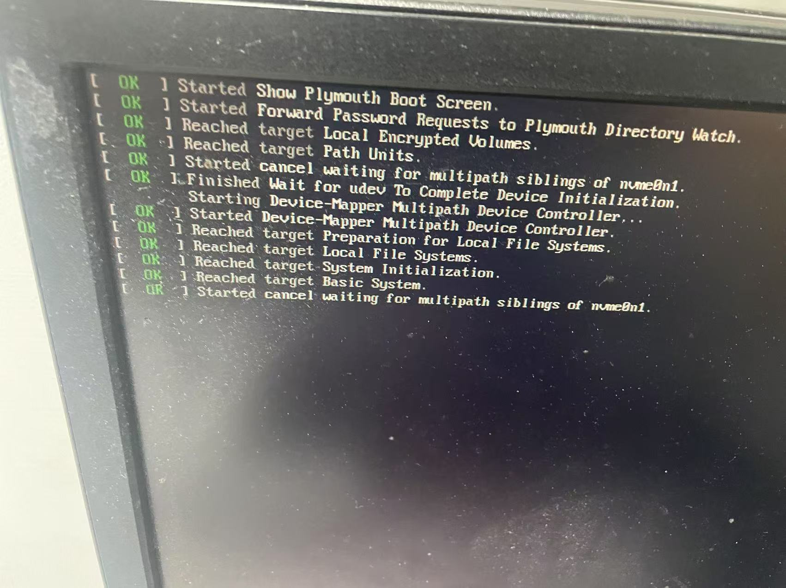
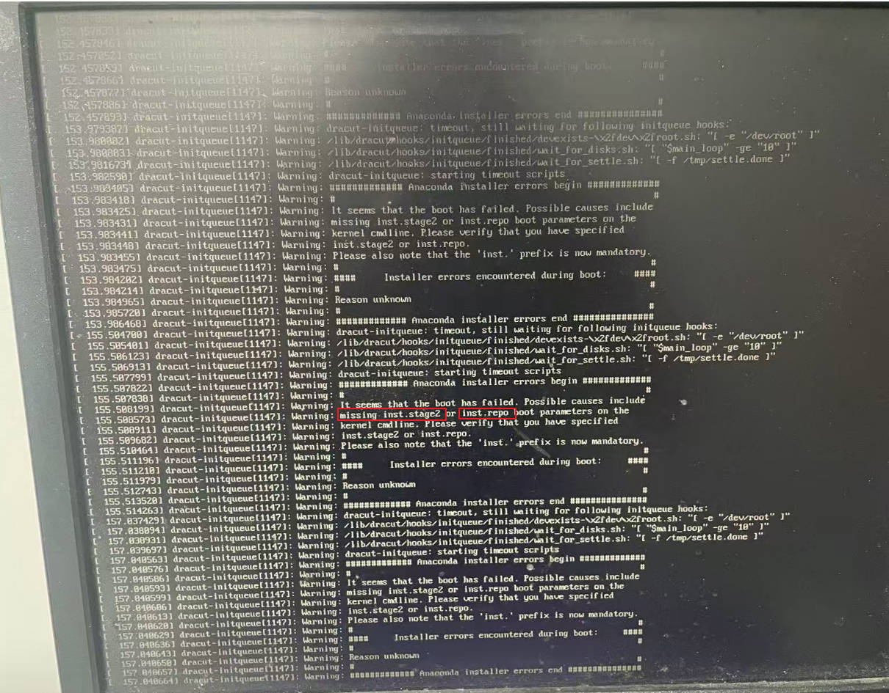
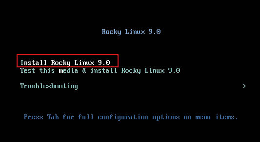
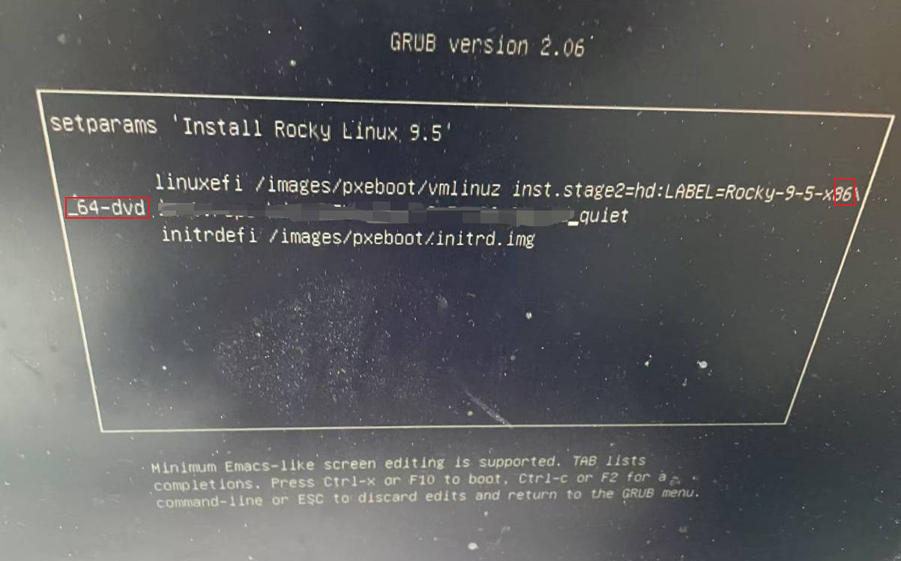

# 一、RockyLinux


## 1. 系统安装

跟安装CentOS7一样，步骤略

> /boot分区最小为300M，否则会安装失败
>
> 

```bash
[root@prometheus02 yum.repos.d]# cat /etc/rocky-release
Rocky Linux release 9.2 (Blue Onyx)
[root@prometheus02 ~]# hostnamectl set-hostname prometheus02
[root@prometheus02 ~]# timedatectl set-timezone Asia/Shanghai
```


## 2. 网卡名称更改

Centos7

```bash
[root@syslog ~]# cat /etc/default/grub
GRUB_TIMEOUT=5
GRUB_DISTRIBUTOR="$(sed 's, release .*$,,g' /etc/system-release)"
GRUB_DEFAULT=saved
GRUB_DISABLE_SUBMENU=true
GRUB_TERMINAL_OUTPUT="console"
GRUB_CMDLINE_LINUX="crashkernel=auto rd.lvm.lv=centos/root rd.lvm.lv=centos/swap net.ifnames=0 biosdevname=0 rhgb quiet"
GRUB_DISABLE_RECOVERY="true"
[root@prometheus02 ~]# grub2-mkconfig -o /boot/grub2/grub.cfg
[root@prometheus02 network-scripts]# cd /etc/sysconfig/network-scripts/
[root@prometheus02 network-scripts]# cp ifcfg-em1 ifcfg-eth0
[root@prometheus02 network-scripts]# sed -i 's/em1/eth0/g' ifcfg-eth0
[root@prometheus02 ~]# reboot
```


RockyLinux9.2

```bash
[root@prometheus02 ~]# cat /etc/default/grub 
GRUB_TIMEOUT=5
GRUB_DISTRIBUTOR="$(sed 's, release .*$,,g' /etc/system-release)"
GRUB_DEFAULT=saved
GRUB_DISABLE_SUBMENU=true
GRUB_TERMINAL_OUTPUT="console"
GRUB_CMDLINE_LINUX="crashkernel=1G-4G:192M,4G-64G:256M,64G-:512M rd.lvm.lv=rl/root net.ifnames=0 biosdevname=0"
GRUB_DISABLE_RECOVERY="true"
GRUB_ENABLE_BLSCFG=true
[root@prometheus02 ~]# grub2-mkconfig -o /boot/grub2/grub.cfg
[root@prometheus02 ~]# reboot
```


RockyLinux9.5

````bash
[root@localhost ~]# cat /etc/default/grub  
GRUB_TIMEOUT=5
GRUB_DISTRIBUTOR="$(sed 's, release .*$,,g' /etc/system-release)"
GRUB_DEFAULT=saved
GRUB_DISABLE_SUBMENU=true
GRUB_TERMINAL_OUTPUT="console"
GRUB_CMDLINE_LINUX="crashkernel=1G-4G:192M,4G-64G:256M,64G-:512M rd.lvm.lv=rl/root net.ifnames=0 biosdevname=0"
GRUB_DISABLE_RECOVERY="true"
GRUB_ENABLE_BLSCFG=true
[root@localhost ~]# grub2-mkconfig -o /boot/grub2/grub.cfg
# 查看网卡MAC地址
[root@localhost system-connections]# ip a s | grep ether
    link/ether 90:6f:18:07:c4:57 brd ff:ff:ff:ff:ff:ff
# 对网卡名称、MAC地址绑定进行配置，无则创建
[root@localhost ~]# cat /etc/udev/rules.d/eth0-network.rules
SUBSYSTEM=="net", ACTION=="add", ATTR{address}=="90:6f:18:07:c4:57", NAME="eth0"
# 创建eth0接口的连接配置文件
```
[root@localhost ~]# cat /etc/NetworkManager/system-connections/eth0.nmconnection 
[connection]
id=eth0
uuid=991e5453-ac77-4e00-b201-e3fadbabd89b
type=ethernet
autoconnect-priority=-999
autoconnect=yes	
interface-name=eth0

[ethernet]

[ipv4]
method=manual
addresses=192.168.13.167/24
gateway=192.168.13.254
dns=192.168.13.186;192.168.13.251;192.168.10.110

[ipv6]
addr-gen-mode=eui64
method=auto

[proxy]
```
# 重启系统进行应用
[root@localhost ~]# reboot
````


## 3. 网络配置

```bash
[root@prometheus02 system-connections]# systemctl enable NetworkManager
[root@prometheus02 system-connections]# pwd
/etc/NetworkManager/system-connections
[root@prometheus02 system-connections]# cat eth0.nmconnection 
[connection]				# connection配置
id=eth0						# connection id
uuid=31bbdaf8-a3d4-456c-b93e-3b608abaa28b
type=ethernet				# device type为ethernet
autoconnect-priority=-999
autoconnect=yes				# 开机自动连接
interface-name=eth0			# device名称

[ethernet]

[ipv4]
method=manual				# ip获取方式为manual，还可为auto
address1=192.168.13.237/24,192.168.13.254	# ip地址
address2=192.168.0.31/24
dns=192.168.10.250;192.168.10.110;			# dns配置，以`;`结尾

[ipv6]
addr-gen-mode=eui64
method=auto

[proxy]
---
# 装载配置
[root@prometheus02 system-connections]# nmcli c load /etc/NetworkManager/system-connections/eth0.nmconnection 
# 激活连接
[root@prometheus02 system-connections]# nmcli c up /etc/NetworkManager/system-connections/eth0.nmconnection
# 重载网络
[root@prometheus02 system-connections]# nmcli c down eth0; nmcli c up eth0;

# 查看状态信息
[root@prometheus02 system-connections]# nmcli d status
DEVICE  TYPE      STATE                   CONNECTION 
eth0    ethernet  connected               eth0       
lo      loopback  connected (externally)  lo         
[root@prometheus02 system-connections]# nmcli c show
NAME  UUID                                  TYPE      DEVICE 
eth0  31bbdaf8-a3d4-456c-b93e-3b608abaa28b  ethernet  eth0   
lo    30af657b-b6f3-4460-a9e3-497eb0900fe9  loopback  lo     
[root@prometheus02 system-connections]# ip a s eth0
2: eth0: <BROADCAST,MULTICAST,UP,LOWER_UP> mtu 1500 qdisc mq state UP group default qlen 1000
    link/ether 00:50:56:84:a7:84 brd ff:ff:ff:ff:ff:ff
    altname enp11s0
    altname ens192
    inet 192.168.13.237/24 brd 192.168.13.255 scope global noprefixroute eth0
       valid_lft forever preferred_lft forever
    inet6 fe80::250:56ff:fe84:a784/64 scope link noprefixroute 
       valid_lft forever preferred_lft forever
```


**IPv6地址**

```bash
# 全球单播地址（类似IPv4公网IP地址）
2000::/3 

# 唯一本地地址（类似IPv4私网IP地址）
FC00::/7，也可以细分为以下两个范围： 
* 随机分配的 ULA: FD00::/8，通用情况下会使用这个范围，通过随机生成的方式保证在局部网络内的唯一性。 
* 原始分配的 ULA: FC00::/8，目前未正式广泛使用。

# 链路本地地址
这些地址只能用于单个网络链路的节点之间，不能路由到其他链路。所有 IPv6 接口在启动时都会自动生成一个链路本地地址以支持邻居发现协议。其地址范围是 FE80::/10 

# 特殊用途地址
多播地址: FF00::/8，用于多播通信。 
组播地址: FF00::/8，用于组播通信。 
```


**刷新DNS方法**

```bash
# Windows 
ifconfig /flushdns 
# macOS Sierra 及以后版本（不同的 macOS 版本不同） 
sudo dscacheutil -flushcache; sudo killall -HUP mDNSResponder 
# Linux（不同 DNS 管理工具操作命令有所不同） 
# Rocky Linux 
systemctl restart NetworkManager 
# ubuntu 18.04 及以后版本 
systemd-resolve --flush-caches 
# 使用 dnsmasq 
systemctl restart dnsmasq 
# 使用 nscd 
systemctl restart nscd 
```


## 4. yum源配置

```bash
# 配置rocky源使用阿里云
[root@prometheus02 yum.repos.d]# sed -e 's|^mirrorlist=|#mirrorlist=|g' \
    -e 's|^#baseurl=http://dl.rockylinux.org/$contentdir|baseurl=https://mirrors.aliyun.com/rockylinux|g' \
    -i.bak \
    /etc/yum.repos.d/rocky*.repo

[root@prometheus02 yum.repos.d]# ll
total 44
-rw-r--r--. 1 root root 2081 Aug 22 11:22 docker-ce.repo
-rw-r--r--. 1 root root 6604 Aug 22 11:09 rocky-addons.repo
-rw-r--r--. 1 root root 6586 Apr 27 13:35 rocky-addons.repo.bak
-rw-r--r--. 1 root root 1164 Aug 22 11:09 rocky-devel.repo
-rw-r--r--. 1 root root 1161 Apr 27 13:35 rocky-devel.repo.bak
-rw-r--r--. 1 root root 2385 Aug 22 11:09 rocky-extras.repo
-rw-r--r--. 1 root root 2379 Apr 27 13:35 rocky-extras.repo.bak
-rw-r--r--. 1 root root 3414 Aug 22 11:09 rocky.repo
-rw-r--r--. 1 root root 3405 Apr 27 13:35 rocky.repo.bak


# 安装epel源
[root@prometheus02 yum.repos.d]# dnf install -y https://mirrors.aliyun.com/epel/epel-release-latest-9.noarch.rpm
[root@prometheus02 yum.repos.d]# sed -i 's|^#baseurl=https://download.example/pub|baseurl=https://mirrors.aliyun.com|' /etc/yum.repos.d/epel*
[root@prometheus02 yum.repos.d]# sed -i 's|^metalink|#metalink|' /etc/yum.repos.d/epel*

[root@prometheus02 yum.repos.d]# dnf makecache
```


## 5. 安装docker

rocky linux 安装docker建议最新版，老版本会有问题
```bash
[root@prometheus02 yum.repos.d]# curl -L -o docker-ce.repo https://mirrors.aliyun.com/docker-ce/linux/centos/docker-ce.repo
[root@prometheus02 yum.repos.d]# sudo dnf install -y yum-utils
[root@prometheus02 yum.repos.d]# dnf install --showduplicates docker-ce-3:20.10.24-3.el9.x86_64
[root@prometheus02 yum.repos.d]# cat /etc/docker/daemon.json
{
	"registry-mirrors": ["http://hub-mirror.c.163.com","https://docker.mirrors.ustc.edu.cn","https://registry.docker-cn.com"],
	"insecure-registries": ["http://192.168.13.235:8000","http://192.168.13.197:8000","harbor.hs.com","harborrepo.hs.com"],
	"log-driver":"json-file",
	"log-opts": {"max-size":"500m", "max-file":"3"}
}
[root@prometheus02 yum.repos.d]# systemctl start docker-ce
[root@prometheus02 yum.repos.d]# systemctl enable docker-ce
[root@prometheus02 yum.repos.d]# docker info 
Client: Docker Engine - Community
 Version:    24.0.5
 Context:    default
 Debug Mode: false
 Plugins:
  buildx: Docker Buildx (Docker Inc.)
    Version:  v0.11.2
    Path:     /usr/libexec/docker/cli-plugins/docker-buildx
  compose: Docker Compose (Docker Inc.)
    Version:  v2.20.2
    Path:     /usr/libexec/docker/cli-plugins/docker-compose

Server:
 Containers: 0
  Running: 0
  Paused: 0
  Stopped: 0
 Images: 0
 Server Version: 20.10.24
 Storage Driver: overlay2
  Backing Filesystem: xfs
  Supports d_type: true
  Native Overlay Diff: true
  userxattr: false
 Logging Driver: json-file
 Cgroup Driver: systemd
 Cgroup Version: 2
 Plugins:
  Volume: local
  Network: bridge host ipvlan macvlan null overlay
  Log: awslogs fluentd gcplogs gelf journald json-file local logentries splunk syslog
 Swarm: inactive
 Runtimes: io.containerd.runtime.v1.linux runc io.containerd.runc.v2
 Default Runtime: runc
 Init Binary: docker-init
 containerd version: 8165feabfdfe38c65b599c4993d227328c231fca
 runc version: v1.1.8-0-g82f18fe
 init version: de40ad0
 Security Options:
  seccomp
   Profile: default
  cgroupns
 Kernel Version: 5.14.0-284.25.1.el9_2.x86_64
 Operating System: Rocky Linux 9.2 (Blue Onyx)
 OSType: linux
 Architecture: x86_64
 CPUs: 8
 Total Memory: 15.37GiB
 Name: prometheus02
 ID: ZRRR:DOCG:OYWM:BBGC:EQRL:RQAL:VVMM:6G57:3WMM:5YLM:U56S:RSQU
 Docker Root Dir: /var/lib/docker
 Debug Mode: false
 Experimental: false
 Insecure Registries:
  192.168.13.197:8000
  192.168.13.235:8000
  harbor.hs.com
  harborrepo.hs.com
  127.0.0.0/8
 Registry Mirrors:
  http://hub-mirror.c.163.com/
  https://docker.mirrors.ustc.edu.cn/
  https://registry.docker-cn.com/
 Live Restore Enabled: false
```


## 6. 安装配置openvpn 

```bash
[root@prometheus02 ~]# dnf install -y openvpn 

# 连接vpn
/usr/bin/expect << EOF
set timeout 10
spawn /usr/sbin/openvpn --config /etc/openvpn/client/client.conf
expect {
"*Username*" { send "$USER\n"; exp_continue }
"*Password*" { send "$PASSWORD\n"; exp_continue }
}
expect eof
EOF

```


## 7. 迁移prometheus

```bash
groupadd -r prometheus && useradd -r -s /sbin/nologin -g prometheus prometheus

[root@prometheus02 shell]# systemctl cat prometheus.service 
# /usr/lib/systemd/system/prometheus.service
[Unit]
Description=https://prometheus.io
After=network-online.target

[Service]
User=prometheus
Group=prometheus
Type=simple
ExecStart=/usr/local/prometheus/prometheus \
--config.file /usr/local/prometheus/prometheus.yml \
--storage.tsdb.path /data/prometheus/ \
--storage.tsdb.retention.time=180d \
--storage.tsdb.retention.size=200GB \
--storage.tsdb.wal-compression \
--web.external-url=http://192.168.13.237:9090 \
--web.enable-admin-api \
--web.enable-lifecycle \
--web.page-title=homsom
Restart=on-failure

[Install]
WantedBy=multi-user.target
###


# 配置权限 
chown -R prometheus.prometheus /data/prometheus /usr/local/prometheus-2.33.5.linux-amd64

# 启动grafana-server
systemctl start prometheus
systemctl enable prometheus

```


## 8. 迁移grafana-server

安装二进制版本grafana-enterprise-7.1.4

```bash
wget https://dl.grafana.com/enterprise/release/grafana-enterprise-7.1.4.linux-amd64.tar.gz
tar -zxvf grafana-enterprise-7.1.4.linux-amd64.tar.gz -C /usr/local

[root@prometheus02 local]# ls grafana-7.1.4/
bin  conf  data  LICENSE  NOTICE.md  plugins-bundled  public  README.md  scripts  VERSION


# 查看老版本环境变量，并复制到新服务器中
[root@prometheus02 local]# cat /etc/sysconfig/grafana-server 
GRAFANA_USER=grafana

GRAFANA_GROUP=grafana

GRAFANA_HOME=/usr/local/grafana

LOG_DIR=/var/log/grafana

DATA_DIR=/var/lib/grafana

MAX_OPEN_FILES=10000

CONF_DIR=/etc/grafana

CONF_FILE=/etc/grafana/grafana.ini

RESTART_ON_UPGRADE=true

PLUGINS_DIR=/var/lib/grafana/plugins

PROVISIONING_CFG_DIR=/etc/grafana/provisioning

# Only used on systemd systems
PID_FILE_DIR=/var/run/grafana
###


# 复制老版本启动服务文件到新服务器
[root@prometheus02 local]# systemctl cat grafana-server.service 
# /usr/lib/systemd/system/grafana-server.service
[Unit]
Description=Grafana instance
Documentation=http://docs.grafana.org
Wants=network-online.target
After=network-online.target
After=postgresql.service mariadb.service mysqld.service

[Service]
EnvironmentFile=/etc/sysconfig/grafana-server
User=grafana
Group=grafana
Type=notify
Restart=on-failure
WorkingDirectory=/usr/local/grafana
RuntimeDirectory=grafana
RuntimeDirectoryMode=0750
ExecStart=/usr/local/grafana/bin/grafana-server                                                  \
                            --config=${CONF_FILE}                                   \
                            --pidfile=${PID_FILE_DIR}/grafana-server.pid            \
                            --packaging=rpm                                         \
                            cfg:default.paths.logs=${LOG_DIR}                       \
                            cfg:default.paths.data=${DATA_DIR}                      \
                            cfg:default.paths.plugins=${PLUGINS_DIR}                \
                            cfg:default.paths.provisioning=${PROVISIONING_CFG_DIR}  

LimitNOFILE=10000
TimeoutStopSec=20

[Install]
WantedBy=multi-user.target
###


# 配置依赖目录及权限 
groupadd -r grafana && useradd -r -s /sbin/nologin -g grafana grafana
mkdir -p /var/log/grafana /var/lib/grafana 
scp -r /var/lib/grafana prometheus02:/var/lib/grafana
scp -r /etc/grafana prometheus02:/etc/grafana
chown -R grafana.grafana /var/log/grafana /var/lib/grafana /etc/grafana /usr/local/grafana-7.1.4


# 启动grafana-server
systemctl start grafana-server
systemctl enable grafana-server 
```


## 9. 配置alertmanager集群

```bash
[root@prometheus02 kubeasz]# systemctl cat alertmanager.service 
# /usr/lib/systemd/system/alertmanager.service
[Unit]
Description=https://prometheus.io
After=network-online.target

[Service]
User=prometheus
Group=prometheus
Type=simple
ExecStart=/usr/local/alertmanager/alertmanager --config.file=/usr/local/alertmanager/alertmanager.yml \
--storage.path=/usr/local/alertmanager/data/ --web.external-url=http://192.168.13.237:9093 \
--cluster.listen-address=0.0.0.0:8001 --cluster.peer=192.168.13.236:8001 --log.level=warn --log.format=json
Restart=on-failure

[Install]
WantedBy=multi-user.target


[root@prometheus02 kubeasz]# head -n 50 /usr/local/prometheus/prometheus.yml 
global:
  scrape_interval: 30s
  evaluation_interval: 30s
  scrape_timeout: 30s

alerting:
  alertmanagers:
  - static_configs:
    - targets:
      - '192.168.13.236:9093'
      - '192.168.13.237:9093'
      - '192.168.13.235:9093'
......
```

**配置时间显示24小时制**

```bash
192.168.13.237 | CHANGED | rc=0 >>
Mon Aug 28 04:07:25 PM CST 2023


[root@prometheus02 ~]# cat /etc/locale.conf 
LANG="en_US.UTF-8"
LC_TIME='en_DK.UTF-8'		#增加此行并重启服务器

192.168.13.237 | CHANGED | rc=0 >>
2023-08-28T16:41:33 CST
```


## 10. journalctl清理日志

**这将删除超过30天的日志文件**
sudo journalctl --vacuum-time=30d


**这将删除旧日志，直到总日志大小小于1GB**
sudo journalctl --vacuum-size=1G

**保留最多1000个日志文件**
sudo journalctl --vacuum-files=1000


**更改配置**

```bash
root@ansible:~# grep -Ev '#|^$' /etc/systemd/journald.conf
[Journal]
SystemMaxUse=500M
SystemKeepFree=100M
SystemMaxFileSize=100M
SystemMaxFiles=5

systemctl restart systemd-journald
```


## 11. cobbler部署

### 11.1 配置aliyun镜像源

```bash
[root@localhost ~]# sed -e 's|^mirrorlist=|#mirrorlist=|g' \
    -e 's|^#baseurl=http://dl.rockylinux.org/$contentdir|baseurl=https://mirrors.aliyun.com/rockylinux|g' \
    -i.bak \
    /etc/yum.repos.d/rocky-*.repo

[root@localhost ~]# dnf makecache
```


### 11.2 安装

```bash
[root@localhost ~]# dnf install -y https://mirrors.aliyun.com/epel/epel-release-latest-9.noarch.rpm
[root@localhost ~]# dnf -y install cobbler dhcp-server
[root@localhost ~]# systemctl enable --now cobblerd tftp.service httpd dhcpd tftp
[root@localhost ~]# cobbler --version
Cobbler 3.3.4
  source: ?, ?
  build time: Mon Feb 26 00:00:00 2024
  
# 停止防火墙
[root@localhost ~]# systemctl stop  firewalld
[root@localhost ~]# systemctl disable firewalld
```


### 11.3 配置cobbler

```bash
# 检查cobbler
[root@localhost ~]# cobbler check
The following are potential configuration items that you may want to fix:

1: The 'server' field in /etc/cobbler/settings.yaml must be set to something other than localhost, or automatic installation features will not work.  This should be a resolvable hostname or IP for the boot server as reachable by all machines that will use it.
2: For PXE to be functional, the 'next_server_v4' field in /etc/cobbler/settings.yaml must be set to something other than 127.0.0.1, and should match the IP of the boot server on the PXE network.
3: For PXE to be functional, the 'next_server_v6' field in /etc/cobbler/settings.yaml must be set to something other than ::1, and should match the IP of the boot server on the PXE network.
4: some network boot-loaders are missing from /var/lib/cobbler/loaders. If you only want to handle x86/x86_64 netbooting, you may ensure that you have installed a *recent* version of the syslinux package installed and can ignore this message entirely. Files in this directory, should you want to support all architectures, should include pxelinux.0, andmenu.c32.
5: reposync is not installed, install yum-utils or dnf-plugins-core
6: yumdownloader is not installed, install yum-utils or dnf-plugins-core
7: debmirror package is not installed, it will be required to manage debian deployments and repositories
8: ksvalidator was not found, install pykickstart
9: The default password used by the sample templates for newly installed machines (default_password_crypted in /etc/cobbler/settings.yaml) is still set to 'cobbler' and should be changed, try: "openssl passwd -1 -salt 'random-phrase-here' 'your-password-here'" to generate new one
10: fencing tools were not found, and are required to use the (optional) power management features. install cman or fence-agents to use them

Restart cobblerd and then run 'cobbler sync' to apply changes.


# 配置cobbler
[root@localhost ~]# openssl passwd -1 -salt 'cobbler' 'cobbler888'
$1$cobbler$QtaubkTmRyxdkgvijM9JQ0

[root@localhost ~]# vim /etc/cobbler/settings.yaml
default_password_crypted: "$1$cobbler$QtaubkTmRyxdkgvijM9JQ0"
next_server_v4: 172.168.2.51
server: 172.168.2.51
manage_dhcp: true
manage_dhcp_v4: true
manage_tftpd: true
pxe_just_once: true
yum_post_install_mirror: false

# 配置dhcp
[root@localhost ~]# vim /etc/cobbler/dhcp.template
subnet 172.168.2.0 netmask 255.255.255.0 {
     option routers             172.168.2.254;
     option domain-name-servers 192.168.13.186,192.168.13.251,192.168.10.110;
     option subnet-mask         255.255.255.0;
     range dynamic-bootp        172.168.2.49 172.168.2.50;
     default-lease-time         21600;
     max-lease-time             43200;
     next-server                $next_server_v4;


# 同步配置，并重新启动相关服务
[root@localhost ~]# cobbler sync
task started: 2024-11-22_234715_sync
task started (id=Sync, time=Fri Nov 22 23:47:15 2024)
syncing all
running pre-sync triggers
cleaning trees
removing: /var/lib/tftpboot/grub/system
removing: /var/lib/tftpboot/grub/system_link
removing: /var/lib/tftpboot/grub/images
copying bootloaders
running: ['rsync', '-rpt', '--copy-links', '--exclude=.cobbler_postun_cleanup', '/var/lib/cobbler/loaders/', '/var/lib/tftpboot']
received on stdout:
running: ['rsync', '-rpt', '--copy-links', '--exclude=README.grubconfig', '/var/lib/cobbler/grub_config/', '/var/lib/tftpboot']
received on stdout:
copying distros to tftpboot
copying images
generating PXE configuration files
generating PXE menu structure
rendering DHCP files
generating /etc/dhcp/dhcpd.conf
cleaning link caches
running post-sync triggers
running: ['dhcpd', '-t', '-q']
received on stdout:
running: ['systemctl', 'restart', 'dhcpd']
received on stdout:
*** TASK COMPLETE ***
# 支持更多系统架构
[root@localhost ~]# dnf -y install syslinux syslinux-extlinux syslinux-tftpboot pykickstart yum-utils
[root@localhost ~]# systemctl restart cobblerd httpd tftp.service dhcpd
[root@localhost ~]# cobbler sync

# 再次检查，以下告警可以忽略
[root@localhost ~]# cobbler check
1: some network boot-loaders are missing from /var/lib/cobbler/loaders. If you only want to handle x86/x86_64 netbooting, you may ensure that you have installed a *recent* version of the syslinux package installed and can ignore this message entirely. Files in this directory, should you want to support all architectures, should include pxelinux.0, andmenu.c32.
2: debmirror package is not installed, it will be required to manage debian deployments and repositories
3: fencing tools were not found, and are required to use the (optional) power management features. install cman or fence-agents to use them


# 修改启动菜单模板
# MENU MASTER PASSWD: 添加安装系统时的密码
[root@localhost ~]# grub2-mkpasswd-pbkdf2
Enter password:
Reenter password:
PBKDF2 hash of your password is grub.pbkdf2.sha512.10000.52A65F5202F77C9CE50F43D71AC1980109405A2AAA4C29B3893F059A50F0E99EB53D9622E756080B3105C9BE94CFB677747D9EDDE565DEEC86AD3DD6060FE703.51B604E5311AE8125DF3FE68DA8D97DB7C54FE6E4031C9D80BE17420D2CDCCACA89E1B4B7AEC04E80460A4012974DE1635EBD7139EE27F3EE7F7C0BB7F42787C

DEFAULT menu
PROMPT 0
MENU TITLE Cobbler | https://homsom.com
MENU PASSWORD --md5 "grub.pbkdf2.sha512.10000.52A65F5202F77C9CE50F43D71AC1980109405A2AAA4C29B3893F059A50F0E99EB53D9622E756080B3105C9BE94CFB677747D9EDDE565DEEC86AD3DD6060FE703.51B604E5311AE8125DF3FE68DA8D97DB7C54FE6E4031C9D80BE17420D2CDCCACA89E1B4B7AEC04E80460A4012974DE1635EBD7139EE27F3EE7F7C0BB7F42787C"
TIMEOUT 200
TOTALTIMEOUT 6000
ONTIMEOUT $pxe_timeout_profile

LABEL local
        MENU LABEL (local)
        MENU DEFAULT
        LOCALBOOT -1
$menu_items
MENU end


[root@localhost ~]# openssl passwd -1 -salt 'homsom' 'jackli'
$1$homsom$oWsW1QF8cEyRzolABzsLC/
[root@localhost ~]# cat /etc/cobbler/boot_loader_conf/pxe_menu.template
DEFAULT menu
PROMPT 0
MENU TITLE Cobbler | https://homsom.com
MENU MASTER PASSWD $1$homsom$oWsW1QF8cEyRzolABzsLC/
TIMEOUT 200
TOTALTIMEOUT 6000
ONTIMEOUT $pxe_timeout_profile

LABEL local
        MENU LABEL (local)
        MENU DEFAULT
        LOCALBOOT -1
$menu_items
MENU end
```


### 11.4 导入镜像RockyLinux9.5

```bash
[root@localhost ~]# cobbler import --path=/mnt --name=Rocky-9.5-x86_64 --arch=x86_64
task started: 2024-11-23_000320_import
task started (id=Media import, time=Sat Nov 23 00:03:20 2024)
import_tree; ['/mnt', 'Rocky-9.5-x86_64', None, None, None]
importing from a network location, running rsync to fetch the files first
running: rsync -a  '/mnt/' /var/www/cobbler/distro_mirror/Rocky-9.5-x86_64 --progress
received on stdout: sending incremental file list
Adding distros from path /var/www/cobbler/distro_mirror/Rocky-9.5-x86_64:
creating new distro: Rocky-9.5-x86_64
trying symlink: /var/www/cobbler/distro_mirror/Rocky-9.5-x86_64 -> /var/www/cobbler/links/Rocky-9.5-x86_64
add_item(distro); ['Rocky-9.5-x86_64']
trying symlink /var/www/cobbler/distro_mirror/Rocky-9.5-x86_64/images/pxeboot/vmlinuz -> /var/www/cobbler/images/Rocky-9.5-x86_64/vmlinuz
trying symlink /var/www/cobbler/distro_mirror/Rocky-9.5-x86_64/images/pxeboot/initrd.img -> /var/www/cobbler/images/Rocky-9.5-x86_64/initrd.img
running: /usr/bin/sha1sum /var/www/cobbler/distro_mirror/Rocky-9.5-x86_64/images/pxeboot/vmlinuz
received on stdout: e121cf5529af928fe7c1dc5b42bef5be9e542109  /var/www/cobbler/distro_mirror/Rocky-9.5-x86_64/images/pxeboot/vmlinuz
trying to create cache file /var/lib/tftpboot/images/.link_cache/e121cf5529af928fe7c1dc5b42bef5be9e542109
copying: /var/www/cobbler/distro_mirror/Rocky-9.5-x86_64/images/pxeboot/vmlinuz -> /var/lib/tftpboot/images/.link_cache/e121cf5529af928fe7c1dc5b42bef5be9e542109
running: /usr/bin/sha1sum /var/www/cobbler/distro_mirror/Rocky-9.5-x86_64/images/pxeboot/initrd.img
received on stdout: 0d2a08150b1f1e34497bcc2885dc976e785c6021  /var/www/cobbler/distro_mirror/Rocky-9.5-x86_64/images/pxeboot/initrd.img
trying to create cache file /var/lib/tftpboot/images/.link_cache/0d2a08150b1f1e34497bcc2885dc976e785c6021
copying: /var/www/cobbler/distro_mirror/Rocky-9.5-x86_64/images/pxeboot/initrd.img -> /var/lib/tftpboot/images/.link_cache/0d2a08150b1f1e34497bcc2885dc976e785c6021
processing boot_files for distro: Rocky-9.5-x86_64
skipping symlink, destination (/var/www/cobbler/links/Rocky-9.5-x86_64) exists
Writing template files for Rocky-9.5-x86_64
creating new profile: Rocky-9.5-x86_64
add_item(profile); ['Rocky-9.5-x86_64']
Writing template files for Rocky-9.5-x86_64
sync_systems
associating repos
checking for rsync repo(s)
add_item(distro); ['Rocky-9.5-x86_64']
copying: /var/www/cobbler/distro_mirror/Rocky-9.5-x86_64/images/pxeboot/vmlinuz -> /var/lib/tftpboot/images/Rocky-9.5-x86_64/vmlinuz
copying: /var/www/cobbler/distro_mirror/Rocky-9.5-x86_64/images/pxeboot/initrd.img -> /var/lib/tftpboot/images/Rocky-9.5-x86_64/initrd.img
processing boot_files for distro: Rocky-9.5-x86_64
skipping symlink, destination (/var/www/cobbler/links/Rocky-9.5-x86_64) exists
Writing template files for Rocky-9.5-x86_64
Writing template files for Rocky-9.5-x86_64
checking for rhn repo(s)
add_item(distro); ['Rocky-9.5-x86_64']
copying: /var/www/cobbler/distro_mirror/Rocky-9.5-x86_64/images/pxeboot/vmlinuz -> /var/lib/tftpboot/images/Rocky-9.5-x86_64/vmlinuz
copying: /var/www/cobbler/distro_mirror/Rocky-9.5-x86_64/images/pxeboot/initrd.img -> /var/lib/tftpboot/images/Rocky-9.5-x86_64/initrd.img
processing boot_files for distro: Rocky-9.5-x86_64
skipping symlink, destination (/var/www/cobbler/links/Rocky-9.5-x86_64) exists
Writing template files for Rocky-9.5-x86_64
Writing template files for Rocky-9.5-x86_64
checking for yum repo(s)
starting descent into /var/www/cobbler/distro_mirror/Rocky-9.5-x86_64 for Rocky-9.5-x86_64
processing repo at : /var/www/cobbler/distro_mirror/Rocky-9.5-x86_64/AppStream
directory /var/www/cobbler/distro_mirror/Rocky-9.5-x86_64/AppStream is missing xml comps file, skipping
processing repo at : /var/www/cobbler/distro_mirror/Rocky-9.5-x86_64/BaseOS
directory /var/www/cobbler/distro_mirror/Rocky-9.5-x86_64/BaseOS is missing xml comps file, skipping
add_item(distro); ['Rocky-9.5-x86_64']
copying: /var/www/cobbler/distro_mirror/Rocky-9.5-x86_64/images/pxeboot/vmlinuz -> /var/lib/tftpboot/images/Rocky-9.5-x86_64/vmlinuz
copying: /var/www/cobbler/distro_mirror/Rocky-9.5-x86_64/images/pxeboot/initrd.img -> /var/lib/tftpboot/images/Rocky-9.5-x86_64/initrd.img
processing boot_files for distro: Rocky-9.5-x86_64
skipping symlink, destination (/var/www/cobbler/links/Rocky-9.5-x86_64) exists
Writing template files for Rocky-9.5-x86_64
Writing template files for Rocky-9.5-x86_64
*** TASK COMPLETE ***

[root@localhost ~]# ls /var/www/cobbler/distro_mirror
config  Rocky-9.5-x86_64
[root@localhost ~]# cobbler distro list
   Rocky-9.5-x86_64
[root@localhost ~]# cobbler profile list
   Rocky-9.5-x86_64
[root@localhost ~]# systemctl restart cobblerd
[root@localhost ~]# cobbler sync

# 查看生成的启动菜单
[root@localhost ~]# cat /var/lib/tftpboot/pxelinux.cfg/default
DEFAULT menu
PROMPT 0
MENU TITLE Cobbler | https://homsom.com
TIMEOUT 200
TOTALTIMEOUT 6000
ONTIMEOUT local

LABEL local
        MENU LABEL (local)
        MENU DEFAULT
        LOCALBOOT -1

LABEL Rocky-9.5-x86_64
        MENU LABEL Rocky-9.5-x86_64
        kernel /images/Rocky-9.5-x86_64/vmlinuz
        append initrd=/images/Rocky-9.5-x86_64/initrd.img  inst.ks.sendmac inst.ks=http://172.168.2.51/cblr/svc/op/autoinstall/profile/Rocky-9.5-x86_64 inst.repo=http://172.168.2.51/cblr/links/Rocky-9.5-x86_64
        ipappend 2
MENU end


# 生成引导加载程序,cobbler mkloaders 此命令适用cobblerV3.3.1及之后的版本。
# 此命令不执行的话新建虚拟机(无cd/dvd)开机会提示pxe-T01:file not found
[root@localhost ~]# cobbler mkloaders
task started: 2024-11-23_001423_mkloaders
task started (id=Create bootable bootloader images, time=Sat Nov 23 00:14:23 2024)
Unable to find "shim.efi" file. Please adjust "bootloaders_shim_file" regex. Bailing out of linking the shim!
ipxe directory did not exist. Please adjust the "bootloaders_ipxe_folder". Bailing out of iPXE setup!
GRUB2 modules directory for arch "aarch64" did no exist. Skipping GRUB2 creation
GRUB2 modules directory for arch "arm" did no exist. Skipping GRUB2 creation
GRUB2 modules directory for arch "arm64-efi" did no exist. Skipping GRUB2 creation
GRUB2 modules directory for arch "i386-efi" did no exist. Skipping GRUB2 creation
Successfully built bootloader for arch "i386-pc-pxe"!
GRUB2 modules directory for arch "i686" did no exist. Skipping GRUB2 creation
GRUB2 modules directory for arch "IA64" did no exist. Skipping GRUB2 creation
GRUB2 modules directory for arch "powerpc-ieee1275" did no exist. Skipping GRUB2 creation
GRUB2 modules directory for arch "x86_64-efi" did no exist. Skipping GRUB2 creation
*** TASK COMPLETE ***
[root@localhost ~]# ls /var/lib/cobbler/loaders/
grub  ldlinux.c32  libcom32.c32  libutil.c32  linux.c32  memdisk  menu.c32  pxelinux.0
```


### 11.5 自定义kickstart文件

```bash
[root@localhost ~]# cat /var/lib/cobbler/templates/Rocky-9.5-x86_64.ks
lang en_US
keyboard us
timezone Asia/Shanghai
rootpw --iscrypted $default_password_crypted
text
install
url --url=$tree
bootloader --location=mbr
zerombr
clearpart --all --initlabel
part /boot --fstype xfs --size 3072 --ondisk sda
part / --fstype xfs --size 1 --grow --ondisk sda
auth --useshadow --enablemd5
$SNIPPET('network_config')
reboot
firewall --disabled
selinux --disabled
skipx
%pre
$SNIPPET('log_ks_pre')
$SNIPPET('kickstart_start')
$SNIPPET('pre_install_network_config')
$SNIPPET('pre_anamon')
%end

%packages
@base
@core
tree
sysstat
iptraf
ntp
lrzsz
ncurses-devel
openssl-devel
zlib-devel
OpenIPMI-tools
mysql
nmap
screen
%end
%post
systemctl disable postfix.service

rm -f /etc/yum.repos.d/*
cat >>/etc/yum.repos.d/epel.repo<<eof
[epel]
name=Extra Packages for Enterprise Linux \$releasever - \$basearch
#baseurl=https://download.example/pub/epel/\$releasever/Everything/\$basearch/
metalink=https://mirrors.fedoraproject.org/metalink?repo=epel-\$releasever&arch=\$basearch&infra=\$infra&content=\$contentdir
enabled=1
gpgcheck=1
countme=1
gpgkey=file:///etc/pki/rpm-gpg/RPM-GPG-KEY-EPEL-\$releasever

eof

$yum_config_stanza
%end


# 查看profile
[root@localhost ~]# cobbler profile list
   Rocky-9.5-x86_64
[root@localhost ~]# cobbler profile report
Name                           : Rocky-9.5-x86_64
Automatic Installation Template : sample.ks
Automatic Installation Metadata : <<inherit>>
TFTP Boot Files                : <<inherit>>
Boot loaders                   : <<inherit>>
Comment                        :
DHCP Tag                       :
Distribution                   : Rocky-9.5-x86_64
Enable iPXE?                   : False
Enable PXE Menu?               : True
Fetchable Files                : <<inherit>>
DHCP Filename Override         :
Kernel Options                 : <<inherit>>
Kernel Options (Post Install)  : <<inherit>>
Parent boot menu               :
Management Classes             : <<inherit>>
Management Parameters          : <<inherit>>
Name Servers                   : []
Name Servers Search Path       : []
Next Server (IPv4) Override    : <<inherit>>
Next Server (IPv6) Override    : <<inherit>>
Owners                         : <<inherit>>
Parent Profile                 :
Proxy                          : <<inherit>>
Red Hat Management Key         : <<inherit>>
Repos                          : []
Server Override                : <<inherit>>
Template Files                 : {}
Virt Auto Boot                 : True
Virt Bridge                    : <<inherit>>
Virt CPUs                      : 1
Virt Disk Driver Type          : raw
Virt File Size(GB)             : <<inherit>>
Virt Path                      :
Virt RAM (MB)                  : <<inherit>>
Virt Type                      : kvm
# 配置profile
[root@localhost ~]# cobbler profile edit --name=Rocky-9.5-x86_64 --distro=Rocky-9.5-x86_64 --autoinstall=Rocky-9.5-x86_64.ks
[root@localhost ~]# cobbler profile report --name=Rocky-9.5-x86_64
Name                           : Rocky-9.5-x86_64
Automatic Installation Template : Rocky-9.5-x86_64.ks
Automatic Installation Metadata : <<inherit>>
TFTP Boot Files                : <<inherit>>
Boot loaders                   : <<inherit>>
Comment                        :
DHCP Tag                       :
Distribution                   : Rocky-9.5-x86_64
Enable iPXE?                   : False
Enable PXE Menu?               : True
Fetchable Files                : <<inherit>>
DHCP Filename Override         :
Kernel Options                 : <<inherit>>
Kernel Options (Post Install)  : <<inherit>>
Parent boot menu               :
Management Classes             : <<inherit>>
Management Parameters          : <<inherit>>
Name Servers                   : []
Name Servers Search Path       : []
Next Server (IPv4) Override    : <<inherit>>
Next Server (IPv6) Override    : <<inherit>>
Owners                         : <<inherit>>
Parent Profile                 :
Proxy                          : <<inherit>>
Red Hat Management Key         : <<inherit>>
Repos                          : []
Server Override                : <<inherit>>
Template Files                 : {}
Virt Auto Boot                 : True
Virt Bridge                    : <<inherit>>
Virt CPUs                      : 1
Virt Disk Driver Type          : raw
Virt File Size(GB)             : <<inherit>>
Virt Path                      :
Virt RAM (MB)                  : <<inherit>>
Virt Type                      : xenpv
[root@localhost ~]# cobbler sync
[root@localhost ~]# systemctl restart cobbler
```


# 二、RockyLinux9.5物理机安装

## 1. 安装步骤

1. 系统选择U盘启动（U盘已提前将`Rocky Linux 9.5 Minimal ISO`刻入U盘）
2. 选择`Install Rocky Linux 9.5`进行安装
3. 配置`Installation source`，使用哪个安装源进行安装
4. 配置`Software Selection`，安装软件的类型，例如最小安装、GUI安装等
5. 配置`Installation Destination`，将系统安装到哪个硬盘，并进行分区配置，可进行LVM和标准分区配置，`/boot、/boot/efi`分区大小配置为2GiB，`/`分区大小配置为所有
6. 配置`Root Password`，并勾选`Allow root SSH login with password`，使Root可远程访问系统
7. 选择`Begin Installation`进行安装


## 2. 安装过程问题解决

### 2.1.1 问题一：安装系统卡住

安装`Rocky Linux 9.5 Minimal ISO`时卡住，无法正常安装






### 2.1.2 解决一：安装系统卡住

**原因：**

从上面报错截图中可看出，是命令行内核启动参数`inst.stage2`或者`inst.repo`出现错误。重新通过U盘引导进行安装，在安装界面时用`方向键`选择`Install Rocky Linux 9.5`，按键盘`e`键进行参数配置，可看出`inst.stage2`的默认启动参数中LABEL为`Rocky-9-5-x86_64`，而实际的启动U盘分区LABEL为`Rocky-9-5-x`，可从`解决步骤`中看出实际LABEL，从而导致找不到安装设备。






**解决步骤：**

1. 进入`Troubleshooting`模式，使用命令`blkid`或者`lsblk`查看block的信息，可以看出/dev/sda4的LABEL为`Rocky-9-5-x`

   

2. 重新通过U盘引导进行安装，在安装界面时用`方向键`选择`Install Rocky Linux 9.5`，按键盘`e`进行参数配置，编辑`linuxefi`中的参数`inst.stage2`，完整值为`inst.stage2=hd:LABEL=Rocky-9-5-x`，然后按`Ctrl-x`或者按`F10`进行配置应用


### 2.2.1 问题二：安装源出错

进行配置安装源时，手动选择`ISO分区`后，仍然报`设置基础软件仓库时出错`信息


### 2.2.2 解决二：安装源出错

**原因：**

因为U盘有2个分区，一个为`ISO分区`，另外一个为`空的分区`，所以需要手动选择，但是手动选择`ISO分区`后，仍然报`设置基础软件仓库时出错`信息


**解决步骤：**

1. 拔掉启动U盘，将`Rocky Linux 9.5 Minimal ISO`放入另外一个为`空的分区`
2. 从U盘启动引导安装，需要执行`解决一：安装系统卡住`步骤，直至正常安装界面打开
3. 选择安装源 - 选择`空的分区` - 选中放入的`Rocky Linux 9.5 Minimal ISO` - 点击左上角完成


# 其它问题


## 1.NetworkManager unable to configure IPv6 route

```bash
[root@g2-pro-mysql03 ~]# tail -f /var/log/messages 
Mar 25 16:56:52 localhost NetworkManager[904]: <warn>  [1742893012.8841] l3cfg[c9dea18990fd9a28,ifindex=2]: unable to configure IPv6 route: type unicast fe80::/64 dev 2 metric 1024 mss 0 rt-src ipv6ll
Mar 25 16:56:54 localhost NetworkManager[904]: <warn>  [1742893014.8864] ipv6ll[15915f9016c9fe6e,ifindex=2]: changed: no IPv6 link local address to retry after Duplicate Address Detection failures (back off)
Mar 25 16:57:04 localhost NetworkManager[904]: <warn>  [1742893024.8876] platform-linux: do-add-ip6-address[2: fe80::926f:18ff:fe07:c457]: failure 13 (Permission denied - ipv6: IPv6 is disabled on this device)
Mar 25 16:57:04 localhost NetworkManager[904]: <warn>  [1742893024.8876] l3cfg[c9dea18990fd9a28,ifindex=2]: unable to configure IPv6 route: type unicast fe80::/64 dev 2 metric 1024 mss 0 rt-src ipv6ll
```

原因：配置了`net.ipv6.conf.all.disable_ipv6=1`，所以系统不支持ipv6功能

解决方案：

```bash
# 禁用内核参数
[root@g2-pro-mysql03 ~]# cat /etc/sysctl.conf | grep disable_ipv6
#net.ipv6.conf.all.disable_ipv6=1
# 从启用到禁用直接重新，这里是从禁用到启用则需要重启系统才能生效
[root@g2-pro-mysql03 ~]# reboot 
# 验证
[root@g2-pro-mysql03 ~]# sysctl -a | grep disable_ipv6
net.ipv6.conf.all.disable_ipv6 = 0
net.ipv6.conf.default.disable_ipv6 = 0
net.ipv6.conf.eth0.disable_ipv6 = 0
net.ipv6.conf.lo.disable_ipv6 = 0
# 可以看到已经有inet6的IP地址了
[root@g2-pro-mysql03 ~]# ip a s eth0
2: eth0: <BROADCAST,MULTICAST,UP,LOWER_UP> mtu 1500 qdisc fq_codel state UP group default qlen 1000
    link/ether 90:6f:18:07:c4:57 brd ff:ff:ff:ff:ff:ff
    altname enp2s0
    inet 192.168.13.167/24 brd 192.168.13.255 scope global noprefixroute eth0
       valid_lft forever preferred_lft forever
    inet6 fe80::926f:18ff:fe07:c457/64 scope link noprefixroute 
       valid_lft forever preferred_lft forever
```


